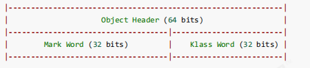
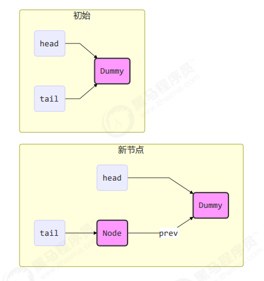
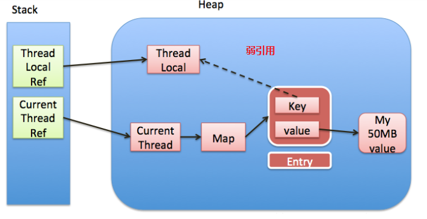

# 多线程

## Java线程

### 线程创建

1. 使用Thread类

   ```java
   Thread t = new Thread() {
    public void run() {
    // 要执行的任务
    }
   };
   // 启动线程
   t.start();
   ```

2. 使用Runnable与Thread

   ```java
   Runnable runnable = new Runnable() {
   public void run(){
    // 要执行的任务
    }
   };
   // 创建线程对象
   Thread t = new Thread( runnable );
   // 启动线程
   t.start();
   ```

3. 使用FutureTask

   ```java
   // 创建任务对象
   FutureTask<Integer> task3 = new FutureTask<>(() -> {
    log.debug("hello");
    return 100;
   });
   // 参数1 是任务对象; 参数2 是线程名字，推荐
   new Thread(task3, "t3").start();
   // 主线程阻塞，同步等待 task 执行完毕的结果
   Integer result = task3.get();
   log.debug("结果是:{}", result);
   ```

### 重要api

| 方法名              | 功能说明                                                    | 注意                                                         |
| ------------------- | ----------------------------------------------------------- | ------------------------------------------------------------ |
| ```start()```       | 启动一个新线程，在新的线程，运行 run 方法                   | start 方法只是让线程进入就绪，里面代码不一定立刻运行（CPU 的时间片还没分给它）。每个线程对象的start方法只能调用一次，如果调用了多次会出现 |
| ```run()```         | 新线程启动后会调用的方法                                    | 如果在构造 Thread 对象时传递了 Runnable 参数，则线程启动后会调用 Runnable 中的 run 方法，否则默认不执行任何操作。但可以创建 Thread 的子类对象，来覆盖默认行为 |
| ```join()```        | 等待线程运行结束                                            | Join原理是在底层循环调用isAlive()判断线程是否存活            |
| ```join(long n)```  | 等待线程运行结束,最多等待 n毫秒                             |                                                              |
| getId()             | 获取线程长整型的Id                                          |                                                              |
| getName()           | 获取线程名                                                  |                                                              |
| setName(String)     | 修改线程名                                                  |                                                              |
| getPriority()       | 获取线程优先级                                              |                                                              |
| setPriority(int)    | 修改线程优先级                                              | java中规定线程优先级是1~10 的整数，较大的优先级能提高该线程被 CPU 调度的机率 |
| getState()          | 获取线程状态                                                | Java 中线程状态是用 6 个 enum 表示，分别为：NEW, RUNNABLE, BLOCKED, WAITING,TIMED_WAITING, TERMINATED |
| isInterrupted()     | 判断是否被打断过                                            | 不会清除``` 打断标记```                                      |
| isAlive()           | 线程是否存活                                                |                                                              |
| ```interrupt()```   | 打断线程                                                    | 如果被打断线程正在 sleep，wait，join 会导致被打断的线程抛出 InterruptedException，并清除 ```打断标记``` ；如果打断的正在运行的线程，则会设置 ```打断标记``` ；park 的线程被打断，也会设置 打断标记 |
| ```interrupted()``` | 判断是否被打断过                                            | 会清除 ```打断标记```                                        |
| currentThread()     | 获取当前正在执行的线程                                      |                                                              |
| ```sleep(long n)``` | 让当前执行的线程休眠n毫秒，休眠时让出 cpu的时间片给其他线程 | 该方法不会释放锁                                             |
| ```yield()```       | 提示线程调度器让出当前线程对CPU的使用                       | 主要是为了测试和调试                                         |

**重要**

1. start与run方法的区别
   - 调用start方法是将新建线程从`new`状态进入`runnable`状态，等待CPU分配时间碎片，执行run方法中的代码。
   - 直接调用run方法就等于执行一个对象普通方法，不会创建新的线程

2. sleep与yield
   - 调用 sleep 会让当前线程从 `Running` 进入 `Timed Waiting` 状态（阻塞）
   - 其他线程可以使用`interrupt()`打断正在睡眠线程，此时sleep会抛出InterruptedException
   - 睡眠结束后的线程不一定会立即执行，而是进入`runnable`状态
   - 建议用 TimeUnit 的 sleep 代替 Thread 的 sleep 来获得更好的可读性
   - yield方法是让当前线程让出cpu时间碎片，线程进入`runnable`状态，如果没有其他线程竞争cpu时间片，那个当前线程会继续往下执行。

### 线程状态

#### 五种状态

**操作系统层面**


- 初始状态：仅在语言层面上创建了线程对应，还未与系统线程关联
- 可运行状态：该线程已经与操作系统线程关联，等待CPU调度执行
- 运行状态：获取了CPU时间片，处于运行中的状态，当CPU时间片用完，又会转换成可运行状态，此时会发生线程上下文切换。
- 阻塞状态：当调用了阻塞API时，该线程不会使用CPU，会导致上下文切换，进入阻塞状态，当阻塞API执行完成，会由操作系统幻想线程，并进入可运行状态。
- 终止状态：标识线程已经执行完成，生命周期已经结束，不会再有线程状态的转换。

#### 六种状态

**Java API层面**：根据Thread.State枚举，分为六种状态


- NEW：线程刚刚被创建，还没有调用线程对象的start方法。
- RUNNABLE：当线程对象调用了start方法后；注意：Java层面的RUNNABLE包含了系统层面的`可运行`、`运行`、`阻塞`状态（由于BIO导致的线程阻塞，在Java中无法区分，仍然认为是可运行的）。
- BLOCKED、WAITING、TIMED_WAITING：都是Java层面对阻塞状态的细分。
- TERMINATED：线程运行结束状态。

### 应用方面

- 异步调用：主线程执行期间，其它线程异步执行耗时操作
- 提高效率：并行计算，缩短运算时间
- 同步等待：join
- 统筹规划：合理使用线程，得到最优效果

### 线程原理

#### 线程运行原理

JVM中由堆、栈、方法区所组成，其中栈内存就是给线程使用的，每个线程启动后，虚拟机就会为其分配一块栈内存。

- 每个栈由多个栈帧(Frame)组成，对应着每次方法调用时所占用的内存。
- 每个线程只能有一个活动栈帧，对应着正在执行的那个方法。

**线程上下文切换(Thread Context Switch)**：因为一些原因导致CPU不在执行当前线程，转而执行另一个线程的代码

- 线程的CPU时间片用完
- 垃圾回收
- 有更高优先级的线程需要运行
- 线程自己调用了sleep、yield、wait、join、park、synchronized、lock等方法。

当Context Switch发生时，需要有操作系统保存当前线程的状态，并恢复另一个线程的状态，Java中对应的概念就是程序计数器(Program Counter Register)，它的作用是记住吓一条JVM的执行地址，是线程私有的

- 状态包括程序计数器、虚拟机栈中的每个栈帧信息，如局部标量，操作数栈，返回地址等
- Context Switch 频繁发生会影响性能。

## 共享模型之管程(Monitor)

- **临界区(Critical Section)**：一个程序运行多个线程本身是没有问题的，问题在于多个线程同时访问共享资源。
  - 多个线程读取共享资源其实也没有问题，问题在于多个线程在对共享资源进行读写操作时发生指令交错，就会出现问题
  - 一段代码块内如果存在对**共享资源**的多线程读写操作，称这段代码块为**临界区**
- **竟态条件(Race Condition)**：多个线程在临界区内执行，由于代码的**执行序列不同**而导致结果无法预测，称之为发生了**竞态条件**

### Synchronized

`Synchronized即俗称的`对象锁`,它采用互斥的方式让同一时刻至多只有一个线程能够持有`对象锁`，其他线程想再获取这个`对象锁`时就会阻塞住。这样就能保证拥有锁的线程可以安全执行临界区的代码，不用担心上下文切换`。

为了避免临界区的竞态条件发生，有多种手段可以达到目的。

- 阻塞式的解决方案：synchronized，Lock
- 非阻塞式的解决方案：原子变量

注意：虽然 java 中互斥和同步都可以采用 synchronized 关键字来完成，但它们还是有区别的

- 互斥是保证临界区的竞态条件发生，同一时刻只能有一个线程执行临界区代码
- 同步是由于线程执行的先后、顺序不同、需要一个线程等待其它线程运行到某个点

如以下代码图解：

```java
static int counter = 0;
static final Object room = new Object();
public static void main(String[] args) throws InterruptedException {
 Thread t1 = new Thread(() -> {
 for (int i = 0; i < 5000; i++) {
 synchronized (room) {
 counter++;
 }
 }
 }, "t1");
 Thread t2 = new Thread(() -> {
 for (int i = 0; i < 5000; i++) {
 synchronized (room) {
 counter--;
 }
 }
 }, "t2");
 t1.start();
 t2.start();
 t1.join();
 t2.join();
 log.debug("{}",counter);
}
```


`**总结**`：synchronized 实际是用**对象锁**保证了**临界区内代码的原子性**，临界区内的代码对外是不可分割的，不会被线程切换所打断。

### 线程八锁

其实就是考察 synchronized 锁住的是哪个对象

```java
//情况一:12 或21
@Slf4j(topic = "c.Number")
class Number{
 public synchronized void a() {
 log.debug("1");
 }
 public synchronized void b() {
 log.debug("2");
 }
}
public static void main(String[] args) {
 Number n1 = new Number();
 new Thread(()->{ n1.a(); }).start();
 new Thread(()->{ n1.b(); }).start();
}

//情况二：1s后12 或 2 1s后1
@Slf4j(topic = "c.Number")
class Number{
 public synchronized void a() {
 sleep(1);
 log.debug("1");
 }
 public synchronized void b() {
 log.debug("2");
 }
}
public static void main(String[] args) {
 Number n1 = new Number();
 new Thread(()->{ n1.a(); }).start();
 new Thread(()->{ n1.b(); }).start();
}
//情况三：1s后123，或 1s后132， 或 2 1s后13， 或 23 1s后1， 或 3 1s后12 或 32 1s后1  
@Slf4j(topic = "c.Number")
class Number{
 public synchronized void a() {
 sleep(1);
 log.debug("1");
 }
 public synchronized void b() {
 log.debug("2");
 }
 public void c() {
 log.debug("3");
 }
}
public static void main(String[] args) {
 Number n1 = new Number();
 new Thread(()->{ n1.a(); }).start();
 new Thread(()->{ n1.b(); }).start();
 new Thread(()->{ n1.c(); }).start();
}
//情况四:2 1s后1
@Slf4j(topic = "c.Number")
class Number{
 public synchronized void a() {
 sleep(1);
 log.debug("1");
 }
 public synchronized void b() {
 log.debug("2");
 }
}
public static void main(String[] args) {
 Number n1 = new Number();
 Number n2 = new Number();
 new Thread(()->{ n1.a(); }).start();
 new Thread(()->{ n2.b(); }).start();
}
//情况五:2 1s后1
@Slf4j(topic = "c.Number")
class Number{
 public static synchronized void a() {
 sleep(1);
 log.debug("1");
 }
 public synchronized void b() {
 log.debug("2");
 }
}
public static void main(String[] args) {
 Number n1 = new Number();
 new Thread(()->{ n1.a(); }).start();
 new Thread(()->{ n1.b(); }).start();
}
//情况六：2 1s后1 或1s后12
@Slf4j(topic = "c.Number")
class Number{
 public static synchronized void a() {
 sleep(1);
 log.debug("1");
 }
 public static synchronized void b() {
 log.debug("2");
 }
}
public static void main(String[] args) {
 Number n1 = new Number();
 new Thread(()->{ n1.a(); }).start();
 new Thread(()->{ n1.b(); }).start();
}
//情况七：2 1s后1
@Slf4j(topic = "c.Number")
class Number{
 public static synchronized void a() {
 sleep(1);
 log.debug("1");
 }
 public synchronized void b() {
 log.debug("2");
 }
}
public static void main(String[] args) {
 Number n1 = new Number();
 Number n2 = new Number();
 new Thread(()->{ n1.a(); }).start();
 new Thread(()->{ n2.b(); }).start();
}
//情况八：2 1s后1 或 1s后12
@Slf4j(topic = "c.Number")
class Number{
 public static synchronized void a() {
 sleep(1);
 log.debug("1");
 }
 public static synchronized void b() {
 log.debug("2");
 }
}
public static void main(String[] args) {
 Number n1 = new Number();
 Number n2 = new Number();
 new Thread(()->{ n1.a(); }).start();
 new Thread(()->{ n2.b(); }).start();
}
```

### 变量线程安全

- **成员变量和静态变量是否线程安全？**

  - 如果它们没有共享，则线程安全
  - 如果它们被共享了，根据它们的状态是否能够改变，又分两种情况
    - 如果只有读操作，则线程安全
    - 如果有读写操作，则这段代码是临界区，需要考虑线程安全

- **局部变量是否线程安全？**

  - 局部变量是线程安全的
  - 但局部变量引用的对象则未必
    - 如果该对象没有逃离方法的作用访问，它是线程安全的
    - 如果该对象逃离方法的作用范围，需要考虑线程安全

- **常见线程安全类**

  String、Integer、StringBuffer、Random、Vector、Hashtable、java.util.concurrent 包下的类。

  这里说它们是线程安全的是指，多个线程调用它们同一个实例的某个方法时，是线程安全的。

### Monitor概念

#### Java对象头

普通对象



数组对象


其中 Mark Word 结构为


64 位虚拟机 Mark Word


#### Monitor原理

`Monitor被翻译为监视器或管程;每个对象都可以关联一个Monitor对象，如果使用synchronized给对象上锁(重量级)后，该对象头的mark word中被设置指向 Monitor 对象的指针`

Monitor结构如下：


- 刚开始Monitor中的Owner为null
- 当 Thread-2 执行 synchronized(obj) 就会将 Monitor 的所有者 Owner 置为 Thread-2，Monitor中只能有一个 Owner
- 在 Thread-2 上锁的过程中，如果 Thread-3，Thread-4，Thread-5 也来执行 synchronized(obj)，就会进入EntryList，状态为 BLOCKED
- Thread-2 执行完同步代码块的内容，然后唤醒 EntryList 中等待的线程来竞争锁，竞争的时是非公平的
- 图中 WaitSet 中的 Thread-0，Thread-1 是之前获得过锁，但条件不满足进入 WAITING 状态的线程

#### synchronized 原理

- **轻量级锁**：如果一个对象虽然有多线程要加锁，但加锁的时间是错开的（也就是没有竞争），那么可以使用轻量级锁来优化。轻量级锁对使用者是透明的，即语法仍然是 synchronized

  - 创建锁记录（Lock Record）对象，每个线程都的栈帧都会包含一个锁记录的结构，内部可以存储锁定对象的Mark Word

    

  - 让锁记录中 Object reference 指向锁对象，并尝试用 cas 替换 Object 的 Mark Word，将 Mark Word 的值存入锁记录

    

  - 如果 cas 替换成功，对象头中存储了 锁记录地址和状态 00 ，表示由该线程给对象加锁，这时图示如下

    

  - 如果 cas 失败，有两种情况

    - 如果是其它线程已经持有了该 Object 的轻量级锁，这时表明有竞争，进入锁膨胀过程

    - 如果是自己执行了 synchronized 锁重入，那么再添加一条 Lock Record 作为重入的计数

      

  - 当退出 synchronized 代码块（解锁时）如果有取值为 null 的锁记录，表示有重入，这时重置锁记录，表示重入计数减一

    

  - 当退出 synchronized 代码块（解锁时）锁记录的值不为 null，这时使用 cas 将 Mark Word 的值恢复给对象头

    - 成功，则解锁成功
    - 失败，说明轻量级锁进行了锁膨胀或已经升级为重量级锁，进入重量级锁解锁流程

- **锁膨胀**：如果在尝试加轻量级锁的过程中，CAS 操作无法成功，这时一种情况就是有其它线程为此对象加上了轻量级锁（有竞争），这时需要进行锁膨胀，将轻量级锁变为重量级锁

  - 当 Thread-1 进行轻量级加锁时，Thread-0 已经对该对象加了轻量级锁

    

  - 这时 Thread-1 加轻量级锁失败，进入锁膨胀流程

    - 即为 Object 对象申请 Monitor 锁，让 Object 指向重量级锁地址

    - 然后自己进入 Monitor 的 EntryList BLOCKED

      

  - 当 Thread-0 退出同步块解锁时，使用 cas 将 Mark Word 的值恢复给对象头，失败。这时会进入重量级解锁流程，即按照 Monitor 地址找到 Monitor 对象，设置 Owner 为 null，唤醒 EntryList 中 BLOCKED 线程

- **自旋优化**：重量级锁竞争的时候，还可以使用自旋来进行优化，如果当前线程自旋成功（即这时候持锁线程已经退出了同步块，释放了锁），这时当前线程就可以避免阻塞。

  - 自旋成功

    

  - 自旋失败

    

  总结：

  1. 自旋会占用 CPU 时间，单核 CPU 自旋就是浪费，多核 CPU 自旋才能发挥优势。
  2. 在 Java 6 之后自旋锁是自适应的，比如对象刚刚的一次自旋操作成功过，那么认为这次自旋成功的可能性会高，就多自旋几次；反之，就少自旋甚至不自旋，总之，比较智能；Java 7 之后不能控制是否开启自旋功能

- **偏向锁**

  轻量级锁在没有竞争时（就自己这个线程），每次重入仍然需要执行 CAS 操作。Java 6 中引入了偏向锁来做进一步优化：只有第一次使用 CAS 将线程 ID 设置到对象的 Mark Word 头，之后发现这个线程 ID 是自己的就表示没有竞争，不用重新 CAS。以后只要不发生竞争，这个对象就归该线程所有。

  

  - 批量重偏向

    当撤销偏向锁阈值超过 20 次后，jvm 会这样觉得，我是不是偏向错了呢，于是会在给这些对象加锁时重新偏向至加锁线程

  - 批量撤销

    当撤销偏向锁阈值超过 40 次后，jvm 会这样觉得，自己确实偏向错了，根本就不该偏向。于是整个类的所有对象都会变为不可偏向的，新建的对象也是不可偏向的

- **锁消除**：在某些情况下，JVM 虚拟机如果检测不到某段代码被共享和竞争的可能性，就会将这段代码所属的同步锁消除掉，从而到底提高程序性能的目的

## wait/notify

- API介绍

  - obj.wait()：让进入 object 监视器的线程到 waitSet 等待，会释放对象锁，可以让其他对象获得锁，无限制等待，知道其他线程调用对象的notify方法，而wait(long n) 有时限的等待, 到 n 毫秒后结束等待，或是被 notify。

  - obj.notify()：在 object 上正在 waitSet 等待的线程中挑一个唤醒，如果也有其他线程在等待，有可能唤醒不了正确的线程，就会出现虚假唤醒，可以用notifyAll解决。

  - obj.notifyAll()：让 object 上正在 waitSet 等待的线程全部唤醒，用 notifyAll 仅解决某个线程的唤醒问题，但使用 if + wait 判断仅有一次机会，一旦条件不成立，就没有重新判断的机会了，可以使用 while + wait，当条件不成立，再次 wait

    ```java
    while (!hasCigarette) {
     log.debug("没烟，先歇会！");
     try {
      room.wait();
     } catch (InterruptedException e) {
      e.printStackTrace();
     }
    }
    ```

    

注意：

1. 它们都是线程之间进行协作的手段，都属于 Object 对象的方法。必须获得此对象的锁，才能调用这几个方法

**原理**


- Owner 线程发现条件不满足，调用 wait 方法，即可进入 WaitSet 变为 WAITING 状态
- BLOCKED 和 WAITING 的线程都处于阻塞状态，不占用 CPU 时间片
- BLOCKED 线程会在 Owner 线程释放锁时唤醒
- WAITING 线程会在 Owner 线程调用 notify 或 notifyAll 时唤醒，但唤醒后并不意味者立刻获得锁，仍需进入EntryList 重新竞争

`**重要**`

sleep和wait的区别：

1. sleep 是 Thread 方法，而 wait 是 Object 的方法 
2. sleep 不需要强制和 synchronized 配合使用，但 wait 需要和 synchronized 一起用
3. sleep 在睡眠的同时，不会释放对象锁的，但 wait 在等待的时候会释放对象锁
4. 它们的状态都是 TIMED_WAITING

## Park/Unpark

#### 基本使用

```java
//它们是 LockSupport 类中的方法,先 park 再 unpark
// 暂停当前线程
LockSupport.park(); 
// 恢复某个线程的运行
LockSupport.unpark(暂停线程对象)
```

#### 特点

与 Object 的 wait & notify 相比

- wait，notify 和 notifyAll 必须配合 Object Monitor 一起使用，而 park，unpark 不必
- park & unpark 是以线程为单位来【阻塞】和【唤醒】线程，而 notify 只能随机唤醒一个等待线程，notifyAll是唤醒所有等待线程，就不那么【精确】
- park & unpark 可以先 unpark，而 wait & notify 不能先 notify

#### 原理

每个线程都有自己的一个 Parker 对象，由三部分组成 _counter ， _cond 和 _mutex 打个比喻

- _counter ：是否需要阻塞，0需要，1不需要
- _cond ：条件变量
- _mutex：互斥锁

**情况一：**


1. 当前线程调用 Unsafe.park() 方法
2. 检查 _counter ，本情况为 0，这时，获得 _mutex 互斥锁
3. .线程进入 _cond 条件变量阻塞
4. 设置 _counter = 0

**情况二：**


1. 调用 Unsafe.unpark(Thread_0) 方法，设置 _counter 为 1
2.  唤醒 _cond 条件变量中的 Thread_0
3. Thread_0 恢复运行
4. 设置 _counter 为 0

**情况三：**


1.  调用 Unsafe.unpark(Thread_0) 方法，设置 _counter 为 1
2. 当前线程调用 Unsafe.park() 方法
3.  检查 _counter ，本情况为 1，这时线程无需阻塞，继续运行
4. 设置 _counter 为 0

## 线程状态转换

**情况一：**`NEW --> RUNNABLE` :当调用 t.start() 方法时，由 NEW --> RUNNABLE

**情况二：**`RUNNABLE <--> WAITING`  :

**t** **线程**用 synchronized(obj) 获取了对象锁后

- 调用 obj.wait() 方法时，**t** **线程**从 RUNNABLE --> WAITING
- 调用 obj.notify() ， obj.notifyAll() ， t.interrupt() 时
  - 竞争锁成功，**t** **线程**从 WAITING --> RUNNABLE
  - 竞争锁失败，**t** **线程**从 WAITING --> BLOCKED

**情况三：**`RUNNABLE <--> WAITING`

- **当前线程**调用 t.join() 方法时，**当前线程**从 RUNNABLE --> WAITING
  - 注意是**当前线程**在**t** **线程对象**的监视器上等待
- **t** **线程**运行结束，或调用了**当前线程**的 interrupt() 时，**当前线程**从 WAITING --> RUNNABLE

**情况四：**`RUNNABLE <--> WAITING`

- 当前线程调用 LockSupport.park() 方法会让当前线程从 RUNNABLE --> WAITING
- 调用 LockSupport.unpark(目标线程) 或调用了线程 的 interrupt() ，会让目标线程从 WAITING --> RUNNABLE

**情况五：**`RUNNABLE <--> TIMED_WAITING`

**t** **线程**用 synchronized(obj) 获取了对象锁后

- 调用 obj.wait(long n) 方法时，**t** **线程**从 RUNNABLE --> TIMED_WAITING
- **t** **线程**等待时间超过了 n 毫秒，或调用 obj.notify() ， obj.notifyAll() ， t.interrupt() 时
  - 竞争锁成功，**t** **线程**从 TIMED_WAITING --> RUNNABLE
  - 竞争锁失败，**t** **线程**从 TIMED_WAITING --> BLOCKED

**情况六：**`RUNNABLE <--> TIMED_WAITING`

- **当前线程**调用 t.join(long n) 方法时，**当前线程**从 RUNNABLE --> TIMED_WAITING
  - 注意是**当前线程**在**t** **线程对象**的监视器上等待
- **当前线程**等待时间超过了 n 毫秒，或**t** **线程**运行结束，或调用了**当前线程**的 interrupt() 时，**当前线程**从TIMED_WAITING --> RUNNABLE

**情况七：**`RUNNABLE <--> TIMED_WAITING`

- 当前线程调用 Thread.sleep(long n) ，当前线程从 RUNNABLE --> TIMED_WAITING
- **当前线程**等待时间超过了 n 毫秒，**当前线程**从 TIMED_WAITING --> RUNNABLE

**情况八：**`RUNNABLE <--> TIMED_WAITING`

- 当前线程调用 LockSupport.parkNanos(long nanos) 或 LockSupport.parkUntil(long millis) 时，**当前线程**从 RUNNABLE --> TIMED_WAITING

- 调用 LockSupport.unpark(目标线程) 或调用了线程 的 interrupt() ，或是等待超时，会让目标线程从

  TIMED_WAITING--> RUNNABLE

**情况九：**`RUNNABLE <--> BLOCKED`

- **t** **线程**用 synchronized(obj) 获取了对象锁时如果竞争失败，从 RUNNABLE --> BLOCKED
- 持 obj 锁线程的同步代码块执行完毕，会唤醒该对象上所有 BLOCKED 的线程重新竞争，如果其中 **t** **线程**竞争成功，从 BLOCKED --> RUNNABLE ，其它失败的线程仍然 BLOCKED

**情况十：**`RUNNABLE <--> TERMINATED`：当前线程所有代码运行完毕，进入 TERMINATED

## 线程活跃性

### 死锁

即`双方因为互相等待对方的资源而进入了循环等待的过程`;一个线程需要同时获取多把锁，这时就容易发生死锁，如：t1 线程 获得 A对象 锁，接下来想获取 B对象 的锁 t2 线程 获得 B对象 锁，接下来想获取 A对象 的锁

```java
public class TestDeadLock{
    public static void main(String[] args){
        Object A = new Object();
		Object B = new Object();
		Thread t1 = new Thread(() -> {
 			synchronized (A) {
 				log.debug("lock A");
 				sleep(1);
 				synchronized (B) {
 					log.debug("lock B");
 					log.debug("操作...");
 				}
 			}
		}, "t1");
		Thread t2 = new Thread(() -> {
			synchronized (B) {
 				log.debug("lock B");
 				sleep(0.5);
 				synchronized (A) {
 					log.debug("lock A");
 					log.debug("操作...");
 				}
 			}
		}, "t2");
		t1.start();
		t2.start();
    }
}
```

**定位：**检测死锁可以使用 jconsole工具，或者使用 jps 定位进程 id，再用 jstack 定位死锁：

```shell
cmd > jps
Picked up JAVA_TOOL_OPTIONS: -Dfile.encoding=UTF-8
12320 Jps
33200 TestDeadLock // JVM 进程
11508 Main
28468 Launcher

cmd > jstack 33200
// 略去部分输出
Found one Java-level deadlock:
=============================
"Thread-1":
 waiting to lock monitor 0x000000000361d378 (object 0x000000076b5bf1c0, a java.lang.Object),
 which is held by "Thread-0"
"Thread-0":
 waiting to lock monitor 0x000000000361e768 (object 0x000000076b5bf1d0, a java.lang.Object),
 which is held by "Thread-1"
```

- 避免死锁要注意加锁顺序,也可以使用限时等待，如果拿不到锁就主动放弃其他锁。
- 另外如果由于某个线程进入了死循环，导致其它线程一直等待，对于这种情况 linux 下可以通过 top 先定位到CPU 占用高的 Java 进程，再利用 top -Hp 进程id 来定位是哪个线程，最后再用 jstack 排查

### 活锁

活锁出现在两个线程互相改变对方的结束条件，最后谁也无法结束，例如

```java
public class TestLiveLock {
 	static volatile int count = 10;
 	static final Object lock = new Object();
 	public static void main(String[] args) {
 		new Thread(() -> {
 			// 期望减到 0 退出循环
 			while (count > 0) {
 				sleep(0.2);
 				count--;
 				log.debug("count: {}", count);
 			}
 		}, "t1").start();
 		new Thread(() -> {
 			// 期望超过 20 退出循环
 			while (count < 20) {
 			sleep(0.2);
 			count++;
 			log.debug("count: {}", count);
 		}
 		}, "t2").start();
 	}
}
```

`解决活锁问题可以通过谦让时，尝试等待一个随机的时间就可以了`

### 饥饿

高优先级线程抢占低优先级线程的CPU时间片，导致低优先级线程无法执行 即`线程得不到运行`

解决饥饿线程可以通过`避免使用线程优先级`和`使用公平锁`解决

## ReentrantLock

相对于 synchronized 它具备如下特点，并且与 synchronized 一样，都支持可重入

- 可中断
- 可以设置超时时间
- 可以设置为公平锁
- 支持多个条件变量

基本语法：

```java
// 获取锁
reentrantLock.lock();
try {
 // 临界区
} finally {
 // 释放锁
 reentrantLock.unlock();
}
```

### 可重入

可重入是指同一个线程如果首次获得了这把锁，那么因为它是这把锁的拥有者，因此有权利再次获取这把锁，如果是不可重入锁，那么第二次获得锁时，自己也会被锁挡住

### 可打断

可打断主要体现在lockInterruptibly()方法上面，lock()方法是不可打断的。

### 锁超时

锁超时主要体现在tryLock()和tryLock(long var1, TimeUnit var3)上面，不带参数是尝试获取锁，如果获取不到立即失败，而后面这个方法是尝试获取多久时间，获取不到就失败。用tryLock可以解决哲学家就餐问题

### 公平锁

主要体现在ReentrantLock的构造方法上，默认是非公平锁，传入true就为公平锁。公平锁一般没有必要，会降低并发度

### 条件变量

synchronized 中也有条件变量，就是我们讲原理时那个 waitSet 休息室，当条件不满足时进入 waitSet 等待

ReentrantLock 的条件变量比 synchronized 强大之处在于，它是支持多个条件变量的，这就好比

- synchronized 是那些不满足条件的线程都在一间休息室等消息
- 而 ReentrantLock 支持多间休息室，有专门等烟的休息室、专门等早餐的休息室、唤醒时也是按休息室来唤醒

**使用要点：**

- await 前需要获得锁
- await 执行后，会释放锁，进入 conditionObject 等待
- await 的线程被唤醒（或打断、或超时）取重新竞争 lock 锁
- 竞争 lock 锁成功后，从 await 后继续执行

**例子：**

```java
public class TestCondition{
	static ReentrantLock lock = new ReentrantLock();
	static Condition waitCigaretteQueue = lock.newCondition();
	static Condition waitbreakfastQueue = lock.newCondition();
	static volatile boolean hasCigrette = false;
	static volatile boolean hasBreakfast = false;
	public static void main(String[] args) {
 		new Thread(() -> {
 			try {
 				lock.lock();
 				while (!hasCigrette) {
 					try {
 						waitCigaretteQueue.await();
 					} catch (InterruptedException e) {
 						e.printStackTrace();
 					}
 				}
 				log.debug("等到了它的烟");
 			} finally {
 				lock.unlock();
 			}
 		}).start();
 		new Thread(() -> {
 			try {
 				lock.lock();
 				while (!hasBreakfast) {
 					try {
 						waitbreakfastQueue.await();
 					} catch (InterruptedException e) {
 						e.printStackTrace();
 					}
 				}
 				log.debug("等到了它的早餐");
 			} finally {
 				lock.unlock();
 			}
 		}).start();
 		sleep(1);
 		sendBreakfast();
 		sleep(1);
 		sendCigarette();
	}
    private static void sendCigarette() {
        lock.lock();
        try {
            log.debug("送烟来了");
            hasCigrette = true;
            waitCigaretteQueue.signal();
        } finally {
                lock.unlock();
        }
    }
    private static void sendBreakfast() {
        lock.lock();
        try {
            log.debug("送早餐来了");
            hasBreakfast = true;
            waitbreakfastQueue.signal();
        } finally {
            lock.unlock();
        }
    }
}

//输出
18:52:27.680 [main] c.TestCondition - 送早餐来了
18:52:27.682 [Thread-1] c.TestCondition - 等到了它的早餐
18:52:28.683 [main] c.TestCondition - 送烟来了
18:52:28.683 [Thread-0] c.TestCondition - 等到了它的烟
```

## 共享模型之内存

### 内存模型

JMM即(Java Memory Model),它定义了主存、工作内存抽象概念，底层对应着 CPU 寄存器、缓存、硬件内存、CPU 指令优化等，具体提现在以下方面

- 原子性 - 保证指令不会受到线程上下文切换的影响
- 可见性 - 保证指令不会受 cpu 缓存的影响
- 有序性 - 保证指令不会受 cpu 指令并行优化的影响

### 可见性

**退不出的循环**：先来看一个现象，main 线程对 run 变量的修改对于 t 线程不可见，导致了 t 线程无法停止

```java
public class test{
    static boolean run = true;
	public static void main(String[] args) throws InterruptedException {
 		Thread t = new Thread(()->{
 			while(run){
 				// ....
 			}
 		});
 		t.start();
 		sleep(1);
 		run = false; // 线程t不会如预想的停下来
	}
}
```

原因是t线程将run的值从主存中读取到了工作内存，而主线程修改了run的值，这时只是将run的值更新到了主存中，并没有更新到t线程的工作内存，所以t线程获取的run的值还是工作线程中的true，导致循环不会退出。


**解决方法**：通过volatile修饰属性。

它可以用来修饰成员变量和静态成员变量，他可以避免线程从自己的工作缓存中查找变量的值，必须到主存中获取它的值，线程操作 volatile 变量都是直接操作主存，从而保证可见性。

**可见性** **vs** **原子性**

前面例子体现的实际就是可见性，它保证的是在多个线程之间，一个线程对 volatile 变量的修改对另一个线程可见， 不能保证原子性，仅用在一个写线程，多个读线程的情况。

如：两个线程一个 i++ 一个 i-- ，只能保证看到最新值，不能解决指令交错

**注意**

- synchronized 语句块既可以保证代码块的原子性，也同时保证代码块内变量的可见性。但缺点是synchronized 是属于重量级操作，性能相对更低、

### 有序性

JVM 会在不影响正确性的前提下，可以调整语句的执行顺序,这种特性称之为『指令重排』，多线程下『指令重排』会影响正确性。为什么要有重排指令这项优化呢？这需要从CPU执行指令的原理来理解!

**CPU执行指令原理是**：CPU将执行指令分为几个阶段，如`取指令` - `指令译码` - `执行指令` - `内存访问` - `数据写回` 的处理器，就可以称之为**五级指令流水线**。这五级流水线执行一个周期称为一个时钟周期，而在这个周期内，可以同时执行其他时钟周期的其他指令，同一时间可以同时执行不同指令一个时钟周期的不同指令，变相地提高了指令地吞吐率。


**解决办法**：volatile 修饰的变量，可以禁用指令重排，即保证有序性。

### volatile原理

volatile 的底层实现原理是内存屏障，Memory Barrier（Memory Fence） 

- 对 volatile 变量的写指令后会加入写屏障
- 对 volatile 变量的读指令前会加入读屏障

**保证可见性**

- 写屏障（sfence）保证在该屏障之前的，对共享变量的改动，都同步到主存当中
- 读屏障（lfence）保证在该屏障之后，对共享变量的读取，加载的是主存中最新数据

```java
public void actor1(I_Result r) {
 	// 读屏障
 	// ready 是 volatile 读取值带读屏障
 	if(ready) {
 		r.r1 = num + num;
 	} else {
 		r.r1 = 1;
 	}
}
```


**保证有序性**

- 写屏障会确保指令重排序时，不会将写屏障之前的代码排在写屏障之后
- 读屏障会确保指令重排序时，不会将读屏障之后的代码排在读屏障之前

```java
public void actor1(I_Result r) {
 	// 读屏障
 	// ready 是 volatile 读取值带读屏障
 	if(ready) {
 		r.r1 = num + num;
 	} else {
 		r.r1 = 1;
 	}
}
```


**重要**

- 写屏障仅仅是保证之后的读能够读到最新的结果，但不能保证读跑到它前面去
- 而有序性的保证也只是保证了本线程内相关代码不被重排序

###  double-checked locking(DCL) 问题

```java
public final class Singleton {
 	private Singleton() { }
 	private static Singleton INSTANCE = null;
 	public static Singleton getInstance() { 
 		if(INSTANCE == null) { // t2
 			// 首次访问会同步，而之后的使用没有 synchronized
 			synchronized(Singleton.class) {
 				if (INSTANCE == null) { // t1
 					INSTANCE = new Singleton();
 				} 
 			}
 		}
 		return INSTANCE;
 	}
}
```

**注意**：第一个判断实例为null是在synchronized外面，这时可能出现一个问题，在synchronized代码块中对INSTANCE赋值，赋值操作可以分为，获取值，实例对象，赋值，三个操作，那个这个时候可以出现指令重排序，将实例对象与赋值调换，导致return出去的不是一个完整的对象。

**解决**：可以通过volatile修饰INSTANCE，就保证了获取值，实例对象，赋值三个操作不会指令重排。

### Happens-before

先行发生规则：规定了对共享变量的写操作对其它线程的读操作可见，它是可见性与有序性的一套规则总结

1. **对象终结规则**：对变量默认值（0，false，null）的写，对其它线程对该变量的读可见
2. **volatile变量规则**：线程对 volatile 变量的写，对接下来其它线程对该变量的读可见

```java
volatile static int x;
new Thread(()->{
 x = 10;
},"t1").start();
new Thread(()->{
 System.out.println(x);
},"t2").start();
```

3. **线程启动规则**：在主线程A执行过程中，启动子线程B，那么线程A在启动子线程B之前对共享变量的修改结果对线程B可见。

```java
static int x; x = 10;
new Thread(()->{
 System.out.println(x);
},"t2").start();
```

4. **管程锁定规则**：线程解锁 m 之前对变量的写，对于接下来对 m 加锁的其它线程对该变量的读可见

```java
static int x;
static Object m = new Object();
new Thread(()->{
 synchronized(m) {
 x = 10;
 }
},"t1").start();
new Thread(()->{
 synchronized(m) {
 System.out.println(x);
 }
},"t2").start();
```

5. **线程中断规则**:线程 t1 打断 t2（interrupt）前对变量的写，对于其他线程得知 t2 被打断后对变量的读可见（通过t2.interrupted 或 t2.isInterrupted）

```java
static int x;
public static void main(String[] args) {
 Thread t2 = new Thread(()->{
 while(true) {
 if(Thread.currentThread().isInterrupted()) {
 System.out.println(x);
 break;
 }
 }
 },"t2");
 t2.start();
 new Thread(()->{
 sleep(1);
 x = 10;
 t2.interrupt();
 },"t1").start();
 while(!t2.isInterrupted()) {
 Thread.yield();
 }
 System.out.println(x);
}
```

6. **传递性规则**：具有传递性，如果 x hb-> y 并且 y hb-> z 那么有 x hb-> z ，配合 volatile 的防指令重排，有下面的例子

```java
volatile static int x;
static int y;
new Thread(()->{ 
 y = 10;
 x = 20;
},"t1").start();
new Thread(()->{
 // x=20 对 t2 可见, 同时 y=10 也对 t2 可见
 System.out.println(x); 
},"t2").start();
```

7. **线程终止规则**：线程结束前对变量的写，对其它线程得知它结束后的读可见（比如其它线程调用 t1.isAlive() 或 t1.join()等待它结束）

```java
static int x;
Thread t1 = new Thread(()->{
 x = 10;
},"t1");
t1.start();
t1.join();
System.out.println(x);
```

8. **程序次序规则**：一个线程内，按照代码顺序，书写在前面的操作先行发生于书写在后面的操作；

## 共享模型之无锁

### CAS与Volatile

 AtomicInteger 的解决办法其实关键在于方法compareAndSet，简称就是 CAS (也有 Compare And Swap 的说法),它必须是原子操作。


> 注意：
>
> - 其实 CAS 的底层是 lock cmpxchg 指令（X86 架构），在单核 CPU 和多核 CPU 下都能够保证【比较-交换】的原子性。
> - 在多核状态下，某个核执行到带 lock 的指令时，CPU 会让总线锁住，当这个核把此指令执行完毕，再开启总线。这个过程中不会被线程的调度机制所打断，保证了多个线程对内存操作的准确性，是原子的

**Volatile**：获取共享变量时，为了保证该变量的可见性，需要使用 volatile 修饰。

它可以用来修饰成员变量和静态成员变量，他可以避免线程从自己的工作缓存中查找变量的值，必须到主存中获取它的值，线程操作 volatile 变量都是直接操作主存。即一个线程对 volatile 变量的修改，对另一个线程可见。

CAS 必须借助 volatile 才能读取到共享变量的最新值来实现【比较并交换】的效果

> **注意**：volatile 仅仅保证了共享变量的可见性，让其它线程能够看到最新值，但不能解决指令交错问题（不能保证原子性）

**为什么无锁效率高**

- 无锁情况下，即使重试失败，线程始终在高速运行，没有停歇，而 synchronized 会让线程在没有获得锁的时候，发生上下文切换，进入阻塞。
- 无锁情况下，因为线程要保持运行，需要额外 CPU 的支持，CPU 在这里就好比高速跑道，没有额外的跑道，线程想高速运行也无从谈起，虽然不会进入阻塞，但由于没有分到时间片，仍然会进入可运行状态，还是会导致上下文切换。

**CAS** **的特点**：结合 CAS 和 volatile 可以实现无锁并发，适用于线程数少、多核 CPU 的场景下。

- CAS 是基于乐观锁的思想：最乐观的估计，不怕别的线程来修改共享变量，就算改了也没关系，我吃亏点再重试呗
- synchronized 是基于悲观锁的思想：最悲观的估计，得防着其它线程来修改共享变量，我上了锁你们都别想改，我改完了解开锁，你们才有机会。
- CAS 体现的是无锁并发、无阻塞并发，请仔细体会这两句话的意思
  - 因为没有使用 synchronized，所以线程不会陷入阻塞，这是效率提升的因素之一
  - 但如果竞争激烈，可以想到重试必然频繁发生，反而效率会受影响

### 原子整数

J.U.C 并发包提供了：AtomicBoolean、AtomicInteger、AtomicLong，以AtomicInteger为例：

```java
AtomicInteger i = new AtomicInteger(0);
// 获取并自增（i = 0, 结果 i = 1, 返回 0），类似于 i++
System.out.println(i.getAndIncrement());
// 自增并获取（i = 1, 结果 i = 2, 返回 2），类似于 ++i
System.out.println(i.incrementAndGet());
// 自减并获取（i = 2, 结果 i = 1, 返回 1），类似于 --i
System.out.println(i.decrementAndGet());
// 获取并自减（i = 1, 结果 i = 0, 返回 1），类似于 i--
System.out.println(i.getAndDecrement());
// 获取并加值（i = 0, 结果 i = 5, 返回 0）
System.out.println(i.getAndAdd(5));
// 加值并获取（i = 5, 结果 i = 0, 返回 0）
System.out.println(i.addAndGet(-5));
// 获取并更新（i = 0, p 为 i 的当前值, 结果 i = -2, 返回 0）
// 其中函数中的操作能保证原子，但函数需要无副作用
System.out.println(i.getAndUpdate(p -> p - 2));
// 更新并获取（i = -2, p 为 i 的当前值, 结果 i = 0, 返回 0）
// 其中函数中的操作能保证原子，但函数需要无副作用
System.out.println(i.updateAndGet(p -> p + 2));
// 获取并计算（i = 0, p 为 i 的当前值, x 为参数1, 结果 i = 10, 返回 0）
// 其中函数中的操作能保证原子，但函数需要无副作用
// getAndUpdate 如果在 lambda 中引用了外部的局部变量，要保证该局部变量是 final 的
// getAndAccumulate 可以通过 参数1 来引用外部的局部变量，但因为其不在 lambda 中因此不必是 final
System.out.println(i.getAndAccumulate(10, (p, x) -> p + x));
// 计算并获取（i = 10, p 为 i 的当前值, x 为参数1, 结果 i = 0, 返回 0）
// 其中函数中的操作能保证原子，但函数需要无副作用
System.out.println(i.accumulateAndGet(-10, (p, x) -> p + x));
```

### 原子引用

当一个属性是引用类型时，这时候需要保证线程安全，那么就会使用到原子引用，JUC提供了AtomicReference、AtomicMarkableReference、AtomicStampedReference。

如当一个类中要保证BigDecimal类型的属性线程安全的时候可以使用AtomicReference，当然也可以使用加锁的方式

```java
class DecimalAccountSafeCas implements DecimalAccount {
 	AtomicReference<BigDecimal> ref;
 	public DecimalAccountSafeCas(BigDecimal balance) {
 		ref = new AtomicReference<>(balance);
 	}

 	public BigDecimal getBalance() {
 		return ref.get();
 	}

 	public void withdraw(BigDecimal amount) {
 		while (true) {
 			BigDecimal prev = ref.get();
 			BigDecimal next = prev.subtract(amount);
 			if (ref.compareAndSet(prev, next)) {
 				break;
 			}
 		}
 	}
}
```

**问题**：CAS也有可能出现ABA问题，用**AtomicStampedReference**就可以解决，请看如下情况。

```java
public class Test{
    static AtomicReference<String> ref = new AtomicReference<>("A");
	public static void main(String[] args) throws InterruptedException {
 		log.debug("main start...");
 		// 获取值 A
 		// 这个共享变量被它线程修改过？
 		String prev = ref.get();
 		other();
 		sleep(1);
 		// 尝试改为 C
 		log.debug("change A->C {}", ref.compareAndSet(prev, "C"));
	}
	private static void other() {
 		new Thread(() -> {
 			log.debug("change A->B {}", ref.compareAndSet(ref.get(), "B"));
 		}, "t1").start();
 		sleep(0.5);
 		new Thread(() -> {
 			log.debug("change B->A {}", ref.compareAndSet(ref.get(), "A"));
 		}, "t2").start();
	}
}
//输出为：
11:29:52.325 c.Test36 [main] - main start... 
11:29:52.379 c.Test36 [t1] - change A->B true 
11:29:52.879 c.Test36 [t2] - change B->A true 
11:29:53.880 c.Test36 [main] - change A->C true //最终还是认为原始值A是没有被动过，所以主线程能修改成功
```

**解决ABA问题**：相当于加了一个版本号，每修改一次版本好加1，每次在对比值时，还要对比版本号

```java
public class Test{
    static AtomicStampedReference<String> ref = new AtomicStampedReference<>("A", 0);
	public static void main(String[] args) throws InterruptedException {
 		log.debug("main start...");
 		// 获取值 A
 		String prev = ref.getReference();
 		// 获取版本号
 		int stamp = ref.getStamp();
 		log.debug("版本 {}", stamp);
 		// 如果中间有其它线程干扰，发生了 ABA 现象
 		other();
 		sleep(1);
 		// 尝试改为 C
 		log.debug("change A->C {}", ref.compareAndSet(prev, "C", stamp, stamp + 1));
	}
	private static void other() {
 		new Thread(() -> {
 			log.debug("change A->B {}", ref.compareAndSet(ref.getReference(), "B", 
 			ref.getStamp(), ref.getStamp() + 1));
 			log.debug("更新版本为 {}", ref.getStamp());
 		}, "t1").start();
 		sleep(0.5);
 		new Thread(() -> {
 			log.debug("change B->A {}", ref.compareAndSet(ref.getReference(), "A", 
 			ref.getStamp(), ref.getStamp() + 1));
 			log.debug("更新版本为 {}", ref.getStamp());
 		}, "t2").start();
	}
}
```

以上解决方案是在知道修改了值时，也知道修改了多少次，但是某些情况下我们只想知道时候对值有过修改，那么就可以使用AtomicMarkableReference解决，如：

```java
@Slf4j
public class TestABAAtomicMarkableReference {
 	public static void main(String[] args) throws InterruptedException {
 		GarbageBag bag = new GarbageBag("装满了垃圾");//这个对象可以是任何对象
 		// 参数2 mark 可以看作一个标记，表示垃圾袋满了
 		AtomicMarkableReference<GarbageBag> ref = new AtomicMarkableReference<>(bag, true);
 		log.debug("主线程 start...");
 		GarbageBag prev = ref.getReference();
 		log.debug(prev.toString());
 		new Thread(() -> {
 			log.debug("打扫卫生的线程 start...");
 			bag.setDesc("空垃圾袋");
 			while (!ref.compareAndSet(bag, bag, true, false)) {}
 			log.debug(bag.toString());
 		}).start();
 		Thread.sleep(1000);
 		log.debug("主线程想换一只新垃圾袋？");
 		boolean success = ref.compareAndSet(prev, new GarbageBag("空垃圾袋"), true, false);
 		log.debug("换了么？" + success);
 		log.debug(ref.getReference().toString());
 	}
}
```

### 原子数组

JUC提供如下类：AtomicIntegerArray、AtomicLongArray、AtomicReferenceArray

有如下方法：

```java
/**
 参数1，提供数组、可以是线程不安全数组或线程安全数组
 参数2，获取数组长度的方法
 参数3，自增方法，回传 array, index
 参数4，打印数组的方法
*/
// supplier 提供者 无中生有 ()->结果
// function 函数 一个参数一个结果 (参数)->结果 , BiFunction (参数1,参数2)->结果
// consumer 消费者 一个参数没结果 (参数)->void, BiConsumer (参数1,参数2)->
private static <T> void demo(
 	Supplier<T> arraySupplier,
 	Function<T, Integer> lengthFun,
 	BiConsumer<T, Integer> putConsumer,
 	Consumer<T> printConsumer ) {
 		List<Thread> ts = new ArrayList<>();
 		T array = arraySupplier.get();
 		int length = lengthFun.apply(array);
 		for (int i = 0; i < length; i++) {
 			// 每个线程对数组作 10000 次操作
 			ts.add(new Thread(() -> {
 				for (int j = 0; j < 10000; j++) {
 					putConsumer.accept(array, j%length);
 				}
 			}));
 		}
 		ts.forEach(t -> t.start()); // 启动所有线程
 		ts.forEach(t -> {
 			try {
 				t.join();
 			} catch (InterruptedException e) {
 				e.printStackTrace();
 			}
 		}); // 等所有线程结束
 	printConsumer.accept(array);
}
```

**不安全的数组**

```java
demo(
 ()->new int[10],
 (array)->array.length,
 (array, index) -> array[index]++,
 array-> System.out.println(Arrays.toString(array))
);
//结果 [9870, 9862, 9774, 9697, 9683, 9678, 9679, 9668, 9680, 9698]
```

**安全的数组**

```java
demo(
 ()-> new AtomicIntegerArray(10),
 (array) -> array.length(),
 (array, index) -> array.getAndIncrement(index),
 array -> System.out.println(array)
);
//结果 [10000, 10000, 10000, 10000, 10000, 10000, 10000, 10000, 10000, 10000]
```

### 字段更新器

JUC提供：AtomicReferenceFieldUpdater // 域 字段、AtomicIntegerFieldUpdater、AtomicLongFieldUpdater

利用字段更新器，可以针对对象的某个域（Field）进行原子操作，只能配合 volatile 修饰的字段使用，否则会出现异常

```java
Exception in thread "main" java.lang.IllegalArgumentException: Must be volatile type
```

```java
public class Test5 {
 private volatile int field;
 public static void main(String[] args) {
 AtomicIntegerFieldUpdater fieldUpdater = AtomicIntegerFieldUpdater.newUpdater(Test5.class, "field");
 Test5 test5 = new Test5();
 fieldUpdater.compareAndSet(test5, 0, 10);
 // 修改成功 field = 10
 System.out.println(test5.field); //输出10
 // 修改成功 field = 20
 fieldUpdater.compareAndSet(test5, 10, 20);
 System.out.println(test5.field);//输出20
 // 修改失败 field = 20
 fieldUpdater.compareAndSet(test5, 10, 30);
 System.out.println(test5.field);//输出20
 }
}
```

### 原子累加器

有如下方法

```java
public class Test{
    public static void main(String[] args){
        //比较 AtomicLong 与 LongAdder性能
        for (int i = 0; i < 5; i++) {
 			demo(() -> new LongAdder(), adder -> adder.increment());
		}
        //输出2000000 cost:32、2000000 cost:18、2000000 cost:15、2000000 cost:16、2000000 cost:16
		for (int i = 0; i < 5; i++) {
 			demo(() -> new AtomicLong(), adder -> adder.getAndIncrement());
		}
        //输出2000000 cost:55、2000000 cost:44、2000000 cost:42、2000000 cost:64、2000000 cost:48
    }
    
    private static <T> void demo(Supplier<T> adderSupplier, Consumer<T> action) {
 		T adder = adderSupplier.get();
 		long start = System.nanoTime();
	 	List<Thread> ts = new ArrayList<>();
 		// 4 个线程，每人累加 50 万
 		for (int i = 0; i < 40; i++) {
 			ts.add(new Thread(() -> {
 				for (int j = 0; j < 500000; j++) {
 					action.accept(adder);
 				}
 			}));
 		}
 		ts.forEach(t -> t.start());
 		ts.forEach(t -> {
 			try {
 				t.join();
 			} catch (InterruptedException e) {
 				e.printStackTrace();
         	}
 		});
 		long end = System.nanoTime();
 		System.out.println(adder + " cost:" + (end - start)/1000_000);
    }
}
```

**对比结果**：发现性能差不多提升1倍，性能提升的原因很简单，就是在有竞争时，设置多个累加单元，Therad-0 累加 Cell[0]，而 Thread-1 累加Cell[1]... 最后将结果汇总。这样它们在累加时操作的不同的 Cell 变量，因此减少了 CAS 重试失败，从而提高性能

 **LongAdder 源码**：几个关键类

```java
// 累加单元数组, 懒惰初始化
//这个类上面加了@sun.misc.Contended，该注解会防止缓存行伪共享，它的原理是在使用此注解的对象或字段的前后各增加 128 字节大小的padding，从而让 CPU 将对象预读至缓存时占用不同的缓存行，这样，不会造成对方缓存行的失效
transient volatile Cell[] cells;
// 基础值, 如果没有竞争, 则用 cas 累加这个域
transient volatile long base;
// 在 cells 创建或扩容时, 置为 1, 表示加锁
transient volatile int cellsBusy;
```

### Unsafe

Unsafe 对象提供了非常底层的，操作内存、线程的方法，Unsafe 对象不能直接调用，只能通过反射获得

```java
public class UnsafeAccessor {
 	static Unsafe unsafe;
 	static {
 		try { 
 			Field theUnsafe = Unsafe.class.getDeclaredField("theUnsafe");
 			theUnsafe.setAccessible(true);
 			unsafe = (Unsafe) theUnsafe.get(null);
 		} catch (NoSuchFieldException | IllegalAccessException e) {
 			throw new Error(e);
 		}
 	}
 	static Unsafe getUnsafe() {
 		return unsafe;
 	}
}
```

**Unsafe CAS** **操作**

```java
public class Test{
    public static void main(String[] args){
        Unsafe unsafe = UnsafeAccessor.getUnsafe();
		Field id = Student.class.getDeclaredField("id");
		Field name = Student.class.getDeclaredField("name");
		// 获得成员变量的偏移量
		long idOffset = UnsafeAccessor.unsafe.objectFieldOffset(id);
		long nameOffset = UnsafeAccessor.unsafe.objectFieldOffset(name);
		Student student = new Student();
		// 使用 cas 方法替换成员变量的值
		UnsafeAccessor.unsafe.compareAndSwapInt(student, idOffset, 0, 20); // 返回 true
		UnsafeAccessor.unsafe.compareAndSwapObject(student, nameOffset, null, "张三");//返回true
		System.out.println(student);
    }
}

@Data
class Student {
 volatile int id;
 volatile String name; 
}
```

自己实现原子操作：

```java
class AtomicData {
 	private volatile int data;
 	static final Unsafe unsafe;
 	static final long DATA_OFFSET;
 	static {
 		unsafe = UnsafeAccessor.getUnsafe();
 		try {
 		// data 属性在 DataContainer 对象中的偏移量，用于 Unsafe 直接访问该属性
 			DATA_OFFSET = unsafe.objectFieldOffset(AtomicData.class.getDeclaredField("data"));
 		} catch (NoSuchFieldException e) {
 			throw new Error(e);
 		}
 	}
    
 	public AtomicData(int data) {
 		this.data = data;
 	}
    
 	public void decrease(int amount) {
 		int oldValue;
 		while(true) {
 			// 获取共享变量旧值，可以在这一行加入断点，修改 data 调试来加深理解
 			oldValue = data;
 			// cas 尝试修改 data 为 旧值 + amount，如果期间旧值被别的线程改了，返回 false
 			if (unsafe.compareAndSwapInt(this, DATA_OFFSET, oldValue, oldValue - amount)) {
 				return;
 			}
 		}
 	}
    
 	public int getData() {
 		return data;
 	}
}
```

## 共享模型之不可变

不可变对象，实际是另一种避免竞争的方式；一个大家更为熟悉的 String 类也是不可变的，以它为例，说明一下不可变设计的要素

```java
public final class String
 	implements java.io.Serializable, Comparable<String>, CharSequence {
 	/** The value is used for character storage. */
 	private final char value[];
 	/** Cache the hash code for the string */
 	private int hash; // Default to 0
 
 	// ...
}
```

**final** **的使用**：发现该类、类中所有属性都是 fifinal 的

- 属性用 final 修饰保证了该属性是只读的，不能修改
- 类用 final 修饰保证了该类中的方法不能被覆盖，防止子类无意间破坏不可变性

**保护性拷贝**

如果String类的substring方法，也会对字符串修改，那么看看String是如何做的？

```java
public String substring(int beginIndex) {
 	if (beginIndex < 0) {
 		throw new StringIndexOutOfBoundsException(beginIndex);
 	}
 	int subLen = value.length - beginIndex;
 	if (subLen < 0) {
 		throw new StringIndexOutOfBoundsException(subLen);
 	}
    //发现其内部是调用 String 的构造方法创建了一个新字符串
 	return (beginIndex == 0) ? this : new String(value, beginIndex, subLen);
}
//再看看调用的这个构造方法
public String(char value[], int offset, int count) {
 	if (offset < 0) {
 		throw new StringIndexOutOfBoundsException(offset);
 	}
 	if (count <= 0) {
 		if (count < 0) {
 			throw new StringIndexOutOfBoundsException(count);
 		}
 		if (offset <= value.length) {
 			this.value = "".value;
 			return;
 		}
 	}
 	if (offset > value.length - count) {
 		throw new StringIndexOutOfBoundsException(offset + count);
 	}
    //发现也没有，构造新字符串对象时，会生成新的 char[] value，对内容进行复制 。这种通过创建副本对象来避免共享的手段称之为【保护性拷贝（defensive copy）】
 	this.value = Arrays.copyOfRange(value, offset, offset+count);
}
```

**无状态**：因为成员变量保存的数据也可以称为状态信息，因此没有成员变量就称之为【无状态】

## 线程池

### 1.自定义线程池


**步骤一**：自定义拒绝策略接口

```java
@FunctionalInterface // 拒绝策略
interface RejectPolicy<T> {
 	void reject(BlockingQueue<T> queue, T task);
}
```

**步骤2**：自定义任务队列

```java
class BlockingQueue<T> {
 	// 1. 任务队列
 	private Deque<T> queue = new ArrayDeque<>();
 	// 2. 锁
 	private ReentrantLock lock = new ReentrantLock();
 	// 3. 生产者条件变量
 	private Condition fullWaitSet = lock.newCondition();
 	// 4. 消费者条件变量
 	private Condition emptyWaitSet = lock.newCondition();
 	// 5. 容量
 	private int capcity;
    
 	public BlockingQueue(int capcity) {
 		this.capcity = capcity;
 	}
 	// 带超时阻塞获取
 	public T poll(long timeout, TimeUnit unit) {
 		lock.lock();
 		try {
 			// 将 timeout 统一转换为 纳秒
 			long nanos = unit.toNanos(timeout);
 			while (queue.isEmpty()) {
 				try {
 					// 返回值是剩余时间
 					if (nanos <= 0) {
 						return null;
 					}
 					nanos = emptyWaitSet.awaitNanos(nanos);
 				} catch (InterruptedException e) {
 					e.printStackTrace();
 				}
 			}
 			T t = queue.removeFirst();
 			fullWaitSet.signal();
 			return t;
 		} finally {
 			lock.unlock();
 		}
      }
    // 阻塞获取
 	public T take() {
 		lock.lock();
 		try {
 			while (queue.isEmpty()) {
 				try {
 					emptyWaitSet.await();
 				} catch (InterruptedException e) {
 					e.printStackTrace();
 				}
 			}
 			T t = queue.removeFirst();
 			fullWaitSet.signal();
 			return t;
 		} finally {
 			lock.unlock();
 		}
 	}
 	// 阻塞添加
 	public void put(T task) {
 		lock.lock();
 		try {
 			while (queue.size() == capcity) {
 				try {
 					log.debug("等待加入任务队列 {} ...", task);
 					fullWaitSet.await();
 				} catch (InterruptedException e) {
 					e.printStackTrace();
 				}
 			}
 			log.debug("加入任务队列 {}", task);
 			queue.addLast(task);
 			emptyWaitSet.signal();
 		} finally {
 			lock.unlock();
 		}
 	}
 	// 带超时时间阻塞添加
 	public boolean offer(T task, long timeout, TimeUnit timeUnit) {
 		lock.lock();
 		try {
 			long nanos = timeUnit.toNanos(timeout);
 			while (queue.size() == capcity) {
 				try {
					if(nanos <= 0) {
 						return false;
 					}
 					log.debug("等待加入任务队列 {} ...", task);
 					nanos = fullWaitSet.awaitNanos(nanos);
     			} catch (InterruptedException e) {
 					e.printStackTrace();
 				}
 			}
 			log.debug("加入任务队列 {}", task);
 			queue.addLast(task);
 			emptyWaitSet.signal();
 			return true;
 		} finally {
 			lock.unlock();
 		}
 	}
 	public int size() {
 		lock.lock();
 		try {
 			return queue.size();
 		} finally {
 			lock.unlock();
 		}
 	}
 	public void tryPut(RejectPolicy<T> rejectPolicy, T task) {
 		lock.lock();
 		try {
 			// 判断队列是否满
 			if(queue.size() == capcity) {
 				rejectPolicy.reject(this, task);
 			} else { // 有空闲
 				log.debug("加入任务队列 {}", task);
 				queue.addLast(task);
 				emptyWaitSet.signal();
 			}
 		} finally {
 			lock.unlock();
 		}
 	}
}
```

**步骤3**：自定义线程池

```java
class ThreadPool {
    // 任务队列
    private BlockingQueue<Runnable> taskQueue;
    // 线程集合
    private HashSet<Worker> workers = new HashSet<>();
    // 核心线程数
    private int coreSize;
    // 获取任务时的超时时间
    private long timeout;
    private TimeUnit timeUnit;
    //拒绝策略
    private RejectPolicy<Runnable> rejectPolicy;
    // 执行任务
    public void execute(Runnable task) {
        // 当任务数没有超过 coreSize 时，直接交给 worker 对象执行
        // 如果任务数超过 coreSize 时，加入任务队列暂存
        synchronized (workers) {
            if(workers.size() < coreSize) {
                Worker worker = new Worker(task);
                log.debug("新增 worker{}, {}", worker, task);
                workers.add(worker);
                worker.start();
            } else {
                // taskQueue.put(task);
                // 1) 死等
                // 2) 带超时等待
                // 3) 让调用者放弃任务执行
                // 4) 让调用者抛出异常
                // 5) 让调用者自己执行任务
                taskQueue.tryPut(rejectPolicy, task);
            }
        }
    }
    public ThreadPool(int coreSize, long timeout, TimeUnit timeUnit, int queueCapcity,
                      RejectPolicy<Runnable> rejectPolicy) {
        this.coreSize = coreSize;
        this.timeout = timeout;
        this.timeUnit = timeUnit;
        this.taskQueue = new BlockingQueue<>(queueCapcity);
        this.rejectPolicy = rejectPolicy;
    }
    class Worker extends Thread{
        private Runnable task;
        public Worker(Runnable task) {
            this.task = task;
        }
        @Override
        public void run() {
            // 执行任务
            // 1) 当 task 不为空，执行任务
            // 2) 当 task 执行完毕，再接着从任务队列获取任务并执行
            // while(task != null || (task = taskQueue.take()) != null) {
            while(task != null || (task = taskQueue.poll(timeout, timeUnit)) != null) {
                try {
                    log.debug("正在执行...{}", task);
                    task.run();
                } catch (Exception e) {
                    e.printStackTrace();
                } finally {
                    task = null;
                }
            }
            synchronized (workers) {
                log.debug("worker 被移除{}", this);
                workers.remove(this);
            }
        }
    }
}
```

**步骤4**：测试

```java
public static void main(String[] args) {
 	ThreadPool threadPool = new ThreadPool(1,
 		1000, TimeUnit.MILLISECONDS, 1, (queue, task)->{
 			// 1. 死等
			// queue.put(task);
 			// 2) 带超时等待
			// queue.offer(task, 1500, TimeUnit.MILLISECONDS);
 			// 3) 让调用者放弃任务执行
			// log.debug("放弃{}", task);
 			// 4) 让调用者抛出异常
			// throw new RuntimeException("任务执行失败 " + task);
 			// 5) 让调用者自己执行任务
 			task.run();
 	});
 	for (int i = 0; i < 4; i++) {
 		int j = i;
 		threadPool.execute(() -> {
 			try {
 				Thread.sleep(1000L);
 			} catch (InterruptedException e) {
 				e.printStackTrace();
 			}
 			log.debug("{}", j);
 		});
 	}
 }
```

### 2.ThreadPoolExecutor

 **线程池状态**：使用 int 的高 3 位来表示线程池状态，低 29 位表示线程数量

| 状态名     | 高三位 | 接受新任务 | 处理阻塞队列任务 | 说明                                      |
| ---------- | :----: | :--------: | :--------------: | ----------------------------------------- |
| RUNNING    |  111   |     Y      |        Y         |                                           |
| SHUTDOWN   |  000   |     N      |        Y         | 不会接收新任务，但会处理阻塞队列剩余任务  |
| STOP       |  001   |     N      |        N         | 会中断正在执行的任务，并抛弃阻塞队列任务  |
| TIDYING    |  010   |     -      |        -         | 任务全执行完毕，活动线程为 0 即将进入终结 |
| TERMINATED |  011   |     -      |        -         | 终结状态                                  |

从数字上比较，TERMINATED > TIDYING > STOP > SHUTDOWN > RUNNING

```java
这些信息存储在一个原子变量 ctl 中，目的是将线程池状态与线程个数合二为一，这样就可以用一次 cas 原子操作进行赋值
// c 为旧值， ctlOf 返回结果为新值
ctl.compareAndSet(c, ctlOf(targetState, workerCountOf(c))));
// rs 为高 3 位代表线程池状态， wc 为低 29 位代表线程个数，ctl 是合并它们
private static int ctlOf(int rs, int wc) { return rs | wc; }
```

**构造方法**：

```java
public ThreadPoolExecutor(int corePoolSize,//核心线程数目 (最多保留的线程数)
						  int maximumPoolSize,//最大线程数目
						  long keepAliveTime,//生存时间 - 针对救急线程
						  TimeUnit unit,//时间单位 - 针对救急线程
						  BlockingQueue<Runnable> workQueue,//阻塞队列
						  ThreadFactory threadFactory,//线程工厂 - 可以为线程创建时起个好名字
						  RejectedExecutionHandler handler)//拒绝策略
```

- 线程池中刚开始是没有线程的，当提交一个任务后，会创建一个新线程来执行任务。
- 当线程数达到corePoolSize时，这时再加入任务，新的任务会被加入workQueue队列等待空闲线程执行。
- 如果是选择的有界队列，那么等待任务超过队列大小时，会创建maximumPoolSize-corePoolSize大小的救急线程来执行队列中的任务。
- 当线程数达到了maximumPoolSize仍有新任务，这时会执行拒绝策略，JDK提供4种策略，其他框架也有实现
  - AbortPolicy 让调用者抛出 RejectedExecutionException 异常，这是默认策略
  - CallerRunsPolicy 让调用者运行任务
  - DiscardPolicy 放弃本次任务
  - DiscardOldestPolicy 放弃队列中最早的任务，本任务取而代之
  - Dubbo实现是抛出RejectedExecutionException异常，并记录日志，且打印线程信息。
  - Netty 的实现，是创建一个新线程来执行任务
  - ActiveMQ 的实现，带超时等待（60s）尝试放入队列
  - PinPoint 的实现，它使用了一个拒绝策略链，会逐一尝试策略链中每种拒绝策略
- 当高峰过去，超过corePoolSize的救急线程，如果超过keepAliveTime时间，还没任务执行，会进行线程回收。


**JDK 线程池**

1. **newFixedThreadPool**

   ```java
   public static ExecutorService newFixedThreadPool(int nThreads) {
    	return new ThreadPoolExecutor(nThreads, nThreads,
    								  0L, TimeUnit.MILLISECONDS,
    								  new LinkedBlockingQueue<Runnable>());
   }
   ```

   **特点**：适用于任务量已知，相对耗时的任务

   - 核心线程数 == 最大线程数（没有救急线程被创建），因此也无需超时时间
   - 阻塞队列是无界的，可以放任意数量的任务

2. **newCachedThreadPool**

   ```java
   public static ExecutorService newCachedThreadPool() {
    	return new ThreadPoolExecutor(0, Integer.MAX_VALUE,
    								  60L, TimeUnit.SECONDS,
    								  new SynchronousQueue<Runnable>());
   }
   ```

   **特点**：适合任务数比较密集，但每个任务执行时间较短的情况

   - 全都是救急线程，并且可以无限创建，生存时间都是60s。
   - 队列采用了 SynchronousQueue 实现特点是，它没有容量，没有线程来取是放不进去的，会阻塞住

3. **newSingleThreadExecutor**

   ```java
   public static ExecutorService newSingleThreadExecutor() {
    	return new FinalizableDelegatedExecutorService(
           new ThreadPoolExecutor(1, 1,
    							   0L, TimeUnit.MILLISECONDS,
    							   new LinkedBlockingQueue<Runnable>()));
   }
   ```

   **特点**：希望多个任务排队执行，任务数超过线程数，会放入无界队列，任务执行完后，唯一的线程也不会释放。

   - 自己创建一个单线程串行执行任务，如果任务执行失败而终止那么没有任何补救措施，而线程池还会新建一个线程，保证池的正常工作
   - Executors.newSingleThreadExecutor() 线程个数始终为1，不能修改，因为FinalizableDelegatedExecutorService 应用的是装饰器模式，只对外暴露了 ExecutorService 接口，此不能调用 ThreadPoolExecutor 中特有的方法

4. **newScheduledThreadPool**:任务调度线程池

   **特点**：线程数固定，任务数多于线程数时，会放入无界队列排队。任务执行完毕，这些线程也不会被释放，用来执行延迟或反复执行的任务。

   在『任务调度线程池』功能加入之前，可以使用 java.util.Timer 来实现定时功能，Timer 的优点在于简单易用，但由于所有任务都是由同一个线程来调度，因此所有任务都是串行执行的，同一时间只能有一个任务在执行，前一个任务的延迟或异常都将会影响到之后的任务。如：

   ```java
   public static void main(String[] args) {
    	Timer timer = new Timer();
    	TimerTask task1 = new TimerTask() {
    		@Override
    		public void run() {
    			log.debug("task 1");
    			sleep(2);
         	}
    	};
    	TimerTask task2 = new TimerTask() {
    		@Override
    		public void run() {
    			log.debug("task 2");
    		}
    	};
    	// 使用 timer 添加两个任务，希望它们都在 1s 后执行
    	// 但由于 timer 内只有一个线程来顺序执行队列中的任务，因此『任务1』的延时，影响了『任务2』的执行
    	timer.schedule(task1, 1000);
    	timer.schedule(task2, 1000);
   }
   ```

   使用newScheduledThreadPool改进：

   ```java
   ScheduledExecutorService executor = Executors.newScheduledThreadPool(2);
   // 添加两个任务，希望它们都在 1s 后执行
   executor.schedule(() -> {
    	System.out.println("任务1，执行时间：" + new Date());
    	try { Thread.sleep(2000); } catch (InterruptedException e) { }
   	}, 1000, TimeUnit.MILLISECONDS);
   executor.schedule(() -> {
    	System.out.println("任务2，执行时间：" + new Date());
   }, 1000, TimeUnit.MILLISECONDS);
   ```

   **scheduleAtFixedRate**:间隔多久执行一次任务，当任务执行时间超过指定间隔时间，会按任务执行时间间隔。

   ```java
   //间隔1s输出running...
   ScheduledExecutorService pool = Executors.newScheduledThreadPool(1);
   log.debug("start...");
   pool.scheduleAtFixedRate(() -> {
    	log.debug("running...");
   }, 1, 1, TimeUnit.SECONDS);
   
   //1s后输出running...，然后间隔2s输出running...
   ScheduledExecutorService pool = Executors.newScheduledThreadPool(1);
   log.debug("start...");
   pool.scheduleAtFixedRate(() -> {
    	log.debug("running...");
    	sleep(2);
   }, 1, 1, TimeUnit.SECONDS);
   ```

   **scheduleWithFixedDelay**:间隔(上一任务执行时间+延时) 时间执行一次任务。

   ```java
   //1s后输出running...，然后3s输入running...
   ScheduledExecutorService pool = Executors.newScheduledThreadPool(1);
   log.debug("start...");
   pool.scheduleWithFixedDelay(()-> {
    	log.debug("running...");
    	sleep(2);
   }, 1, 1, TimeUnit.SECONDS);
   ```

   **应用**：定时任务（如何让每周四 18:00:00 定时执行任务？）

   ```java
   // 获得当前时间
   LocalDateTime now = LocalDateTime.now();
   // 获取本周四 18:00:00.000
   LocalDateTime thursday = 
   now.with(DayOfWeek.THURSDAY).withHour(18).withMinute(0).withSecond(0).withNano(0);
   // 如果当前时间已经超过 本周四 18:00:00.000， 那么找下周四 18:00:00.000
   if(now.compareTo(thursday) >= 0) {
    thursday = thursday.plusWeeks(1);
   }
   // 计算时间差，即延时执行时间
   long initialDelay = Duration.between(now, thursday).toMillis();
   // 计算间隔时间，即 1 周的毫秒值
   long oneWeek = 7 * 24 * 3600 * 1000;
   ScheduledExecutorService executor = Executors.newScheduledThreadPool(2);
   System.out.println("开始时间：" + new Date());
   executor.scheduleAtFixedRate(() -> {
    	System.out.println("执行时间：" + new Date());
   }, initialDelay, oneWeek, TimeUnit.MILLISECONDS);
   ```

**提交任务**

```java
// 执行任务
void execute(Runnable command);

// 提交任务 task，用返回值 Future 获得任务执行结果
<T> Future<T> submit(Callable<T> task);

// 提交 tasks 中所有任务
<T> List<Future<T>> invokeAll(Collection<? extends Callable<T>> tasks) throws InterruptedException;

// 提交 tasks 中所有任务，带超时时间
<T> List<Future<T>> invokeAll(Collection<? extends Callable<T>> tasks,long timeout, TimeUnit unit) throws InterruptedException;

// 提交 tasks 中所有任务，哪个任务先成功执行完毕，返回此任务执行结果，其它任务取消
<T> T invokeAny(Collection<? extends Callable<T>> tasks) throws InterruptedException, ExecutionException;

// 提交 tasks 中所有任务，哪个任务先成功执行完毕，返回此任务执行结果，其它任务取消，带超时时间
<T> T invokeAny(Collection<? extends Callable<T>> tasks,long timeout, TimeUnit unit) throws InterruptedException, ExecutionException, TimeoutException;
```

**关闭线程池**

```java
/*
线程池状态变为 SHUTDOWN
- 不会接收新任务
- 但已提交任务会执行完
- 此方法不会阻塞调用线程的执行
*/
public void shutdown() {
 	final ReentrantLock mainLock = this.mainLock;
 	mainLock.lock();
 	try {
 		checkShutdownAccess();
 		// 修改线程池状态
 		advanceRunState(SHUTDOWN);
 		// 仅会打断空闲线程
 		interruptIdleWorkers();
 		onShutdown(); // 扩展点 ScheduledThreadPoolExecutor
 	} finally {
 		mainLock.unlock();
 	}
 	// 尝试终结(没有运行的线程可以立刻终结，如果还有运行的线程也不会等)
 	tryTerminate();
}

/*
线程池状态变为 STOP
- 不会接收新任务
- 会将队列中的任务返回
- 并用 interrupt 的方式中断正在执行的任务
*/
public List<Runnable> shutdownNow() {
    List<Runnable> tasks;
 	final ReentrantLock mainLock = this.mainLock;
 	mainLock.lock();
 	try {
 		checkShutdownAccess();
 		// 修改线程池状态
		advanceRunState(STOP);
 		// 打断所有线程
 		interruptWorkers();
 		// 获取队列中剩余任务
 		tasks = drainQueue();
 	} finally {
 		mainLock.unlock();
 	}
 	// 尝试终结
 	tryTerminate();
 	return tasks; 
}

// 不在 RUNNING 状态的线程池，此方法就返回 true
boolean isShutdown();
// 线程池状态是否是 TERMINATED
boolean isTerminated();
// 调用 shutdown 后，由于调用线程并不会等待所有任务运行结束，因此如果它想在线程池 TERMINATED 后做些事情，可以利用此方法等待(等待时间)
boolean awaitTermination(long timeout, TimeUnit unit) throws InterruptedException;
```

**线程池异常处理**

- 方法一：主动捉异常

  ```java
  ExecutorService pool = Executors.newFixedThreadPool(1);
  pool.submit(() -> {
   	try {
   		log.debug("task1");
   		int i = 1 / 0;
   	} catch (Exception e) {
   		log.error("error:", e);
   	}
  });
  ```

- 方法二：使用Future

  ```java
  ExecutorService pool = Executors.newFixedThreadPool(1);
  Future<Boolean> f = pool.submit(() -> {
   	log.debug("task1");
   	int i = 1 / 0;
   	return true;
  });
  log.debug("result:{}", f.get());//如果线程内部抛了异常，会作为返回结果到Future，调用get可以获取异常
  ```

### Fork/Join

#### 概念

Fork/Join 是 JDK 1.7 加入的新的线程池实现，体现一种分治思想，适用于能够进行任务拆分的 cpu 密集型运算

Fork/Join 在分治的基础上加入了多线程，可以把每个任务的分解和合并交给不同的线程来完成，进一步提升了运算效率，Fork/Join 默认会创建与 cpu 核心数大小相同的线程池

#### 使用

提交给 Fork/Join 线程池的任务需要继承 RecursiveTask（有返回值）或 RecursiveAction（没有返回值），例如下面定义了一个对 1~n 之间的整数求和的任务

```java
class AddTask1 extends RecursiveTask<Integer> {
 	int n;
 	public AddTask1(int n) {
 		this.n = n;
 	}
 	@Override
 	public String toString() {
 		return "{" + n + '}';
 	}
 	@Override
	protected Integer compute() {
 		// 如果 n 已经为 1，可以求得结果了
		if (n == 1) {
 			log.debug("join() {}", n);
 			return n;
 		}
 
 		// 将任务进行拆分(fork)
 		AddTask1 t1 = new AddTask1(n - 1);
 		t1.fork();
 		log.debug("fork() {} + {}", n, t1);
 
 		// 合并(join)结果
 		int result = n + t1.join();
 		log.debug("join() {} + {} = {}", n, t1, result);
 		return result;
 	}
    //然后提交给 ForkJoinPool 来执行
    public static void main(String[] args) {
 		ForkJoinPool pool = new ForkJoinPool(4);
 		System.out.println(pool.invoke(new AddTask1(5)));//最终结果15
	}
}
```

用图表示


改进刚才的例子：

```java
class AddTask3 extends RecursiveTask<Integer> {
 	int begin;
 	int end;
 	public AddTask3(int begin, int end) {
 		this.begin = begin;
 		this.end = end;
 	}
 	@Override
 	public String toString() {
 		return "{" + begin + "," + end + '}';
 	}
 	@Override
 	protected Integer compute() {
 		// 5, 5
 		if (begin == end) {
 			log.debug("join() {}", begin);
 			return begin;
 		}
 		// 4, 5
      	if (end - begin == 1) {
 			log.debug("join() {} + {} = {}", begin, end, end + begin);
 			return end + begin;
 		}
 
 		// 1 5
 		int mid = (end + begin) / 2; // 3
 		AddTask3 t1 = new AddTask3(begin, mid); // 1,3
 		t1.fork();
 		AddTask3 t2 = new AddTask3(mid + 1, end); // 4,5
 		t2.fork();
 		log.debug("fork() {} + {} = ?", t1, t2);
 		int result = t1.join() + t2.join();
 		log.debug("join() {} + {} = {}", t1, t2, result);
 		return result;
 	}
    //然后提交给 ForkJoinPool 来执行
    public static void main(String[] args) {
 		ForkJoinPool pool = new ForkJoinPool(4);
 		System.out.println(pool.invoke(new AddTask3(1,5)));//最终结果15
	}
}
```

用图来表示


## J.U.C

### *AQS原理

#### 概述

全称是 AbstractQueuedSynchronizer，是阻塞式锁和相关的同步器工具的框架

**特点**：

- 用 state 属性来表示资源的状态（分独占模式和共享模式），子类需要定义如何维护这个状态，控制如何获取锁和释放锁
  - getState - 获取 state 状态
  - setState - 设置 state 状态
  - compareAndSetState - cas 机制设置 state 状态
  - 独占模式是只有一个线程能够访问资源，而共享模式可以允许多个线程访问资源
- 提供了基于 FIFO 的等待队列，类似于 Monitor 的 EntryList
- 条件变量来实现等待、唤醒机制，支持多个条件变量，类似于 Monitor 的 WaitSet
- 子类主要实现这样一些方法（默认抛出 UnsupportedOperationException）
  - tryAcquire：尝试获取锁
  - tryRelease：尝试释放锁
  - tryAcquireShared：尝试获取shared类型锁
  - tryReleaseShared：尝试释放shared类型锁
  - isHeldExclusively：判断是否拥有锁

```java
// 如果获取锁失败
if (!tryAcquire(arg)) {
 // 入队, 可以选择阻塞当前线程 park unpark
}
// 如果释放锁成功
if (tryRelease(arg)) {
 // 让阻塞线程恢复运行
}
```

#### 实现不可重入锁

**自定义同步器**

```java
final class MySync extends AbstractQueuedSynchronizer {
 	@Override
 	protected boolean tryAcquire(int acquires) {
 		if (acquires == 1){
 			if (compareAndSetState(0, 1)) {
 				setExclusiveOwnerThread(Thread.currentThread());
 				return true;
 			}
 		}
		return false;
 	}
 	@Override
 	protected boolean tryRelease(int acquires) {
 		if(acquires == 1) {
 			if(getState() == 0) {
 				throw new IllegalMonitorStateException();
 			}
 			setExclusiveOwnerThread(null);
 			setState(0);
 			return true;
 		}
 		return false;
 	}
 	protected Condition newCondition() {
 		return new ConditionObject();
 	}
 	@Override
 	protected boolean isHeldExclusively() {
 		return getState() == 1;
    }
}
```

**自定义锁**

```java
class MyLock implements Lock {
 	static MySync sync = new MySync();
 	@Override
 	// 尝试，不成功，进入等待队列
 	public void lock() {
 		sync.acquire(1);
 	}
 	@Override
 	// 尝试，不成功，进入等待队列，可打断
 	public void lockInterruptibly() throws InterruptedException {
 		sync.acquireInterruptibly(1);
 	}
 	@Override
 	// 尝试一次，不成功返回，不进入队列
 	public boolean tryLock() {
 		return sync.tryAcquire(1);
 	}
 	@Override
 	// 尝试，不成功，进入等待队列，有时限
 	public boolean tryLock(long time, TimeUnit unit) throws InterruptedException {
 		return sync.tryAcquireNanos(1, unit.toNanos(time));
 	}
 	@Override
 	// 释放锁
 	public void unlock() {
 		sync.release(1);
 	}
 	@Override
 	// 生成条件变量
 	public Condition newCondition() {
 		return sync.newCondition();
 	}
}
```

**测试**

```java
MyLock lock = new MyLock();
new Thread(() -> {
 	lock.lock();
 	try {
 		log.debug("locking...");
 		sleep(1);
 	} finally {
 		log.debug("unlocking...");
 		lock.unlock();
 	}
},"t1").start();
new Thread(() -> {
 	lock.lock();
 	try {
 		log.debug("locking...");
 	} finally {
 		log.debug("unlocking...");
 	lock.unlock();
	}
},"t2").start();
```

#### 总结

**起源**：早期程序员会自己通过一种同步器去实现另一种相近的同步器，例如用可重入锁去实现信号量，或反之。这显然不够优雅，于是在 JSR166（java 规范提案）中创建了 AQS，提供了这种通用的同步器机制。

##### 目标

- 阻塞版本获取锁 acquire 和非阻塞的版本尝试获取锁 tryAcquire
- 获取锁超时机制
- 通过打断取消机制
- 独占机制及共享机制
- 条件不满足时的等待机制

##### 设计

```java
//获取锁逻辑
while(state 状态不允许获取) {
 	if(队列中还没有此线程) {
 		入队并阻塞
 	}
}
//释放锁逻辑
if(state 状态允许了) {
 	恢复阻塞的线程(s) 
}
```

**要点**

- 原子维护 state 状态
- 阻塞及恢复线程
- 维护队列

###### state设计

- state 使用 volatile 配合 cas 保证其修改时的原子性
- state 使用了 32bit int 来维护同步状态，因为当时使用 long 在很多平台下测试的结果并不理想

###### 阻塞恢复设计

- 早期的控制线程暂停和恢复的 api 有 suspend 和 resume，但它们是不可用的，因为如果先调用的 resume那么 suspend 将感知不到
- 解决方法是使用 park & unpark 来实现线程的暂停和恢复，先 unpark 再 park 也没问题
- park & unpark 是针对线程的，而不是针对同步器的，因此控制粒度更为精细
- park 线程还可以通过 interrupt 打断

######  队列设计

- 使用了 FIFO 先入先出队列，并不支持优先级队列

- 设计时借鉴了 CLH 队列（无锁，使用自旋/快速，无阻塞），它是一种单向无锁队列，队列中有 head 和 tail 两个指针节点，都用 volatile 修饰配合 cas 使用，每个节点有 state 维护节点状态

  

- 入队伪代码，只需要考虑 tail 赋值的原子性

  ```java
  do {
   // 原来的 tail
   Node prev = tail;
   // 用 cas 在原来 tail 的基础上改为 node
  } while(tail.compareAndSet(prev, node))
  ```

- 出队伪代码

  ```java
  // prev 是上一个节点
  while((Node prev=node.prev).state != 唤醒状态) {
  }
  // 设置头节点
  head = node;
  ```

- AQS 在一些方面改进了 CLH

  ```java
  private Node enq(final Node node) {
   	for (;;) {
   		Node t = tail;
   		// 队列中还没有元素 tail 为 null
   		if (t == null) {
   			// 将 head 从 null -> dummy
   			if (compareAndSetHead(new Node()))
   				tail = head;
  		} else {
   			// 将 node 的 prev 设置为原来的 tail
   			node.prev = t;
   			// 将 tail 从原来的 tail 设置为 node
   			if (compareAndSetTail(t, node)) {
   				// 原来 tail 的 next 设置为 node
   				t.next = node;
   				return t;
   			}
   		}
   	}
  }
  ```

  

### *ReentrantLock原理


#### 非公平锁原理

默认不带参数的构造方法，默认为非公平锁。此时的非公平说的是锁在竞争的时候。新的线程与唤醒的线程同事竞争。

```java
public ReentrantLock() {
 sync = new NonfairSync();//NonfairSync 继承自 AQS
}
```

没有竞争时：


第一个竞争出现时：


Thread-1 执行了：

1.  CAS 尝试将 state 由 0 改为 1，结果失败

2. 进入 tryAcquire 逻辑，这时 state 已经是1，结果仍然失败

3. 接下来进入 addWaiter 逻辑，构造 Node 队列

   - 图中黄色三角表示该 Node 的 waitStatus 状态，其中 0 为默认正常状态
   - Node 的创建是懒惰的
   - 其中第一个 Node 称为 Dummy（哑元）或哨兵，用来占位，并不关联线程

   

   当前线程进入 acquireQueued 逻辑:

   1. acquireQueued 会在一个死循环中不断尝试获得锁，失败后进入 park 阻塞

   2.  如果自己是紧邻着 head（排第二位），那么再次 tryAcquire 尝试获取锁，当然这时 state 仍为 1，失败

   3. 进入 shouldParkAfterFailedAcquire 逻辑，将前驱 node，即 head 的 waitStatus 改为 -1，这次返回 false

      

4. shouldParkAfterFailedAcquire 执行完毕回到 acquireQueued ，再次 tryAcquire 尝试获取锁，当然这时state 仍为 1，失败

5. 当再次进入 shouldParkAfterFailedAcquire 时，这时因为其前驱 node 的 waitStatus 已经是 -1，这次返回true

6.  进入 parkAndCheckInterrupt， Thread-1 park（灰色表示）

   

   再次有多个线程经历上述过程竞争失败，变成这个样子

   

7. Thread-0 释放锁，进入 tryRelease 流程，如果成功,设置 exclusiveOwnerThread 为 null,state = 0

8. 当前队列不为 null，并且 head 的 waitStatus = -1，进入 unparkSuccessor 流程

9. 找到队列中离 head 最近的一个 Node（没取消的），unpark 恢复其运行，本例中即为 Thread-1

   

   如果加锁成功（没有竞争），会设置：

   - exclusiveOwnerThread 为 Thread-1，state = 1
   - head 指向刚刚 Thread-1 所在的 Node，该 Node 清空 Thread
   - 原本的 head 因为从链表断开，而可被垃圾回收

   如果这时候有其它线程来竞争（非公平的体现），例如这时有 Thread-4 来了

   

   如果不巧又被 Thread-4 占了先：

   - Thread-4 被设置为 exclusiveOwnerThread，state = 1
   - Thread-1 再次进入 acquireQueued 流程，获取锁失败，重新进入 park 阻塞

**加锁源码**

```java
// Sync 继承自 AQS
static final class NonfairSync extends Sync {
 	private static final long serialVersionUID = 7316153563782823691L;
 
 	// 加锁实现
    final void lock() {
 		// 首先用 cas 尝试（仅尝试一次）将 state 从 0 改为 1, 如果成功表示获得了独占锁
 		if (compareAndSetState(0, 1))
 			setExclusiveOwnerThread(Thread.currentThread());
 		else
 			// 如果尝试失败，进入 ㈠
 			acquire(1);
 	}
 
 	// ㈠ AQS 继承过来的方法, 方便阅读, 放在此处
 	public final void acquire(int arg) {
 		// ㈡ tryAcquire 
 		if (
 			!tryAcquire(arg) &&
			 // 当 tryAcquire 返回为 false 时, 先调用 addWaiter ㈣, 接着 acquireQueued ㈤
 			acquireQueued(addWaiter(Node.EXCLUSIVE), arg)
 		) {
 			selfInterrupt();
 		}
 	}
 
 	// ㈡ 进入 ㈢
 	protected final boolean tryAcquire(int acquires) {
 		return nonfairTryAcquire(acquires);
 	}
 
 	// ㈢ Sync 继承过来的方法, 方便阅读, 放在此处
 	final boolean nonfairTryAcquire(int acquires) {
 		final Thread current = Thread.currentThread();
 		int c = getState();
 		// 如果还没有获得锁
 		if (c == 0) {
 			// 尝试用 cas 获得, 这里体现了非公平性: 不去检查 AQS 队列
 			if (compareAndSetState(0, acquires)) {
 				setExclusiveOwnerThread(current);
 				return true;
 			}
 		}
		// 如果已经获得了锁, 线程还是当前线程, 表示发生了锁重入
 		else if (current == getExclusiveOwnerThread()) {
 			// state++
 			int nextc = c + acquires;
 			if (nextc < 0) // overflow
 				throw new Error("Maximum lock count exceeded");
            setState(nextc);
            return true;
 		}
 		// 获取失败, 回到调用处
 		return false;
 	}
 
 	// ㈣ AQS 继承过来的方法, 方便阅读, 放在此处
 	private Node addWaiter(Node mode) {
     	// 将当前线程关联到一个 Node 对象上, 模式为独占模式
 		Node node = new Node(Thread.currentThread(), mode);
 		// 如果 tail 不为 null, cas 尝试将 Node 对象加入 AQS 队列尾部
 		Node pred = tail;
 		if (pred != null) {
 			node.prev = pred;
 			if (compareAndSetTail(pred, node)) {
 				// 双向链表
 				pred.next = node;
 				return node;
 			}
 		}
 		// 尝试将 Node 加入 AQS, 进入 ㈥
 		enq(node);
 		return node;
 	}
 
 	// ㈥ AQS 继承过来的方法, 方便阅读, 放在此处
 	private Node enq(final Node node) {
 		for (;;) {
 			Node t = tail;
 			if (t == null) {
 				// 还没有, 设置 head 为哨兵节点（不对应线程，状态为 0）
 				if (compareAndSetHead(new Node())) {
 					tail = head;
 				}
 			} else {
 				// cas 尝试将 Node 对象加入 AQS 队列尾部
 				node.prev = t;
 				if (compareAndSetTail(t, node)) {
 					t.next = node;
 					return t;
 				}
 			}
 		}
 	}
 
 	// ㈤ AQS 继承过来的方法, 方便阅读, 放在此处
 	final boolean acquireQueued(final Node node, int arg) {
 		boolean failed = true;
 		try {
 			boolean interrupted = false;
 			for (;;) {
 				final Node p = node.predecessor();
 				// 上一个节点是 head, 表示轮到自己（当前线程对应的 node）了, 尝试获取
 				if (p == head && tryAcquire(arg)) {
 					// 获取成功, 设置自己（当前线程对应的 node）为 head
 					setHead(node);
 					// 上一个节点 help GC
 					p.next = null;
 					failed = false;
 					// 返回中断标记 false
 					return interrupted;
      			}
 				if (
 					// 判断是否应当 park, 进入 ㈦
 					shouldParkAfterFailedAcquire(p, node) &&
 					// park 等待, 此时 Node 的状态被置为 Node.SIGNAL ㈧
 					parkAndCheckInterrupt()
 				) {
 					interrupted = true;
 				}
 			}
 		} finally {
 			if (failed)
 				cancelAcquire(node);
 		}
 	}
 
 	// ㈦ AQS 继承过来的方法, 方便阅读, 放在此处
	private static boolean shouldParkAfterFailedAcquire(Node pred, Node node) {
 		// 获取上一个节点的状态
 		int ws = pred.waitStatus;
		 if (ws == Node.SIGNAL) {
 			// 上一个节点都在阻塞, 那么自己也阻塞好了
 			return true;
 		}
 		// > 0 表示取消状态
 		if (ws > 0) {
 			// 上一个节点取消, 那么重构删除前面所有取消的节点, 返回到外层循环重试
 			do {
 				node.prev = pred = pred.prev;
 			} while (pred.waitStatus > 0);
 			pred.next = node;
 		} else {
 			// 这次还没有阻塞
 			// 但下次如果重试不成功, 则需要阻塞，这时需要设置上一个节点状态为 Node.SIGNAL
 			compareAndSetWaitStatus(pred, ws, Node.SIGNAL);
 		}
 		return false;
 	}
 
 	// ㈧ 阻塞当前线程
 	private final boolean parkAndCheckInterrupt() {
		LockSupport.park(this);
 		return Thread.interrupted();
 	}
}
```

**解锁源码**

```java
// Sync 继承自 AQS
static final class NonfairSync extends Sync {
 	// 解锁实现
 	public void unlock() {
 		sync.release(1);
 	}
 
 	// AQS 继承过来的方法, 方便阅读, 放在此处
 	public final boolean release(int arg) {
 		// 尝试释放锁, 进入 ㈠
 		if (tryRelease(arg)) {
 			// 队列头节点 unpark
 			Node h = head; 
 			if (
 				// 队列不为 null
 				h != null &&
 				// waitStatus == Node.SIGNAL 才需要 unpark
            	h.waitStatus != 0
 			) {
 				// unpark AQS 中等待的线程, 进入 ㈡
 				unparkSuccessor(h);
 			}
 			return true;
 		}
 		return false;
 	}
 
 	// ㈠ Sync 继承过来的方法, 方便阅读, 放在此处
 	protected final boolean tryRelease(int releases) {
 		// state--
 		int c = getState() - releases;
 		if (Thread.currentThread() != getExclusiveOwnerThread())
			throw new IllegalMonitorStateException();
 		boolean free = false;
 		// 支持锁重入, 只有 state 减为 0, 才释放成功
 		if (c == 0) {
 			free = true;
 			setExclusiveOwnerThread(null);
 		}
 		setState(c);
 		return free;
 	}
 
 	// ㈡ AQS 继承过来的方法, 方便阅读, 放在此处
 	private void unparkSuccessor(Node node) {
 		// 如果状态为 Node.SIGNAL 尝试重置状态为 0
 		// 不成功也可以
 		int ws = node.waitStatus;
 		if (ws < 0) {
 			compareAndSetWaitStatus(node, ws, 0);
 		}
 		// 找到需要 unpark 的节点, 但本节点从 AQS 队列中脱离, 是由唤醒节点完成的
      	Node s = node.next;
 		// 不考虑已取消的节点, 从 AQS 队列从后至前找到队列最前面需要 unpark 的节点
 		if (s == null || s.waitStatus > 0) {
 			s = null;
 			for (Node t = tail; t != null && t != node; t = t.prev)
 				if (t.waitStatus <= 0)
 					s = t;
 		}
 		if (s != null)
 			LockSupport.unpark(s.thread);
 		}
	}
```

#### 可重入锁原理

```java
static final class NonfairSync extends Sync {
 	// ...
 	// Sync 继承过来的方法, 方便阅读, 放在此处
 	final boolean nonfairTryAcquire(int acquires) {
 		final Thread current = Thread.currentThread();
 		int c = getState();
 		if (c == 0) {
 			if (compareAndSetState(0, acquires)) {
 				setExclusiveOwnerThread(current);
 				return true;
 			}
 		}
 		// 如果已经获得了锁, 线程还是当前线程, 表示发生了锁重入
 		else if (current == getExclusiveOwnerThread()) {
 			// state++
 			int nextc = c + acquires;
 			if (nextc < 0) // overflow
 				throw new Error("Maximum lock count exceeded");
 			setState(nextc);
 			return true;
 		}
 		return false;
 	}
 
 	// Sync 继承过来的方法, 方便阅读, 放在此处
 	protected final boolean tryRelease(int releases) {
 		// state-- 
 		int c = getState() - releases;
 		if (Thread.currentThread() != getExclusiveOwnerThread())
 			throw new IllegalMonitorStateException();
 		boolean free = false;
 		// 支持锁重入, 只有 state 减为 0, 才释放成功
 		if (c == 0) {
 			free = true;
 			setExclusiveOwnerThread(null);
 		}
      	setState(c);
 		return free;
 	}
}
```

#### 可打断锁原理

- **不可打断模式**：在此模式下，即使它被打断，仍会驻留在 AQS 队列中，一直要等到获得锁后方能得知自己被打断了

  ```java
  // Sync 继承自 AQS
  static final class NonfairSync extends Sync {
   	// ...
   	private final boolean parkAndCheckInterrupt() {
   		// 如果打断标记已经是 true, 则 park 会失效
   		LockSupport.park(this);
   		// interrupted 会清除打断标记
   		return Thread.interrupted();
   	}
   
   	final boolean acquireQueued(final Node node, int arg) {
   		boolean failed = true;
   		try {
   			boolean interrupted = false;
   			for (;;) {
   				final Node p = node.predecessor();
   				if (p == head && tryAcquire(arg)) {
   					setHead(node);
   					p.next = null;
   					failed = false;
   					// 还是需要获得锁后, 才能返回打断状态
   					return interrupted;
   				}
   				if (
   					shouldParkAfterFailedAcquire(p, node) &&
   					parkAndCheckInterrupt()
   				) {
   					// 如果是因为 interrupt 被唤醒, 返回打断状态为 true
   					interrupted = true;
   				}
   			}
   		} finally {
   			if (failed)
   				cancelAcquire(node);
   		}
   	}
   
   	public final void acquire(int arg) {
        	if (
   			!tryAcquire(arg) &&
   			acquireQueued(addWaiter(Node.EXCLUSIVE), arg)
   		) {
   			// 如果打断状态为 true
   			selfInterrupt();
   		}
   	}
   
   	static void selfInterrupt() {
   		// 重新产生一次中断
   		Thread.currentThread().interrupt();
   	}
  }
  ```

- **可打断模式**

  ```java
  static final class NonfairSync extends Sync {
   	public final void acquireInterruptibly(int arg) throws InterruptedException {
   		if (Thread.interrupted())
   			throw new InterruptedException();
   		// 如果没有获得到锁, 进入 ㈠
   		if (!tryAcquire(arg))
   			doAcquireInterruptibly(arg);
   	}
   
   	// ㈠ 可打断的获取锁流程
   	private void doAcquireInterruptibly(int arg) throws InterruptedException {
   		final Node node = addWaiter(Node.EXCLUSIVE);
   		boolean failed = true;
   		try {
   			for (;;) {
   				final Node p = node.predecessor();
   				if (p == head && tryAcquire(arg)) {
   					setHead(node);
   					p.next = null; // help GC
   					failed = false;
   					return;
   				}
   				if (shouldParkAfterFailedAcquire(p, node) &&
   				parkAndCheckInterrupt()) {
   					// 在 park 过程中如果被 interrupt 会进入此
   					// 这时候抛出异常, 而不会再次进入 for (;;)
   					throw new InterruptedException();
   				}
   			}
   		} finally {
   			if (failed)
   				cancelAcquire(node);
   		}
   	}
  }
  ```

#### 公平锁原理

与非公平锁主要区别在于 tryAcquire 方法的实现，当队列中有等待的，需要将新的线程加入队列最后。

```java
static final class FairSync extends Sync {
 	private static final long serialVersionUID = -3000897897090466540L;
 	final void lock() {
 		acquire(1);
 	}
 
 	// AQS 继承过来的方法, 方便阅读, 放在此处
 	public final void acquire(int arg) {
 		if (!tryAcquire(arg) && acquireQueued(addWaiter(Node.EXCLUSIVE), arg)) {
 			selfInterrupt();
 		}
 	}
 	// 与非公平锁主要区别在于 tryAcquire 方法的实现
 	protected final boolean tryAcquire(int acquires) {
 		final Thread current = Thread.currentThread();
 		int c = getState();
 		if (c == 0) {
 			// 先检查 AQS 队列中是否有前驱节点, 没有才去竞争
 			if (!hasQueuedPredecessors() && compareAndSetState(0, acquires)) {
 				setExclusiveOwnerThread(current);
 				return true;
 			}
 		} else if (current == getExclusiveOwnerThread()) {
 			int nextc = c + acquires;
 			if (nextc < 0)
 				throw new Error("Maximum lock count exceeded");
 			setState(nextc);
 			return true;
 		}
 		return false;
 	}
 
 	// ㈠ AQS 继承过来的方法, 方便阅读, 放在此处
 	public final boolean hasQueuedPredecessors() {
 		Node t = tail;
 		Node h = head;
 		Node s;
 		// h != t 时表示队列中有 Node
 		return h != t &&
 		(
 			// (s = h.next) == null 表示队列中还有没有老二
 			(s = h.next) == null ||
      		// 或者队列中老二线程不是此线程
 			s.thread != Thread.currentThread()
 		);
 	}
}
```

#### 条件变量原理

每个条件变量其实就对应着一个等待队列，其实现类是 ConditionObject

- **await** **流程**

  1. 开始 Thread-0 持有锁，调用 await，进入 ConditionObject 的 addConditionWaiter 流程，创建新的 Node 状态为 -2（Node.CONDITION），关联 Thread-0，加入等待队列尾部

     

  2. 接下来进入 AQS 的 fullyRelease 流程，释放同步器上的锁

     

  3. unpark AQS 队列中的下一个节点，竞争锁，假设没有其他竞争线程，那么 Thread-1 竞争成功

     

  4. park 阻塞 Thread-0

     

- **signal** **流程**

  1. 假设 Thread-1 要来唤醒 Thread-0

     

  2. 进入 ConditionObject 的 doSignal 流程，取得等待队列中第一个 Node，即 Thread-0 所在 Node

     

  3. 执行 transferForSignal 流程，将该 Node 加入 AQS 队列尾部，将 Thread-0 的 waitStatus 改为 0，Thread-3 的waitStatus 改为 -1

     

  4. Thread-1 释放锁，进入 unlock 流程，略

- **源码**

  ```java
  public class ConditionObject implements Condition, java.io.Serializable {
   	private static final long serialVersionUID = 1173984872572414699L;
   	// 第一个等待节点
   	private transient Node firstWaiter;
   	// 最后一个等待节点
   	private transient Node lastWaiter;
   	public ConditionObject() { }
   		// ㈠ 添加一个 Node 至等待队列
   	private Node addConditionWaiter() {
   		Node t = lastWaiter;
   		// 所有已取消的 Node 从队列链表删除, 见 ㈡
        	if (t != null && t.waitStatus != Node.CONDITION) {
   			unlinkCancelledWaiters();
   			t = lastWaiter;
   		}
   		// 创建一个关联当前线程的新 Node, 添加至队列尾部
   		Node node = new Node(Thread.currentThread(), Node.CONDITION);
   		if (t == null)
   			firstWaiter = node;
   		else
   			t.nextWaiter = node;
   		lastWaiter = node;
   		return node;
   	}
   	// 唤醒 - 将没取消的第一个节点转移至 AQS 队列
   	private void doSignal(Node first) {
   		do {
   			// 已经是尾节点了
   			if ( (firstWaiter = first.nextWaiter) == null) {
   				lastWaiter = null;
   			}
   			first.nextWaiter = null;
   		} while (
   			// 将等待队列中的 Node 转移至 AQS 队列, 不成功且还有节点则继续循环 ㈢
   			!transferForSignal(first) &&
   			// 队列还有节点
   			(first = firstWaiter) != null
   		);
  	}
   
   	// 外部类方法, 方便阅读, 放在此处
   	// ㈢ 如果节点状态是取消, 返回 false 表示转移失败, 否则转移成功
   	final boolean transferForSignal(Node node) {
   		// 如果状态已经不是 Node.CONDITION, 说明被取消了
   		if (!compareAndSetWaitStatus(node, Node.CONDITION, 0))
   			return false;
          
   		// 加入 AQS 队列尾部
   		Node p = enq(node);
   		int ws = p.waitStatus;
   		if (
   			// 上一个节点被取消
   			ws > 0 ||
   			// 上一个节点不能设置状态为 Node.SIGNAL
   			!compareAndSetWaitStatus(p, ws, Node.SIGNAL) 
   		) {
   			// unpark 取消阻塞, 让线程重新同步状态
   			LockSupport.unpark(node.thread);
   		}
   		return true;
   	}
   	// 全部唤醒 - 等待队列的所有节点转移至 AQS 队列
      private void doSignalAll(Node first) {
   		lastWaiter = firstWaiter = null;
   		do {
   			Node next = first.nextWaiter;
   			first.nextWaiter = null;
   			transferForSignal(first);
   			first = next;
   		} while (first != null);
   	}
   
   	// ㈡
   	private void unlinkCancelledWaiters() {
   		// ...
   	}
   	// 唤醒 - 必须持有锁才能唤醒, 因此 doSignal 内无需考虑加锁
   	public final void signal() {
   		if (!isHeldExclusively())
   			throw new IllegalMonitorStateException();
   		Node first = firstWaiter;
   		if (first != null)
   			doSignal(first);
   	}
   	// 全部唤醒 - 必须持有锁才能唤醒, 因此 doSignalAll 内无需考虑加锁
   	public final void signalAll() {
   		if (!isHeldExclusively())
   			throw new IllegalMonitorStateException();
   		Node first = firstWaiter;
   		if (first != null)
   			doSignalAll(first);
   	}
   	// 不可打断等待 - 直到被唤醒
   	public final void awaitUninterruptibly() {
   		// 添加一个 Node 至等待队列, 见 ㈠
   		Node node = addConditionWaiter();
   		// 释放节点持有的锁, 见 ㈣
   		int savedState = fullyRelease(node);
   		boolean interrupted = false;
   		// 如果该节点还没有转移至 AQS 队列, 阻塞
   		while (!isOnSyncQueue(node)) {
   			// park 阻塞
   			LockSupport.park(this);
   			// 如果被打断, 仅设置打断状态
   			if (Thread.interrupted())
   				interrupted = true;
   		}
   		// 唤醒后, 尝试竞争锁, 如果失败进入 AQS 队列
   		if (acquireQueued(node, savedState) || interrupted)
   			selfInterrupt();
   		}
       	// 外部类方法, 方便阅读, 放在此处
   	// ㈣ 因为某线程可能重入，需要将 state 全部释放
   	final int fullyRelease(Node node) {
   		boolean failed = true;
   		try {
   			int savedState = getState();
   			if (release(savedState)) {
   				failed = false;
   				return savedState;
   			} else {
   				throw new IllegalMonitorStateException();
   			}
   		} finally {
   			if (failed)
   			node.waitStatus = Node.CANCELLED;
   		}
   	}
   	// 打断模式 - 在退出等待时重新设置打断状态
   	private static final int REINTERRUPT = 1;
   	// 打断模式 - 在退出等待时抛出异常
   	private static final int THROW_IE = -1;
   	// 判断打断模式
   	private int checkInterruptWhileWaiting(Node node) {
   		return Thread.interrupted() ?(transferAfterCancelledWait(node) ? THROW_IE : REINTERRUPT) : 0;
   	}
   	// ㈤ 应用打断模式
   	private void reportInterruptAfterWait(int interruptMode) throws InterruptedException {
   		if (interruptMode == THROW_IE)
   			throw new InterruptedException();
   		else if (interruptMode == REINTERRUPT)
   			selfInterrupt();
   	}
   	// 等待 - 直到被唤醒或打断
   	public final void await() throws InterruptedException {
   		if (Thread.interrupted()) {
   			throw new InterruptedException();
   		}
   		// 添加一个 Node 至等待队列, 见 ㈠
   		Node node = addConditionWaiter();
   		// 释放节点持有的锁
   		int savedState = fullyRelease(node);
   		int interruptMode = 0;
   		// 如果该节点还没有转移至 AQS 队列, 阻塞
   		while (!isOnSyncQueue(node)) {
   			// park 阻塞
   			LockSupport.park(this);
        		// 如果被打断, 退出等待队列
   			if ((interruptMode = checkInterruptWhileWaiting(node)) != 0)
   				break;
   		}
   		// 退出等待队列后, 还需要获得 AQS 队列的锁
   		if (acquireQueued(node, savedState) && interruptMode != THROW_IE)
   			interruptMode = REINTERRUPT;
   			// 所有已取消的 Node 从队列链表删除, 见 ㈡
   		if (node.nextWaiter != null) 
   			unlinkCancelledWaiters();
   		// 应用打断模式, 见 ㈤
   		if (interruptMode != 0)
   			reportInterruptAfterWait(interruptMode);
   	}
   	// 等待 - 直到被唤醒或打断或超时
   	public final long awaitNanos(long nanosTimeout) throws InterruptedException {
   		if (Thread.interrupted()) {
   			throw new InterruptedException();
   		}
   		// 添加一个 Node 至等待队列, 见 ㈠
   		Node node = addConditionWaiter();
   		// 释放节点持有的锁
   		int savedState = fullyRelease(node);
   		// 获得最后期限
   		final long deadline = System.nanoTime() + nanosTimeout;
   		int interruptMode = 0;
   		// 如果该节点还没有转移至 AQS 队列, 阻塞
   		while (!isOnSyncQueue(node)) {
   			// 已超时, 退出等待队列
   			if (nanosTimeout <= 0L) {
   				transferAfterCancelledWait(node);
   				break;
   			}
   			// park 阻塞一定时间, spinForTimeoutThreshold 为 1000 ns
   			if (nanosTimeout >= spinForTimeoutThreshold)
   				LockSupport.parkNanos(this, nanosTimeout);
   			// 如果被打断, 退出等待队列
   			if ((interruptMode = checkInterruptWhileWaiting(node)) != 0)
   				break;
   			nanosTimeout = deadline - System.nanoTime();
   		}
   		// 退出等待队列后, 还需要获得 AQS 队列的锁
   		if (acquireQueued(node, savedState) && interruptMode != THROW_IE)
   			interruptMode = REINTERRUPT;
   		// 所有已取消的 Node 从队列链表删除, 见 ㈡
   		if (node.nextWaiter != null)
   			unlinkCancelledWaiters();
   		// 应用打断模式, 见 ㈤
   		if (interruptMode != 0)
   			reportInterruptAfterWait(interruptMode);
   		return deadline - System.nanoTime();
   	}
      // 等待 - 直到被唤醒或打断或超时, 逻辑类似于 awaitNanos
   	public final boolean awaitUntil(Date deadline) throws InterruptedException {
   		// ...
   	}
   	// 等待 - 直到被唤醒或打断或超时, 逻辑类似于 awaitNanos
   	public final boolean await(long time, TimeUnit unit) throws InterruptedException {
   		// ...
   	}
   	// 工具方法 省略 ...
  }
  ```

### 读写锁

#### **ReentrantReadWriteLock**

当读操作远远高于写操作时，这时候使用 `读写锁` 让 `读-读` 可以并发，提高性能。 类似于数据库中的 `select ...from ... lock in share mode`

提供一个 数据容器类 内部分别使用读锁保护数据的 read() 方法，写锁保护数据的 write() 方法

```java
class DataContainer {
 	private Object data;
 	private ReentrantReadWriteLock rw = new ReentrantReadWriteLock();
 	private ReentrantReadWriteLock.ReadLock r = rw.readLock();
 	private ReentrantReadWriteLock.WriteLock w = rw.writeLock();
 	public Object read() {
 		log.debug("获取读锁...");
 		r.lock();
 		try {
 			log.debug("读取");
 			sleep(1);
 			return data;
 		} finally {
 			log.debug("释放读锁...");
            r.unlock();
      	}
 	}
 	public void write() {
 		log.debug("获取写锁...");
 		w.lock();
 		try {
 			log.debug("写入");
 			sleep(1);
 		} finally {
 			log.debug("释放写锁...");
 			w.unlock();
 		}
 	}
    
    //测试 读锁-读锁 可以并发
    public static void main(String[] args){
        DataContainer dataContainer = new DataContainer();
		new Thread(() -> {
 			dataContainer.read();
		}, "t1").start();
		new Thread(() -> {
 			dataContainer.read();
		}, "t2").start();
        //t1 锁定期间，t2 的读操作不受影响
    }
    
    //测试 读锁-写锁 相互阻塞(写-写也是相互阻塞的)
    public static void main(String[] args){
        DataContainer dataContainer = new DataContainer();
		new Thread(() -> {
 			dataContainer.read();
		}, "t1").start();
		Thread.sleep(100);
		new Thread(() -> {
 			dataContainer.write();
		}, "t2").start();
        //t1先获取读锁，还没有释放读锁时，t2获取了写锁，t1就阻塞了，当t2释放了写锁后，t1才开始读数据，并释放读锁。
    }
}
```

***注意事项**：

- 读锁不支持条件变量

- 重入时升级不支持：即持有读锁的情况下去获取写锁，会导致获取写锁永久等待

  ```java
  r.lock();
  try {
   	// ...
   	w.lock();
   	try {
   		// ...
   	} finally{
   		w.unlock();
   	}
  } finally{
   	r.unlock();
  }
  ```

- 重入时降级支持：即持有写锁的情况下去获取读锁

  ```java
  class CachedData {
   	Object data;
   	// 是否有效，如果失效，需要重新计算 data
   	volatile boolean cacheValid;
   	final ReentrantReadWriteLock rwl = new ReentrantReadWriteLock();
   	void processCachedData() {
   		rwl.readLock().lock();
   		if (!cacheValid) {
   			// 获取写锁前必须释放读锁
   			rwl.readLock().unlock();
   			rwl.writeLock().lock();
   			try {
   				// 判断是否有其它线程已经获取了写锁、更新了缓存, 避免重复更新
   				if (!cacheValid) {
   					data = ...
   					cacheValid = true;
   				}
   				// 降级为读锁, 释放写锁, 这样能够让其它线程读取缓存
   				rwl.readLock().lock();
   			} finally { 
       			rwl.writeLock().unlock();
   			}
   		}
   		// 自己用完数据, 释放读锁 
   		try {
   			use(data);
   		} finally {
   			rwl.readLock().unlock();
   		}
   	}
  }
  ```

***读写锁实现一致性缓存**

```java
class GenericCachedDao<T> {
 	// HashMap 作为缓存非线程安全, 需要保护
 	HashMap<SqlPair, T> map = new HashMap<>();
 
 	ReentrantReadWriteLock lock = new ReentrantReadWriteLock(); 
 	GenericDao genericDao = new GenericDao();
 	public int update(String sql, Object... params) {
 		SqlPair key = new SqlPair(sql, params);
 		// 加写锁, 防止其它线程对缓存读取和更改
      	lock.writeLock().lock();
 		try {
 			int rows = genericDao.update(sql, params);
 			map.clear();//这里直接将缓存全部清楚了，可以优化
 			return rows;
 		} finally {
 			lock.writeLock().unlock();
 		}
 	}
 	public T queryOne(Class<T> beanClass, String sql, Object... params) {
 		SqlPair key = new SqlPair(sql, params);
 		// 加读锁, 防止其它线程对缓存更改
 		lock.readLock().lock();
 		try {
 			T value = map.get(key);
 			if (value != null) {
 				return value;
 			}
 		} finally {
 			lock.readLock().unlock();
 		}
 		// 加写锁, 防止其它线程对缓存读取和更改
 		lock.writeLock().lock();
 		try {
 			// get 方法上面部分是可能多个线程进来的, 可能已经向缓存填充了数据
 			// 为防止重复查询数据库, 再次验证
 			T value = map.get(key);
 			if (value == null) {
 				// 如果没有, 查询数据库
 				value = genericDao.queryOne(beanClass, sql, params);
 				map.put(key, value);
 			}
 			return value;
 		} finally {
 			lock.writeLock().unlock();
 		}
 	}
    
 	// 作为 key 保证其是不可变的
 	class SqlPair {
 		private String sql;
 		private Object[] params;
 		public SqlPair(String sql, Object[] params) {
 			this.sql = sql;
 			this.params = params;
 		}
 		@Override
 		public boolean equals(Object o) {
 			if (this == o) {
      			return true;
 			}
 			if (o == null || getClass() != o.getClass()) {
 				return false;
 			}
 			SqlPair sqlPair = (SqlPair) o;
 			return sql.equals(sqlPair.sql) && Arrays.equals(params, sqlPair.params);
 		}
 		@Override
 		public int hashCode() {
 			int result = Objects.hash(sql);
 			result = 31 * result + Arrays.hashCode(params);
 			return result;
 		}
 	}
}
```

#### ***读写锁原理**

读写锁用的是同一个 Sycn 同步器，因此等待队列、state 等也是同一个

##### **图解流程**

**t1 w.lock，t2 r.lock**

1. t1 成功上锁，流程与 ReentrantLock 加锁相比没有特殊之处，不同是写锁状态占了 state 的低 16 位，而读锁使用的是 state 的高 16 位 

   

2. t2 执行 r.lock，这时进入读锁的 sync.acquireShared(1) 流程，首先会进入 tryAcquireShared 流程。如果有写锁占据，那么 tryAcquireShared 返回 -1 表示失败

   > tryAcquireShared 返回值表示
   >
   > - -1 表示失败
   > - 0 表示成功，但后继节点不会继续唤醒
   > - 正数表示成功，而且数值是还有几个后继节点需要唤醒，读写锁返回 1
   >
   > 

3. 这时会进入 sync.doAcquireShared(1) 流程，首先也是调用 addWaiter 添加节点，不同之处在于节点被设置为Node.SHARED 模式而非 Node.EXCLUSIVE 模式，注意此时 t2 仍处于活跃状态

   

4. t2 会看看自己的节点是不是老二，如果是，还会再次调用 tryAcquireShared(1) 来尝试获取锁

5. 如果没有成功，在 doAcquireShared 内 for (;;) 循环一次，把前驱节点的 waitStatus 改为 -1，再 for (;;) 循环一次尝试 tryAcquireShared(1) 如果还不成功，那么在 parkAndCheckInterrupt() 处 park

   

**t3 r.lock，t4 w.lock**

这种状态下，假设又有 t3 加读锁和 t4 加写锁，这期间 t1 仍然持有锁，就变成了下面的样子


**t1 w.unlock**

这时会走到写锁的 sync.release(1) 流程，调用 sync.tryRelease(1) 成功，变成下面的样子


接下来执行唤醒流程 sync.unparkSuccessor，即让老二恢复运行，这时 t2 在 doAcquireShared 内parkAndCheckInterrupt() 处恢复运行

这回再来一次 for (;;) 执行 tryAcquireShared 成功则让读锁计数加一


这时 t2 已经恢复运行，接下来 t2 调用 setHeadAndPropagate(node, 1)，它原本所在节点被置为头节点


事情还没完，在 setHeadAndPropagate 方法内还会检查下一个节点是否是 shared，如果是则调用doReleaseShared() 将 head 的状态从 -1 改为 0 并唤醒老二，这时 t3 在 doAcquireShared 内parkAndCheckInterrupt() 处恢复运行


这回再来一次 for (;;) 执行 tryAcquireShared 成功则让读锁计数加一


这时 t3 已经恢复运行，接下来 t3 调用 setHeadAndPropagate(node, 1)，它原本所在节点被置为头节点


下一个节点不是 shared 了，因此不会继续唤醒 t4 所在节点

**t2 r.unlock，t3 r.unlock**

t2 进入 sync.releaseShared(1) 中，调用 tryReleaseShared(1) 让计数减一，但由于计数还不为零


t3 进入 sync.releaseShared(1) 中，调用 tryReleaseShared(1) 让计数减一，这回计数为零了，进入doReleaseShared() 将头节点从 -1 改为 0 并唤醒老二，即


之后 t4 在 acquireQueued 中 parkAndCheckInterrupt 处恢复运行，再次 for (;;) 这次自己是老二，并且没有其他竞争，tryAcquire(1) 成功，修改头结点，流程结束


##### **源码分析**

**写锁上锁流程**

```java
static final class NonfairSync extends Sync {
 	// ... 省略无关代码
 	// 外部类 WriteLock 方法, 方便阅读, 放在此处
 	public void lock() {
 		sync.acquire(1);
 	}
 
 	// AQS 继承过来的方法, 方便阅读, 放在此处
	public final void acquire(int arg) {
 		if (
 			// 尝试获得写锁失败
 			!tryAcquire(arg) &&
 			// 将当前线程关联到一个 Node 对象上, 模式为独占模式
 			// 进入 AQS 队列阻塞
 			acquireQueued(addWaiter(Node.EXCLUSIVE), arg)
 		) {
 			selfInterrupt();
 		}
 	}
 
 	// Sync 继承过来的方法, 方便阅读, 放在此处
 	protected final boolean tryAcquire(int acquires) {
 		// 获得低 16 位, 代表写锁的 state 计数
 		Thread current = Thread.currentThread();
 		int c = getState();
      	int w = exclusiveCount(c);
 
 		if (c != 0) {
 			if (
 				// c != 0 and w == 0 表示有读锁, 或者
				w == 0 ||
 				// 如果 exclusiveOwnerThread 不是自己
 				current != getExclusiveOwnerThread()
 			) {
 				// 获得锁失败
 				return false;
 			}
 			// 写锁计数超过低 16 位, 报异常
 			if (w + exclusiveCount(acquires) > MAX_COUNT)
 				throw new Error("Maximum lock count exceeded");
 				// 写锁重入, 获得锁成功
 			setState(c + acquires);
 			return true;
 		} 
 		if (
 			// 判断写锁是否该阻塞, 或者
 			writerShouldBlock() ||
 			// 尝试更改计数失败
 			!compareAndSetState(c, c + acquires)
 		) {
 			// 获得锁失败
 			return false;
 		}
 		// 获得锁成功
 		setExclusiveOwnerThread(current);
 		return true;
 	}
 
 	// 非公平锁 writerShouldBlock 总是返回 false, 无需阻塞
 	final boolean writerShouldBlock() {
 		return false;
 	}
}
```

**写锁释放流程**

```java
static final class NonfairSync extends Sync {
 	// ... 省略无关代码
 	// WriteLock 方法, 方便阅读, 放在此处
 	public void unlock() {
 		sync.release(1);
 	}
 
 	// AQS 继承过来的方法, 方便阅读, 放在此处
 	public final boolean release(int arg) {
 		// 尝试释放写锁成功
      	if (tryRelease(arg)) {
 		// unpark AQS 中等待的线程
 		Node h = head;
 		if (h != null && h.waitStatus != 0)
 			unparkSuccessor(h);
 			return true;
 		}
 		return false;
 	}
 
 	// Sync 继承过来的方法, 方便阅读, 放在此处
 	protected final boolean tryRelease(int releases) {
 		if (!isHeldExclusively())
 			throw new IllegalMonitorStateException();
 		int nextc = getState() - releases;
 		// 因为可重入的原因, 写锁计数为 0, 才算释放成功
 		boolean free = exclusiveCount(nextc) == 0;
 		if (free) {
			setExclusiveOwnerThread(null);
 		}
 		setState(nextc);
 		return free;
 	}
}
```

**读锁上锁流程**

```java
static final class NonfairSync extends Sync {
 
 	// ReadLock 方法, 方便阅读, 放在此处
 	public void lock() {
 		sync.acquireShared(1);
 	}
 
 	// AQS 继承过来的方法, 方便阅读, 放在此处
 	public final void acquireShared(int arg) {
 		// tryAcquireShared 返回负数, 表示获取读锁失败
 		if (tryAcquireShared(arg) < 0) {
 			doAcquireShared(arg);
 		}
 	}
 
 	// Sync 继承过来的方法, 方便阅读, 放在此处
 	protected final int tryAcquireShared(int unused) {
 		Thread current = Thread.currentThread();
 		int c = getState();
 		// 如果是其它线程持有写锁, 获取读锁失败
 		if ( 
 			exclusiveCount(c) != 0 &&
 			getExclusiveOwnerThread() != current
 		) {
 			return -1;
      	}
 		int r = sharedCount(c);
 		if (
 			// 读锁不该阻塞(如果老二是写锁，读锁该阻塞), 并且
 			!readerShouldBlock() &&
 			// 小于读锁计数, 并且
 			r < MAX_COUNT &&
 			// 尝试增加计数成功
 			compareAndSetState(c, c + SHARED_UNIT)
 		) {
 			// ... 省略不重要的代码
 			return 1;
 		}
 		return fullTryAcquireShared(current);
 	}
 
 	// 非公平锁 readerShouldBlock 看 AQS 队列中第一个节点是否是写锁
 	// true 则该阻塞, false 则不阻塞
 	final boolean readerShouldBlock() {
 		return apparentlyFirstQueuedIsExclusive();
 	}
 
 	// AQS 继承过来的方法, 方便阅读, 放在此处
 	// 与 tryAcquireShared 功能类似, 但会不断尝试 for (;;) 获取读锁, 执行过程中无阻塞
 	final int fullTryAcquireShared(Thread current) {
 		HoldCounter rh = null;
 		for (;;) {
 			int c = getState();
 			if (exclusiveCount(c) != 0) {
 				if (getExclusiveOwnerThread() != current)
 					return -1;
 			} else if (readerShouldBlock()) {
 				// ... 省略不重要的代码
 			}
 			if (sharedCount(c) == MAX_COUNT)
 				throw new Error("Maximum lock count exceeded");
 			if (compareAndSetState(c, c + SHARED_UNIT)) {
 				// ... 省略不重要的代码
 				return 1;
 			}
 		}
 	}
 
 	// AQS 继承过来的方法, 方便阅读, 放在此处
 	private void doAcquireShared(int arg) {
 		// 将当前线程关联到一个 Node 对象上, 模式为共享模式
 		final Node node = addWaiter(Node.SHARED);
 		boolean failed = true;
 		try {
 			boolean interrupted = false;
 			for (;;) {
 				final Node p = node.predecessor();
 				if (p == head) {
      				// 再一次尝试获取读锁
 					int r = tryAcquireShared(arg);
 					// 成功
 					if (r >= 0) {
 						// ㈠
 						// r 表示可用资源数, 在这里总是 1 允许传播
 						//（唤醒 AQS 中下一个 Share 节点）
 						setHeadAndPropagate(node, r);
 						p.next = null; // help GC
 						if (interrupted)
 							selfInterrupt();
 						failed = false;
 						return;
 					}
 				}
 				if (
 					// 是否在获取读锁失败时阻塞（前一个阶段 waitStatus == Node.SIGNAL）
					shouldParkAfterFailedAcquire(p, node) &&
 					// park 当前线程
 					parkAndCheckInterrupt()
 				) {
 					interrupted = true;
 				}
 			}
 		} finally {
 			if (failed)
 				cancelAcquire(node);
 		}
 	}
 
 	// ㈠ AQS 继承过来的方法, 方便阅读, 放在此处
 	private void setHeadAndPropagate(Node node, int propagate) {
 		Node h = head; // Record old head for check below
 		// 设置自己为 head
 		setHead(node);
 
 		// propagate 表示有共享资源（例如共享读锁或信号量）
 		// 原 head waitStatus == Node.SIGNAL 或 Node.PROPAGATE
 		// 现在 head waitStatus == Node.SIGNAL 或 Node.PROPAGATE
 		if (propagate > 0 || h == null || h.waitStatus < 0 || (h = head) == null || h.waitStatus < 0) {
 			Node s = node.next;
 			// 如果是最后一个节点或者是等待共享读锁的节点
 			if (s == null || s.isShared()) {
 				// 进入 ㈡
 				doReleaseShared();
 			}
 		}
 	}
 
 	// ㈡ AQS 继承过来的方法, 方便阅读, 放在此处
 	private void doReleaseShared() {
 		// 如果 head.waitStatus == Node.SIGNAL ==> 0 成功, 下一个节点 unpark
      	// 如果 head.waitStatus == 0 ==> Node.PROPAGATE, 为了解决 bug, 见后面分析
 		for (;;) {
 			Node h = head;
 			// 队列还有节点
 			if (h != null && h != tail) {
 				int ws = h.waitStatus;
 				if (ws == Node.SIGNAL) {
 					if (!compareAndSetWaitStatus(h, Node.SIGNAL, 0))
 						continue; // loop to recheck cases
 					// 下一个节点 unpark 如果成功获取读锁
 					// 并且下下个节点还是 shared, 继续 doReleaseShared
 					unparkSuccessor(h);
 				} else if (ws == 0 && !compareAndSetWaitStatus(h, 0, Node.PROPAGATE))
 					continue; // loop on failed CAS
 			}
 			if (h == head) // loop if head changed
 				break;
 		}
 	}
}
```

**读锁释放流程**

```java
static final class NonfairSync extends Sync {
 
 	// ReadLock 方法, 方便阅读, 放在此处
 	public void unlock() {
 		sync.releaseShared(1);
 	}
 
 	// AQS 继承过来的方法, 方便阅读, 放在此处
 	public final boolean releaseShared(int arg) {
 		if (tryReleaseShared(arg)) {
 			doReleaseShared();
 			return true;
 		}
 		return false;
 	}
 
 	// Sync 继承过来的方法, 方便阅读, 放在此处
 	protected final boolean tryReleaseShared(int unused) {
 		// ... 省略不重要的代码
 		for (;;) {
 			int c = getState();
 			int nextc = c - SHARED_UNIT;
 			if (compareAndSetState(c, nextc)) {
 				// 读锁的计数不会影响其它获取读锁线程, 但会影响其它获取写锁线程
 				// 计数为 0 才是真正释放
 				return nextc == 0;
 			}
      	}
 	}
 
 	// AQS 继承过来的方法, 方便阅读, 放在此处
 	private void doReleaseShared() {
 		// 如果 head.waitStatus == Node.SIGNAL ==> 0 成功, 下一个节点 unpark
 		// 如果 head.waitStatus == 0 ==> Node.PROPAGATE 
 		for (;;) {
 			Node h = head;
 			if (h != null && h != tail) {
 				int ws = h.waitStatus;
 				// 如果有其它线程也在释放读锁，那么需要将 waitStatus 先改为 0
 				// 防止 unparkSuccessor 被多次执行
 				if (ws == Node.SIGNAL) {
 					if (!compareAndSetWaitStatus(h, Node.SIGNAL, 0))
 						continue; // loop to recheck cases
 					unparkSuccessor(h);
 				}
 				// 如果已经是 0 了，改为 -3，用来解决传播性，见后文信号量 bug 分析
 				else if (ws == 0 && !compareAndSetWaitStatus(h, 0, Node.PROPAGATE))
 					continue; // loop on failed CAS
 			}
 			if (h == head) // loop if head changed
				 break;
 		}
 	} 
}
```

### Semaphonre

#### 基本使用

信号量，用来限制能同时访问共享资源的线程上限。

```java
public static void main(String[] args) {
 	// 1. 创建 semaphore 对象
 	Semaphore semaphore = new Semaphore(3);
 	// 2. 10个线程同时运行
 	for (int i = 0; i < 10; i++) {
 		new Thread(() -> {
 			// 3. 获取许可
			try {
 				semaphore.acquire();
 			} catch (InterruptedException e) {
 				e.printStackTrace();
 			}
 			try {
 				log.debug("running...");
 				sleep(1);
 				log.debug("end...");
 			} finally {
 				// 4. 释放许可
 				semaphore.release();
 			}
 		}).start();
 	}
 }
//输出  同时只能有三个线程执行
07:35:15.485 c.TestSemaphore [Thread-2] - running... 
07:35:15.485 c.TestSemaphore [Thread-1] - running... 
07:35:15.485 c.TestSemaphore [Thread-0] - running... 
07:35:16.490 c.TestSemaphore [Thread-2] - end... 
07:35:16.490 c.TestSemaphore [Thread-0] - end... 
07:35:16.490 c.TestSemaphore [Thread-1] - end... 
07:35:16.490 c.TestSemaphore [Thread-3] - running... 
07:35:16.490 c.TestSemaphore [Thread-5] - running... 
07:35:16.490 c.TestSemaphore [Thread-4] - running... 
07:35:17.490 c.TestSemaphore [Thread-5] - end... 
07:35:17.490 c.TestSemaphore [Thread-4] - end... 
07:35:17.490 c.TestSemaphore [Thread-3] - end...
```

#### *Semaphore 原理

**加锁解锁流程**

Semaphore 有点像一个停车场，permits 就好像停车位数量，当线程获得了 permits 就像是获得了停车位，然后停车场显示空余车位减一

刚开始，permits（state）为 3，这时 5 个线程来获取资源

、

假设其中 Thread-1,Thread-2,Thread-4 cas 竞争成功，而 Thread-0 和 Thread-3 竞争失败，进入 AQS 队列park 阻塞


这时 Thread-4 释放了 permits，状态如下


接下来 Thread-0 竞争成功，permits 再次设置为 0，设置自己为 head 节点，断开原来的 head 节点，unpark 接下来的 Thread-3 节点，但由于 permits 是 0，因此 Thread-3 在尝试不成功后再次进入 park 状态


**源码分析**

```java
static final class NonfairSync extends Sync {
 	private static final long serialVersionUID = -2694183684443567898L;
 	NonfairSync(int permits) {
 		// permits 即 state
 		super(permits);
 	}
 
 	// Semaphore 方法, 方便阅读, 放在此处
 	public void acquire() throws InterruptedException {
 		sync.acquireSharedInterruptibly(1);
 	}
 	// AQS 继承过来的方法, 方便阅读, 放在此处
 	public final void acquireSharedInterruptibly(int arg) throws InterruptedException {
 		if (Thread.interrupted())
 			throw new InterruptedException();
 		if (tryAcquireShared(arg) < 0)
 			doAcquireSharedInterruptibly(arg);
 	}
 
 	// 尝试获得共享锁
 	protected int tryAcquireShared(int acquires) {
 		return nonfairTryAcquireShared(acquires);
 	}
 
 	// Sync 继承过来的方法, 方便阅读, 放在此处
 	final int nonfairTryAcquireShared(int acquires) {
 		for (;;) {
 			int available = getState();
 			int remaining = available - acquires; 
 			if (
 				// 如果许可已经用完, 返回负数, 表示获取失败, 进入 doAcquireSharedInterruptibly
 				remaining < 0 ||
 				// 如果 cas 重试成功, 返回正数, 表示获取成功
 				compareAndSetState(available, remaining)
      		) {
 				return remaining;
 			}
		}
 	}
 
 	// AQS 继承过来的方法, 方便阅读, 放在此处
 	private void doAcquireSharedInterruptibly(int arg) throws InterruptedException {
 		final Node node = addWaiter(Node.SHARED);
 		boolean failed = true;
 		try {
 			for (;;) {
 				final Node p = node.predecessor();
 				if (p == head) {
 					// 再次尝试获取许可
 					int r = tryAcquireShared(arg);
 					if (r >= 0) {
 						// 成功后本线程出队（AQS）, 所在 Node设置为 head
 						// 如果 head.waitStatus == Node.SIGNAL ==> 0 成功, 下一个节点 unpark
 						// 如果 head.waitStatus == 0 ==> Node.PROPAGATE 
 						// r 表示可用资源数, 为 0 则不会继续传播
						setHeadAndPropagate(node, r);
 						p.next = null; // help GC
 						failed = false;
 						return;
 					}
 				}
 				// 不成功, 设置上一个节点 waitStatus = Node.SIGNAL, 下轮进入 park 阻塞
 				if (shouldParkAfterFailedAcquire(p, node) && parkAndCheckInterrupt())
 					throw new InterruptedException();
 			}
 		} finally {
 			if (failed)
 				cancelAcquire(node);
 		}
 	}
 
 	// Semaphore 方法, 方便阅读, 放在此处
 	public void release() {
 		sync.releaseShared(1);
 	}
 
 	// AQS 继承过来的方法, 方便阅读, 放在此处
 	public final boolean releaseShared(int arg) {
 		if (tryReleaseShared(arg)) {
 			doReleaseShared();
 			return true;
 		}
 		return false;
 	}
 
 	// Sync 继承过来的方法, 方便阅读, 放在此处
    protected final boolean tryReleaseShared(int releases) {
 		for (;;) {
 			int current = getState();
 			int next = current + releases;
			if (next < current) // overflow
 				throw new Error("Maximum permit count exceeded");
 			if (compareAndSetState(current, next))
 				return true;
 		}
 	}
}
```

**为什么要有** **PROPAGATE**:早期有 bug

- releaseShared 方法

  ```java
  public final boolean releaseShared(int arg) {
   	if (tryReleaseShared(arg)) {
   		Node h = head;
   		if (h != null && h.waitStatus != 0)
   			unparkSuccessor(h);
   		return true;
   	}
   	return false; 
  }
  ```

- doAcquireShared 方法

  ```java
  private void doAcquireShared(int arg) {
   	final Node node = addWaiter(Node.SHARED);
   	boolean failed = true;
   	try {
   		boolean interrupted = false;
   		for (;;) {
   			final Node p = node.predecessor();
   			if (p == head) {
   				int r = tryAcquireShared(arg);
   				if (r >= 0) {
   					// 这里会有空档
   					setHeadAndPropagate(node, r);
  					p.next = null; // help GC
   					if (interrupted)
   						selfInterrupt();
   					failed = false;
   					return;
   				}
  			}
   			if (shouldParkAfterFailedAcquire(p, node) && parkAndCheckInterrupt())
        			interrupted = true;
   		}
   	} finally {
   		if (failed)
   			cancelAcquire(node);
   	}
  }
  ```

- setHeadAndPropagate 方法

  ```java
  private void setHeadAndPropagate(Node node, int propagate) {
  	setHead(node);
   	// 有空闲资源
   	if (propagate > 0 && node.waitStatus != 0) {
  	Node s = node.next;
   	// 下一个
   	if (s == null || s.isShared())
   		unparkSuccessor(node);
   	}
  }
  ```

- 假设存在某次循环中队列里排队的结点情况为 head(-1)->t1(-1)->t2(-1)

- 假设存在将要信号量释放的 T3 和 T4，释放顺序为先 T3 后 T4

  **正常流程**


​		**产生bug的情况**


修复前版本执行流程：

1. T3 调用 releaseShared(1)，直接调用了 unparkSuccessor(head)，head 的等待状态从 -1 变为 0
2. T1 由于 T3 释放信号量被唤醒，调用 tryAcquireShared，假设返回值为 0（获取锁成功，但没有剩余资源量）
3.  T4 调用 releaseShared(1)，此时 head.waitStatus 为 0（此时读到的 head 和 1 中为同一个head），不满足条件，因此不调用 unparkSuccessor(head)
4. T1 获取信号量成功，调用 setHeadAndPropagate 时，因为不满足 propagate > 0（2 的返回值也就是propagate（剩余资源量） == 0），从而不会唤醒后继结点， T2 线程得不到唤醒

bug修复后：

```java
private void setHeadAndPropagate(Node node, int propagate) {
 	Node h = head; // Record old head for check below
 	// 设置自己为 head
 	setHead(node);
 	// propagate 表示有共享资源（例如共享读锁或信号量）
 	// 原 head waitStatus == Node.SIGNAL 或 Node.PROPAGATE
 	// 现在 head waitStatus == Node.SIGNAL 或 Node.PROPAGATE
 	if (propagate > 0 || h == null || h.waitStatus < 0 || (h = head) == null || h.waitStatus < 0) {
 		Node s = node.next;
 		// 如果是最后一个节点或者是等待共享读锁的节点
 		if (s == null || s.isShared()) {
 			doReleaseShared();
 		}
 	}
}
private void doReleaseShared() {
 	// 如果 head.waitStatus == Node.SIGNAL ==> 0 成功, 下一个节点 unpark
 	// 如果 head.waitStatus == 0 ==> Node.PROPAGATE 
 	for (;;) {
 		Node h = head;
 		if (h != null && h != tail) {
 			int ws = h.waitStatus;
      		if (ws == Node.SIGNAL) {
 				if (!compareAndSetWaitStatus(h, Node.SIGNAL, 0))
 					continue; // loop to recheck cases
 			unparkSuccessor(h);
 			}else if (ws == 0 && !compareAndSetWaitStatus(h, 0, Node.PROPAGATE))
 				continue; // loop on failed CAS
 		}
 		if (h == head) // loop if head changed
 			break;
		}
	}
}
```


1.  T3 调用 releaseShared()，直接调用了 unparkSuccessor(head)，head 的等待状态从 -1 变为 0
2. T1 由于 T3 释放信号量被唤醒，调用 tryAcquireShared，假设返回值为 0（获取锁成功，但没有剩余资源量）
3. T4 调用 releaseShared()，此时 head.waitStatus 为 0（此时读到的 head 和 1 中为同一个 head），调用doReleaseShared() 将等待状态置为 **PROPAGATE（-3）**
4. T1 获取信号量成功，调用 setHeadAndPropagate 时，读到 h.waitStatus < 0，从而调用doReleaseShared() 唤醒 T2

### CountDownLatch

用来进行线程同步协作，等待所有线程完成倒计时；其中构造参数用来初始化等待计数值，await() 用来等待计数归零，countDown() 用来让计数减一

```java
public static void main(String[] args) throws InterruptedException {
 	CountDownLatch latch = new CountDownLatch(3);
 	new Thread(() -> {
 		log.debug("begin...");
 		sleep(1);
 		latch.countDown();
 		log.debug("end...{}", latch.getCount());
 	}).start();
 	new Thread(() -> {
 		log.debug("begin...");
 		sleep(2);
 		latch.countDown();
 		log.debug("end...{}", latch.getCount());
 	}).start();
 	new Thread(() -> {
 		log.debug("begin...");
 		sleep(1.5);
 		latch.countDown();
 		log.debug("end...{}", latch.getCount());
 	}).start();
 	log.debug("waiting...");
 	latch.await();//主线程会在此等待，当latch.getCount()为0时，会执行下面代码
 	log.debug("wait end...");
}
```

配合线程池使用

```java
public static void main(String[] args) throws InterruptedException {
 	CountDownLatch latch = new CountDownLatch(3);
 	ExecutorService service = Executors.newFixedThreadPool(4);
 	service.submit(() -> {
 		log.debug("begin...");
 		sleep(1);
 		latch.countDown();
 		log.debug("end...{}", latch.getCount());
 	});
 	service.submit(() -> {
 		log.debug("begin...");
 		sleep(1.5);
 		latch.countDown();
 		log.debug("end...{}", latch.getCount());
 	});
 	service.submit(() -> {
 		log.debug("begin...");
 		sleep(2);
 		latch.countDown();
 		log.debug("end...{}", latch.getCount());
 	});
 	service.submit(()->{
 		try {
 			log.debug("waiting...");
 			latch.await();//此线程会等待上面三个线程将latch.countDown()为0时才会运行await下面的代码
 			log.debug("wait end...");
 		} catch (InterruptedException e) {
 			e.printStackTrace();
 		}
 	});
}
```

 **应用之同步等待多线程准备完毕**

```java
public static void main(String[] args){
	AtomicInteger num = new AtomicInteger(0);
	ExecutorService service = Executors.newFixedThreadPool(10, (r) -> {
     	return new Thread(r, "t" + num.getAndIncrement());
	});
	CountDownLatch latch = new CountDownLatch(10);
	String[] all = new String[10];
	Random r = new Random();
	for (int j = 0; j < 10; j++) {
 		int x = j;
 		service.submit(() -> {
 			for (int i = 0; i <= 100; i++) {
 				try {
 					Thread.sleep(r.nextInt(100));
 				} catch (InterruptedException e) {
 				}
 				all[x] = Thread.currentThread().getName() + "(" + (i + "%") + ")";
 				System.out.print("\r" + Arrays.toString(all));
 			}
 			latch.countDown();
 		});
	}
	latch.await();//等待10个线程执行完成
	System.out.println("\n游戏开始...");
	service.shutdown();
    //最终结果：
    //[t0(100%), t1(100%), t2(100%), t3(100%), t4(100%), t5(100%), t6(100%), t7(100%), t8(100%), t9(100%)] 
	//游戏开始...
}
```

**应用之同步等待多个远程调用结束**

```java
@RestController
public class TestCountDownlatchController {
 	@GetMapping("/order/{id}")
 	public Map<String, Object> order(@PathVariable int id) {
 		HashMap<String, Object> map = new HashMap<>();
 		map.put("id", id);
 		map.put("total", "2300.00");
 		sleep(2000);
 		return map;
 	}
 	@GetMapping("/product/{id}")
 	public Map<String, Object> product(@PathVariable int id) {
      	HashMap<String, Object> map = new HashMap<>();
 		if (id == 1) {
 			map.put("name", "小爱音箱");
 			map.put("price", 300);
 		} else if (id == 2) {
 			map.put("name", "小米手机");
 			map.put("price", 2000);
 		}
 		map.put("id", id);
 		sleep(1000);
 		return map;
 	}
 	@GetMapping("/logistics/{id}")
 	public Map<String, Object> logistics(@PathVariable int id) {
 		HashMap<String, Object> map = new HashMap<>();
 		map.put("id", id);
 		map.put("name", "中通快递");
 		sleep(2500);
 		return map;
 	}
 	private void sleep(int millis) {
		try {
 			Thread.sleep(millis);
 		} catch (InterruptedException e) {
 			e.printStackTrace();
 		}
 	}
}
```

rest远程调用

```java
public static void main(String[] args){
	RestTemplate restTemplate = new RestTemplate();
	log.debug("begin");
	ExecutorService service = Executors.newCachedThreadPool();
	CountDownLatch latch = new CountDownLatch(4);
	service.submit(() -> {
 		Map<String, Object> r = restTemplate.getForObject("http://localhost:8080/order/{1}", Map.class, 1);
 		Systeam.out.printLn(r);
		latch.countDown();
	});
	service.submit(() -> {
 		Map<String, Object> r = restTemplate.getForObject("http://localhost:8080/product/{1}", Map.class, 1);
 		Systeam.out.printLn(r);
		latch.countDown();
	});
	service.submit(() -> {
 		Map<String, Object> r = restTemplate.getForObject("http://localhost:8080/product/{1}", Map.class, 2);
 		Systeam.out.printLn(r);
		latch.countDown();
	});
	service.submit(() -> {
 		Map<String, Object> r =restTemplate.getForObject("http://localhost:8080/logistics/{1}", Map.class, 1);
 		Systeam.out.printLn(r);
		latch.countDown();
	});
	latch.await();//等待四个线程执行完成后，进行后面操作
	log.debug("执行完毕");
	service.shutdown();
}
```

### CyclicBarrier

循环栅栏，用来进行线程协作，等待线程满足某个计数。构造时设置『计数个数』，每个线程执行到某个需要“同步”的时刻调用 await() 方法进行等待，当等待的线程数满足『计数个数』时，继续执行

```java
public static void main(String[] args){
    CyclicBarrier cb = new CyclicBarrier(2); // 个数为2时才会继续执行
	new Thread(()->{
 		System.out.println("线程1开始.."+new Date());
 		try {
 			cb.await(); // 当个数不足时，等待
 		} catch (InterruptedException | BrokenBarrierException e) {
 			e.printStackTrace();
 		}
 		System.out.println("线程1继续向下运行..."+new Date());
	}).start();
	new Thread(()->{
 		System.out.println("线程2开始.."+new Date());
 		try { Thread.sleep(2000); } catch (InterruptedException e) { }
 		try {
 			cb.await(); // 2 秒后，线程个数够2，继续运行
 		} catch (InterruptedException | BrokenBarrierException e) {
 			e.printStackTrace();
 		}
 		System.out.println("线程2继续向下运行..."+new Date());
	}).start();
}
```

> **注意** CyclicBarrier 与 CountDownLatch 的主要区别在于 CyclicBarrier 是可以重用的 CyclicBarrier 可以被比
>
> 喻为『人满发车』

### 线程安全集合类


线程安全集合类可以分为**三大类**：

- 遗留的线程安全集合如 Hashtable ， Vector

- 使用 Collections 装饰的线程安全集合，如：

  - Collections.synchronizedCollection
  - Collections.synchronizedList
  - Collections.synchronizedMap
  - Collections.synchronizedSet
  - Collections.synchronizedNavigableMap
  - Collections.synchronizedNavigableSet 
  - Collections.synchronizedSortedMap
  - Collections.synchronizedSortedSet

- **java.util.concurrent.***：下的线程安全集合类，可以发现它们有规律，里面包含三类关键词：Blocking、CopyOnWrite、Concurrent

  - Blocking 大部分实现基于锁，并提供用来阻塞的方法

  - CopyOnWrite 之类容器修改开销相对较重

  - Concurrent 类型的容器

    - 内部很多操作使用 cas 优化，一般可以提供较高吞吐量

    - 弱一致性

      - 遍历时弱一致性，例如，当利用迭代器遍历时，如果容器发生修改，迭代器仍然可以继续进行遍历，这时内容是旧的
      - 求大小弱一致性，size 操作未必是 100% 准确
      - 读取弱一致性

      > 遍历时如果发生了修改，对于非安全容器来讲，使用 **fail-fast** 机制也就是让遍历立刻失败，抛出ConcurrentModifificationException，不再继续遍历

### ConcurrentHashMap

#### 练习：单词计数

```java
public class test{
    static final String ALPHA = "abcedfghijklmnopqrstuvwxyz";
	public static void main(String[] args) {
 		int length = ALPHA.length();
 		int count = 200;
 		List<String> list = new ArrayList<>(length * count);
 		for (int i = 0; i < length; i++) {
 			char ch = ALPHA.charAt(i);
 			for (int j = 0; j < count; j++) {
 				list.add(String.valueOf(ch));
 			}
 		}
 		Collections.shuffle(list);//打乱
 		for (int i = 0; i < 26; i++) {//写入26个文件
 			try (PrintWriter out = new PrintWriter(
 				new OutputStreamWriter(
 					new FileOutputStream("tmp/" + (i+1) + ".txt")))) {
 						String collect = list.subList(i * count, (i + 1) * count).stream().collect(Collectors.joining("\n"));
 						out.print(collect);
 				} catch (IOException e) {}
 		}
	}
    //一是提供一个 map 集合，用来存放每个单词的计数结果，key 为单词，value 为计数
	//二是提供一组操作，保证计数的安全性，会传递 map 集合以及 单词 List
    private static <V> void demo(Supplier<Map<String,V>> supplier,BiConsumer<Map<String,V>,List<String>> consumer) {
 		Map<String, V> counterMap = supplier.get();
 		List<Thread> ts = new ArrayList<>();
 		for (int i = 1; i <= 26; i++) {
 			int idx = i;
 			Thread thread = new Thread(() -> {
 				List<String> words = readFromFile(idx);
 				consumer.accept(counterMap, words);
 			});
 			ts.add(thread);
 		}
 		ts.forEach(t->t.start());
 		ts.forEach(t-> {
 			try {
 				t.join();
 			} catch (InterruptedException e) {
 				e.printStackTrace();
      		}
 		});
        //正确结果26个字母都是200次
 		System.out.println(counterMap);
	}
	public static List<String> readFromFile(int i) {
 		ArrayList<String> words = new ArrayList<>();
 		try (BufferedReader in = new BufferedReader(new InputStreamReader(new FileInputStream("tmp/"+ i +".txt")))) {
 			while(true) {
 				String word = in.readLine();
 				if(word == null) {
 					break;
 				}
 				words.add(word);
 			}
 			return words;
 		} catch (IOException e) {
 			throw new RuntimeException(e);
 		}
	}
}
```

测试代码：

```java
demo(
 	// 创建 map 集合
 	// 创建 ConcurrentHashMap 对不对？
 	() -> new HashMap<String, Integer>(),//不是安全集合，后面get与put也不是安全操作
 	// 进行计数
 	(map, words) -> {
 		for (String word : words) {
            //当换成了ConcurrentHashMap，以下三个操作也不是原子的，也会有线程安全问题
 			Integer counter = map.get(word);
 			int newValue = counter == null ? 1 : counter + 1;
 			map.put(word, newValue);
 		}
 	}
);
//改进
//答案一
demo(
 	() -> new ConcurrentHashMap<String, LongAdder>(),
 	(map, words) -> {
 		for (String word : words) {
 			// 注意不能使用 putIfAbsent，此方法返回的是上一次的 value，首次调用返回 null
            //computeIfAbsent该方法先判断word存在不，不存在就返回new LongAdder()，即
            //第一次匹配返回new LongAdder()，即为0 ，然后increment，写入map集合，如a：1
            //当后面再是a时，集合里面已经有了会返回之前的LongAdder数值，然后在加1，写入map
 			map.computeIfAbsent(word, (key) -> new LongAdder()).increment();
 		}
 	}
);
//答案二
demo(
 	() -> new ConcurrentHashMap<String, Integer>(),
 	(map, words) -> {
 		for (String word : words) {
 			// 函数式编程，无需原子变量，map中不存在，初始值1，存在将1+之前的值，并且写入map
 			map.merge(word, 1, Integer::sum);
 		}
 	}
);
```

#### *ConcurrentHashMap 原理

##### JDK7 HashMap 并发死链

**测试代码**：要在 JDK 7 下运行，否则扩容机制和 hash 的计算方法都变了

```java
public static void main(String[] args) {
 	// 测试 java 7 中哪些数字的 hash 结果相等
 	System.out.println("长度为16时，桶下标为1的key");
 	for (int i = 0; i < 64; i++) {
 		if (hash(i) % 16 == 1) {
 			System.out.println(i);
 		}
 	}
 	System.out.println("长度为32时，桶下标为1的key");
 	for (int i = 0; i < 64; i++) {
 		if (hash(i) % 32 == 1) {
 			System.out.println(i);
 		}
 	}
 	// 1, 35, 16, 50 当大小为16时，它们在一个桶内
 	final HashMap<Integer, Integer> map = new HashMap<Integer, Integer>();
 	// 放 12 个元素
	map.put(2, null);
 	map.put(3, null);
 	map.put(4, null);
 	map.put(5, null);
 	map.put(6, null);
 	map.put(7, null);
 	map.put(8, null);
	map.put(9, null);
 	map.put(10, null);
 	map.put(16, null);
 	map.put(35, null);
 	map.put(1, null);
 	System.out.println("扩容前大小[main]:"+map.size());
 	new Thread() {
 		@Override
 		public void run() {
 			// 放第 13 个元素, 发生扩容
 			map.put(50, null);
 			System.out.println("扩容后大小[Thread-0]:"+map.size());
 		}
 	}.start();
 	new Thread() {
 		@Override
 		public void run() {
 			// 放第 13 个元素, 发生扩容
 			map.put(50, null);
 			System.out.println("扩容后大小[Thread-1]:"+map.size());
 		}
 	}.start();
}
final static int hash(Object k) {
 	int h = 0;
    if (0 != h && k instanceof String) {
 		return sun.misc.Hashing.stringHash32((String) k);
 	}
 	h ^= k.hashCode();
 	h ^= (h >>> 20) ^ (h >>> 12);
 	return h ^ (h >>> 7) ^ (h >>> 4);
}
```

**死链复现**:调试工具使用 idea,在 HashMap 源码 590 行加断点

```java
int newCapacity = newTable.length;
```

断点的条件如下，目的是让 HashMap 在扩容为 32 时，并且线程为 Thread-0 或 Thread-1 时停下来

```java
newTable.length==32 &&
 (
 Thread.currentThread().getName().equals("Thread-0")||
 Thread.currentThread().getName().equals("Thread-1")
 )
```

断点暂停方式选择 Thread，否则在调试 Thread-0 时，Thread-1 无法恢复运行

运行代码，程序在预料的断点位置停了下来，输出

```java
长度为16时，桶下标为1的key 
1 
16 
35 
50 
长度为32时，桶下标为1的key 
1 
35 
扩容前大小[main]:12
```

接下来进入扩容流程调试,在 HashMap 源码 594 行加断点

```java
Entry<K,V> next = e.next; // 593
if (rehash) // 594
// ...
```

这是为了观察 e 节点和 next 节点的状态，Thread-0 单步执行到 594 行，再 594 处再添加一个断点（条件Thread.currentThread().getName().equals("Thread-0"),这时可以在 Variables 面板观察到 e 和 next 变量，使用 view as -> Object 查看节点状态

```java
e (1)->(35)->(16)->null 
next (35)->(16)->null
```

在 Threads 面板选中 Thread-1 恢复运行，可以看到控制台输出新的内容如下，Thread-1 扩容已完成

```java
newTable[1] (35)->(1)->null
//扩容后大小:13
```

这时 Thread-0 还停在 594 处， Variables 面板变量的状态已经变化为

```java
e (1)->null 
next (35)->(1)->null
```

为什么呢，因为 Thread-1 扩容时链表也是后加入的元素放入链表头，因此链表就倒过来了，但 Thread-1 虽然结果正确，但它结束后 Thread-0 还要继续运行,接下来就可以单步调试（F8）观察死链的产生了

下一轮循环到 594，将 e 搬迁到 newTable 链表头

```java
newTable[1] (1)->null 
e (35)->(1)->null 
next (1)->null
```

下一轮循环到 594，将 e 搬迁到 newTable 链表头

```java
newTable[1] (35)->(1)->null 
e (1)->null 
next null
```

再看看源码

```java
e.next = newTable[1];
// 这时 e (1,35)
// 而 newTable[1] (35,1)->(1,35) 因为是同一个对象
newTable[1] = e; 
// 再尝试将 e 作为链表头, 死链已成
e = next;
// 虽然 next 是 null, 会进入下一个链表的复制, 但死链已经形成了
```

**源码分析**

```java
void transfer(Entry[] newTable, boolean rehash) { 
 	int newCapacity = newTable.length;
 	for (Entry<K,V> e : table) {
 		while(null != e) {
			 Entry<K,V> next = e.next;
 			// 1 处
 			if (rehash) {
 				e.hash = null == e.key ? 0 : hash(e.key);
 			}
 			int i = indexFor(e.hash, newCapacity);
 			// 2 处
 			// 将新元素加入 newTable[i], 原 newTable[i] 作为新元素的 next
 			e.next = newTable[i];
 			newTable[i] = e;
 			e = next;
 		}
	}
}
```

假设 map 中初始元素是

```java
原始链表，格式：[下标] (key,next) [1] (1,35)->(35,16)->(16,null)
线程 a 执行到 1 处 ，此时局部变量 e 为 (1,35)，而局部变量 next 为 (35,16) 线程 a 挂起
线程 b 开始执行
第一次循环
[1] (1,null)
第二次循环
[1] (35,1)->(1,null)
第三次循环
[1] (35,1)->(1,null) [17] (16,null)
切换回线程 a，此时局部变量 e 和 next 被恢复，引用没变但内容变了：e 的内容被改为 (1,null)，而 next 的内容被改为 (35,1) 并链向 (1,null)
第一次循环
[1] (1,null)
第二次循环，注意这时 e 是 (35,1) 并链向 (1,null) 所以 next 又是 (1,null) [1] (35,1)->(1,null)
第三次循环，e 是 (1,null)，而 next 是 null，但 e 被放入链表头，这样 e.next 变成了 35 （2 处）
[1] (1,35)->(35,1)->(1,35)
已经是死链了
```

**小结**

- 究其原因，是因为在多线程环境下使用了非线程安全的 map 集合
- JDK 8 虽然将扩容算法做了调整，不再将元素加入链表头（而是保持与扩容前一样的顺序），但仍不意味着能够在多线程环境下能够安全扩容，还会出现其它问题（如扩容丢数据）

##### JDK8 ConcurrentHashMap

**重要属性和内部类**

```java
// 默认为 0
// 当初始化时, 为 -1
// 当扩容时, 为 -(1 + 扩容线程数)
// 当初始化或扩容完成后，为 下一次的扩容的阈值大小
private transient volatile int sizeCtl;
// 整个 ConcurrentHashMap 就是一个 Node[]
static class Node<K,V> implements Map.Entry<K,V> {}
// hash 表
transient volatile Node<K,V>[] table;
// 扩容时的 新 hash 表
private transient volatile Node<K,V>[] nextTable;
// 扩容时如果某个 bin 迁移完毕, 用 ForwardingNode 作为旧 table bin 的头结点
static final class ForwardingNode<K,V> extends Node<K,V> {}
// 用在 compute 以及 computeIfAbsent 时, 用来占位, 计算完成后替换为普通 Node
static final class ReservationNode<K,V> extends Node<K,V> {}
// 作为 treebin 的头节点, 存储 root 和 first
static final class TreeBin<K,V> extends Node<K,V> {}
// 作为 treebin 的节点, 存储 parent, left, right
static final class TreeNode<K,V> extends Node<K,V> {}
```

**重要方法**

```java
// 获取 Node[] 中第 i 个 Node
static final <K,V> Node<K,V> tabAt(Node<K,V>[] tab, int i)
 
// cas 修改 Node[] 中第 i 个 Node 的值, c 为旧值, v 为新值
static final <K,V> boolean casTabAt(Node<K,V>[] tab, int i, Node<K,V> c, Node<K,V> v)
 
// 直接修改 Node[] 中第 i 个 Node 的值, v 为新值
static final <K,V> void setTabAt(Node<K,V>[] tab, int i, Node<K,V> v)
```

**构造器分析**：可以看到实现了懒惰初始化，在构造方法中仅仅计算了 table 的大小，以后在第一次使用时才会真正创建

```java
public ConcurrentHashMap(int initialCapacity, float loadFactor, int concurrencyLevel) {
 	if (!(loadFactor > 0.0f) || initialCapacity < 0 || concurrencyLevel <= 0)
 		throw new IllegalArgumentException();
 	if (initialCapacity < concurrencyLevel) // Use at least as many bins
 		initialCapacity = concurrencyLevel; // as estimated threads
 	long size = (long)(1.0 + (long)initialCapacity / loadFactor);
 	// tableSizeFor 仍然是保证计算的大小是 2^n, 即 16,32,64 ... 
 	int cap = (size >= (long)MAXIMUM_CAPACITY) ? MAXIMUM_CAPACITY : tableSizeFor((int)size);
 	this.sizeCtl = cap; 
}
```

**get** **流程**

```java
public V get(Object key) {
 	Node<K,V>[] tab; Node<K,V> e, p; int n, eh; K ek;
 	// spread 方法能确保返回结果是正数
 	int h = spread(key.hashCode());
 	if ((tab = table) != null && (n = tab.length) > 0 && (e = tabAt(tab, (n - 1) & h)) != null){
 		// 如果头结点已经是要查找的 key
 		if ((eh = e.hash) == h) {
 			if ((ek = e.key) == key || (ek != null && key.equals(ek)))
 				return e.val;
 		}
 		// hash 为负数表示该 bin 在扩容中或是 treebin, 这时调用 find 方法来查找
 		else if (eh < 0)
 			return (p = e.find(h, key)) != null ? p.val : null;
 		// 正常遍历链表, 用 equals 比较
		while ((e = e.next) != null) {
 			if (e.hash == h && ((ek = e.key) == key || (ek != null && key.equals(ek))))
 				return e.val;
 		}
 	}
 	return null; 
}
```

**put** **流程**：以下数组简称（table），链表简称（bin）

```java
public V put(K key, V value) {
    return putVal(key, value, false);
}
final V putVal(K key, V value, boolean onlyIfAbsent) {
 	if (key == null || value == null) throw new NullPointerException();
 	// 其中 spread 方法会综合高位低位, 具有更好的 hash 性
 	int hash = spread(key.hashCode());
 	int binCount = 0;
 	for (Node<K,V>[] tab = table;;) {
 		// f 是链表头节点
 		// fh 是链表头结点的 hash
 		// i 是链表在 table 中的下标
 		Node<K,V> f; int n, i, fh;
 		// 要创建 table
 		if (tab == null || (n = tab.length) == 0)
 			// 初始化 table 使用了 cas, 无需 synchronized 创建成功, 进入下一轮循环
 			tab = initTable();
 		// 要创建链表头节点
 		else if ((f = tabAt(tab, i = (n - 1) & hash)) == null) {
 			// 添加链表头使用了 cas, 无需 synchronized
 			if (casTabAt(tab, i, null,new Node<K,V>(hash, key, value, null)))
 				break;
 		}
 		// 帮忙扩容
 		else if ((fh = f.hash) == MOVED)
 			// 帮忙之后, 进入下一轮循环
 			tab = helpTransfer(tab, f);
 		else {
 			V oldVal = null;
 			// 锁住链表头节点
 			synchronized (f) {
 				// 再次确认链表头节点没有被移动
 				if (tabAt(tab, i) == f) {
 					// 链表
 					if (fh >= 0) {
 						binCount = 1;
 						// 遍历链表
 						for (Node<K,V> e = f;; ++binCount) {
 							K ek;
 							// 找到相同的 key
 							if (e.hash == hash && ((ek = e.key) == key || (ek != null && key.equals(ek)))) {
 								oldVal = e.val;
 								// 更新
 								if (!onlyIfAbsent)
 									e.val = value;
 								break;
 							}
 							Node<K,V> pred = e;
 							// 已经是最后的节点了, 新增 Node, 追加至链表尾
 							if ((e = e.next) == null) {
      							pred.next = new Node<K,V>(hash, key,value, null);
 								break;
 							}
 						}
 					}
 					// 红黑树
 					else if (f instanceof TreeBin) {
 						Node<K,V> p;
 						binCount = 2;
 						// putTreeVal 会看 key 是否已经在树中, 是, 则返回对应的 TreeNode
 						if ((p = ((TreeBin<K,V>)f).putTreeVal(hash, key,value)) != null) {
 							oldVal = p.val;
 							if (!onlyIfAbsent)
 								p.val = value;
 						}
 					}
 				}
 			// 释放链表头节点的锁
 			}
 
 			if (binCount != 0) { 
 				if (binCount >= TREEIFY_THRESHOLD)
 					// 如果链表长度 >= 树化阈值(8), 进行链表转为红黑树
 					treeifyBin(tab, i);
 				if (oldVal != null)
 					return oldVal;
 				break;
 			}
 		}
 	}
 	// 增加 size 计数
 	addCount(1L, binCount);
 	return null; 
}
private final Node<K,V>[] initTable() {
 	Node<K,V>[] tab; int sc;
 	while ((tab = table) == null || tab.length == 0) {
 		if ((sc = sizeCtl) < 0)
 			Thread.yield();
 		// 尝试将 sizeCtl 设置为 -1（表示初始化 table）
 		else if (U.compareAndSwapInt(this, SIZECTL, sc, -1)) {
 			// 获得锁, 创建 table, 这时其它线程会在 while() 循环中 yield 直至 table 创建
 			try {
 				if ((tab = table) == null || tab.length == 0) {
 					int n = (sc > 0) ? sc : DEFAULT_CAPACITY;
 					Node<K,V>[] nt = (Node<K,V>[])new Node<?,?>[n];
 					table = tab = nt;
 					sc = n - (n >>> 2);
 				}
 			} finally {
      			sizeCtl = sc;
 			}
 			break;
 		}
 	}
 	return tab; 
}
// check 是之前 binCount 的个数
private final void addCount(long x, int check) {
 	CounterCell[] as; long b, s;
 	if (
 		// 已经有了 counterCells, 向 cell 累加
 		(as = counterCells) != null ||
 		// 还没有, 向 baseCount 累加
 		!U.compareAndSwapLong(this, BASECOUNT, b = baseCount, s = b + x)
 	) {
 		CounterCell a; long v; int m;
 		boolean uncontended = true;
 		if (
 			// 还没有 counterCells
 			as == null || (m = as.length - 1) < 0 ||
 			// 还没有 cell
 			(a = as[ThreadLocalRandom.getProbe() & m]) == null ||
 			// cell cas 增加计数失败
 			!(uncontended = U.compareAndSwapLong(a, CELLVALUE, v = a.value, v + x))
 		) {
 			// 创建累加单元数组和cell, 累加重试
 			fullAddCount(x, uncontended);
 			return;
 		}
 		if (check <= 1)
 			return;
 		// 获取元素个数
 		s = sumCount();
 	}
 	if (check >= 0) {
 		Node<K,V>[] tab, nt; int n, sc;
 		while (s >= (long)(sc = sizeCtl) && (tab = table) != null && (n = tab.length) < MAXIMUM_CAPACITY) {
 			int rs = resizeStamp(n);
 			if (sc < 0) {
 				if ((sc >>> RESIZE_STAMP_SHIFT) != rs || sc == rs + 1 || sc == rs + MAX_RESIZERS || (nt = nextTable) == null || transferIndex <= 0)
 					break;
 				// newtable 已经创建了，帮忙扩容
 				if (U.compareAndSwapInt(this, SIZECTL, sc, sc + 1))
 					transfer(tab, nt);
 			}
 			// 需要扩容，这时 newtable 未创建
 			else if (U.compareAndSwapInt(this, SIZECTL, sc,(rs << RESIZE_STAMP_SHIFT) + 2))
      			transfer(tab, null);
 			s = sumCount();
 		}
 	}
}
```

**size** **计算流程**:size 计算实际发生在 put，remove 改变集合元素的操作之中

- 没有竞争发生，向 baseCount 累加计数

- 有竞争发生，新建 counterCells，向其中的一个 cell 累加计数

  - counterCells 初始有两个 cell
  - 如果计数竞争比较激烈，会创建新的 cell 来累加计数

  ```java
  public int size() {
   	long n = sumCount();
   	return ((n < 0L) ? 0 : (n > (long)Integer.MAX_VALUE) ? Integer.MAX_VALUE :(int)n);
  }
  final long sumCount() {
   	CounterCell[] as = counterCells; CounterCell a;
   	// 将 baseCount 计数与所有 cell 计数累加
   	long sum = baseCount;
   	if (as != null) {
   		for (int i = 0; i < as.length; ++i) {
   			if ((a = as[i]) != null)
   				sum += a.value;
   		}
   	}
   	return sum; 
  }
  ```

**Java 8** 数组（Node） +（ 链表 Node | 红黑树 TreeNode ） 以下数组简称（table），链表简称（bin）

- 初始化，使用 cas 来保证并发安全，懒惰初始化 table
- 树化，当 table.length < 64 时，先尝试扩容，超过 64 时，并且 bin.length > 8 时，会将链表树化，树化过程会用 synchronized 锁住链表头
- put，如果该 bin 尚未创建，只需要使用 cas 创建 bin；如果已经有了，锁住链表头进行后续 put 操作，元素添加至 bin 的尾部
- get，无锁操作仅需要保证可见性，扩容过程中 get 操作拿到的是 ForwardingNode 它会让 get 操作在新table 进行搜索
- 扩容，扩容时以 bin 为单位进行，需要对 bin 进行 synchronized，但这时妙的是其它竞争线程也不是无事可做，它们会帮助把其它 bin 进行扩容，扩容时平均只有 1/6 的节点会把复制到新 table 中
- size，元素个数保存在 baseCount 中，并发时的个数变动保存在 CounterCell[] 当中。最后统计数量时累加即可

##### JDK7 ConcurrentHashMap

它维护了一个 segment 数组，每个 segment 对应一把锁

- 优点：如果多个线程访问不同的 segment，实际是没有冲突的，这与 jdk8 中是类似的
- 缺点：Segments 数组默认大小为16，这个容量初始化指定后就不能改变了，并且不是懒惰初始化

**构造器分析**

```java
public ConcurrentHashMap(int initialCapacity, float loadFactor, int concurrencyLevel) {
 	if (!(loadFactor > 0) || initialCapacity < 0 || concurrencyLevel <= 0)
 		throw new IllegalArgumentException();
 	if (concurrencyLevel > MAX_SEGMENTS)
 		concurrencyLevel = MAX_SEGMENTS;
 	// ssize 必须是 2^n, 即 2, 4, 8, 16 ... 表示了 segments 数组的大小
 	int sshift = 0;
 	int ssize = 1;
 	while (ssize < concurrencyLevel) {
 		++sshift;
 		ssize <<= 1;
 	}
 	// segmentShift 默认是 32 - 4 = 28
 	this.segmentShift = 32 - sshift;
 	// segmentMask 默认是 15 即 0000 0000 0000 1111
 	this.segmentMask = ssize - 1;
 	if (initialCapacity > MAXIMUM_CAPACITY)
 		initialCapacity = MAXIMUM_CAPACITY;
 	int c = initialCapacity / ssize;
 	if (c * ssize < initialCapacity)
 		++c;
 	int cap = MIN_SEGMENT_TABLE_CAPACITY;
 	while (cap < c)
 		cap <<= 1;
 	// 创建 segments and segments[0]
 	Segment<K,V> s0 = new Segment<K,V>(loadFactor, (int)(cap * loadFactor),(HashEntry<K,V>[])new HashEntry[cap]);
 	Segment<K,V>[] ss = (Segment<K,V>[])new Segment[ssize];
 	UNSAFE.putOrderedObject(ss, SBASE, s0); // ordered write of segments[0]
 	this.segments = ss; 
}
```

构造完成，如下图所示


可以看到 ConcurrentHashMap 没有实现懒惰初始化，空间占用不友好

其中 this.segmentShift 和 this.segmentMask 的作用是决定将 key 的 hash 结果匹配到哪个 segment

例如，根据某一 hash 值求 segment 位置，先将高位向低位移动 this.segmentShift 位


结果再与 this.segmentMask 做位于运算，最终得到 1010 即下标为 10 的 segment


**put** **流程**

```java
public V put(K key, V value) {
 	Segment<K,V> s;
 	if (value == null)
 		throw new NullPointerException();
 	int hash = hash(key);
 	// 计算出 segment 下标
 	int j = (hash >>> segmentShift) & segmentMask;
 
 	// 获得 segment 对象, 判断是否为 null, 是则创建该 segment
 	if ((s = (Segment<K,V>)UNSAFE.getObject(segments, (j << SSHIFT) + SBASE)) == null) {
 		// 这时不能确定是否真的为 null, 因为其它线程也发现该 segment 为 null,
 		// 因此在 ensureSegment 里用 cas 方式保证该 segment 安全性
		s = ensureSegment(j);
 	}
 	// 进入 segment 的put 流程
 	return s.put(key, hash, value, false);
}
//segment 继承了可重入锁（ReentrantLock），它的 put 方法为
final V put(K key, int hash, V value, boolean onlyIfAbsent) {
 	// 尝试加锁
 	HashEntry<K,V> node = tryLock() ? null :
 	// 如果不成功, 进入 scanAndLockForPut 流程
 	// 如果是多核 cpu 最多 tryLock 64 次, 进入 lock 流程
 	// 在尝试期间, 还可以顺便看该节点在链表中有没有, 如果没有顺便创建出来
 	scanAndLockForPut(key, hash, value);
 
 	// 执行到这里 segment 已经被成功加锁, 可以安全执行
 	V oldValue;
 	try {
 		HashEntry<K,V>[] tab = table;
 		int index = (tab.length - 1) & hash;
 		HashEntry<K,V> first = entryAt(tab, index);
 		for (HashEntry<K,V> e = first;;) {
 			if (e != null) {
 				// 更新
 				K k;
 				if ((k = e.key) == key || (e.hash == hash && key.equals(k))) { 
 					oldValue = e.value;
 					if (!onlyIfAbsent) {
 						e.value = value;
 						++modCount;
 					}
      				break;
 				}
 				e = e.next;
 			}else {
 				// 新增
 				// 1) 之前等待锁时, node 已经被创建, next 指向链表头
 				if (node != null)
 					node.setNext(first);
 				else
 					// 2) 创建新 node
 					node = new HashEntry<K,V>(hash, key, value, first);
 				int c = count + 1; 
 				// 3) 扩容
 				if (c > threshold && tab.length < MAXIMUM_CAPACITY)
 					rehash(node);
 				else
 					// 将 node 作为链表头
 					setEntryAt(tab, index, node);
 				++modCount;
				count = c;
 				oldValue = null;
 				break;
 			}
 		}
 	} finally {
 		unlock();
 	}
 	return oldValue; 
}
```

**rehash** **流程**：发生在 put 中，因为此时已经获得了锁，因此 rehash 时不需要考虑线程安全

```java
private void rehash(HashEntry<K,V> node) {
 	HashEntry<K,V>[] oldTable = table;
 	int oldCapacity = oldTable.length;
 	int newCapacity = oldCapacity << 1;
 	threshold = (int)(newCapacity * loadFactor);
 	HashEntry<K,V>[] newTable = (HashEntry<K,V>[]) new HashEntry[newCapacity];
 	int sizeMask = newCapacity - 1;
 	for (int i = 0; i < oldCapacity ; i++) {
		HashEntry<K,V> e = oldTable[i];
 		if (e != null) {
 			HashEntry<K,V> next = e.next;
 			int idx = e.hash & sizeMask;
 			if (next == null) // Single node on list
 				newTable[idx] = e;
 			else { // Reuse consecutive sequence at same slot
 				HashEntry<K,V> lastRun = e;
      			int lastIdx = idx;
 				// 过一遍链表, 尽可能把 rehash 后 idx 不变的节点重用
 				for (HashEntry<K,V> last = next;last != null;last = last.next) {
 					int k = last.hash & sizeMask;
 					if (k != lastIdx) {
 						lastIdx = k;
 						lastRun = last;
 					}
 				}
 				newTable[lastIdx] = lastRun;
 				// 剩余节点需要新建
 				for (HashEntry<K,V> p = e; p != lastRun; p = p.next) {
 					V v = p.value;
 					int h = p.hash;
 					int k = h & sizeMask;
 					HashEntry<K,V> n = newTable[k];
 					newTable[k] = new HashEntry<K,V>(h, p.key, v, n);
 				}
 			}
 		}
 	}
 	// 扩容完成, 才加入新的节点
 	int nodeIndex = node.hash & sizeMask; // add the new node
 	node.setNext(newTable[nodeIndex]);
 	newTable[nodeIndex] = node;
 	// 替换为新的 HashEntry table
 	table = newTable; 
}
```

附，调试代码

```java
public static void main(String[] args) {
 	ConcurrentHashMap<Integer, String> map = new ConcurrentHashMap<>();
 	for (int i = 0; i < 1000; i++) {
 		int hash = hash(i);
 		int segmentIndex = (hash >>> 28) & 15;
 		if (segmentIndex == 4 && hash % 8 == 2) {
 			System.out.println(i + "\t" + segmentIndex + "\t" + hash % 2 + "\t" + hash % 4 +"\t" + hash % 8);
 		}
 	}
 	map.put(1, "value");
 	map.put(15, "value"); // 2 扩容为 4 15 的 hash%8 与其他不同
 	map.put(169, "value");
 	map.put(197, "value"); // 4 扩容为 8
 	map.put(341, "value");
 	map.put(484, "value");
 	map.put(545, "value"); // 8 扩容为 16
 	map.put(912, "value");
    map.put(941, "value");
 	System.out.println("ok");
}
private static int hash(Object k) {
 	int h = 0;
 	if ((0 != h) && (k instanceof String)) {
 		return sun.misc.Hashing.stringHash32((String) k);
 	}
 	h ^= k.hashCode();
 	// Spread bits to regularize both segment and index locations,
 	// using variant of single-word Wang/Jenkins hash.
 	h += (h << 15) ^ 0xffffcd7d;
 	h ^= (h >>> 10);
 	h += (h << 3);
 	h ^= (h >>> 6);
 	h += (h << 2) + (h << 14);
 	int v = h ^ (h >>> 16);
 	return v; 
}
```


**get** **流程**：get 时并未加锁，用了 UNSAFE 方法保证了可见性，扩容过程中，get 先发生就从旧表取内容，get 后发生就从新表取内容

```java
public V get(Object key) {
 	Segment<K,V> s; // manually integrate access methods to reduce overhead
 	HashEntry<K,V>[] tab;
 	int h = hash(key);
 	// u 为 segment 对象在数组中的偏移量
 	long u = (((h >>> segmentShift) & segmentMask) << SSHIFT) + SBASE;
 	// s 即为 segment
 	if ((s = (Segment<K,V>)UNSAFE.getObjectVolatile(segments, u)) != null && (tab = s.table) != null) {
 		for (HashEntry<K,V> e = (HashEntry<K,V>) UNSAFE.getObjectVolatile(tab, ((long)(((tab.length - 1) & h)) << TSHIFT) + TBASE);e != null; e = e.next) {
 			K k;
 			if ((k = e.key) == key || (e.hash == h && key.equals(k)))
 				return e.value;
 		}
 	}
 	return null; 
}
```

**size** **计算流程**

- 计算元素个数前，先不加锁计算两次，如果前后两次结果如一样，认为个数正确返回

- 如果不一样，进行重试，重试次数超过 3，将所有 segment 锁住，重新计算个数返回

  ```java
  public int size() {
   	// Try a few times to get accurate count. On failure due to
   	// continuous async changes in table, resort to locking.
   	final Segment<K,V>[] segments = this.segments;
   	int size;
   	boolean overflow; // true if size overflows 32 bits
   	long sum; // sum of modCounts
   	long last = 0L; // previous sum
   	int retries = -1; // first iteration isn't retry
   	try {
   		for (;;) {
   			if (retries++ == RETRIES_BEFORE_LOCK) {
   				// 超过重试次数, 需要创建所有 segment 并加锁
   				for (int j = 0; j < segments.length; ++j)
   					ensureSegment(j).lock(); // force creation
   			}
   			sum = 0L;
   			size = 0;
   			overflow = false;
   			for (int j = 0; j < segments.length; ++j) {
   				Segment<K,V> seg = segmentAt(segments, j);
   				if (seg != null) {
   					sum += seg.modCount;
   					int c = seg.count;
   					if (c < 0 || (size += c) < 0)
   						overflow = true;
   				}
   			}
   			if (sum == last)
   				break;
   			last = sum;
   		}
   	} finally {
   		if (retries > RETRIES_BEFORE_LOCK) {
   			for (int j = 0; j < segments.length; ++j)
   				segmentAt(segments, j).unlock();
   		}
   	}
   	return overflow ? Integer.MAX_VALUE : size; 
  }
  ```

  

### LinkedBlockingQueue原理

#### 基本的入队出队

```java
public class LinkedBlockingQueue<E> extends AbstractQueue<E> implements BlockingQueue<E>, java.io.Serializable {
 	static class Node<E> {
      	E item;
 		/**
 		* 下列三种情况之一
 		* - 真正的后继节点
 		* - 自己, 发生在出队时
 		* - null, 表示是没有后继节点, 是最后了
 		*/
 		Node<E> next;
 		Node(E x) { item = x; }
 	}
}
```

**入队**

1. 初始化链表 last = head = new Node<E>(null); Dummy 节点用来占位，item 为 nul

   

2. 当一个节点入队 last = last.next = node;

   

3. 再来一个节点入队 last = last.next = node;

   

**出队**

```java
Node<E> h = head;
Node<E> first = h.next; h.next = h; // help GC
head = first; E x = first.item;
first.item = null;
return x;
```

1. h = head

   

2. first = h.next

   

3. h.next = h

   

4. head = first

   

5. ```java
   E x = first.item;
   first.item = null;
   return x;
   ```

   

#### 加锁分析

==高明之处==在于用了两把锁和 dummy 节点

- 用一把锁，同一时刻，最多只允许有一个线程（生产者或消费者，二选一）执行

- 用两把锁，同一时刻，可以允许两个线程同时（一个生产者与一个消费者）执行

  > 消费者与消费者线程仍然串行,生产者与生产者线程仍然串行

**线程安全分析**

- 当节点总数大于 2 时（包括 dummy 节点），putLock 保证的是 last 节点的线程安全，takeLock 保证的是head 节点的线程安全。两把锁保证了入队和出队没有竞争

- 当节点总数等于 2 时（即一个 dummy 节点，一个正常节点）这时候，仍然是两把锁锁两个对象，不会竞争

- 当节点总数等于 1 时（就一个 dummy 节点）这时 take 线程会被 notEmpty 条件阻塞，有竞争，会阻塞

  ```java
  // 用于 put(阻塞) offer(非阻塞)
  private final ReentrantLock putLock = new ReentrantLock();
  // 用户 take(阻塞) poll(非阻塞)
  private final ReentrantLock takeLock = new ReentrantLock();
  ```

  put 操作

  ```java
  public void put(E e) throws InterruptedException {
      if (e == null) throw new NullPointerException();
   	int c = -1;
   	Node<E> node = new Node<E>(e);
   	final ReentrantLock putLock = this.putLock;
   	// count 用来维护元素计数
   	final AtomicInteger count = this.count;
   	putLock.lockInterruptibly();
   	try {
   		// 满了等待
   		while (count.get() == capacity) {
   			// 倒过来读就好: 等待 notFull
   			notFull.await();
   		}
   		// 有空位, 入队且计数加一
   		enqueue(node);
   		c = count.getAndIncrement(); 
   		// 除了自己 put 以外, 队列还有空位, 由自己叫醒其他 put 线程
   		if (c + 1 < capacity)
   			notFull.signal();
   	} finally {
   		putLock.unlock();
   	}
   	// 如果队列中有一个元素, 叫醒 take 线程
   	if (c == 0)
  		// 这里调用的是 notEmpty.signal() 而不是 notEmpty.signalAll() 是为了减少竞争
   		signalNotEmpty();
  }
  ```

  take 操作

  ```java
  public E take() throws InterruptedException {
   	E x;
   	int c = -1;
   	final AtomicInteger count = this.count;
   	final ReentrantLock takeLock = this.takeLock;
   	takeLock.lockInterruptibly();
   	try {
   		while (count.get() == 0) {
   			notEmpty.await();
   		}
   		x = dequeue();
   		c = count.getAndDecrement();
   		if (c > 1)
   			notEmpty.signal();
   	} finally {
   		takeLock.unlock();
   	}
   	// 如果队列中只有一个空位时, 叫醒 put 线程
   	// 如果有多个线程进行出队, 第一个线程满足 c == capacity, 但后续线程 c < capacity
   	if (c == capacity)
   		// 这里调用的是 notFull.signal() 而不是 notFull.signalAll() 是为了减少竞争
   		signalNotFull()
      return x; 
  }
  ```

#### 性能比较

主要列举 LinkedBlockingQueue 与 ArrayBlockingQueue 的性能比较：

- Linked 支持有界，Array 强制有界
- Linked 实现是链表，Array 实现是数组
- Linked 是懒惰的，而 Array 需要提前初始化 Node 数组
- Linked 每次入队会生成新 Node，而 Array 的 Node 是提前创建好的
- Linked 两把锁，Array 一把锁

### ConcurrentLinkedQueue

ConcurrentLinkedQueue 的设计与 LinkedBlockingQueue 非常像，也是

- 两把【锁】，同一时刻，可以允许两个线程同时（一个生产者与一个消费者）执行
- dummy 节点的引入让两把【锁】将来锁住的是不同对象，避免竞争
- 只是这【锁】使用了 cas 来实现

事实上，ConcurrentLinkedQueue 应用还是非常广泛的

例如之前讲的 Tomcat 的 Connector 结构时，Acceptor 作为生产者向 Poller 消费者传递事件信息时，正是采用了

ConcurrentLinkedQueue 将 SocketChannel 给 Poller 使用

### CopyOnWriteArrayList

`CopyOnWriteArraySet` 是它的马甲 底层实现采用了 写入时拷贝 的思想，增删改操作会将底层数组拷贝一份，更改操作在新数组上执行，这时不影响其它线程的**并发读**，**读写分离**。适合『**读多写少**』的应用场景,以新增为例：

```java
//jdk11
public boolean add(E e) {
 	synchronized (lock) {
 		// 获取旧的数组
 		Object[] es = getArray();
 		int len = es.length;
 		// 拷贝新的数组（这里是比较耗时的操作，但不影响其它读线程）
 		es = Arrays.copyOf(es, len + 1);
 		// 添加新元素
 		es[len] = e;
 		// 替换旧的数组
 		setArray(es);
 		return true;
 	}
}
//jdk8
public boolean add(E e) {
    final ReentrantLock lock = this.lock;
    lock.lock();
    try {
        Object[] elements = getArray();
        int len = elements.length;
        Object[] newElements = Arrays.copyOf(elements, len + 1);
        newElements[len] = e;
        setArray(newElements);
        return true;
    } finally {
        lock.unlock();
    }
}
```

其它读操作并未加锁，例如：

```java
public void forEach(Consumer<? super E> action) {
 	Objects.requireNonNull(action);
 	for (Object x : getArray()) {
 		@SuppressWarnings("unchecked") E e = (E) x;
 		action.accept(e);
 	}
}
```

**get** **弱一致性**


| **时间点** | **操作**                     | 结果    |
| ---------- | ---------------------------- | ------- |
| 1          | Thread-0 getArray()          | [1,2,3] |
| 2          | Thread-1 getArray()          | [1,2,3] |
| 3          | Thread-1 setArray(arrayCopy) | [2,3]   |
| 4          | Thread-0 array[0]            | 1       |

**迭代器弱一致性**

```java
CopyOnWriteArrayList<Integer> list = new CopyOnWriteArrayList<>();
	list.add(1);
	list.add(2);
	list.add(3);
	Iterator<Integer> iter = list.iterator();
	new Thread(() -> {
 		list.remove(0);
 		System.out.println(list);
	}).start();
	sleep1s();
	while (iter.hasNext()) {
 		System.out.println(iter.next());//输出1，2，3
	}
```

# [ThreadLocal](https://so.csdn.net/so/search?q=ThreadLocal&spm=1001.2101.3001.7020)全面解析

## ThreadLocal介绍

### 官方介绍

从Java官方文档中的描述：ThreadLocal类用来提供线程内部的局部变量。这种变量在多线程环境下访问（通过get和set方法访问）时能保证各个线程的变量相对独立于其他线程内的变量。ThreadLocal实例通常来说都是private static类型的，用于关联线程和线程上下文。

我们可以得知 ThreadLocal 的作用是：提供线程内的局部变量，不同的线程之间不会相互干扰，这种变量在线程的生命周期内起作用，减少同一个线程内多个函数或组件之间一些公共变量传递的复杂度。

> 总结:
>
> 1. 线程并发: 在多线程并发的场景下
> 2. 传递数据: 我们可以通过ThreadLocal在同一线程，不同组件中传递公共变量
> 3. 线程隔离: 每个线程的变量都是独立的，不会互相影响

### 基本使用

#### 常用方法

在使用之前,我们先来认识几个ThreadLocal的常用方法

| 方法声明                  | 描述                       |
| ------------------------- | -------------------------- |
| ThreadLocal()             | 创建ThreadLocal对象        |
| public void set( T value) | 设置当前线程绑定的局部变量 |
| public T get()            | 获取当前线程绑定的局部变量 |
| public void remove()      | 移除当前线程绑定的局部变量 |

#### 使用案例

我们来看下面这个案例 , 感受一下ThreadLocal 线程隔离的特点

```java
public class MyDemo {
    private String content;

    private String getContent() {
        return content;
    }

    private void setContent(String content) {
        this.content = content;
    }

    public static void main(String[] args) {
        MyDemo demo = new MyDemo();
        for (int i = 0; i < 5; i++) {
            Thread thread = new Thread(new Runnable() {
                @Override
                public void run() {
                    demo.setContent(Thread.currentThread().getName() + "的数据");
                    System.out.println("-----------------------");
             		System.out.println(Thread.currentThread().getName() + "--->" + demo.getContent());
                }
            });
            thread.setName("线程" + i);
            thread.start();
        }
    }
}
```

从结果可以看出多个线程在访问同一个变量的时候出现的异常，线程间的数据没有隔离。下面我们来看下采用 ThreadLocal 的方式来解决这个问题的例子。

```java
public class MyDemo1 {

    private static ThreadLocal<String> tl = new ThreadLocal<>();

    private String content;

    private String getContent() {
        return tl.get();
    }

    private void setContent(String content) {
         tl.set(content);
    }

    public static void main(String[] args) {
        MyDemo demo = new MyDemo();
        for (int i = 0; i < 5; i++) {
            Thread thread = new Thread(new Runnable() {
                @Override
                public void run() {
                    demo.setContent(Thread.currentThread().getName() + "的数据");
                    System.out.println("-----------------------");
                    System.out.println(Thread.currentThread().getName() + "--->" + demo.getContent());
                }
            });
            thread.setName("线程" + i);
            thread.start();
        }
    }
}
//从结果来看，这样很好的解决了多线程之间数据隔离的问题，十分方便。
```

### ThreadLocal类与synchronized关键字

#### synchronized同步方式

```java
//这里可能有的朋友会觉得在上述例子中我们完全可以通过加锁来实现这个功能。我们首先来看一下用synchronized代码块实现的效果:

public class Demo02 {
    
    private String content;

    public String getContent() {
        return content;
    }

    public void setContent(String content) {
        this.content = content;
    }

    public static void main(String[] args) {
        Demo02 demo02 = new Demo02();
        
        for (int i = 0; i < 5; i++) {
            Thread t = new Thread(){
                @Override
                public void run() {
                    synchronized (Demo02.class){
                        demo02.setContent(Thread.currentThread().getName() + "的数据");
                        System.out.println("-------------------------------------");
                        String content = demo02.getContent();
                        System.out.println(Thread.currentThread().getName() + "--->" + content);
                    }
                }
            };
            t.setName("线程" + i);
            t.start();
        }
    }
}
//从结果可以发现, 加锁确实可以解决这个问题，但是在这里我们强调的是线程数据隔离的问题，并不是多线程共享数据的问题, 在这个案例中使用synchronized关键字是不合适的。
```

#### ThreadLocal与synchronized的区别

虽然ThreadLocal模式与synchronized关键字都用于处理多线程并发访问变量的问题, 不过两者处理问题的角度和思路不同。

|        | **synchronized**                                             | **ThreadLocal**                                              |
| ------ | ------------------------------------------------------------ | ------------------------------------------------------------ |
| 原理   | 同步机制采用’以时间换空间’的方式, 只提供了一份变量,让不同的线程排队访问 | hreadLocal采用’以空间换时间’的方式, 为每一个线程都提供了一份变量的副本,从而实现同时访问而相不干扰 |
| 侧重点 | 多个线程之间访问资源的同步                                   | 多线程中让每个线程之间的数据相互隔离                         |

> 总结：
> 在刚刚的案例中，虽然使用ThreadLocal和synchronized都能解决问题,但是使用ThreadLocal更为合适,因为这样可以使程序拥有更高的并发性。

## 运用场景_事务案例

### 转账案例

**数据准备**


**dao层代码 ： AccountDao**

```java
public class AccountDao {
	public void out(String outUser, int money) throws SQLException {
    	String sql = "update account set money = money - ? where name = ?";

    	Connection conn = JdbcUtils.getConnection();
    	PreparedStatement pstm = conn.prepareStatement(sql);
    	pstm.setInt(1,money);
    	pstm.setString(2,outUser);
    	pstm.executeUpdate();

    	JdbcUtils.release(pstm,conn);
	}

	public void in(String inUser, int money) throws SQLException {
    	String sql = "update account set money = money + ? where name = ?";

    	Connection conn = JdbcUtils.getConnection();
    	PreparedStatement pstm = conn.prepareStatement(sql);
    	pstm.setInt(1,money);
    	pstm.setString(2,inUser);
    	pstm.executeUpdate();

    	JdbcUtils.release(pstm,conn);
	}
} 
```

**service层代码 ： AccountService**

```java
public class AccountService {

    public boolean transfer(String outUser, String inUser, int money) {
        AccountDao ad = new AccountDao();
        try {
            // 转出
            ad.out(outUser, money);
            // 转入
            ad.in(inUser, money);
        } catch (Exception e) {
            e.printStackTrace();
            return false;
        }
        return true;
    }
}
```

**工具类 ： JdbcUtils**

```java
public class JdbcUtils { 
	public static void commitAndClose(Connection conn) {
    	try {
        	if(conn != null){
            	//提交事务
            	conn.commit();
            	//释放连接
            	conn.close();
        	}
    	} catch (SQLException e) {
        	e.printStackTrace();
    	}
	}

	public static void rollbackAndClose(Connection conn) {
    	try {
        	if(conn != null){
            	//回滚事务
            	conn.rollback();
            	//释放连接
            	conn.close();
        	}
    	} catch (SQLException e) {
        	e.printStackTrace();
    	}
	}
} 
```

#### 引入事务

```java
//案例中的转账涉及两个DML操作： 一个转出，一个转入。这些操作是需要具备原子性的，不可分割。不然就有可能出现数据修改异常情况。

public class AccountService {
    public boolean transfer(String outUser, String inUser, int money) {
        AccountDao ad = new AccountDao();
        try {
            // 转出
            ad.out(outUser, money);
            // 模拟转账过程中的异常
            int i = 1/0;
            // 转入
            ad.in(inUser, money);
        } catch (Exception e) {
            e.printStackTrace();
            return false;
        }
        return true;
    }
}

//所以这里就需要操作事务，来保证转出和转入操作具备原子性，要么同时成功，要么同时失败。
```

1. JDBC中关于事务的操作的api

   | Connection接口的方法      | 作用                         |
   | ------------------------- | ---------------------------- |
   | void setAutoCommit(false) | 禁用事务自动提交（改为手动） |
   | void commit();            | 提交事务                     |
   | void rollback();          | 回滚事务                     |

2. **开启事务的注意点:**

   - 为了保证所有的操作在一个事务中,案例中使用的连接必须是同一个: service层开启事务的connection需要跟dao层访问数据库的connection保持一致
   - 线程并发情况下, 每个线程只能操作各自的 connection

### 常规解决方案

基于上面给出的前提， 大家通常想到的解决方案是 :

- 传参: 从service层将connection对象向dao层传递
- 加锁

**AccountService 类**

```java
public class AccountService {
    public boolean transfer(String outUser, String inUser, int money) {
        AccountDao ad = new AccountDao();
        //线程并发情况下,为了保证每个线程使用各自的connection,故加锁
        synchronized (AccountService.class) {

            Connection conn = null;
            try {
                conn = JdbcUtils.getConnection();
                //开启事务
                conn.setAutoCommit(false);
                // 转出
                ad.out(conn, outUser, money);
                // 模拟转账过程中的异常
//            int i = 1/0;
                // 转入
                ad.in(conn, inUser, money);
                //事务提交
                JdbcUtils.commitAndClose(conn);
            } catch (Exception e) {
                e.printStackTrace();
                //事务回滚
                JdbcUtils.rollbackAndClose(conn);
                return false;
            }
            return true;
        }
    }
}
```

**AccountDao 类**

```java
AccountDao 类 （这里需要注意的是： connection不能在dao层释放，要在service层，不然在dao层释放，service层就无法使用了）

public class AccountDao {
    public void out(Connection conn, String outUser, int money) throws SQLException{
        String sql = "update account set money = money - ? where name = ?";
        //注释从连接池获取连接的代码,使用从service中传递过来的connection
//        Connection conn = JdbcUtils.getConnection();
        PreparedStatement pstm = conn.prepareStatement(sql);
        pstm.setInt(1,money);
        pstm.setString(2,outUser);
        pstm.executeUpdate();
        //注意： connection不能在dao层释放，要在service层，不然在dao层释放，service层就无法使用了
//        JdbcUtils.release(pstm,conn);
        JdbcUtils.release(pstm);
    }

    public void in(Connection conn, String inUser, int money) throws SQLException {
        String sql = "update account set money = money + ? where name = ?";
//        Connection conn = JdbcUtils.getConnection();
        PreparedStatement pstm = conn.prepareStatement(sql);
        pstm.setInt(1,money);
        pstm.setString(2,inUser);
        pstm.executeUpdate();
//        JdbcUtils.release(pstm,conn);
        JdbcUtils.release(pstm);
    }
}
```

#### 常规方案的弊端

1. 直接从service层传递connection到dao层, 造成代码耦合度提高
2. 加锁会造成线程失去并发性，程序性能降低

### ThreadLocal解决方案

像这种需要在项目中进行**数据传递**和**线程隔离**的场景，我们不妨用ThreadLocal来解决：

工具类的修改： 加入ThreadLocal:

```java
public class JdbcUtils {
    //ThreadLocal对象 : 将connection绑定在当前线程中
    private static final ThreadLocal<Connection> tl = new ThreadLocal();

    // c3p0 数据库连接池对象属性
    private static final ComboPooledDataSource ds = new ComboPooledDataSource();

    // 获取连接
    public static Connection getConnection() throws SQLException {
        //取出当前线程绑定的connection对象
        Connection conn = tl.get();
        if (conn == null) {
            //如果没有，则从连接池中取出
            conn = ds.getConnection();
            //再将connection对象绑定到当前线程中
            tl.set(conn);
        }
        return conn;
    }

    //释放资源
    public static void release(AutoCloseable... ios) {
        for (AutoCloseable io : ios) {
            if (io != null) {
                try {
                    io.close();
                } catch (Exception e) {
                    e.printStackTrace();
                }
            }
        }
    }

    public static void commitAndClose() {
        try {
            Connection conn = getConnection();
            //提交事务
            conn.commit();
            //解除绑定
            tl.remove();
            //释放连接
            conn.close();
        } catch (SQLException e) {
            e.printStackTrace();
        }
    }

    public static void rollbackAndClose() {
        try {
            Connection conn = getConnection();
            //回滚事务
            conn.rollback();
            //解除绑定
            tl.remove();
            //释放连接
            conn.close();
        } catch (SQLException e) {
            e.printStackTrace();
        }
    }
}
```

AccountService类的修改：不需要传递connection对象

```java
public class AccountService {
    public boolean transfer(String outUser, String inUser, int money) {
        AccountDao ad = new AccountDao();

        try {
            Connection conn = JdbcUtils.getConnection();
            //开启事务
            conn.setAutoCommit(false);
            // 转出 ： 这里不需要传参了 ！
            ad.out(outUser, money);
            // 模拟转账过程中的异常
//            int i = 1 / 0;
            // 转入
            ad.in(inUser, money);
            //事务提交
            JdbcUtils.commitAndClose();
        } catch (Exception e) {
            e.printStackTrace();
            //事务回滚
           JdbcUtils.rollbackAndClose();
            return false;
        }
        return true;
    }
}
```

#### ThreadLocal方案的好处

1. 传递数据 ： 保存每个线程绑定的数据，在需要的地方可以直接获取, 避免参数直接传递带来的代码耦合问题
2. 线程隔离 ： 各线程之间的数据相互隔离却又具备并发性，避免同步方式带来的性能损失

## ThreadLocal内部结构

### 常见的误解

如果我们不去看源代码的话，可能会猜测ThreadLocal是这样子设计的：每个ThreadLocal都创建一个Map，然后用线程作为Map的key，要存储的局部变量作为Map的value，这样就能达到各个线程的局部变量隔离的效果。这是最简单的设计方法，JDK最早期的ThreadLocal 确实是这样设计的，但现在早已不是了。


### 现在的设计

 但是，JDK后面优化了设计方案，在JDK8中 `ThreadLocal`的设计是：每个`Thread`维护一个`ThreadLocalMap`，这个Map的`key`是`ThreadLocal`实例本身，`value`才是真正要存储的值`Object`。

具体的过程是这样的：

- 每个Thread线程内部都有一个Map (ThreadLocalMap)

- Map里面存储ThreadLocal对象（key）和线程的变量副本（value）

- Thread内部的Map是由ThreadLocal维护的，由ThreadLocal负责向map获取和设置线程的变量值。

- 对于不同的线程，每次获取副本值时，别的线程并不能获取到当前线程的副本值，形成了副本的隔离，互不干扰。

  

### 这样设计的好处

这个设计与我们一开始说的设计刚好相反，这样设计有如下两个优势：

- 这样设计之后每个`Map`存储的`Entry`数量就会变少。因为之前的存储数量由`Thread`的数量决定，现在是由`ThreadLocal`的数量决定。在实际运用当中，往往ThreadLocal的数量要少于Thread的数量。
- 当`Thread`销毁之后，对应的`ThreadLocalMap`也会随之销毁，能减少内存的使用。

## ThreadLocal核心方法源码

除了构造方法之外， ThreadLocal对外暴露的方法有以下4个：

| **方法声明**               | **描述**                     |
| -------------------------- | ---------------------------- |
| protected T initialValue() | 返回当前线程局部变量的初始值 |
| public void set( T value)  | 设置当前线程绑定的局部变量   |
| public T get()             | 获取当前线程绑定的局部变量   |
| public void remove()       | 移除当前线程绑定的局部变量   |

### set方法

1. **源码和对应的中文注释**

   ```java
   /**
        * 设置当前线程对应的ThreadLocal的值
        *
        * @param value 将要保存在当前线程对应的ThreadLocal的值
        */
   public void set(T value) {
       // 获取当前线程对象
       Thread t = Thread.currentThread();
       // 获取此线程对象中维护的ThreadLocalMap对象
       ThreadLocalMap map = getMap(t);
       // 判断map是否存在
       if (map != null)
           // 存在则调用map.set设置此实体entry
           map.set(this, value);
       else
           // 1）当前线程Thread 不存在ThreadLocalMap对象
           // 2）则调用createMap进行ThreadLocalMap对象的初始化
           // 3）并将 t(当前线程)和value(t对应的值)作为第一个entry存放至ThreadLocalMap中
           createMap(t, value);
   }
   
   /**
        * 获取当前线程Thread对应维护的ThreadLocalMap 
        * 
        * @param  t the current thread 当前线程
        * @return the map 对应维护的ThreadLocalMap 
        */
   ThreadLocalMap getMap(Thread t) {
       return t.threadLocals;
   }
   /**
        *创建当前线程Thread对应维护的ThreadLocalMap 
        *
        * @param t 当前线程
        * @param firstValue 存放到map中第一个entry的值
        */
   void createMap(Thread t, T firstValue) {
       //这里的this是调用此方法的threadLocal
       t.threadLocals = new ThreadLocalMap(this, firstValue);
   }
   ```

2. **代码执行流程**

   1. 首先获取当前线程，并根据当前线程获取一个Map
   2. 如果获取的Map不为空，则将参数设置到Map中（当前ThreadLocal的引用作为key）
   3. 如果Map为空，则给该线程创建 Map，并设置初始值

### get方法

1. **源码和对应的中文注释**

   ```java
   /**
        * 返回当前线程中保存ThreadLocal的值
        * 如果当前线程没有此ThreadLocal变量，
        * 则它会通过调用{@link #initialValue} 方法进行初始化值
        *
        * @return 返回当前线程对应此ThreadLocal的值
        */
   public T get() {
       // 获取当前线程对象
       Thread t = Thread.currentThread();
       // 获取此线程对象中维护的ThreadLocalMap对象
       ThreadLocalMap map = getMap(t);
       // 如果此map存在
       if (map != null) {
           // 以当前的ThreadLocal 为 key，调用getEntry获取对应的存储实体e
           ThreadLocalMap.Entry e = map.getEntry(this);
           // 对e进行判空 
           if (e != null) {
               @SuppressWarnings("unchecked")
               // 获取存储实体 e 对应的 value值
               // 即为我们想要的当前线程对应此ThreadLocal的值
               T result = (T)e.value;
               return result;
           }
       }
       /*
           	初始化 : 有两种情况有执行当前代码
           	第一种情况: map不存在，表示此线程没有维护的ThreadLocalMap对象
           	第二种情况: map存在, 但是没有与当前ThreadLocal关联的entry
            */
       return setInitialValue();
   }
   
   /**
        * 初始化
        *
        * @return the initial value 初始化后的值
        */
   private T setInitialValue() {
       // 调用initialValue获取初始化的值
       // 此方法可以被子类重写, 如果不重写默认返回null
       T value = initialValue();
       // 获取当前线程对象
       Thread t = Thread.currentThread();
       // 获取此线程对象中维护的ThreadLocalMap对象
       ThreadLocalMap map = getMap(t);
       // 判断map是否存在
       if (map != null)
           // 存在则调用map.set设置此实体entry
           map.set(this, value);
       else
           // 1）当前线程Thread 不存在ThreadLocalMap对象
           // 2）则调用createMap进行ThreadLocalMap对象的初始化
           // 3）并将 t(当前线程)和value(t对应的值)作为第一个entry存放至ThreadLocalMap中
           createMap(t, value);
       // 返回设置的值value
       return value;
   }
   ```

2. **代码执行流程**

   1. 首先获取当前线程, 根据当前线程获取一个Map
   2. 如果获取的Map不为空，则在Map中以ThreadLocal的引用作为key来在Map中获取对应的Entry e，否则转到D
   3. 如果e不为null，则返回e.value，否则转到D
   4. Map为空或者e为空，则通过initialValue函数获取初始值value，然后用ThreadLocal的引用和value作为firstKey和firstValue创建一个新的Map

**总结:** **先获取当前线程的 ThreadLocalMap 变量，如果存在则返回值，不存在则创建并返回初始值。**

### remove方法

1. **源码和对应的中文注释**

   ```java
   /**
        * 删除当前线程中保存的ThreadLocal对应的实体entry
        */
   public void remove() {
       // 获取当前线程对象中维护的ThreadLocalMap对象
       ThreadLocalMap m = getMap(Thread.currentThread());
       // 如果此map存在
       if (m != null)
           // 存在则调用map.remove
           // 以当前ThreadLocal为key删除对应的实体entry
           m.remove(this);
   }
   ```

2. **代码执行流程**

   1. 首先获取当前线程，并根据当前线程获取一个Map
   2. 如果获取的Map不为空，则移除当前ThreadLocal对象对应的entry

### **initialValue方法**

```java
/**
  * 返回当前线程对应的ThreadLocal的初始值
  
  * 此方法的第一次调用发生在，当线程通过get方法访问此线程的ThreadLocal值时
  * 除非线程先调用了set方法，在这种情况下，initialValue 才不会被这个线程调用。
  * 通常情况下，每个线程最多调用一次这个方法。
  *
  * <p>这个方法仅仅简单的返回null {@code null};
  * 如果程序员想ThreadLocal线程局部变量有一个除null以外的初始值，
  * 必须通过子类继承{@code ThreadLocal} 的方式去重写此方法
  * 通常, 可以通过匿名内部类的方式实现
  *
  * @return 当前ThreadLocal的初始值
  */
protected T initialValue() {
    return null;
}
```

此方法的作用是 返回该线程局部变量的初始值.

- 这个方法是一个延迟调用方法，从上面的代码我们得知，在set方法还未调用而先调用了get方法时才执行，并且仅执行1次
- 这个方法缺省实现直接返回一个`null`。
- 如果想要一个除null之外的初始值，可以重写此方法。（备注： 该方法是一个`protected`的方法，显然是为了让子类覆盖而设计的）

## ThreadLocalMap源码分析

### 基本结构

ThreadLocalMap是ThreadLocal的内部类，没有实现Map接口，用独立的方式实现了Map的功能，其内部的Entry也是独立实现。


 **成员变量**

    /**
     * 初始容量 —— 必须是2的整次幂
     */
    private static final int INITIAL_CAPACITY = 16;
    
    /**
     * 存放数据的table，Entry类的定义在下面分析
     * 同样，数组长度必须是2的整次幂。
     */
    private Entry[] table;
    
    /**
     * 数组里面entrys的个数，可以用于判断table当前使用量是否超过阈值。
     */
    private int size = 0;
    
    /**
     * 进行扩容的阈值，表使用量大于它的时候进行扩容。
     */
    private int threshold; // Default to 0

 跟HashMap类似，INITIAL_CAPACITY代表这个Map的初始容量；table 是一个Entry 类型的数组，用于存储数据；size 代表表中的存储数目； threshold 代表需要扩容时对应 size 的阈值。

**存储结构 - Entry**

```java
/*
 * Entry继承WeakReference，并且用ThreadLocal作为key.
 * 如果key为null(entry.get() == null)，意味着key不再被引用，
 * 因此这时候entry也可以从table中清除。
 */
static class Entry extends WeakReference<ThreadLocal<?>> {
    /** The value associated with this ThreadLocal. */
    Object value;

    Entry(ThreadLocal<?> k, Object v) {
        super(k);
        value = v;
    }
}
```

- 在ThreadLocalMap中，也是用Entry来保存K-V结构数据的。不过Entry中的key只能是ThreadLocal对象，这点在构造方法中已经限定死了。

- 另外，Entry继承WeakReference，也就是key（ThreadLocal）是弱引用，其目的是将ThreadLocal对象的生命周期和线程生命周期解绑。

### 弱引用和内存泄漏

有些程序员在使用ThreadLocal的过程中会发现有内存泄漏的情况发生，就猜测这个内存泄漏跟Entry中使用了弱引用的key有关系。这个理解其实是不对的。

我们先来回顾这个问题中涉及的几个名词概念，再来分析问题。

**内存泄漏相关概念**

- Memory overflow:内存溢出，没有足够的内存提供申请者使用
- Memory leak: 内存泄漏是指程序中已动态分配的堆内存由于某种原因程序未释放或无法释放，造成系统内存的浪费，导致程序运行速度减慢甚至系统崩溃等严重后果。内存泄漏的堆积终将导致内存溢出。

**弱引用相关概念**

 Java中的引用有4种类型： 强、软、弱、虚。当前这个问题主要涉及到强引用和弱引用：

- **强引用（“Strong” Reference）**，就是我们最常见的普通对象引用，只要还有强引用指向一个对象，就能表明对象还“活着”，垃圾回收器就不会回收这种对象。
-  **弱引用（WeakReference）**，垃圾回收器一旦发现了只具有弱引用的对象，不管当前内存空间足够与否，都会回收它的内存。

**如果key使用强引用**

假设ThreadLocalMap中的key使用了强引用，那么会出现内存泄漏吗？此时ThreadLocal的内存图（实线表示强引用）如下：


- 假设在业务代码中使用完ThreadLocal ，threadLocal Ref被回收了。

- 但是因为threadLocalMap的Entry强引用了threadLocal，造成threadLocal无法被回收。

- 在没有手动删除这个Entry以及CurrentThread依然运行的前提下，始终有强引用链 threadRef->currentThread->threadLocalMap->entry，Entry就不会被回收（Entry中包括了ThreadLocal实例和value），导致Entry内存泄漏。

- 也就是说，ThreadLocalMap中的key使用了强引用， 是无法完全避免内存泄漏的。

**如果key使用弱引用**

那么ThreadLocalMap中的key使用了弱引用，会出现内存泄漏吗？此时ThreadLocal的内存图（实线表示强引用，虚线表示弱引用）如下：



- 同样假设在业务代码中使用完ThreadLocal ，threadLocal Ref被回收了。

- 由于ThreadLocalMap只持有ThreadLocal的弱引用，没有任何强引用指向threadlocal实例, 所以threadlocal就可以顺利被gc回收，此时Entry中的key=null。

- 但是在没有手动删除这个Entry以及CurrentThread依然运行的前提下，也存在有强引用链 threadRef->currentThread->threadLocalMap->entry -> value ，value不会被回收， 而这块value永远不会被访问到了，导致value内存泄漏。

- 也就是说，ThreadLocalMap中的key使用了弱引用， 也有可能内存泄漏。

**出现内存泄漏的真实原因**

比较以上两种情况，我们就会发现，内存泄漏的发生跟ThreadLocalMap中的key是否使用弱引用是没有关系的。那么内存泄漏的的真正原因是什么呢？细心的同学会发现，在以上两种内存泄漏的情况中，都有两个前提：

> 1. 没有手动删除这个Entry
> 2. CurrentThread依然运行

- 第一点很好理解，只要在使用完ThreadLocal，调用其remove方法删除对应的Entry，就能避免内存泄漏。

- 第二点稍微复杂一点， 由于ThreadLocalMap是Thread的一个属性，被当前线程所引用，所以它的生命周期跟Thread一样长。那么在使用完ThreadLocal之后，如果当前Thread也随之执行结束，ThreadLocalMap自然也会被gc回收，从根源上避免了内存泄漏。

 **综上**，ThreadLocal内存泄漏的根源是：由于ThreadLocalMap的生命周期跟Thread一样长，如果没有手动删除对应key就会导致内存泄漏。

**为什么使用弱引用**

根据刚才的分析, 我们知道了： 无论ThreadLocalMap中的key使用哪种类型引用都无法完全避免内存泄漏，跟使用弱引用没有关系。 要避免内存泄漏有两种方式：

1. 使用完ThreadLocal，调用其remove方法删除对应的Entry
2. 使用完ThreadLocal，当前Thread也随之运行结束

> - 相对第一种方式，第二种方式显然更不好控制，特别是使用线程池的时候，线程结束是不会销毁的。
>
> - 也就是说，只要记得在使用完ThreadLocal及时的调用remove，无论key是强引用还是弱引用都不会有问题。那么为什么key要用弱引用呢？
>
>   - 事实上，在ThreadLocalMap中的set/getEntry方法中，会对key为null（也即是ThreadLocal为null）进行判断，如果为null的话，那么是会对value置为null的。
>
>   - 这就意味着使用完ThreadLocal，CurrentThread依然运行的前提下，就算忘记调用remove方法，弱引用比强引用可以多一层保障：弱引用的ThreadLocal会被回收，对应的value在下一次ThreadLocalMap调用set,get,remove中的任一方法的时候会被清除，从而避免内存泄漏。

### hash冲突的解决

hash冲突的解决是Map中的一个重要内容。我们以hash冲突的解决为线索，来研究一下ThreadLocalMap的核心源码。

**首先从ThreadLocal的set() 方法入手**

```java
public void set(T value) {
    Thread t = Thread.currentThread();
    ThreadLocal.ThreadLocalMap map = getMap(t);
    if (map != null)
        //调用了ThreadLocalMap的set方法
        map.set(this, value);
    else
        createMap(t, value);
}

ThreadLocal.ThreadLocalMap getMap(Thread t) {
    return t.threadLocals;
}

void createMap(Thread t, T firstValue) {
    //调用了ThreadLocalMap的构造方法
    t.threadLocals = new ThreadLocal.ThreadLocalMap(this, firstValue);
}
```

这个方法我们刚才分析过, 其作用是设置当前线程绑定的局部变量 :

- 首先获取当前线程，并根据当前线程获取一个Map
- 如果获取的Map不为空，则将参数设置到Map中（当前ThreadLocal的引用作为key）, **(这里调用了ThreadLocalMap的set方法)**
- 如果Map为空，则给该线程创建 Map，并设置初始值, **(这里调用了ThreadLocalMap的构造方法)**
- 这段代码有两个地方分别涉及到ThreadLocalMap的两个方法, 我们接着分析这两个方法。

**构造方法`ThreadLocalMap(ThreadLocal<?> firstKey, Object firstValue)`**

```java
/*
  * firstKey : 本ThreadLocal实例(this)
  * firstValue ： 要保存的线程本地变量
  */
ThreadLocalMap(ThreadLocal<?> firstKey, Object firstValue) {
    //初始化table
    table = new ThreadLocal.ThreadLocalMap.Entry[INITIAL_CAPACITY];
    //计算索引(重点代码）
    int i = firstKey.threadLocalHashCode & (INITIAL_CAPACITY - 1);
    //设置值
    table[i] = new ThreadLocal.ThreadLocalMap.Entry(firstKey, firstValue);
    size = 1;
    //设置阈值
    setThreshold(INITIAL_CAPACITY);
}
```

构造函数首先创建一个长度为16的Entry数组，然后计算出firstKey对应的索引，然后存储到table中，并设置size和threshold。

重点分析： int i = firstKey.threadLocalHashCode & (INITIAL_CAPACITY - 1)。

关于`firstKey.threadLocalHashCode`：

```java
private final int threadLocalHashCode = nextHashCode();

private static int nextHashCode() {
    return nextHashCode.getAndAdd(HASH_INCREMENT);
}
//AtomicInteger是一个提供原子操作的Integer类，通过线程安全的方式操作加减,适合高并发情况下的使用
private static AtomicInteger nextHashCode =  new AtomicInteger();
//特殊的hash值
private static final int HASH_INCREMENT = 0x61c88647;
```

这里定义了一个AtomicInteger类型，每次获取当前值并加上HASH_INCREMENT，HASH_INCREMENT = 0x61c88647,这个值跟斐波那契数列（黄金分割数）有关，其主要目的就是为了让哈希码能均匀的分布在2的n次方的数组里, 也就是Entry[] table中，这样做可以尽量避免hash冲突。

关于`& (INITIAL_CAPACITY - 1)`

计算hash的时候里面采用了hashCode & (size - 1)的算法，这相当于取模运算hashCode % size的一个更高效的实现。正是因为这种算法，我们要求size必须是2的整次幂，这也能保证在索引不越界的前提下，使得hash发生冲突的次数减小。

**ThreadLocalMap中的set方法**

```java
private void set(ThreadLocal<?> key, Object value) {
    ThreadLocal.ThreadLocalMap.Entry[] tab = table;
    int len = tab.length;
    //计算索引(重点代码，刚才分析过了）
    int i = key.threadLocalHashCode & (len-1);
    /**
         * 使用线性探测法查找元素（重点代码）
         */
    for (ThreadLocal.ThreadLocalMap.Entry e = tab[i];
         e != null;
         e = tab[i = nextIndex(i, len)]) {
        ThreadLocal<?> k = e.get();
        //ThreadLocal 对应的 key 存在，直接覆盖之前的值
        if (k == key) {
            e.value = value;
            return;
        }
        // key为 null，但是值不为 null，说明之前的 ThreadLocal 对象已经被回收了，
        // 当前数组中的 Entry 是一个陈旧（stale）的元素
        if (k == null) {
            //用新元素替换陈旧的元素，这个方法进行了不少的垃圾清理动作，防止内存泄漏
            replaceStaleEntry(key, value, i);
            return;
        }
    }

    //ThreadLocal对应的key不存在并且没有找到陈旧的元素，则在空元素的位置创建一个新的Entry。
    tab[i] = new Entry(key, value);
    int sz = ++size;
    /**
             * cleanSomeSlots用于清除那些e.get()==null的元素，
             * 这种数据key关联的对象已经被回收，所以这个Entry(table[index])可以被置null。
             * 如果没有清除任何entry,并且当前使用量达到了负载因子所定义(长度的2/3)，那么进行				 * rehash（执行一次全表的扫描清理工作）
             */
    if (!cleanSomeSlots(i, sz) && sz >= threshold)
        rehash();
}

/**
     * 获取环形数组的下一个索引
     */
private static int nextIndex(int i, int len) {
    return ((i + 1 < len) ? i + 1 : 0);
}
```

代码执行流程：

1. 首先还是根据key计算出索引 i，然后查找i位置上的Entry，
2. 若是Entry已经存在并且key等于传入的key，那么这时候直接给这个Entry赋新的value值,
3. 若是Entry存在，但是key为null，则调用replaceStaleEntry来更换这个key为空的Entry,
4. 不断循环检测，直到遇到为null的地方，这时候要是还没在循环过程中return，那么就在这个null的位置新建一个Entry，并且插入，同时size增加1。
5. 最后调用cleanSomeSlots，清理key为null的Entry，最后返回是否清理了Entry，接下来再判断sz 是否>= thresgold达到了rehash的条件，达到的话就会调用rehash函数执行一次全表的扫描清理。

**重点分析** ： ThreadLocalMap使用`线性探测法`来解决哈希冲突的。

该方法一次探测下一个地址，直到有空的地址后插入，若整个空间都找不到空余的地址，则产生溢出。

举个例子，假设当前table长度为16，也就是说如果计算出来key的hash值为14，如果table[14]上已经有值，并且其key与当前key不一致，那么就发生了hash冲突，这个时候将14加1得到15，取table[15]进行判断，这个时候如果还是冲突会回到0，取table[0],以此类推，直到可以插入。

 按照上面的描述，可以把Entry[] table看成一个环形数组。


# 设计模式

## 同步两阶段终止模式

如何优雅的终止某个线程？

- 使用线程对象的 stop() 方法停止线程：stop 方法会真正杀死线程，如果这时线程锁住了共享资源，那么当它被杀死后就再也没有机会释放锁，其它线程将永远无法获取锁
- 使用 System.exit(int) 方法停止线程：目的仅是停止一个线程，但这种做法会让整个程序都停止


方法一：**利用** **isInterrupted**

```java
//定义线程类
class TPTInterrupt{
    private Thread thread;
    public void start(){
        thread = new Thread(()->{
            while(true){
                Thread current = Thread.currentThread();
                if(current.isInterrupted()){
                    log.debug("料理后事");
                    break;
                }
                try{
                    Thread.sleep(1000);
                    log.debug("保存结果");
                }catch(InterruptedException e){
                    current.interrupt();
                }
                //执行监控操作
            }
        },"监控线程");
        thread.start();
    }
    
    public void stop(){
        thread.interrupt();
    }
}

//调用
TPTInterrupt thread = new TPTInterrupt();
thread.start();
Thread.sleep(3500);
log.debug("stop");
thread.stop();

//结果
11:49:42.915 c.TwoPhaseTermination [监控线程] - 将结果保存
11:49:43.919 c.TwoPhaseTermination [监控线程] - 将结果保存
11:49:44.919 c.TwoPhaseTermination [监控线程] - 将结果保存
11:49:45.413 c.TestTwoPhaseTermination [main] - stop 
11:49:45.413 c.TwoPhaseTermination [监控线程] - 料理后事
```

方法二：**利用停止标记**

```java
// 停止标记用 volatile 是为了保证该变量在多个线程之间的可见性
// 我们的例子中，即主线程把它修改为 true 对 t1 线程可见
class TPTVolatile{
    private Thread thread;
    private volatile boolean stop = false;
    
    public void start(){
       thread = new Thread(()->{
            while(true){
                Thread current = Thread.currentThread();
                if(stop){
                    log.debug("料理后事");
                    break;
                }
                try{
                    Thread.sleep(1000);
                    log.debug("将结果保存");
                }catch(InterruptedException e){
                    
                }
                //执行监控操作
            }
        },"监控线程");
        thread.start();
    }
    
    pubulic void stop(){
        stop=true;
        thread.insterrupt();
    }
}

//调用
TPTVolatile t = new TPTVolatile();
t.start();
Thread.sleep(3500);
log.debug("stop");
t.stop();

//输出
11:54:52.003 c.TPTVolatile [监控线程] - 将结果保存
11:54:53.006 c.TPTVolatile [监控线程] - 将结果保存
11:54:54.007 c.TPTVolatile [监控线程] - 将结果保存
11:54:54.502 c.TestTwoPhaseTermination [main] - stop 
11:54:54.502 c.TPTVolatile [监控线程] - 料理后事
```

## 同步保护性暂停模式

即 Guarded Suspension，用在一个线程等待另一个线程的执行结果

要点：

- 有一个结果需要从一个线程传递到另一个线程，让他们关联同一个 GuardedObject
- 如果有结果不断从一个线程到另一个线程那么可以使用消息队列（见生产者/消费者）
- JDK 中，join 的实现、Future 的实现，采用的就是此模式
- 因为要等待另一方的结果，因此归类到同步模式


## 异步生产者/消费者模式

要点：

- 与前面的保护性暂停中的 GuardObject 不同，不需要产生结果和消费结果的线程一一对应
- 消费队列可以用来平衡生产和消费的线程资源
- 生产者仅负责产生结果数据，不关心数据该如何处理，而消费者专心处理结果数据
- 消息队列是有容量限制的，满时不会再加入数据，空时不会再消耗数据
- JDK 中各种阻塞队列，采用的就是这种模式

、

## 同步顺序控制模式

### 固定运行顺序

必须先 2 后 1 打印

#### Wait/Notify版

```java
public class testNotify{
    // 用来同步的对象
	static Object obj = new Object();
	// t2 运行标记， 代表 t2 是否执行过
	static boolean t2runed = false;
	public static void main(String[] args) {
 		Thread t1 = new Thread(() -> {
 			synchronized (obj) {
 			// 如果 t2 没有执行过
 				while (!t2runed) { 
 					try {
 						// t1 先等一会
 						obj.wait(); 
 					} catch (InterruptedException e) {
 						e.printStackTrace();
 					}
 				}
 			}
 			System.out.println(1);
 		});
 		Thread t2 = new Thread(() -> {
 			System.out.println(2);
 			synchronized (obj) {
 				// 修改运行标记
 				t2runed = true;
 				// 通知 obj 上等待的线程（可能有多个，因此需要用 notifyAll）
				obj.notifyAll();
 			}
 		});
 		t1.start();
 		t2.start();
	}
}
```

#### Park/Unpark版

```java
public class testPark{
    public static void main(String[] args){
        Thread t1 = new Thread(() -> {
 			try { Thread.sleep(1000); } catch (InterruptedException e) { }
 			// 当没有『许可』时，当前线程暂停运行；有『许可』时，用掉这个『许可』，当前线程恢复运行
 			LockSupport.park();
 			System.out.println("1");
		});
		Thread t2 = new Thread(() -> {
 			System.out.println("2");
 			// 给线程 t1 发放『许可』（多次连续调用 unpark 只会发放一个『许可』）
 			LockSupport.unpark(t1);
		});
		t1.start();
		t2.start();
    }
}
```

### 交替输出

线程 1 输出 a 5 次，线程 2 输出 b 5 次，线程 3 输出 c 5 次。现在要求输出 abcabcabcabcabc 怎么实现

#### Wait/Notify版

```java
public class test{
    public static void main(String[] args){
        SyncWaitNotify syncWaitNotify = new SyncWaitNotify(1, 5);
		new Thread(() -> {syncWaitNotify.print(1, 2, "a");}).start();
		new Thread(() -> {syncWaitNotify.print(2, 3, "b");}).start();
		new Thread(() -> {syncWaitNotify.print(3, 1, "c");}).start();
    }
}

class SyncWaitNotify {
 	private int flag;
 	private int loopNumber;
    
 	public SyncWaitNotify(int flag, int loopNumber) {
 		this.flag = flag;
 		this.loopNumber = loopNumber;
 	}
    
 	public void print(int waitFlag, int nextFlag, String str) {
 		for (int i = 0; i < loopNumber; i++) {
 			synchronized (this) {
 				while (this.flag != waitFlag) {
 					try {
 						this.wait();
 					} catch (InterruptedException e) {
 						e.printStackTrace();
 					}
 				}
 				System.out.print(str);
 				flag = nextFlag;
 				this.notifyAll();
 			}
 		}
 	}
}
```

#### Lock 条件变量版

```java
public class test{
    public static void main(String[] args){
        AwaitSignal as = new AwaitSignal(5);
        
		Condition aWaitSet = as.newCondition();
		Condition bWaitSet = as.newCondition();
		Condition cWaitSet = as.newCondition();
        
		new Thread(() -> {as.print("a", aWaitSet, bWaitSet);}).start();
		new Thread(() -> {as.print("b", bWaitSet, cWaitSet);}).start();
		new Thread(() -> {as.print("c", cWaitSet, aWaitSet);}).start();
        
		as.start(aWaitSet);
    }
}

class AwaitSignal extends ReentrantLock {
    // 循环次数
 	private int loopNumber;
 	public AwaitSignal(int loopNumber) {
 		this.loopNumber = loopNumber;
 	}
    
 	public void start(Condition first) {
 		this.lock();
 		try {
 			log.debug("start");
 			first.signal();
 		} finally {
 			this.unlock();
 		}
 	}
    
 	public void print(String str, Condition current, Condition next) {
 		for (int i = 0; i < loopNumber; i++) {
 			this.lock();
 			try {
 				current.await();
 				log.debug(str);
 				next.signal();
 			} catch (InterruptedException e) {
 				e.printStackTrace();
 			} finally {
 				this.unlock();
 			}
 		}
 	}
}
```

#### Park/Unpark版

```java
public class test{
    public static void main(String[] args){
        SyncPark syncPark = new SyncPark(5);
        
		Thread t1 = new Thread(() -> {syncPark.print("a");});
		Thread t2 = new Thread(() -> {syncPark.print("b");});
		Thread t3 = new Thread(() -> {syncPark.print("c\n");});
        
		syncPark.setThreads(t1, t2, t3);
		syncPark.start();
    }
}

class SyncPark {
 	private int loopNumber;
 	private Thread[] threads;
    
 	public SyncPark(int loopNumber) {
 		this.loopNumber = loopNumber;
 	}
    
 	public void setThreads(Thread... threads) {
 		this.threads = threads;
 	}
    
 	public void print(String str) {
 		for (int i = 0; i < loopNumber; i++) {
 			LockSupport.park();
 			System.out.print(str);
 			LockSupport.unpark(nextThread());
 		}
 	}
    
 	private Thread nextThread() {
 		Thread current = Thread.currentThread();
 		int index = 0;
 		for (int i = 0; i < threads.length; i++) {
 			if(threads[i] == current) {
 				index = i;
 				break;
 			}
 		}
 		if(index < threads.length - 1) {
 			return threads[index+1];
 		} else {
 			return threads[0];
 		}
 	}
    
 	public void start() {
 		for (Thread thread : threads) {
 			thread.start();
 		}
 		LockSupport.unpark(threads[0]);
 	}
}
```

## 同步balking模式

定义：一个线程发现另一个线程或本线程已经做了某一件相同的事，那么本线程就无需再做了，直接结束返回

实现：

```java
public class MonitorService {
 	// 用来表示是否已经有线程已经在执行启动了
 	private volatile boolean starting;
 	public void start() {
 		log.info("尝试启动监控线程...");
 		synchronized (this) {
 			if (starting) {
 				return;
 		}
 		starting = true;
 	}
 
 	// 真正启动监控线程...
 }
```

**注意**：经常用来实现线程安全的单例,对比一下保护性暂停模式：保护性暂停模式用在一个线程等待另一个线程的执行结果，当条件不满足时线程等待。

```java
public final class Singleton {
 	private Singleton() {}
    
 	private static Singleton INSTANCE = null;
 	public static synchronized Singleton getInstance() {
 		if (INSTANCE != null) {
 			return INSTANCE;
 		}
 
 		INSTANCE = new Singleton();
 		return INSTANCE;
 	}
}
```

## 线程安全单例模式

### 饿汉单例

```java
// 问题1：为什么加 final? 
// 答：加final是为了防止类被继承
// 问题2：如果实现了序列化接口, 还要做什么来防止反序列化破坏单例
// 答：可以通过增加一个方法readResolve()
public final class Singleton implements Serializable {
 // 问题3：为什么设置为私有? 是否能防止反射创建新的实例?
 // 答：因为私有构造方法方式直接通过new的方式创建对象，并不能防止反射创建新的对象。
 private Singleton() {}
 // 问题4：这样初始化是否能保证单例对象创建时的线程安全?
 // 答：线程是安全的，因为static是在类加载的时候实例，通过jvm保证线程安全
 private static final Singleton INSTANCE = new Singleton();
    
 public static Singleton getInstance() {
 	return INSTANCE;
 }
 public Object readResolve() {//防止反序列化破坏单例
 	return INSTANCE;
 }
}
```

### 枚举单例

```java
// 问题1：枚举单例是如何限制实例个数的
// 答：自己定义有多少个静态成员变量，就会有多少个对象。
// 问题2：枚举单例在创建时是否有并发问题
// 答：不会，枚举类对象也是在类加载阶段完成的创建
// 问题3：枚举单例能否被反射破坏单例
// 答：不能，因为反射的newInstence会判断是否是枚举类，如果是会抛出异常。
// 问题4：枚举单例能否被反序列化破坏单例
// 答：不能
// 问题5：枚举单例属于懒汉式还是饿汉式
// 答：饿汉式
// 问题6：枚举单例如果希望加入一些单例创建时的初始化逻辑该如何做
// 答：可以通过构造方法
enum Singleton { 
 INSTANCE; 
}
```

### 懒汉单例

```java
public final class Singleton {
 	private Singleton() { }
 	private static Singleton INSTANCE = null;
 	// 分析这里的线程安全, 并说明有什么缺点
    // 答：在这里线程是安全的，但是synchronized是加在方法上面，锁粒度大，效率低
 	public static synchronized Singleton getInstance() {
 		if( INSTANCE != null ){
 			return INSTANCE;
 		} 
 		INSTANCE = new Singleton();
 		return INSTANCE;
 	}
}
```

### DCL懒汉单例

```java
public final class Singleton {
 private Singleton() { }
 // 问题1：解释为什么要加 volatile ?
 // 这里加volatile主要是为了保证有序性
 private static volatile Singleton INSTANCE = null;
 
 // 问题2：对比实现3, 说出这样做的意义 
 // 答：这样锁的粒度小，性能稍微高些，而且当第一次加锁实例化对象后，就不会再加锁了
 public static Singleton getInstance() {
 	if (INSTANCE != null) { 
 		return INSTANCE;
 	}
 	synchronized (Singleton.class) { 
 	// 问题3：为什么还要在这里加为空判断, 之前不是判断过了吗
 	// 答：因为之前判断的是在synchronized的外面，如果2个线程同事访问，那么第一次判断都可能是null
 		if (INSTANCE != null) { // t2 
 			return INSTANCE;
 		}
 		INSTANCE = new Singleton(); 
 		return INSTANCE;
 	} 
 }
}
```

### 静态内部类懒汉单例

```java
public final class Singleton {
 	private Singleton() { }
 	// 问题1：属于懒汉式还是饿汉式
    // 答：懒汉式单例，因为类是在第一次被用到时才会加载
 	private static class LazyHolder {
 		static final Singleton INSTANCE = new Singleton();
 	}
 	// 问题2：在创建时是否有并发问题
    // 答：不会有，因为类加载时，其中静态属性的赋值是有jvm来操作，jvm保证了线程安全
	 public static Singleton getInstance() {
 		return LazyHolder.INSTANCE;
 	}
}
```

## 享元模式

### 定义

英文名称：Flyweight pattern. 当需要重用数量有限的同一类对象

### 体现

- **包装类**：在JDK中 Boolean，Byte，Short，Integer，Long，Character等包装类提供了valueOf方法，如Long的valueOf会缓存 -128~127之间的Long对象，在这个范围之间会重用对象，大于这个范围，才会新建 Long 对象：

  > **注意：**
  >
  > - Byte, Short, Long 缓存的范围都是 -128~127
  > - Character 缓存的范围是 0~127
  > - Integer的默认范围是 -128~127,最小值不能变,但最大值可以通过调整虚拟机参数 ` -Djava.lang.Integer.IntegerCache.high` 来改变
  > - Boolean 缓存了 TRUE 和 FALSE

- **String串池**
  
  - 直接使用双引号声明出来的String对象会直接存储在常量池中
- 其他字符串可以调用String的intern() 是一个Native方法，它的作用是：如果运行时常量池中已经包含一个等于此String对象内容的字符串，则返回常量池中该字符串的引用
  
- **BigDecimal BigInteger**
- **线程池的实现**：线程池也是利用了享元模式的思想，在初始化类的时候创建多个线程。

## 异步模式之工作线程

### 定义

让有限的工作线程（Worker Thread）来轮流异步处理无限多的任务。也可以将其归类为分工模式，它的典型实现就是线程池，也体现了经典设计模式中的享元模式。

### 饥饿

固定大小线程池会有饥饿现象。如做一件事情需要两步，有一个线程池有2个固定线程，当同事两个人都去做了事情的第一步，那么第二步就没有线程做了，就造成了饥饿现象。

解决方法可以增加线程池的大小，不过不是根本解决方案；最好是采用不行的线程池做不同的步骤，以上例子可以实例两个线程池，如下改进。

```java
public class TestDeadLock {
 	static final List<String> MENU = Arrays.asList("地三鲜", "宫保鸡丁", "辣子鸡丁", "烤鸡翅");
 	static Random RANDOM = new Random();
 	static String cooking() {
 		return MENU.get(RANDOM.nextInt(MENU.size()));
 	}
 	public static void main(String[] args) {
 		ExecutorService waiterPool = Executors.newFixedThreadPool(1);
 		ExecutorService cookPool = Executors.newFixedThreadPool(1);
 		waiterPool.execute(() -> {
 			log.debug("处理点餐...");
 			Future<String> f = cookPool.submit(() -> {
 				log.debug("做菜");
 				return cooking();
 			});
 			try {
 				log.debug("上菜: {}", f.get());
 			} catch (InterruptedException | ExecutionException e) {
 				e.printStackTrace();
			}
 		});
 		waiterPool.execute(() -> {
 			log.debug("处理点餐...");
 			Future<String> f = cookPool.submit(() -> {
 				log.debug("做菜");
 				return cooking();
 			});
 			try {
      			log.debug("上菜: {}", f.get());
 			} catch (InterruptedException | ExecutionException e) {
 				e.printStackTrace();
 			}
 		});
 	}
    
    //输出结果
    17:25:14.626 c.TestDeadLock [pool-1-thread-1] - 处理点餐... 
	17:25:14.630 c.TestDeadLock [pool-2-thread-1] - 做菜
	17:25:14.631 c.TestDeadLock [pool-1-thread-1] - 上菜: 地三鲜
	17:25:14.632 c.TestDeadLock [pool-1-thread-1] - 处理点餐... 
	17:25:14.632 c.TestDeadLock [pool-2-thread-1] - 做菜
	17:25:14.632 c.TestDeadLock [pool-1-thread-1] - 上菜: 辣子鸡丁
}
```

### 线程池线程个数

- 过小会导致程序不能充分地利用系统资源、容易导致饥饿
- 过大会导致更多的线程上下文切换，占用更多内存

**CPU** **密集型运算**：通常采用 cpu 核数 + 1 能够实现最优的 CPU 利用率，+1 是保证当线程由于页缺失故障（操作系统）或其它原因导致暂停时，额外的这个线程就能顶上去，保证 CPU 时钟周期不被浪费

**I/O** **密集型运算**：CPU 不总是处于繁忙状态，例如，当你执行业务计算时，这时候会使用 CPU 资源，但当你执行 I/O 操作时、远程RPC 调用时，包括进行数据库操作时，这时候 CPU 就闲下来了，你可以利用多线程提高它的利用率。经验公式如下：

> 线程数 = 核数 * 期望 CPU 利用率 * 总时间(CPU计算时间+等待时间) / CPU 计算时间
>
> 例如: 4 核 CPU 计算时间是 50% ，其它等待时间是 50%，期望 cpu 被 100% 利用，套用公式
>
> 4 * 100% * 100% / 50% = 8
>
> 例如: 4 核 CPU 计算时间是 10% ，其它等待时间是 90%，期望 cpu 被 100% 利用，套用公式
>
> 4 * 100% * 100% / 10% = 40
>
> 例如: 4 核 CPU 计算时间是 20% ，其它等待时间是 80%，期望 cpu 被 50% 利用，套用公式
>
> 4 * 50% * 100% / 20% = 10