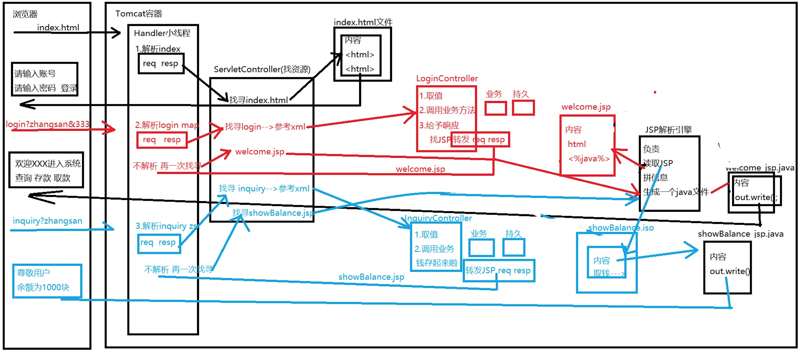

JSP：Java Server Page，Java服务页面，为Servlet动态响应信息服务，本质上是Servlet，是Servlet的一部分

## 请求原理

- 请求文件资源：tomcat底层参考web.xml文件直接找到文件资源，将文件内容直接返回

- 请求操作资源：

  - Servlet
    - tomcat底层参考web.xml文件，根据servlet-mapping配置找到对应的controller
    - 通过反射执行找到的controller中的service、doPost、doGet...方法
    - 方法执行完后
      - response.getWriter().write("字符串")：直接响应字符串回去
      - response.sendRedirect("页面名称")：直接跳转到某个页面
      - request.getRequestDispatcher("页面名称").forward(request,response)：转发到指定页面
  - JSP
    - tomcat底层参考自己的web.xml文件找到JSP解析引擎：JSPServlet
    - 解析引擎将jsp文件中的内容重新拼接组合，将内容写入一个新的文件：xxx_jsp.java
    - 将新文件编译形成：xxx_jsp.class文件
    - class文件执行，将返回内容响应
    - 形成的.java文件和.class文件默认都在idea的文件夹下

- 为什么说JSP就是Servlet？

  - 从tomcat默认配置在web.xml中的映射关系可以看出。
  - 从jsp文件生成的java类中的方法可以看出，包含：\_jspInit()、\_jspDestory()、_jspService()

- **编译过程**

  如浏览器发送请求：index.jsp?key=value，到达tomcat时：

  - 获取请求信息：获取请求名称以及请求参数

  - 创建对象：创建HttpServletRequest、HttpServletResponse对象

  - 根据请求名称获取资源：

    - 先参考工程内部web.xml，主要确定是否是动态资源，如果不是
    - 再参考tomcat内部web.xml文件，找到jsp的解析引擎：JSPServlet
    - JSP引擎解析jsp文件形成新的index_jsp.java，javac编译成index_jsp.class文件，最后响应浏览器

  - 流程图：

    

## 内置对象

内置对象放置在jsp文件经过JSPServlet解析后生成的xxx_jsp.java文件中的_jspService()方法中

| 数据类型            | 变量名称    | 含义           | 作用域对象                                  |
| ------------------- | ----------- | -------------- | ------------------------------------------- |
| HttpServletRequest  | request     | 一次请求       | 是，作用在一次请求中                        |
| HttpServletResponse | response    | 客户端响应信息 | 是，作用在一次请求中                        |
| HttpSession         | session     | 一次会话       | 是，作用在同一个用户的多次请求              |
| ServletContext      | application | 全局上下文     | 是，作用在任何位置(多个session之间可以共享) |
| JSPWriter           | out         | 输出对象       | 否                                          |
| Object              | page        | 当前页面对象   | 否                                          |
| PageContext         | pageContext | 页面上下文     | 是，作用在当前页面作用域中                  |
| ServletConfig       | config      | 读取信息对象   | 否                                          |
| Exception           | exception   | 异常对象       | 否                                          |

- HttpServletRequest中常用方法

  1. String value = request.getParameter("key")：获取浏览器发送请求携带的参数信息

  2. request.setChareacterEncoding("UTF-8")：设置接受请求信息时的字符集(post)

  3. request.setAttribute("key",Object)：设置一个新属性到request对象中

  4. Object object = request.getAttribute("key")：从request对象获取指定key的一个值

  5. RequestDispatcher dispatcher = request.getRequestDispatcher("path")：获取转发的资源路径对象

     dispatcher.forward(request,response);//转发

  6. Enumeration\<String> params = request.getParameterNames()：获取请求携带参数全部的key

  7. String[] values = request.getParameterValues("key")：获取指定key的一组值

  8. StringBuffer sbuffer = request.getRequestURL()：获取请求全路径，Locator统一资源定位符

     http://localhost:8080/JSPBuiltInObject/index.jsp

  9. String str = request.getRequestURI()：Identifier统一资源标识符

     /JSPBuiltInObject/index.jsp

  10. String str = request.getHeader("Accept-Language")：获取协议头传递的信息，如国际化

  11. Enumeration\<String>  names = request.getHeaderNames()：获取所有请求头信息

  12. HttpSession session  = request.getSession()：获取HttpSession对象

  13. Cookie[] cookies = request.getCookies()：获取所有的Cookie对象

- HttpServletResponse中常用方法

  1. response.setCharacterEncoding("UTF-8")：设置响应信息字符集编码

  2. PrintWriter pw = response.getWriter()：获取PrintWriter对象

     pw.write("")：响应信息

  3. int statusNumber = response.getStatus()：获取http响应状态码

  4. response.setStatus(int statusNumber)：设置http响应状态码

  5. response.addCookie(new Cookie("key","value"))：添加一个Cookie对象返回浏览器，key不能为null，值长度不能为0

  6. response.sendRedirect("path")：重定向到指定页面

- HttpSeession中常用方法

  1. session.setAttribute("key",Object)：设置一个新属性到session对象中
  2. Object object = session.getAttribute("key")：从session对象中获取指定key的值
  3. session.removeAttribute("key")：移除session对象中指定的key
  4. Enumeration\<String> names = session.getAttributeNames()：获取session对象中所有的key
  5. session.setMaxInactiveInterval(int 秒)：设置session不活跃时间，超出时间无法获取session中的值
  6. session.invalidate()：设置session对象失效(没有session了)
  7. String JSessionID = session.getId()：获取当前用的session值

- ServletContext中常用方法

  1. application.setAttribute("key",Object)
  2. Object object = application.getAttribute("key")
  3. application.removeAttributer("key")
  4. Enumeration\<String> en = application.getAttributeNames()
  5. String value = application.getInitParameter("key")
  6. Enumeration\<String> en = application.getInitParameterNames()：获取web.xml中context-param标签中配置的参数名列表
  7. application.getRequestDispatcher("").forwar(req,resp)
  8. String realPath = application.getRealPath("/")：获取项目真实路径

- JSPWriter中常用方法

  1. write()
  2. println()

- PageContext中常用方法

  1. pageContext.setAttribute()
  2. pageContext.getAttribute()
  3. pageContext.removeAttribute()

- ServletConfig中常用方法

  1. String value = config.getInitParameter("key")：获取初始化参数
  2. Enumeration\<String> en = config.getInitParameterNames()：获取初始化参数名列表
  3. String name = config.getServletName()：获取当前Servlet名称
  4. ServletContext application = config.getServletContext()：获取全局上下文对象

- Exception中常用方法

  - Exception主要目的是为了定义实现错误页面，实现方法：
    - 写一个新的jsp文件，如：error.jsp
    - 在error.jsp头信息上设置：isErrorPage="true"
    - 在正常的jsp页面中设置头信息：errorPage="error.jsp"

## 标签

- 指令标签

  - <%@ page %>：说明性的标记 通常会放在文件的顶部
    - contentType="text/html;charset=UTF-8"：告知浏览器解析时遵循的规则
    - language="java" ：告知JSP中含有的语言(默认)
    - pageEncoding="UTF-8"：告知Tomcat解析JSP时遵循的字符规则
    - import=""：在JSP中导入的Java文件的包
    - isErrorPage="true"：设置当前JSP是否作为一个异常页
    - errorPage="xxx.jsp"：定义当前页面的错误页
  - <%@ taglib %>：主要目的是为了引入JSTL库
    - <%@ taglib uri="http://java.sun.com/jsp/jstl/core" prefix="c" %>
  - <%@ include%>：用来引入其他文件资源，如：.jsp、.html文件

- 代码标签

  - <%!  %>：生成的代码存在xxx_jsp.java类中，作为成员存在，通常用来定义属性，方法
  - <%  %>：生成的代码存在xxx_jsp.java类中的_jspService()方法内部，方法内的局部，通常是写逻辑
  - <%=  %>：生成的代码存在xxx_jsp.java类中的_jspService()方法内部，通常用来赋值或者打印输出

- 动作标签：\<jsp:xxx>用来替代之前在Java程序中的创建对象、对象赋值取值、请求转发、携带参数等操作

  - 引入页面：<jsp:include page="">

  - 引入domain对象：<jsp:useBean id="" class="" scope="">\</jsp:useBean>

  - 给对象属性赋值：<jsp:setProperty name="" property="" param="">\</jsp:setProperty>

  - 获取对象属性值：<jsp:getProperty name="" property="">\</jsp:getProperty>

  - 转发页面并带参数：

    ```xml
    <jsp:forward page="">
      <jsp:param name="" value=""></jsp:param>
    </jsp:forward>
    ```

## 总结JSP

- 三个指令标签

  \<%@page%>、 \<%@taglib%>、 \<%@include%>

- 六个动作标签

  <jsp:>  useBean、setProperty、 getProperty、 forward、 param、 include

- 四个作用域对象

  page(pageContext)、request(HttpServletRequest)、session(HttpSession)、 application(ServletContext)

- 九个内置对象

   request、response、session 、application、out、page、pageContext、config、exception

## EL&&JSTL

- EL(Expression Language)：表达式语言

  - 代替jsp中Java程序获取域对象中的信息，只能取作用域中通过setAttribute()方法设置的值

    ${xxxScope.key}、 ${xxxScope.key.属性}、${xxxScope.key.方法()}

  - 内置隐式对象

    - ${param.xxx}：请求参数中的值
    - ${paramValues.xxx}：请求参数中的值，返回数组
    - ${requestScope.xxx}：request作用域中的值
    - ${sessionScope.xxx}：session作用域中的值
    - {applicationScope.xxx}：application作用域中的值
    - ${pageScope.xxx}：page作用域中的值
    - ${initParam.xxx}：web.xml配置文件中的值  
    - ${cookie}：cookie中的值
    - ${header}： header中的值

  - 简单的运算

    - 算数运算：\+、-、*、/、%|mod
    - 比较运算：\>(gt)、>=(ge)、<(lt)、<=(le)、!=(ne)、==(eq)
    - 逻辑运算：&&(and)、||(or)、!(not)

- JSTL(JSP Standard Tag Library)：jsp标准标签库

  - 替代jsp中java的流程控制、字符串处理、格式化，使用方式：

    <%@ taglib uri="http://java.sun.com/jsp/jstl/xxxx" prefix=""%>

  - 核心标签库(core)：前缀(c)

    - 输出信息,value可以是字符串可以是表达式：<c:out value="">\</c:out>

    - if表达式,没有else：<c:if test="">\</c:if>

    - 类似switch判断：

      ```xml
      <c:choose>
        <c:when test="${salary <= 0}">
          Salary is very low to survive.
        </c:when>
      
        <c:when test="${salary > 5000}">
          Salary is very good.
        </c:when>
      
        <c:otherwise>
          No comment sir...
        </c:otherwise>
      </c:choose>
      ```

    - 循环：\<c:forEach> 

      - 普通for循环：

        ```xml
        <!--普通for-->
        <c:forEach var="每个变量名字" items="要迭代的list" varStatus="每个对象的状态" begin="循环从哪儿开始" end="循环到哪儿结束" step="循环的步长">
          <c:out value="${i}" />
        </c:forEach>
        ---------------------
        <c:forEach var="i" begin="1" end="10" step=1 varStatus="index">
          当前值： <c:out value="${i}" />
          <br />
        </c:forEach>
        <!--增强for-->
        <c:forEach var="user" items="users">
          当前值： <c:out value="${i}" />
          <br />
        </c:forEach>
        ```

    - 用来拆分字符串：\<c:forTokens>

      ```xml
      <c:forTokens items="google,runoob,taobao" delims="," var="name">
         <c:out value="${name}"/><p>
      </c:forTokens>
      ```

  - 函数标签库(functions)：前缀(fn)

    - 作用：用来处理字符串,可以理解为是以前Java中的String类常用方法
    - 用法：在taglib标签中引用functions库，在文件中用${fn:xxx()}调用函数

  - 格式化标签库

    - 作用：用来处理日期，实现格式化，可以理解为是以前的Date类型：SimpleDateFormat

    - 用法：在taglib标签中引用fmt库，写法与核心标签库类似：\<fmt:xxx>

      <fmt:formatDate value="${requestScope.date}" pattern="yyyy-MM-dd kk:mm:ss">

  - 自定义函数：每一函数都是类中单独的方法

    1. 创建一个类，并创建方法，方法必须是静态方法，通常有返回值

    2. 配置一个"说明书"：xxx.tld

       在当前工程的web/WEB-INF文件夹下创建xxx.tld文件,写入内容：

       ```xml
       <short-name>myFn</short-name>
       <uri>http://www.duyiedu.com</uri>
       <function>
          <name>add</name>
          <function-class>myfn.MyFunctions</function-class>
          <function-signature>int add(int,int)</function-signature>
       </function>
       ```

    3. 在jsp文件中引入，并使用

       ```jsp
       <!--引入-->
       <%@ taglib uri="http://www.duyiedu.com" prefix="myFn"%>
       <!--使用-->
       ${myFn:add()}
       ```

  - 自定义标签：每一个标签都是单独的类

    1. 创建一个类，实现Tag接口，重写里面的方法

    2. 将两组get/set方法补全，并添加响应的私有属性

    3. 在doStartTag、doEndTag两个方法内添加自己的逻辑

    4. 配置一个"说明书"：xxx.tld

       在当前工程的web/WEB-INF文件夹下创建xxx.tld文件,写入内容

       ```xml
       <short-name>myTag</short-name>
       <uri>http://www.duyiedu.com/myTag</uri>
       <!--描述标签及标签内部的属性-->
       <tag>
         <name>out</name>
         <tag-class>mytag.MyOut</tag-class>
         <body-content>JSP</body-content>
         <attribute>
           <name>value</name>
           <required>true</required>
           <rtexprvalue>true</rtexprvalue>
         </attribute>
       </tag>
       ```

    5. 在jsp文件中引入，并使用

       ```jsp
       <!--引入-->
       <%@ taglib uri="http://www.duyiedu.com/myTag" prefix="myTag"%>
       <!--使用-->
       <myTag:out value=""></myTag>
       ```

       