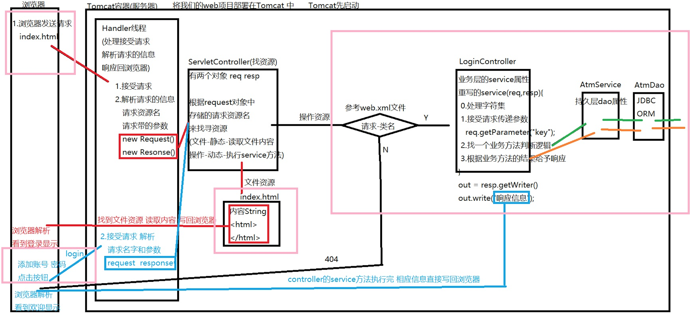

## 介绍

- Tomcat：Apache组织开源免费web容器，用来管理web项目
- Jetty：社区发展出现的容器
-  Resin：Caucho公司一个产品
- JBoss、WebLogic、WebSphere
- Tomcat历史及各版本
  - Tomcat6 JDK5   Servlet2.x JSP2.x  EL2.x
  - Tomcat7 JDK6   Servlet3.x JSP2.x  EL2.x
  - Tomcat8 JDK7   Servlet3.x JSP2.x  EL3.x
  - Tomcat9 JDK8   Servlet4.0 JSP2.3  EL3.0

## Tomcat的安装

- 下载

  - [www.apache.org](http://www.apache.org/)：下载之后直接解压缩就可以使用啦

- 文件夹结构

  - bin：服务器启动相关
  - conf：配置文件  web.xml(请求相关)  server.xml(容器自身的信息 比如端口)
  - lib：jar形式的包
  - logs：日志文件
  - temp：临时文件
  - webapps：用来存放部署在容器内的项目资源的
  - work：用来存放解析JSP后形成的java文件

- IDEA集成Tomcate

  - 安装tomcate插件：File--Settings--Plugins--Installed

  - IDEA解决tomcat乱码，找到IDEA的一下配置文件：

    - 方式一：找到idea.exe.vmoptions|idea64.exe.vmoptions，在末尾添加

      -Dfile.encoding=UTF-8；-Dconsole.encoding=UTF-8

    - 方式二：配置Tomcat容器做参数处理

      - VM options处添加： -Dfile.encoding=UTF-8

      - Startup/Connection选项卡，勾选 Pass environment variables，添加：

        JAVA_OPTS    -Dfile.encoding=UTF-8

        JAVA_TOOL_OPTIONS  -Dfile.encoding=UTF-8

## 交互流程

- 自定义Servlet

  - 创建一个类，继承tomcat提供的一个规则：HttpServlet

  - 重写service方法，有参数(HttpServletRequest HttpServletResponse)，无返回值

  - 抛出两个异常：ServletException IOException

  - 在web文件夹的WEB-INF文件夹配置web.xml，告知请求映射关系：

    ```xml
    <servlet>
      <servlet-name>用来配对的名字</servlet-name>
      <servlet-class>真实类全名</servlet-class>
    </servlet>
    <servlet-mapping>
      <servlet-name>用来配对的名字</servlet-name>
      <url-pattern>/请求名字</url-pattern>
    </servlet-mapping>
    ```

- 流程图

  

- 交互中乱码处理

  - tomcat老版本配置文件中默认编码是：ISO-8859-1；新版本(tomcat8+)是：UTF-8

  - GET请求方式乱码处理方式(新版本不用处理)：

    ```java
    String aname = request.getParameter("aname");
    byte[] value = aname.getBytes("ISO-8859-1");
    String newString = new String(value,"UTF-8");
    ```

  - POST请求方式乱码处理方式：

    request.setCharacterEncoding("UTF-8")

## Servlet

- 产生方式：通过web.xml配置文件，采用生命周期托管形式的单例对象，有两种加载方式

  - 立即加载：tomcat启动的时候就将类实例化。
  - 延迟加载：当使用该类时才实例化该类。

  默认效果是延迟加载的方式，因为tomcat启动会读取web.xml文件，如果都立即加载，内存压力很大，可以通过一下方式改变加载方式：

  ```xml
  <servlet>
    <servlet-name></servlet-name>
    <servlet-class></servlet-class>
    <!--设置立即加载，值越小越早加载-->
    <load-on-startup>整数0</load-on-startup>
  </servlet>
  <servlet-mapping>
  </servlet-mapping>
  ```

- 生命周期：为了更好的管理对象的产生和销毁，Servlet提供了3个方法：

  - init()：对象创建时
  - service()：每一次处理请求
  - destroy()：销毁对象时

- 初始化参数

  ```xml
  <servlet>
    <servlet-name></servlet-name>
    <servlet-class></servlet-class>
    <init-param>
      <param-name>key1</param-name>
      <param-value>value1</param-value>
    </init-param>
  </servlet>
  
  <!--
  可以在init方法内使用带ServletConfig的参数读取
  String value = config.getInitParameter("key");//某一个key对应的value
  Enumeration en = config.getInitParameterNames();//获取全部的key
  String name = config.getServletName();//获取当前Servlet类名
  ServletContext application = config.getServletContext();//获取全局上下文对象
  -->
  ```

- 继承关系

  自定义**Servlet** extents **HttpServlet** extends **GenericServlet** implements **Servlet,ServletConfig,Serializable**

  - ServletConfig：接口里只有4个抽象方法

    - String param = getInitParameter(String var1)
    - Enumeration\<String> paramNames = getInitParameterNames()
    - String servletName = getServletName()
    - ServletContext application = getServletContext()

  - Servlet：接口里只有5个抽象方法

    - void init(ServletConfig config) throws ServletException
    - void service(ServletRequest var1, ServletResponse var2) throws ServletException, IOException
    - void destroy()
    - ServletConfig getServletConfig()
    - String getServletInfo()

  - GenericServlet：实现上面两个接口的目的是体现缺省适配器模式

    - 将两个接口中的8个方法重写实现了，留下一个service方法给用户实现具体业务逻辑。
    - 多了一些自己独有的方法：init()无参与有参方法构成方法重载;log()

  - HttpServlet：继承GenericServlet，实现跟Http协议相关方法

    - 添加了具体的响应方式方法，如：

      doGet、doPost、doPut、doDelete...

    - 实现了父类的service方法，并加了一个service方法重载

      实现父类service方法：方法内部将两个没有协议的参数，强制类型转化成带HTTP协议的参数

      构成service重载的方法：通过request.getMethod()，获取请求的方式调用对应方法

## Filter(过滤器)

Tomcat提供的一个组件 类似Servlet机制 使用方式，是一个特殊的Servlet，在真正的目标之前执行，如Servlet、jsp。

- 基本使用

  - 可以参考Servlet：定义一个类，继承HttpFilter

  - 重写doFilter方法：

    - 参数：HttpServletRequest、HttpServletResponse、FilterChain
    - 异常：ServletException、IOException

  - 配置web.xml文件：

    ```xml
    <filter>
        <filter-name>one</filter-name>
        <filter-class>filter.FilterOne</filter-class>
        <init-param>
             <param-name>key</param-name>
             <param-value>value</param-value>
        </init-param>
    </filter>
    <filter-mapping>
        <filter-name>one</filter-name>
        <url-pattern>/*</url-pattern>
      	<!--让拦截器作用于指定的方式，可以配置多个：
    				四种方式：
    						REQUEST(默认)：客服端发送请求
    						FORWARD：通过请求转发转发过来
    						INCLUDE：通过<jsp:include page="xxx.jsp" />
    						ERROR：web.xml中配置的error-page标签
    							<error-page>
                    <error-code>400</error-code>
        						<location>/filter/error.jsp</location>
    							</error-page>
    		-->
        <dispatcher>REQUEST</dispatcher>
        <dispatcher>FORWARD</dispatcher>
    </filter-mapping>
    ```

- 管理机制

  自定义**Filter** extends **HttpFilter** extends **GenericFilter** **implements Filter,FilterConfig,Serializable**

  - FilterConfig：只有四个抽象方法

    - String filterName = getFilterName()
    - ServletContext application = getServletContext()
    - String value = getInitParameter("key")
    - Enumeration\<String> paraNames = getInitParameterNames()

  - Filter：2个具体方法，一个抽象方法

    - default void init(FilterConfig filterConfig) throws ServletException {}

    - ```java
      void doFilter(ServletRequest var1, ServletResponse var2, FilterChain var3) throws IOException, ServletException
      ```

    - default void destroy() {}

  - GenericFilter：实现上面两个接口，缺省适配器模式

    - 实现了FilterConfig中的所有抽象方法，实现了Filter中的init方法，并重载一个无参方法

  - HttpFilter：做一个参数类型的转化 ,将无协议的参数强制转化成Http协议的参数

- 拦截请求

  - 处理方式：处理请求|给予响应|转发|重定向|放行

  - 从服务器发送出来的请求转发forward(同一次请求)：默认不经过filter

  - 从服务器发送出来的请求重定向sendRedirect(新请求)：经过filter

  - 如果想要让指定的请求经过filter过滤(默认配置是重定向)：

    ```xml
    <dispatcher>REQUEST</dispatcher>
    <dispatcher>FORWARD</dispatcher>
    ```

## Listener(监听器)

Tomcat提供的一个组件，类似观察者模式，作用：

- 监听域对象产生和销毁的

  - ServletRequestListener：request
  - HttpSessionListener：session
  - ServletContextListener：application

- 监听域对象存值 修改 删除

  - ServletRequestAttributeListener
  - HttpSessionAttributeListener
  - ServletContextAttributeListener

  setAttribute();  removeAttribute();

- 实现：创建一个类，实现以上接口，然后在web.xml中配置：

  ```xml
  <listener>
      <listener-class>监听类</listener-class>
  </listener>
  ```

## Web注解

配置web.xml目的是让请求资源与真实的类产生对应关系，由于web.xml配置过于麻烦，所以WEB3.0版本之后出现了替代web.xml配置的注解：

- @WebServlet
  - urlPatterns={"请求","请求"}
  - value={"",""}
  - loadOnStartUp=0
  - initParams={@WebInitParam(name="",value=""),@WebInitParam(name="",value="")}
- @WebFilter
  - urlPatterns={"请求","请求"}
  - value={"",""}
  - initParams={@WebInitParam(name="",value=""),@WebInitParam(name="",value="")}
- @WebListener
  - 直接写在类上即可，没有参数

