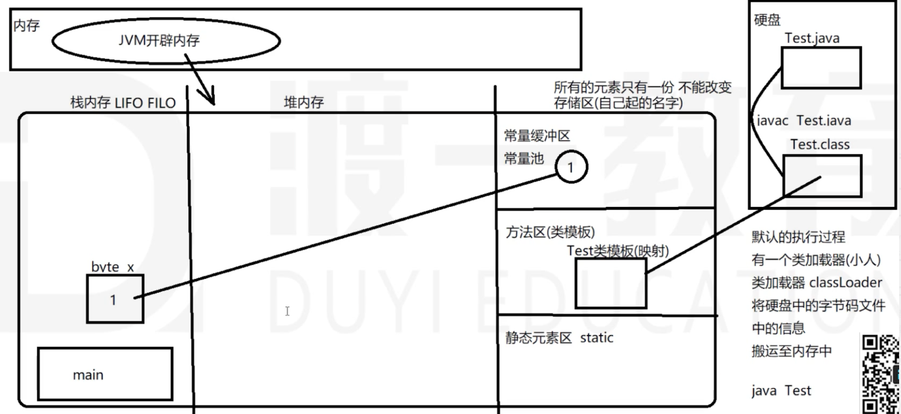
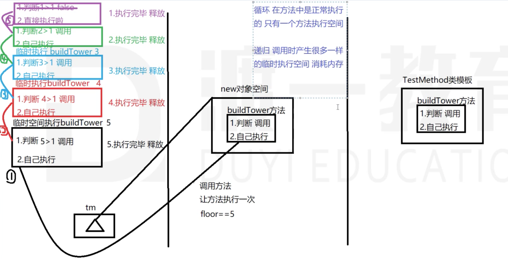
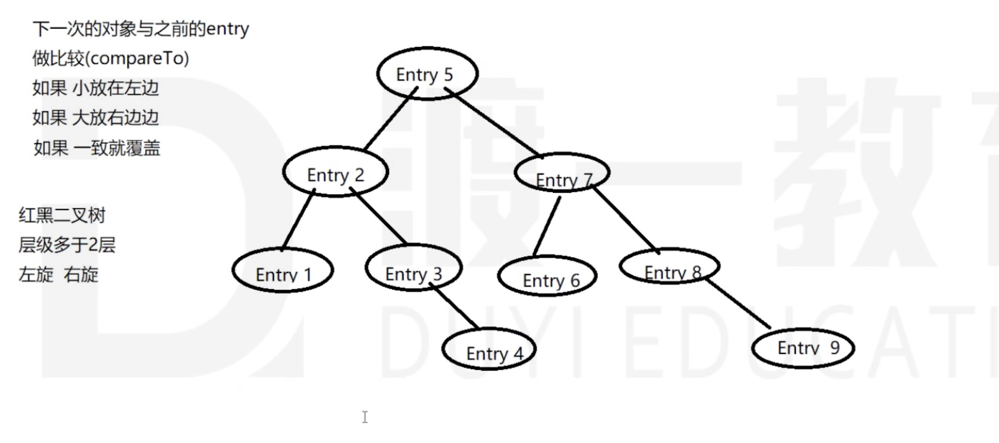
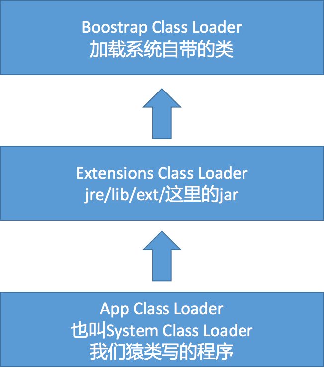
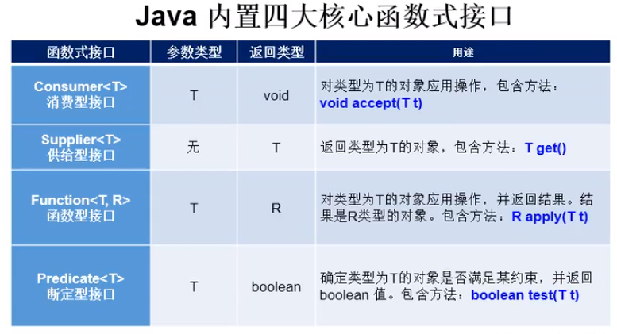
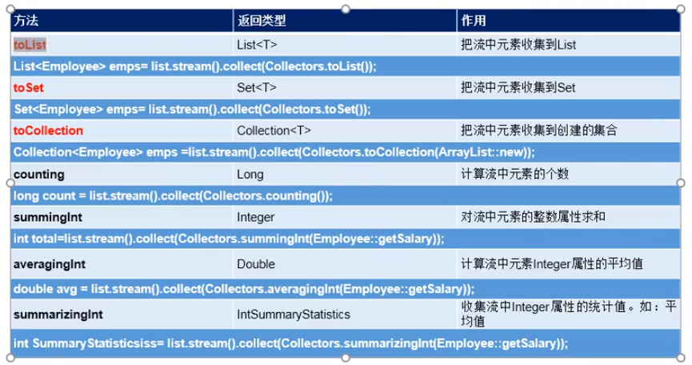
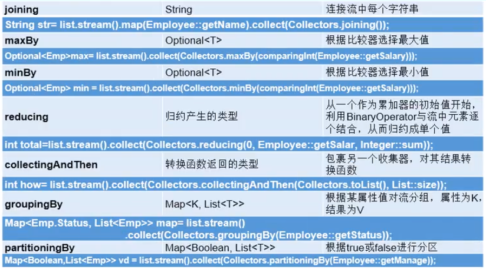

## 介绍及环境搭建

### Java介绍

- Java语言可以编写跨平台应用软件的面向对象程序语言

- 什么是跨平台？

  不依赖于操作系统，也不依赖于硬件环境

- 什么是面向对象？

  把数据和对数据的操作都封装在一起，作为一个整体

- 版本说明

  - 标准版    Standard Edition     JavaSE
  - 企业版    Enterprise Edition    JavaEE
  - 微型版    Micro Edition       JavaME

- 特点：跨平台性、面向对象、简单性、健壮性、多线程、大数据开发相关

### 环境搭建

JDK：Java Development Kit(Java 开发工具包)

安装JDK步骤：

1. 下载JDK：[www.oracle.com](http://www.oracle.com/)
2. 安装:双击安装文件，可自定义安装路径
3. 配置环境变量：JAVA_HOME(JDK安装路径)、CLASSPATH(一般设置lib/tools.jar和lib/dt.jar)、PATH(环境变量，需要将java的exe执行文件配置，目录JAVA_HOME/bin)

JDK、JRE、JVM关系：运行一个java程序最小环境为JRE，开发一个Java程序最小环境为JDK。

- [^JDK]: Java Development Kit（Java开发工具包）

- [^JRE]: Java Runtime Environment（Java运行环境）

- [^JVM]: Java Virtual Machines（Java虚拟机）

### 编译过程

- 程序员编写的java源文件（.java）首先要经过jvm编译，生存所谓的字节码文件（.class）

  ​	javac *.java：编译.java文件为.class文件

- java程序的运行需要JVM的支持，JVM是一个软件，安装在操作系统中，为字节码文件提供运行环境

## 语言基本构成

### 基础数据类型

**8种基本数据类型:**

| 数据类型 | 类型名称 | 字节空间    | 使用场景                        |
| -------- | -------- | ----------- | ------------------------------- |
| 整数     | byte     | 1字节(8位)  | 存储字节数据(较常用)            |
| 整数     | short    | 2字节(16位) | 兼容性考虑(很少使用)            |
| 整数     | int      | 4字节(32位) | 存储普通整数(常用)              |
| 整数     | long     | 8字节(64位) | 存储长整数(常用)                |
| 浮点     | float    | 4字节(32位) | 存储浮点数(不常用)              |
| 浮点     | double   | 8字节(64位) | 存储双精度浮点数(常用)          |
| char     | char     | 2字节(16位) | 存储一个字符(常用)              |
| 布尔     | boolean  | 1字节(8位)  | 存储逻辑变量(true、false)(常用) |

[^字节]: 计算机中存储量的单位

8位=1B(字节)、1024B = 1KB(千字节)、1024KB = 1M(兆)、1024M = 1G

- **int** 

  - int 是最常用的整数类型，一个int类型的变量占用4个字节(32位)，最大表示范围：

    -2^31~2^31-1即-2147483648～2147483647

  - 无论保存多大的数据都是占用4个字节，当超出最大保存返回，就会出现编译失败。

  - 整数直接量：直接写入的整数，如果 int a = 100；那么100就是直接量。

  - 两个整数相除，会舍弃小数部分，不做四舍五入。

  - 在做运算时，需要防止溢出的发生：

    - 正数过大发生溢出结果是负数
    - 负数过大发生溢出结果是正数

- **long**

  比int类型存储范围更大的整数类型，当int类型范围不够，可以使用long类型进行存储。

  - 一个long类型的变量占用8个字节，最大范围：-2^63~2^63-1
  - 如果直接量操作int类型最大值，则必须以l或者L结尾作为直接量。

- **double**

  浮点数就是小数，包括float和double。

  - 因为double类型的误差比float类型小，所以在计算小数的时候都是使用double类型。
  - 如果需要表示float的直接量，需要加f或者F，如:float a = 3.14F

- **char**

  - 字符类型本质上是一个16位无符号整数，这个整数是该字符的unicode编码。
  - unicode是将地球上主要的语言中的每个文字符号都对应1个号。
  - 计算机中存字符都是存字符对应的数字。
  - 直接使用字符即可，不必关心每个字符的数字，但必须用单银号包括。
  - 一个字符变量中只能存1个字符。
  - 常用char类型数值操作：‘0’～‘9’：48～57；‘A’～‘Z’：65～90；’a’~’z’:97～122

- **基本类型间转换**

  不同的基本数据类型之间可以相互转换

  - 自动转换(隐式转换)：从小类型到大类型可以自动转换，参考以下规则：

    (byte、short、char)➡️int➡️long➡️float➡️double

  - 强制转换：从大类型转换成小类型，如：

    ```java
  char a = ‘a’; 
    char A = (char)(a-32);
    ```
  
  注意：

  - 多种基本数据类型参与的运算中，结果会自动向较大的类型进行转换
- 强制将大类型转换成小类型极容易出现溢出或丢失精度
  - byte、short、char三种类型实际存储的数据都是整数
  - 在实际应用中：
    - int直接量可以直接赋给byte、short、char，只要不操作其表示的范围；
    - byte、short、char三种类型参与运算时，先一律转换成int类型再进行运算。

### 常量与变量

- **变量**

  - 定义：变量就是内存中开辟的一块存储空间，用于存放运行过程中所需要用到的数据，可以将变量理解为一个代词，指代它所存储的那个数据。
  - 说明：变量是一个空间，在声明(创建)的时候，必须指定存储数据类型，和变量空间名称，并且只能存储一个类容(值|引用)，变量空间内的内容可以改变。
  - 声明：
    - 数据类型 变量名，如：int a;
    - 如果数据类型一样，可以在一条语句中声明多个变量，如：int a,b,c;
    - 命名规范：
      - 可以由字母、数字、_和$符组成
      - 首字母不能以数字开头
      - 大小写敏感，命名时需要注意
      - 不能使用关键字，如：if、int、for、break等
      - 中文可以作为变量名称，但不推荐使用

- **常量**

  - 定义：程序运行过程中不能再次改变的值。

  - 源码编译运行过程：重要
  
    

### 运算符

- 算术运算符

  - 模运算(%)：取余，除法中不能被整除的部分
  - 自增(++)和自减(--):可以使变量的值加1或者减1
    - 语法：变量++或者++变量，在单独使用的情况下，都等效于：变量 = 变量 + 1
    - 在变量前++，表示在内存中先加1，然后再取出使用
    - 在变量后++，表示在内存中，先取出使用再加1
  - 算术运算符包括：+、-、*、/、%、++、--

- 赋值运算符

  将=右边的内容存入=左边的变量空间，包括：

  =、+=、-=、*=、/=、%=

- 关系运算符

  用于判断数据之间的大小，返回的结果都是boolean类型,包括：

  \>、<、<=、>=、==、!=、instanceof(对象 instanceof 类)

- 逻辑运算符

  参与逻辑运算的每个条件都是boolean类型，运算结果也是boolean类型，运算符包括：

  &&(且)、||(或)、&(逻辑与)、|(逻辑或)、^(逻辑异或:前后两个条件结果不一样，最终结果为true)、!(非)

  注意：

  - 逻辑与(&)与短路与(&&)的区别：逻辑与根据所有表达式结果确定最后结果，短路与一个表达式为false，后面表达式不用得到结果，最后结果为false。
  - 逻辑或(|)与短路或(||)的区别：逻辑或根据所有表达式结果确定最后结果，短路或一个表达式为true，后面表达式不用得到结果，最后结果为true。

- 位(bit)运算符

  先转换成二进制，然后按着对应位置进行计算(1为true,0为false),再转换为十进制。

  - 按位与(&)：同为1为1
  - 按位或(|)：一位为1为1
  - 按位异或(^)：异为1，同为0
  - 按位取反(~)：1为0，0为1
  - 按位左位移(<<)：乘以2的位移次方,6<<2=24相当于6乘以2的2次方
  - 按位右位移(>>)：除以2的位移次方,6>>1=3相当于6除以2的1次方
  - 按位右位移无符号位(>>>)：

- 知识补充

  **进制转换**

  - 十进制转换成二进制，以60为例：计算机中32个0或1来表示60，60除以2取余，然后将余数倒叙排列

    00000000 00000000 00000000 00111100

  - 二进制转换成十进制，以60为例：从右至左开始计算，每一个源数据乘以2的位置(0开始)次幂，最终求和

    00000000 00000000 00000000 00111100----->
    $$
    2^0*0+2^1*0+2^2*1+2^3*1+2^4*1+2^5*1
    $$

  - 八进制：将二进制的每三位计算成十进制，然后以0开头，将每个值拼在一起，如60->074
  - 十六进制：将二进制的每四位计算成十进制，表示形式以0x开头，10-15对应A-F，如60->0x3C

  **原码、反码、补码**

  | 数值 | 原码                                | 反码                                                      | 补码                                        |
  | ---- | ----------------------------------- | --------------------------------------------------------- | ------------------------------------------- |
  | 6    | 00000000 00000000 00000000 00000110 | 00000000 00000000 00000000 00000110                       | 00000000 00000000 00000000 00000110         |
  | -6   | 10000000 00000000 00000000 00000110 | 11111111 11111111 11111111 11111001(符号位不动，其余取反) | 11111111 11111111 11111111 11111010(反码+1) |

  计算机中不管是整数还是负数，存储的形式都是以补码的形式来存储，反码是一种表现形式，取反是一个计算过程(每一个位置都取反)

## 基础语法

### 流程控制

- **顺序结构**

  正常的代码执行顺序

- **分支结构**

  - 单分支

    ```java
    if(){};
    if(){}else{};
    if(){}else if(){}else{}
    ```

  - 多分支

    ```
    switch(参数){
    	case 值1:
    		...;
    		break;
      case 值2:
      	...;
      	break;
      default:
      	...；
      	break;
    }
    ```

  注意：

  - switch无break关键字时是多分支，有则是单分支。
  - switch支持参数类型：byte、short、int、char、1.5+enum、1.7+string
  - if优点：可以写复杂的判断逻辑；缺点：执行效率比较低
  - switch优点：判断过程效率比较高；缺点：值必须固定。

- **循环结构**

  - for(初始值；判断条件；变化量){执行逻辑}

  - while(条件){变化量和执行逻辑};先执行判断，再确定是否执行逻辑
  - do{变化量和执行逻辑}while(条件)：先执行一次程序，然后再判断条件
  - 增强for：for(变量类型 变量:需要循环遍历的变量){执行逻辑}

- **递归**

  ```java
  public void buildTower(int floor){
      if(floor>1){
          this.buildTower(floor-1);
      }
      System.out.println("盖到了第"+floor+"层");
  }
  ```

  内存图：

注意：循环中经常用到break和continue

- break是终止本次当前循环，continue是终止本次循环
- 为了清楚循环，可以给循环起别名(循环标记)，如：first:for(){},然后使用break first或者continue first终止指定循环。

### 数组

- 定义

  是一组数据类型相同的数据的组合，将这些数据统一管理。

- 赋值(初始化)

  数组是引用数据类型，数组内存储的数据类型可以是基本数据类型也可以是引用数据类型，在声明时必须指定长度。

  - 静态初始化(有长度、有元素)

    ```java
    int[] array = new int[]{10,20,30,40,50};
    int[] array = {10,20,30,40,50};
    ```

  - 动态初始化(有长度、无元素，默认值根据指定的存储数据类型决定)

    ```java
    int[] array = new int[5];
    ```

    整数默认值0；浮点数默认值0.0；字符型默认值0-char、97-a、65-A、48-'0'；布尔型默认值false；引用数据类型默认值null。

- 访问：通过元素在数组中的位置(index索引)来访问，索引从0开始。

- 遍历：JDK1.5版本后可以使用增强for循环来遍历数组。

- 冒泡排序算法

  ```java
  int[] a={5,6,2,3,4,1};
  for (int m=0;m<a.length;m++){
      for (int i=a.length-1;i>m;i--)
      {
          if(a[i]<a[i-1]){
              a[i]=a[i]^a[i-1];
              a[i-1]=a[i]^a[i-1];
              a[i]=a[i]^a[i-1];
          }
      }
  }
  ```

- 多维数组

  - 定义：存储类型[] 数组名称；

    int[]\[] array;

  - 初始化

    静态—有长度，有元素：int[][] array = {{1,2,3},{1,2},{,4,6,8}};

    动态—有长度，无元素(默认)：int[][] array = new int[3]\[2];{{x,x},{x,x},{x,x}}

  - 访问：通过元素在数组中的位置—index索引

    array[i]\[j]:i控制外出数组索引，j控制里层数组索引

  - 遍历：正常for嵌套或者增强for嵌套。

**注意**：

- 引用数据类型与基础数据类型再内存结构上的区别
  - 所有的变量空间都存储在栈内存，可以存储基础数据类型和引用数据类型。
  - 基本数据类型变量空间存储的是值，传递的也是值，一个改变，另一个不变。
  - 引用数据类型变量空间存储的是引用地址，传递的是引用地址，一个改变，另一个也改变。
  - new 关键字，实际是在堆内存中新开辟了一个空间，数组在堆内存的空间形态是一串连续的地址(hashCode)
  - 堆内存中的数组空间长度一旦确定，是不能修改的。

## 面向对象

Java面向对象三(四)个特征：继承、封装、多态、（抽象）

### 命名规则和规约

- 规则：可以由字母、数字、符号、中文命名;字母区分大小写，数字不能抬头，符号包含_、$,中文不推荐使用

- 规约：

  类名首字母大写，两个单词以上，每个单词首字母大写

  属性、方法、变量都采用驼峰命名

  构造方法与类名一致

  静态常量全部字母大写，单词之间用_连接

  包名全部字母小写，但是java的关键字都是小写，注意不要与关键字冲突

### 类与对象

类：抽象的概念，描述一类事物，具有一定的相同特征(属性)和行为(方法)

对象：具体的个体

### 类的构成

- 属性：权限修饰符 [特征修饰符] 数据类型 属性名称[ = 值 ]；
- 方法：权限修饰符 [特征修饰符] 返回值类型 方法名称([参数列表]) [抛出异常] [{方法体;}]
- 构造方法：权限修饰符 方法名称(与类名一致)(参数列表) [抛出异常]{创建当前对象;返回对象;}
- 程序块：{};算是一个非常特殊的方法，只有方法体。
- 方法在类中存在的4中形式：无参数无返回值、无参数有返回值、有参数无返回值、有参数有返回值

### 方法重载与方法重写

- 方法重载：

  - 概念：一个类中的一组方法，相同的方法名字，不同的参数列表，这样的一组方法构成了方法重载

  - 参数的不同：参数的个数、参数的类型、参数的顺序

  - 作用：调用方法先通过方法名定位，如果有重复名称，再通过参数类型定位，如果没有参数类型一致的方法，会找一个参数类型可以自动转换后的方法。

  - 参数：JDK1.5版本后出现了动态参数列表的写法，如：

    int...x,表示参数类型固定，但是参数个数不固定，x本质上就是数组，有length属性，有index，但不能与相同意义的数组类型的方法构成方法重载，他们本质是一样的，在方法的参数位置只能放在末尾，而且只能有一个。

- 方法重写：将父类的方法在子类中重新定义,重新定义时，方法名称、参数必须一样。

- 两者对比

  |            | 方法重写(override)                                           |            方法重载(overload)            |
  | :--------- | :----------------------------------------------------------- | :--------------------------------------: |
  | 类         | 参数两个继承关系的类，子类重写父类方法                       |            一个类中的一组方法            |
  | 权限修饰符 | 子类可以大于等于父类                                         |                 没有要求                 |
  | 特征修饰符 | final、static、abstract 父类是final，子类不能重写 父类是static，子类不存在重写这一说法 父类是abstract，子类是具体类必须重写，否则子类是抽象类，可以不用重写 |                 没有要求                 |
  | 返回值类型 | 子类可以小于等于父类                                         |                 没有要求                 |
  | 名字       | 子类名字必须与父类名称一致                                   |              方法名必须一致              |
  | 参数       | 子类与父类一致                                               | 每个方法的参数必须不一致(个数 类型 顺序) |
  | 异常       | 运行时异常、编译时异常 1、如果父类方法抛出运行时异常，子类可以不理会 2、如果父类方法抛出编译时异常，子类抛出异常的个数和类型都少于等于父类 |                 没有要求                 |
  | 方法体     | 子类的方法应该与父类的不一致                                 | 每个方法执行的过程或者业务逻辑应该不一致 |

### 构造方法、块、this

- 构造方法

  - 作用：构建(构造)当前类的方法，一个类里面只能有一个
  - 写法：权限修饰符 方法名称(与类名一致)(参数列表) [抛出异常]{创建当前对象;返回对象;}，方法体必须有
  - 用法：通过new关键字调用
  - 特点：
    - 每一个类默认都有自己的一个无参数构造方法，如果在类中自己定义了构造方法，则以重写这个为准。
    - 构造方法也存在方法重载。

- 程序块

  - 作用：需要在构造方法之前执行的逻辑，需要代码块

  - 写法：{}可以认为是一个无修饰符无参数无返回值无名字的特殊方法

  - 用法：也是需要调用才能执行，无法直接调用（没有名字）

    每一次我们调用构造方法之前，系统会自动调用一次代码块并执行。

  - 特点：没有什么重载的概念，但是可以在类中定义多个代码块，按顺序执行

- this

  - 是一个关键字(指代词)，代替的是某一个对象(当前调用属性或方法时的那个对象)；
  - 可以放置在类中的任何成员位置调用属性和方法，上下顺序随意。
  - 在一般的方法内部不能调用构造方法，但是在构造方法中可以调用构造方法，调用方式this(),省略了类名，在另一个构造方法调用时，必须放在第一行;
  - 方法之间来回调用写法可以，执行可能会产生StackOverflowError栈溢出错误 

### 泛型

在JDK1.5版本后出现的泛型，用来规定数据类型的，定义时用一个符号代替某种类型，使用时用具体的数据类型，替换定义的那个符号替换。

可以使用在：

- 类：类定义时描述某种数据类型，集合的使用就是这样,如

  ```java
  ArrayList<String> list = new ArrayList<[String]>();
  ```

- 接口：与泛型类的使用基本一致，子类实现接口时必须添加泛型

- 方法：方法调用时传参数，方法的泛型与类无关，带有泛型的方法可以不放在泛型类中

- 参数：高级泛型   规范边界  extends super

### 类的关系

类与类之间的关系：

A is a B					泛化(继承 实现)

A has a B				包含(组合 聚合 关联)

A need a B			 依赖

- 继承
  - 通过extends关键字实现类与类的继承
  - 子类可以调用父类的public、protected修饰的属性和方法，可以添加自己独有的属性和方法
  - 继承过来的方法不满足子类的需求，子类可以将重写父类的方法。
  - 每个类都默认继承Object类，如果有extends其他类，那么间接继承Object类。
  - Object类非常重要，是所有引用类型的父类，Object没有父类。
  - Java是单继承，只能继承一个类，所以继承是很珍贵的。
  - 关于this和supper的使用
    - this和supper都是代指某个对象。
    - this代指当前执行方法时的那个对象，不一定是当前类的对象
    - supper代指当前执行方法时的对象的父类对象
    - 可以放置在类成员的的任何位置(属性、方法、构造方法、块)
      - 注意调用一般方法的时候可以来回相互调用(编译可以)，执行可能产生StackOverflowError错误
      - 可以调用构造方法，放在构造方法的第一行，构造方法之间不能来回调用，编译就不行

- 包含和依赖

  - 包含关系(组合  聚合  关联)

    - 组合：整体和部分的关系，不可分割
    - 聚合：整体和部分的关系，可能在创建的时候是分开的
    - 关联：整体和部分的关系，可以分割，后来形成在一起的

    java程序体现形式：通过一个类的对象当做另一个类的属性来存储

  - 依赖关系

    不是整体和部分的关系，是因为某一件事情产生了关系，临时组合在一起，这件事完成就解散。

    java程序体现形式：一个类的方法中使用到另一个类的对象，可以以参数传递或者创建新对象。

- Object类的方法

  | hashCode()  | 将对象在内存中的地址经过计算得到一个int整数                  |
  | ----------- | ------------------------------------------------------------ |
  | equals()    | 用来比较两个对象的内容，基本类型(比较值)，引用类型(比较地址)，默认比较地址，可以重写 |
  | toString()  | 打印输出是将对象变成String字符串                             |
  | getClass()  | 获取对象对应类的类映射(反射机制)                             |
  | wait()      | 线程进入挂起等待状态，存在重载                               |
  | notify()    | 线程唤醒                                                     |
  | notifyAll() | 唤醒所有                                                     |
  | finalize()  | 权限修饰符是protected，在对象被GC回收的时候，默认调用执行的方法,析构函数(回收方法) |
  | clone()     | 权限修饰符是protected，为了克隆对象                          |
  
  注意：==与equals()的区别
  
  - ==可以比较基本数据类型也可以比较引用数据类型，如果是基本数据类型比较的是值，如果是引用数据类型比较的是引用地址。
  - equals是继承自Object类，每一个引用数据类型都可以调用， 默认与==比较的一样，如果想要改变比较规则，可以重写equals()方法，如Integer重写了equals方法，默认比较的是值。

### 修饰符

- 权限修饰符

  | public    | 公共的   | 本类 | 同包(package一样) | 子类             | 当前工程任何位置都可以用 |
  | --------- | -------- | ---- | ----------------- | ---------------- | ------------------------ |
  | protected | 受保护的 | 本类 | 同包              | 子类对象范围内部 |                          |
  | 默认不写  | 默认的   | 本类 | 同包              |                  |                          |
  | private   | 私有的   | 本类 |                   |                  |                          |

  可以用来修饰类本身和类里面的成员(除程序块)，修饰类的时候只能使用(public、默认不写)

- 特征修饰符

  - **final：**最终的，不可改变的

    - 修饰变量(栈内存)

      无默认值，如果在定义时，没有赋值，可以赋值一次，如果有赋值就不能再次赋值

      注意变量是基本类型还是引用类型，基本类型数值不能改变，引用类型引用地址不能改变

    - 修饰属性(堆内存)

      全局变量，有默认值，用final修饰后，必须赋初始值，不然编译报错，特点与修饰变量一致

    - 修饰方法

      用final修饰的方法，不能被子类重写

    - 修饰类

      此类不可以被其他类继承，通常是一些定义好的工具类

  - **static**：静态的，可以修饰属性、方法、块、类(内部类)

    特点：

    - 静态元素在类加载时就初始化，创建的非常早，此时没有创建对象
    - 静态元素存储在静态元素区中，每一个类有自己的区域，与别的类不冲突
    - 静态元素只加载一次(只有一份)，全部类对象及类本身共享
    - 由于没有创建对象，可以直接通过类名直接访问
    - 可以理解为静态元素不属于任何一个对象，属于类的
    - 内存管理：栈内存创建开始用完即回收，堆内存通过GC(垃圾回收器)回收，静态元素区GC无法管理(可以认为常驻内存)
    - 非静态成员(堆内存对象内)可以访问静态成员(静态元素区)，静态成员中可以访问静态成员，静态成员中不可以访问非静态成员
    - 静态元素中不可以出现this和super(静态元素属于类，而this和super是对对象来说得)

  - **abstract**：抽象的

    - 修饰方法：用abstract修饰，只有方法结构，没有方法体，用native修饰的不是抽象方法
    - 修饰类：用abstract修饰的类为抽象类
      - 抽象类不一定有抽象方法，但是抽象方法必须放在抽象类或接口中。
      - 抽象类与一般类一样，只是里面可以有抽象方法。
      - 抽象类不能直接被实例，只能通过子类继承来做事情。
      - 抽象类可以单继承抽象类，可以单继承具体类(通常不这样用)，具体类可以单继承抽象类，必须实现抽象类所有方法，如果不实现，那么该类也必须是抽象类。

  - native：本地的

    Java源码中看到native就不能再往下继续看源码了，后面是用其他语言写的了

  - transient：瞬时的，短暂的

  - synchronized：同步的(线程问题)

  - volatile：不稳定的(线程问题)

### 多态

- 定义：同一个对象体现出多种不同形态(身份)，将一种行为表现出不同的效果
- 体现：
  - 父类的引用指向子类的对象，如：Person person = new Teacher()
  - 该引用只能调用父类中定义的属性和方法
  - 如果子类中将父类的方法重写，那么是调取子类重写的那个方法，属性不存在重写，所以还是调用父类
  - 可以强制类型转换(造型，铸型，向上、下转型)成子类的类型，然后调用子类独有方法，在转换之前，可以用instenceof先判断

### 内部类

指在java中将一个类定义在另一个类的内部，可以与类成员的层次一样，也可以定义在方法/块的内部

优点：省略了一个.java的源文件，可以访问外部类的所有成员

- 成员内部类：将一个类直接定义在类的里面，作为成员，与类成员层次一致

  - 可以与正常类一样，使用不同的修饰符修饰
  - 可以使用外部类名.this.外部类成员调用外部类成员
  - 如果想要使用内部类的属性和方法，必须创建对象，通过外部类对象操作

  ```java
  public class Demo{
    public class InnerDemo{}
  }
  Demo demo = new Demo();
  InnerDemo innerDemo = demo.new InnerDemo();
  ```

- 局部内部类：将一个类定义在方法/块里面，作为成员的内部结构，与临时的局部变量一个层次

  - 和类的局部变量一样，不能用public、protected、private及static修饰，只能用abstract或final修饰，使用变量只能是final修饰的。

  ```java
  public class Demo {
      public void test(){
          final class innerDemo{}
      }
  }
  ```

- 匿名内部类

  ```java
  public interfase Test(){
      public void test();
  }
  Test t = new Test(){
      public void test(){}
  }
  ```

- 静态内部类：成员静态内部类

  - 不需要外部类对象，通过正常的方式直接创建。
  - 静态元素不能访问非静态成员(包括自己类和外部类)

### 枚举类

一个类中的对象，认为个数是有限且固定的，并且可以将每一个对象一一列举出来，JDK1.5版本之后可以直接定义enum类型

- 我们自己定义的enum类型直接继承了Enum类(java.lang包)
- 我们自己定义的enum类不能再继承其他类，不能使用extends，但可以实现其他接口
- Enum类型：
  - 两个属性：
    - name：枚举对象的名称，name()方法或者name属性值
    - ordinal：枚举对象在类中罗列的顺序类似index,也从0开始，ordinal()方法获取序号
  - 一些常用方法：
    - valueOf()：通过给定的name获取对应的枚举对象
    - values()：获取全部的枚举对象，返回一个枚举对象的数组
    - compareTo()：可以比较两个枚举对象，正数在前，负数在后，0一样
    - toString()：由于没有final修饰，可以重写
- 可以在enum中描述自己的一个方法和属性
  - 必须在enum类的第一行描述一下枚举的样子，最后分号结束
  - 可以定义自己的属性和方法
  - 需要给枚举类型提供对应样子的构造方法，构造方法只能private修饰，可以重载

```java
public enum Day {
    //描述了7个当前类的对象。
    monday("星期一"),tuesday("星期二"),wednesday("星期三"),
    thursday("星期四"),friday("星期五"),saturday(),sunday();
    private Day(String name){}
    private Day(){}
  	//自定义方法
    public String getName(){
        return super.name();
    }
}
```

### 接口

interface：通常为了定义一个通用的规则，即抽象类抽象到极致，没有具体的方法就成为了接口。

特点：

- 还是一个类接口，但是不用class修饰，用interface修饰的一个类。
- 不能含有一般属性，只用含有公有的静态的常量，如：public static final String name；
- 不能含有一般方法，只能含有公有的抽象方法(1.8版本后用default修饰具体方法)
- 不能含有块、不能含有构造方法
- 不能直接创建对象，只能通过子类多实现来做事
- 抽象类可以直接多实现接口
- 具体类可以多实现接口，但是必须实现所有接口中的抽象方法。
- 接口之间可以多继承

## 工具类

### 包装类

| 基本数据类型 | 包装数据类型 |
| ------------ | ------------ |
| byte         | Byte         |
| short        | Short        |
| int          | Integer      |
| long         | Long         |
| float        | Float        |
| double       | Double       |
| char         | Character    |
| boolean      | Boolean      |

- 8个包装类都在java.lang包下，不需要导包，直接使用
- 有6个是和数字相关的，都继承了Number类
- 8个包装类都实现了Serializable，Comparable，都有带自己对应类型的构造方法，除了Character还有构造方法重载，带String类型。
- Integer类加载的时候，自己有一个静态空间，空间内默认加载Integer类型的数组，内存储256个Integer对象，范围-128~127，如果使用对象在这个范围内，直接到静态区找，不在范围内会在堆内存中创建一个新的Integer对象。

### 数学相关

- Math：属于java.lang包，构造方法私有，不能直接创建对象，也不需要创建对象

  - 常用方法：

    [^abs()]: 取绝对值
    [^ceil()]: 向上取整
    [^floor()]: 向下取整
    [^rint()]: 临近的整数，距离一样，返回偶数
    [^round()]: 四舍五入
    [^max(a,b)]: 返回两值最大
    [^min(a,b)]: 返回两值最小
    [^pow(a,b)]: 计算a的b次方
    [^sqrt()]: 获取给定参数的平方根
    [^random()]: 随机返回[0.0~1.0)之间的数
    [^Math.random()]: 获取Random类，因为计算小数的时候精确度可能会有些损失

- Random

  - 常用方法：

    [^nextInt()]: 随机产生int类型范围内的整数
    [^nextInt(int bound)]: 随机产生[0-bound)之间的整数
    [^nextFloat()]: 随机产生[0-1)之间的小数

### 日期相关

- Date：通常使用java.util包下的Date类，常用无参数构造方法与带Long类型参数的构造方法。

  常用方法：before()、after()、setTime()、getTime()

- DateFormat：属于java.text包，是抽象类，不能创建对象，通过子类来使用SimpleDateFormat

  ```java
  DateFormat df = new SimpleDateFormat("yyyy-MM-dd HH:mm:ss");
  System.out.println(df.format(new Date()));
  ```

- Calendar：属于java.util包，构造方法用protected修饰，问不到，调用getInstence()方法获取对象

  常用方法：after(),before(),setTime(),getTime(),getTimeInMillis(),getTimeZone(),set(),get()

- TimeZone：属于java.util包，可通过Calendar对象.getTimeZone()获取，也可以通过TimeZone.getDefault()获取对象。

  常用方法：getID()，getDisplayName()

### 字符串相关

- String：属于java.lang包，可以像基本类型一样创建、赋值，是一个非常特殊的引用数据类型

  - 特性：不可变特性，体现在长度及内容

    ```java
    private final char[] value;
    ```

    - 长度：final修饰的数组，数组长度本身不变，final修饰的数组地址也不变。

    - 内容：private修饰的属性，不能在类的外部访问
    - 存储："abc"存储在字符串常量池；new String("abc")存储在堆内存中。

  - 常用方法：

    [^equals()]: 继承自Object,重写了,比较两个字符串中的值是否相等
    [^equalsIgnoreCase()]: 比较两个字符串的值是否相等，忽略大小写
    [^hashCode():]: 继承自Object,重写了,将当前字符串的每一个char元素拆开，乘以31求和
    [^compareTo(String str)]: 实现自Comparable接口，实现了，按照字典(unicode编码)索引顺序比较
    [^compareToIgnoreCase()]: 忽略大小写
    [^toString()]: 继承自Object,重写了，输出字符串的字面值
    [^charAt(int index)]: 返回给定位置的那个char值
    [^codePointAt(int index)]: 返回给定位置的那个char值对应的code码
    [^length()]: 返回字符串的长度
    [^concat(String str)]: 将给定字符串拼接到字符串的后面,concat比+号性能高
    [^contains(CharSequence s)]: 判断给定的字符串是否在字符串中存在
    [^startsWith(String s)]: 判断字符串是否以给定的字符串开始
    [^endsWith(String s)]: 判断字符串是否以给定的字符串结尾
    [^getBytes()]: 将字符串转换成数组，返回byte数组
    [^toCharArray()]: 将字符串转换成数组，返回char数组
    [^indexOf()]: 找给定元素在字符串中第一次出现的位置，若字符串不存在，返回-1
    [^lastIndexOf()]: 找给定元素在字符串中最后一次出现的位置，若字符串不存在，返回-1
    [^isEmpty()]: 判断字符串是否为空，既长度是否为0
    [^replace()]: 将指定字符串换成给定的字符串，全换
    [^replaceAll()]: 将指定字符串换成给定的字符串，全换
    [^replaceFirst()]: 将指定字符串换成给定的字符串，换第一个出现的
    [^split(String regex,[int limit\])]: 按照给定的表达式将字符串拆分
    [^substring(int beginIndex,[int endIndex\])]: 将字符串按指定位置截取，位置[beginIndex,endIndex)
    [^toUpperCase()]: 将字符串全部转换成大写
    [^toLowerCase()]: 将字符串全部转换成小写
    [^trim()]: 去掉字符串前后多余的空格

- StringBuilder&&StringBuffer

  属于java.lang包，继承AbstractStringBuilder，间接继承Object,实现了接口Serializable、CharSequence、Appendable。

  没有compareTo(),方法，因为没有实现Comparable接口，含有一个append()方法，用来拼接字符串

  可变字符串 char[] value;可以动态扩容

  - 对象构建

  ```java
  //默认创建16个长度的数组
  StringBuilder sb1 = new StringBuilder();
  //创建20个长度的数组
  StringBuilder sb2 = new StringBuilder(20);
  //创建给定参数长度加16的和长度的数组
  StringBuilder sb3 = new StringBuilder("哈哈哈");
  ```

  - 常用方法：

    [^append()]: 频繁拼接字符串，提高性能
    [^capacity()]: 返回底层数组char[]的容量
    [^length()]: 返回字符串的长度
    [^setLength()]: 设置字符串的有效长度
    [^charAt()]: 返回对应位置的字符串
    [^delete(int start,int end)]: StringBuilder独有的方法,将start到end间的字符串都删除，可以不用接收返回值
    [^substring(int start[,int end\])]: 返回值是个string类型，需要接收返回值
    [^deleteCharAt(int index)]: 删除指定位置的字符，返回值为StringBuilder
    [^indexOf(String str[,int from\])]: 找寻给定字符串在字符串中第一次出现的位置，带重载，则从某一个位置开始找
    [^lastIndexOf(String str,[,int from\])]: 找寻给定字符串在字符串中最后一次出现的位置，带重载，则从某一个位置开始找
    [^insert(int index,value)]: 将给定的value插入指定的位置
    [^replace(int start,int end,String str)]: 将start，end之间的部分替换成str
    [^reverse()]: 字符串反转
    [^setCharAt(int index,Char char)]: 将index位置的字符改成char
    [^toString()]: 将StringBuilder对象构建成String对象
    [^trimToSize()]: 将数组中无用的容量去掉，变成length长度的数组

- 总结：

  - 底层数组是可变的StringBuilder类一般在需要频繁拼接修改字符串的情况下使用，比String的性能高
  - 常用方法：
    - 与String独有的方法：append(),insert(),delete(),reverse(),deleteCharAt()
    - 与String相同或用法不同的方法：charAt(),codePointAt(),indexOf(),lastIndexOf(),replace(),substring()
    - 不常用方法：ensureCapacity(),capacity(),setLength(),trimToSize(),setCharAt()
  - StringBuffer和StringBuilder的区别
    - StringBuffer：JDK1.0，线程同步，安全性比较高，执行效率相对较低
    - StringBuilder：JDK1.5，线程非同步，安全性比较低，执行效率相对较高

### 正则表达式

- 定义：一个带有一定规律的表达式，匹配字符串格式

- 作用：字符串的格式校验、字符串的拆分及替换、字符串的查找

- 校验：string.matches(regex)

- 拆分及替换：

  [^replace(regex)]: 替换
  [^split(regex)]: 拆分

- 查找：Pattern模式和Matcher匹配器

  ```java
  //1、提供一个字符串
  String string = "dsjs283874kkdjf995482djfnn747633";
  //2、利用Pattern类创建一个模式，理解为是一个正则表达式对象
  Pattern pattern = Pattern.compile("\\d{6}");
  //3、利用Pattern模式创建一个匹配器
  Matcher matcher = pattern.matcher(string);
  //4、寻找字符串中出现满足上述格式的字符
  while (matcher.find()){
      System.out.println(matcher.group());
  }
  ```

- 表达式

  [^[abc\]]: abc其中一个
  [^[^abc\]]: 不能是abc其中一个
  [^[a-zA-Z\]]: 必须是字母
  [^[a-z&&[^ab\]\]]: 小写字母但是不能是ab
  [^.]: 代表任意字符
  [^\d]: 表示数组0~9
  [^\D]: 表示非数字
  [^\s]: space留白
  [^\S]: 非留白
  [^\w]: [0-9a-zA-Z]数字或字母
  [^\W]: [^0-9a-zA-Z]非数字和字母
  [^|]: 或者
  [^?]: 0次或者1次
  [^*]: 0次到n次
  [^+]: 1次到n次
  [^{n}]: 固定n次
  [^{n,}]: 至少出现n次
  [^{m,n}]: m次到n次

### 集合相关

- 定义：指具有某种特定性质的具体或抽象的对象汇总而成的集体

- 两个分支

  - Collection：存储的都是value对象
    - List：有序可重复
    - Set：无序无重复
  - Map：存储都是以Key-Value形式存在，Key无序无重复，Value无序可重复

- List集合：有序可重复

  - ArrayList：底层就是一个数组,适合遍历，不适合插入和删除

    - 属于java.util包，拥有无参数、带长度、带collection参数构造方法
    - 常用方法：**存**：add()、**取**：get()、**删**：remove()、**改**：set()、**并集**：addAll()、**个数**：size()、**清除**：clear()、**是否存在**：contains()、**确保容量**：ensureCapacity()、**所在位置**：indexOf()、**最后一个所在位置**：lastIndexOf()、**是否为空**：isEmpty()、**迭代器**：iterator()、**差集**：removeAll()、**交集**：retainAll()、**截取List**：subList(int begin,int end)、**转数组**：toArray()

    - 注意：由于ArrayList底层是一个Object[],什么类型都可以存储，取出来就存在多态的效果，需要自己造型，所以出现了泛型：ArrayList\<String>

  - LinkedList

    - 是List和Queue的子类，在java.util包下，底层使用双向链表的数据结构形式存储，适合插入或删除，不适合遍历，可以通过无参数构造方法，和带参数构造方法创建对象
    - 常用方法：**添加**：add()、**删除**：remove()、**修改**：set()、**获取**：get()、**长度**：size()、**并集**：addAll()、addFirst()、addLast()、clear()、contains()、element()、getFirst()、getLast()、indexOf()、lastIndexOf()

  - Vector：是ArrayList的早期版本，底层也是利用(动态)数组的形式存储,同样在java.util包下

    - Vector相比ArrayList：线程同步(synchronized)，安全性高,执行效率低,扩容默认扩容2倍,可以通过构造方法创建对象是修改这一机制
    - ArrayList相比Vector：线程非同步，安全性低，执行效率高，扩容默认扩容1.5倍，构造方法与常用方法与ArrayList类似

  - Stack(栈)：在java.util包下，只有一个无参数的构造方法

    - 除了继承Vector外的特殊的方法

      push()：将某一个元素压入栈顶，相当于add();

    ​       pop():将某一个元素从栈顶出去，并删除返回。

    ​       peek():查看栈顶的一个元素，不删除，类似get().

    ​       empty():判断栈内元素是否为空，类似isEmpty().

    ​       search():查找给定元素在栈内的位置，类似indexOf().

  - Queue：是一个接口，继承了collection，在java.util包下，通常使用其子类LinkedList、ArrayDeque，通常无参数构造方法创建

    - 一般方法：

      offer(E e):相当于add();

      peek():相当于get()、element()

      poll():相当于remove();

- Set集合：无序无重复

  - HashSet：在java.util包下底层是HashMap实现的，结构是数组+链表(散列表|临接链表)，有自己的顺序算法，无法做修改操作，可以使用增强for循环
    - 常用方法：add(value)、addAll(collection c)、retainAll()、removeAll()、remove(object)、iterator()获取一个迭代器对象，循环取值、size()
    - 无重复原则：利用equals()和hashCode()两个方法同时起作用，都一样才认为是重复的
      - 发现重复的元素，拒接存入，存储的是第一个
  - TreeSet：在java.util包，底层是TreeMap结构(二叉数)，利用Node(left、item、right),没有修改方法
    - 常用方法：add(E e)、iterator()、remove(E e)、size()
    - 无重复规则：本身是有顺序的，只是我们存入和取出时无顺序
      - 如果想要将自己写的对象存如TreeSet集合里，不能随意存储，需要自己写的类实现Comparable接口，并且重写compareTo方法
      - 发现重复的元素，拒接存入，存储的是第一个

- Map集合：key无序无重复，value无序可重复，键值对存储

  - HashMap：在java.util包下，底层存储为散列表形式存储(**数组+链表(邻接链表)**)

    - 其中3个值很重要：

      - 初始化桶长度：16
      - 长度达到8后变为红黑树(jdk1.8)：8
      - 负载因子0.75：
        - 老版本：HashMap中存放的总数量达到负载因子时(桶长度 * 负载因子)，扩容一倍(1.7之前)
        - 新版本：HashMap中存放的总数量，达到桶长度时，扩容负载因子倍。(1.7及1.7之后)

    - 常用方法：

      - 添加：put(key,value)，存储的顺序与取得的顺序不一致，key同覆盖，不同添加。

      - 删除：remove(key[,value])

      - 修改：put(key,value),replace(key,value)

      - 获取：get(key)

      - 遍历：先通过keySet()方法返回所有key,然后通过迭代器循环key,再取值

        ```java
        HashMap<String,String> hashMap = new HashMap<String,String>();
        Set<String> keys = hashMap.keySet();
        Iterator it = keys.iterator();
        while(it.hasNext()){
          String key = (String) it.next();
          String value = hashMap.get(key);
        }
        ```

        size()、clear()、containsKey(key),containsValue(value)、getOrDefault(key,default)、isEmpty(),putAll(map)

      - putIfAbsent(key,value)：如果key不存在或者为null，才将值添加

      - Set keySet()：获取所有的key

      - Set<Map.Entry<String,String>> entrySet():返回所有类似node的对象

    - 常见问题：

      - 什么情况下,查询效率HashMap没有ArrayList高？

        1. 存储值在2个以内
        2. 在存放的内容hash值一样，且长度不操作8时(JDK1.8后超过8链表就变为红黑树了)
        3. 在高并发写入的同时(高速并发写入的时候，HashMap会扩容或者将链表转为红黑树)

      - 我要向HashMap中存1000个数，我应该初始化桶长度为多少?

        1000/0.75≈1333.333  所以至少1333+,最好2^11 = 2048

      - hash值，对HashMap有什么影响？

        有Hash值，就可以直接找桶，没hash值，得现算Hash值。

  - TreeMap：在java.util包下，自然有序，按照unicode编码，底层数据结构：二叉树

    - 常用方法：put、remove、replace、get、size

      

- 总结：长度固定用数组，长度不定用集合。

  - 有序集合用List
    - ArrayList适合遍历轮询
    - LinkedList适合插入和删除
    - Stack：LIFO(先进后出)
  - 自动去重用Set
    - HashSet性能更高
    - TreeSet存入的元素自动排序
  - 通过key快速查找value用Map
    - HashMap性能更高
    - TreeMap存入的key自动排序

## 错误与异常

在java中有一个定义好的规则Throwable(可以抛出的)，被错误和异常继承

Error(错误)：通常是一些物理性的，JVM虚拟机本身出现的问题，程序指令是处理不了的

Exception(异常)：通常是一种人为规则的不正常现象，通常是给定的程序指令产生了一些不符合规范的事情

| Error(错误)                    | Exception(异常)              |
| ------------------------------ | ---------------------------- |
| StackOverFlowError(栈内存错误) | RuntimeException(运行时异常) |
| OutOfMemoryError(堆内存错误)   | IOException(IO异常)          |

### 运行时异常

- Error和Exception都是输入运行时异常，javac编译时不会被发现，编译时不要求必须处理，但也可以手动处理(try、throws)

- 异常例子：

  | 异常名称                                     | 原因例子                                          |
  | -------------------------------------------- | ------------------------------------------------- |
  | InputMisMatchException：输入不匹配           | int value = input.nextLine()，输入abc             |
  | NumberFormatException：格式化异常            | int value = Integer.parseInt("abc")               |
  | NegativeArraySizeException：数组长度不符     | int[] array = new int[-2]                         |
  | ArrayIndexOutOfBoundsException：数组索引越界 | int[] array = {1,2,3};array[5];                   |
  | NullPointerException：空指针异常             | int[][] array = new int[3]\[];array[0]0] = 10     |
  | ArithmeticException：数字异常                | 10/0  整数不允许除以0;小数除以0会无穷大：infinity |
  | ClassCastException：造型异常                 | Person p = new Teacher();Student s = (Student) p; |
  | StringIndexOutOfBoundsException：字符串越界  | String str = "abc";str.charAt(10);                |
  | IndexOutOfBoundsException：集合越界          | ArrayList list = new ArrayList();list.get(10);    |
  | IllegalArgumentException：非法参数异常       | ArrayList list = new ArrayList(-2);               |

### 编译时异常

除了Error和RuntimeException都是编译时异常，javac在编译时强制要求我们处理这样的异常(try、throws)

### 异常处理手段

处理异常不是异常消失了，是处理了异常后续代码不会因为此异常而终止执行。

- 方式一：使用try{} catch(){} [finally{}]处理

  - try不能单独出现、后面必须有catch或者finally。
  - catch可以有一组括号捕获不同的异常，之间可以没有任何继承关系；如果有，必须从小到大捕获，也可以直接捕获最大的Exception
  - finally不是必须存在的，但是存在则一定执行，不论是否返回出去。

- 方式二：throws抛出

  ```java
  public String test() throws NullPointException,,{
  
  }
  ```

  - 异常只能在方法内产生，属性是不能处理异常的
  - 只有普通方法和构造方法可以抛出异常,可以抛出多个异常，通过，隔开
  - 抛出的异常与catch类似，要么没有关系，要么是从小到大的关系

- 方式三：自定义异常

  - 自己创建一个类，继承RuntimeException或者Exception。

    - RuntimeException：行时异常(不必要添加处理手段)
    - Exception：编译时异常(必须添加处理手段)

  - 通过创建一个自定义异常类的对象，通过throw关键字抛出(主动产生异常)

    ```java
    public class MyException extends Exception {
        public MyException(){};
        public MyException(String msg){
            super(msg);
        }
    }
    
    throw new MyException("错误原因描述")；
    ```

## Java之IO

### File类

- 定义：在java.io包中，是文件或文件夹的抽象表现形式，是堆内存中的一个对象与磁盘上的文件或文件夹的映射
- 常用方法：canRead()  canWrite()  isHidden()  isFile()  isDirectory()
  - length()：获取文件字节数
  - lastModified()：获取文件最后修改时间(毫秒时间戳)
  - getAbsolutePath()：获取绝对路径
  - getName()：获取文件名称
  - createNewFile()：创建新文件
  - mkdir()：创建新的文件夹，外层没有不能创建
  - mkdirs()：创建多层文件夹
  - getParent()：获取上级名称
  - getParentFile()：获取上级File对象
  - list()：获取下级名称，返回String[]
  - listFiles()：获取下级所有file对象，返回File[]
  - delete()：删除文件或者空的文件夹，不能删除有下级的文件夹

### 流处理

- 文件流：文件流按照读取或者写入的单位(字节数)大小来区分

  - 字节型文件流(1字节)：

    - java.io.FileInputStream：读取文件内的内容，继承InputStream(字节型输入流的父类)

      - 常用方法：

        read()每次从流管道中读取一个字节，返回字符的code嘛

        read(byte[] b) 每次从流管道中读取若干个字节，存入数组b中，返回有效元素

        available()  返回流管道中还有多少缓存字节数

        skip(Long l)  跳过几个字节再读取

        close()  将流管道关闭—必须要做，最好放在finally里，注意代码的健壮性 判断严

    - java.io.FileOutputStream：将数据写入文件中，继承OutputStream(字节型输出流的父类)

      - 常用方法：

        write(int code)  将给定code对应的字符写入文件

        write(byte[] b)  将数组中的全部字节写入文件，String.getBytes()

        flush()  将管道内的字节推入(刷新)文件

        close()  注意在finally中关闭，判断严谨

  - 字符型文件流(2字节)：只能操作纯文本文件

    - java.io.FileReader：继承InputStreamReader，Reader都是字符型

      常用方法与java.io.FileInputStream类似，只是用的是char[]

    - java.io.FileWriter：继承OutputStreamWriter，Writer都是字符型

      常用方法与java.io.FileOutputStream类似，额外提供write(String)方法

- 缓冲流：在流管道内增加缓存的数据，让我们在流读取数据时更加流畅,需要由低级流来构建

  BufferedInputStream/BufferedOutputStream(字节型缓冲流)

  BufferedReader/BufferedWriter(字符型缓冲流)

  用法与字节型文件流、字符型文件流一样，只是构建时需要提供低级流对象。

  BufferedReader提供了readLine()方法读取一行

  BufferedWriter提供了newLine()方法和writer(String)方法

- 数组流

  - byte数组(字节型)：ByteArrayInputStream/ByteArrayOutputStream
  - char数组(字符型)：CharArrayReader/CharArrayWriter

- 数据流

  DataInputStream(字节型)/DataOutputStream(字节型)

- 对象流：将对象序列化到文件中，达到数据的持久化

  ObjectInputStream(字节型)/ObjectOutputStream(字节型)

- 打印流(字符)

  InputStreamReader/PrintWriter

## 反射与注解

反射(reflect)：用来描述类，可以分为

- Class：描述类本身
- Package：描述类所属的包
- Field：描述类中的属性
- Method：描述类中的方法
- Constructor：描述类中的构造方法
- Annotation：描述类中的注解

### Class

- 获取Class三种方式：

  - Class clazz = Class.forName("类全名")
  - Class clazz = 类名.class
  - Class clazz = 对象.getClass()

- 常用方法：

  - int result = getModifiers()：获取类的修饰符(包括权限、特征修饰符)，如果两种都有，返回两种值的和，返回值含义：

    0-默认不写、1-public、2-private、4-protected、8-static、16-final、32-synchronied、64-volatile、128-transient、256-native、512-interface、1024-abstract

  - String str = getName()：获取类全名，包括包名

  - String str = getSimpleName()：获取类名称，不包含包名

  - Package pag = getPackage()：获取所属包，返回Package对象。

    - pag.getName()：获取包名

  - Class sclazz = getSuperclass()：获取当前类的父类Class对象

  - Class[] clazz = getInterfaces()：获取当前类(不包含父类)实现的所有接口

  - Object o = newInstence()：获取当前类的对象相当于调用类的无参数构造方法

  - Field f = getField("属性名")、Field[] f = getFields()：获取类中指定/所有属性(公有+自己类+父类)

  - Field f = getDeclaredField()、Field[] f = getDeclaredFields()：(公有+私有+自己类)

  - Method m = getMethod(方法名[，Class...参数类型对应的类])、getMethods():获取指定/所有方法(公有+自己类+父类)

  - Method m = getDeclaredMethod(方法名[，Class...参数类型对应的类])、getDeclaredMethods():获取指定/所有方法(公有+私有+自己类)

  - Constructor c = getConstructor([Class...参数类型对应的类])、getConstructors():获取指定/所有构造方法(公有+自己类)

  - Constructor c = getDeclaredConstructor([Class...参数类型对应的类])、getDeclaredConstructors():获取指定/所有构造方法(公有+私有)

### Field

- 获取Field对象：

  通过Class的getField()/getFields()/getDeclaredField()/getDeclaredFields()方法获取。

- 常用方法：

  - int result = getModifiers()获取属性修饰符
  - Class c = getType()获取属性对应的类型的类
  - String str = getName()获取属性名
  - setAccessable(true)：设置私有属性可被操作
  - set(对象,value):给对象的属性赋值
  - 值 = get(对象)：返回对象的属性的值

### Method

- 获取Method对象：

  通过Class的getMethod()/getMethods()/getDeclaredMethod()/getDeclaredMethods()方法获取。

- 常用方法：

  - int result = getModifiers()获取方法修饰符
  - Class c = getReturnType()获取方法返回值类型
  - String m = getName()获取方法名称
  - Class[] m = getParameterTypes()获取方法参数列表的类型
  - Class[] m = getExceptionTypes()获取方法抛出异常的类型
  - Object obj= invoke(对象[,参数...])：执行指定对象的方法,返回通用Object类型，可以通过造型
  - setAccessable(true):设置私有方法可以执行

### Constructor

- 获取Constructor对象：

  通过Class的getConstructor()/getConstructors()/getDeclaredConstructor()/getDeclaredConstructors()获取

- 常用方法：

  - int result = getModifiers()获取构造方法修饰符
  - String m = getName()获取构造方法名称
  - Class[] m = getParameterTypes()获取构造方法参数列表的类型
  - Class[] m = getExceptionTypes()获取构造方法抛出异常的类型
  - Object obj = newInstence([参数列表…]),通过该方法获取对象 
  - setAccessable(true):设置私有构造方法可以执行

### Annotation

- 注解的写法，如：@param[携带信息]

- 注解的书写位置：类上面、属性上、方法上、构造方法上、参数前面

- 注解携带信息：基本数据类型、String、enum、注解类型、数组类型(数组内部类型只能是以上4种类型)

- 注解的作用

  - 用来充当注释的作用，仅仅是一个说明而已，如：@Deprecated
  - 用来做代码的检测(验证)，如@Override
  - 可以携带一些信息(内容)

- Java中常用注解

  - @Deprecated：说明方法是废弃的
  - @Override：检查方法是否是重写
  - @SuppressWarnings({"",""})：里面是String的数组，如果只有一个元素，可以直接写字符串，值：
    - unused：忽略变量定义后没有被使用的提示
    - serial：忽略类实现了序列化接口，但是不添加序列化ID号
    - rawtypes：忽略集合没有定义泛型
    - deprecation：忽略方法已废弃的提示
    - unchecked：出现了泛型的问题，可以不检测
    - all：忽略以上出现的所有问题(不推荐)

- 自定义注解

  - 通过@interface来定义一个新的注解类型，新建一个类，将class替换成@interface

  - 与接口写法非常相似,属性只能是public static final 修饰，在注释类型中比较少见

  - 注解类型中的方法只能是public abstract 修饰，可以不写，但是方法必须有返回值，返回值类型必须是注解允许携带的类型

  - 定义好后，还不能直接使用，还需要用Java提供好的注解来说明(元注解)

    - 元注解：用来说明新定义的注解

      - Target()：描述当前注解可以被放置在哪里，里面参数为数组参数值可以为ElementType中的静态常量

      - Retention()：描述当前注解存在什么作用域中的,参数为RetentionPolicy中的静态常量

        作用域：源代码文件(SOURCE)—>编译—>字节码文件(CLASS)—>加载—>内存执行(RUNTIME)

      - @Inherited：描述当前注解是否能被子类继承

      - @Document：描述当前注解是能被文档记录

  - 注意：

    - 注解中有方法，在使用注解时需要传递参数：理解为注解的方法做事，将我们传递的参数作为返回值给别人
    - 如果定义的注解只有一个方法叫value(),在使用注解传参时可以不写方法名称
    - 如果定义的注解不止一个方法时，在使用注解传递参数时，需要“方法名称=值”来传递，多个方法用逗号分隔
    - 如果参数是传递数组，数组只有一个元素时，可以不写{},有多个元素就必须写
    - 定义方法是可以在方法后面写default 默认值

- 利用反射机制解析注解

  - 获取类的Class
  - 获取类中需要解析的注解所在位置的成员，成员可能是类、属性、方法、构造方法
  - 获取注解对象：Annotation annotation = 成员对象.getAnnotation(注解类型.class)
  - 获取注解对象内的方法，执行方法，获取注解参数。

## JDBC

- 释意(Java Database Connectivity)：可以理解为以前的Socket桥梁，流读写数据库，准确的说JDBC是Java平台提供的一套统一的执行规范/标准(接口)
- 作用：
  - 负责与数据库产生连接；
  - 传送SQL指令；
  - 处理响应信息；
  - 处理事务

### 驱动类型

- JDBC-ODBC：每一个客户机都需要安装，很耗费空间，管理不方便
- JDBC-Native：类似第一种，每一个客户机安装，调用本地原生C/C++，具体到某一个数据库
- JDBC-Net：使用了标准的Socket通信，不需要每一个客户机安装，相对比较灵活
- 纯JavaJDBC：一个纯粹的基于Socket进行的通信，不需要安装在客户机上，每一个数据库的厂商自身提供的

### 连接Mysql

- 下载驱动

- JDBC连接数据库六部曲

  - 导包(将下载的jar文件包导入到Java工程里)

    - 在我们的工程里创建一个文件夹lib
    - 将mysql-connector-java.jar复制到当前工程的lib文件夹内
    - 做一个设置:File-->Project Structure—>Libraries->点击中间的+ 选择Java 选择jar文件路径

  - 加载驱动类  Driver

    - 驱动5.x版本：com.mysql.jdbc.Driver
    - 驱动8.x版本：com.mysql.cj.jdbc.Driver
    - 方式：
      - 通过反射机制：Class.forName("com.mysql.jdbc.Driver")
      - 通过DriverManager静态方法注册驱动：DriverManager.registerDriver(new Driver())
      - 通过直接创建驱动对象：new Driver()
      - 通过System类设置属性值来加载：System.setProperty("jdbc.driver","com.mysql.jdbc.Driver")

  - 获取连接

    - 5.x版本url规则：jdbc:mysql://ip:端口/数据库

    - 8.x版本url规则：jdbc:[mysql://ip](mysql://ip):端口/数据库?serverTimezone=CST

      Connection conn = DriverManager.getConnection(url,user,password);

  - 创建状态参数(流)

    ```java
    Statement stat = conn.createStatement();
    preparedStatement   pstat = conn.prepareStatement(sql);
    ```

  - 执行数据库操作

    - 写DML--->insert delete update  (对数据库进行更新)

      返回结果：int num = stat.executeUpdate(sql);

    - 读DQL---->select      (数据库没有发生变化 我需要处理结果)

      ```java
      ResultSet rs = stat.executeQuery(sql);
      //值存储结构类似Set<Map<String,Object>>
      //循环：
      if(rs.next()){
        rs.getxxx(列名);
        rs.getxxx(序号从1开始);
      }
      //getString()可以接收所有列的值。
      ```

  - 关闭连接

    - stat.close();conn.close();

### 操作事务

- JDBC默认的开启事务 默认的自动提交事务
- 设置手动提交事务
  - conn.setAutoCommit(false);  false表示手动提交  true默认 表示自动提交
- 设置事务的隔离级别
  - conn.setTransactionIsolation(Connection.TRANSACTION_REPEATABLE_READ);
- 事务最终的处理操作
  - 提交：conn.commit();
  - 回滚conn.rollback();
  - 保存还原点：Savepoint s = conn.setSavepoint("A");
  - 回滚到某个点：conn.rollback("A");

## 文件上传与下载

### 文件上传

- 本质：就是I/O读写

  - 客户端(浏览器)：客户端本地输入流，内容，网络输出流
  - 服务端(web容器)：网络输入流，内容，服务端本地输出流

- 使用现成的文件上传包

  在https://mvnrepository.com/中找到Apache的commons-fileupload.jar、commons-io.jar并导入

- 浏览器端

  - 在jsp/html文件中写一个form表单，提交方式为post，并添加属性：enctype="multipart/form-date"

  - 表单中上传文件标签：\<input type="file">

  - 字节数的限制

    - get请求没有限制，每一个不同浏览器对于URL处理长度有所不同

      Google：8182、FireFox：65535、Safari：80000、Opera：190000

    - post请求没有限制，可以通过web容器配置限制，限制值跟容器的处理性能有关

      如tomcat，在server.xml文件中配置：\<Connector port="8080" maxPostSize="0">

- 服务器端

  - DiskFileItemFactory对象的使用

    - DiskFileItemFactory factory = new DiskFileItemFactory()：构建factory对象
    - factory.setSizeThreshold(int)：设置缓冲区大小，默认10240
    - factory.setRepository(filePath)：设置临时文件存储位置，默认存在Tomcat中的temp文件夹内

  - ServletFileUpload对象的使用，包含一个factory

    - ServletFileUpload upload = new ServletFileUpload(factory)：构建upload对象
    - upload.setFileSizeMax(long)：设置上传单个文件的大小
    - upload.setSizeMax(long)：设置上传文件的总大小
    - List\<FileItem> itemList = upload.parseRequest(request)：使用upload对象解析request对象

  - 实现具体业务逻辑

    - 遍历以上List\<FileItem> itemList集合得到FileItem item对象

    - item对象可能是一个普通组件，也可能是一个文件，通过：item.isFormField()判断是否是普通文件

      1. 普通组件

         - String = item.getFieldName()：获取组件的name属性值
         - String = item.getString(["UTF-8"])：获取组件的value属性值

      2. file组件

         - item.getFileName()：获取组件的name属性值

         - item.getName()：获取上传文件的文件名  

         - 设置字符集：request.setCharacterEncoding("UTF-8") 

            					  upload.setHeaderEncoding("UTF-8")

         - item.getInputStream()：获取输入流，配合原生的方式输出流，写入文件

         - item.write(file)：写入文件

  - 监测上传进度

    ```java
    //upload对象
    upload.setProgressListener(new ProgressListener(){
        public void update(long l, long l1, int i) {
             //  第一个参数表示 已经上传的字节个数   4096个字节
             //  第二个参数表示 上传文件的总字节数
             //  第三个参数表示 正在上传第几个组件
             System.out.println("正在上传第"+i+"个组件,已经上传"+((((double)l/(double)l1)*100))+"%");
              try {
                  Thread.sleep(300);
              } catch (InterruptedException e) {
                  e.printStackTrace();
              }
         }
    });
    ```

### 文件下载

- 浏览器端设置下载按钮，如：

   \<a href="download?fileName=xxxx">\</a>

- 服务器端

  - 获取下载文件名称：String fileName = request.getParameter("filename")

  - 找到目标文件，创建输入流读取文件内容，如：

    FileInputStream inputStream = new FileInputStream(new File("/Users/admin/Desktop/"+fileName));

  - 处理响应时文件名称编码：fileName = URLEncoder.encode(fileName, "UTF-8")

  - 设置响应内容类型和状态

    - response.setContentType("application/x-msdownload")
    - response.setHeader("Content-disposition", "attachment;filename="+fileName)

  - response对象创建输出流对象

    OutputStream outputStream = response.getOutputStream();

  - 读取文件内容，并响应回浏览器

    ```java
    byte[] b = new byte[1024];
    int length = inputStream.read(b);
    while (length!=-1){
      outputStream.write(b);
      length = inputStream.read(b);
    }
    ```

## XML定义与解析

XML(EXtensible Markup Language)：扩展标记(标签)语言

- 作用：XML文件宗旨不是为了HTML进行扩展，关注的非展示，更多的是关注数据的存储和传输
- 写法：创建一个.xml文件，并在第一行定义头信息：<?xml version="1.0" encoding="UTF-8" >
- 规则
  - 结构良好：标签对应，如：\<test>\</test>
  - 结构有效：良好的基础上遵循很多规则(标签、标签名字、标签属性、标签顺序等规则)
  - 实现结构有效：需要单独再写一个用来描述规则的xml文件
    - .tld(Tag Library Definition)：用来描述标签的
    - .dtd(Document Type Difinition)：描述xml文档规则
    - .xsd(Xml Schema Definition)：描述xml文档规则及内容
    - .xml(eXtensible Markup Language)：用来存储数据的文档
- 自定义规则：参考文档
- 解析xml文件内容：本质上就是文件内容的读取
  - DOM(Document Object Model)：树结构处理方式，将文档全部解析形成一个树结构
    - 优点：编程容易
    - 缺点：必须将整个文档全部处理完毕(慢)
  - SAX(Simple Api for Xml)：类似流媒体方式，基于事件的模式 解析时候触发一系列事件，当某一个tag标签被解析的时候激活后续的方法
    - 优点：快(不需要将所有文档都一次性处理完)
    - 缺点：编写很麻烦(复用性也不强)
  - JDOM(Java-based Document Object Model)：外部jar包，基于DOM方式，底层提升了性能
  - DOM4J(Document Object Model for Java)：外部jar包，基于JDOM方式，底层提升了性能

## Session与Cookie

### Session

- Session对象是服务器管理的，无状态的，需要一个标识来寻找
- 服务器分配一个唯一的字符串作为标识，在浏览器第一次请求后，将响应信息与标识一起返回浏览器，浏览器将标识存储在浏览器端的Cookie中，后面每次请求都会带上该标识(JSESSIONID)
- Session对象的管理机制：有两个类，一个负责管理session，一个负责session对象中的存储
- JSESSIONID存在浏览器中的cookie里  cookie("JSESSONID","随机")

### Cookie

1993年  网景公司  Lou Montulli工程师为了让用户访问网站提高速度，存储少量信息，产生了Cookie

- 定义：Cookie是浏览器端的一个对象，存储形式：key=>value

- 服务端使用

  - 创建Cookie对象：Cookie c = new Cookie("key","value")
  - response对象将cookie携带走：response.addCookie(c)
  - 获取Cookie对象：Cookie[] cookies = request.getCookies()

- 常用方法

  - cookie.getName()：获取cookie的key
  - cookie.getValue()：获取cookie的value
  - cookie.setMaxAge(int )：设置cookie的失效时间 秒为单位的
  - cookie.getDomain()：返回cookie的域名

- 浏览器端如何解析

  在javascript中：var cookieObject = document.cookie，返回结果是一个String，如：k1=v1;k2=v2;k3=v3

## AJAX

- 定义(Asynchronous JavaScript and XML)：异步JavaScript和XML技术

- 原生写法：

  ```javascript
  //创建对象
  var ajaxHttpRequest = new XMLHttpRequest();
  //打开链接
  ajaxHttpRequest.open(请求方式,请求资源,模式);//模式：true异步、false同步
  //发送请求
  ajaxHttpRequest.send();
  //监听状态
  ajaxHttpRequest.onreadystatechange = function(){
    //判断状态：5种状态,状态码变化3次
    // 0: 请求未初始化
    // 1: 服务器连接已建立
    // 2: 请求已接收
    // 3: 请求处理中
    // 4: 请求已完成，且响应已就绪
    if(ajaxHttpRequest.readystate==4 && ajaxHttpRequest.status=200){
      //接收返回消息
      var result = ajaxHttpRequest.responseText;
      //处理响应信息
    }
  }
  ```

## 线程

### 程序

定义：为实现特定目标或解决特定问题而用计算机语言编写的命令序列的有序集合

### 进程

- 定义：程序的一次执行过程
- 五个基本特点
  - 动态性
    - 体现一：进程是程序这个静态实体的执行过程
    - 体现二：进程由创建而产生，由调度而执行，由得不到资源而暂停执行，由撤销而消亡，这是一个生命周期
  - 并发性：多个进程存在于内存中，可以在一段时间内同时运行
  - 独立性
  - 异步性
  - 结构性：进程由程序段，数据段，进程控制块PCB三部分组成，这三部分统称为"上下文"
- 三种状态
  - 就绪状态：除了处理器(cpu)外已分配到所有必要资源，只要获得cpu就能执行，系统里有就绪队列
  - 等待状态：因发生某些事件而无法执行时，释放cpu，进入等待队列，等事件结束后进入就绪队列
  - 执行状态：已获得cpu，程序正在执行

### 线程

- 定义：进程的一个实体

- 分类：

  - 主线程(系统线程)
  - 用户线程：main
  - 守护线程(精灵线程)：GC

- 状态变化：

  ```mermaid
  graph LR
  A[创建线程start方法] -->B[就绪状态等待CPU分配资源]
  B --> C[执行状态]
  C --> D[等待/挂起wait]
  D --> E[异常exception/消亡over]
  ```

  ​														|-------------唤醒notify()/notifyAll()------------|

- 实现线程

  - 方式一：创建类继承Thread类，重写run方法，实例化该类，调用start()方法进入就绪状态
  - 方式二：创建类实现Runnable接口，重写run方法，实例化带参数Thread类，传入创建类对象，调用start()方法进入就绪状态

### 生产消费者模型

- 目的：通过该模型演示线程安全问题

  两个消费者通过访问一个仓库对象，仓库内只有一个元素的时候，两个消费者并发访问可能出现抢夺资源问题

- 解决线程安全

  - 可以使用线程安全的集合存储数据

  - 让仓库对象被线程访问的时候被锁定，让创库对象只能被同一个线程访问，其他线程处于等待状态

    - 特征修饰符(线程锁)：synchronized，两种形式(都锁对象)

      - 将synchronized放在方法结构上，锁定的是调用方法时的那个对象
      - 将synchronized放在方法(构造方法、块)的内部，其中参数this是调用方法时那个对象，参数可以是其他对象
      - 一旦对象被锁定，不释放的情况下，其他对象都需要等待，这样就可能产生一个新的死锁效果

      ```java
      public synchronized void get() {
        if (arrayList.size() > 0) {
          arrayList.remove(0);
        } else {
          return;
        }
      }
      public void add() {
        synchronized (this) {
          if (arrayList.size() < 20) {
            arrayList.add("a");
          } else {
            return;
          }
        }
      }
      ```

- 线程状态切换

  - wait()：Object类中的方法，让线程进入等待状态

    - 对象.wait()：不是当前对象进入等待，是访问当前这个对象的线程进入等待状态
    - 当进入wait状态后，如果不唤醒线程，可能产生假死状态，没有线程做事，需要调用notify()/notifyAll()唤醒线程

  - notify()：唤醒一个线程

  - notifyAll()：唤醒所有线程

  - 补充：

    - 当只有两个线程的时候，可以调用nitify()，当前线程调用notify()唤醒另一个线程

    - 当有很多线程时，调用notify()就不知道唤醒的哪个线程，所以最好调用notifyAll()；这里就涉及优先分配资源问题：可以让线程对象调用setPrioity()方法，传入1-10的值，值越大，优先级越高

      ```java
      public void add() {
          synchronized (this) {
              if (arrayList.size() < 20) {
                  arrayList.add("a");
              } else {
                  try {
                      this.notifyAll();//唤醒所有线程
                      this.wait();//当前对象调用wait方法，使用当前对象的生产者线程进入等待
                  } catch (InterruptedException e) {
                      e.printStackTrace();
                  }
              }
          }
      }
      ```

    - sleep()和wait()方法的区别：

      - sleep()属于Thread类，wait()方法属于Object类
      - sleep()直接使用Thread.sleep()方法，wait()属于Object类，既任何对象都可以调用
      - sleep()哪个调用哪个等待，wait()是访问对象的线程等待
      - sleep不会释放线程锁，到时间自动唤醒；wait会释放线程锁，其他线程可以同时访问，需要其他线程唤醒

- Thread类的join方法：两个线程并行变成单线程

  - 线程中谁调join方法谁加入，如在one线程的run方法中用two线程调用join()，那么就是two加入one
  - join()方法带参数，是指被加入线程加入线程多少毫秒，然后线程剔除被加入线程，如果在这期间被加入线程被锁定，需要被加入线程被其他线程释放后才能剔除

- 死锁效果：经典的哲学家就餐问题

  - 解决死锁：

    - 让线程间产生时间差
    - 不要产生对象共用问题

    ```java
    package study.eat;
    
    public class People extends Thread {
      private String name;
      private Chopstick left;
      private Chopstick right;
      private long time;
    
      public People(String name, Chopstick left, Chopstick right, long time) {
        this.name = name;
        this.left = left;
        this.right = right;
        this.time = time;
      }
    
      public void run() {
        try {
          Thread.sleep(time);
        } catch (InterruptedException e) {
          e.printStackTrace();
        }
        synchronized (left) {
          System.out.println(this.name + "拿起了左手边的" + this.left.getNumber() + "筷子");
          synchronized (right) {
            System.out.println(this.name + "拿起了右手边的" + this.right.getNumber() + "筷子");
            System.out.println(this.name + "开始吃放了");
          }
        }
      }
    }
    ```

- 线程应用：计时器/定时器

  - 使用java.util.Timer类

    ```java
    public void test() throws ParseException {
        System.out.println("准备开始");
        SimpleDateFormat smf = new SimpleDateFormat("yyyy-MM-dd HH:mm:ss");
        Date date = smf.parse("2019-11-21 14:49:00");
        Timer timer = new Timer();
        timer.schedule(new TimerTask() {
            @Override
            public void run() {
                System.out.println("开始第"+count+"次发送");
                for (int i=0;i<arrayList.size();i++){
                    System.out.println("给"+arrayList.get(i)+"发送了");
                }
                System.out.println("第"+count+++"干完了");
            }
        }, date, 3000);
    }
    ```

### Thread及线程安全

- 线程的Callable

  - 创建线程的方式有几种？

    答：1种，new Thread.start();

  - 什么情况下使用多线程？

    答：在程序比较复杂，比较耗时的情况下，串行效率低，需要使用并行方式

  - 分别三次要计算从1加到n，会得出三个结果，什么情况下更快？

    答：当数值比较小时，用串行比较快，因为用并行需要创建线程、切换线程需要消耗资源，数值较大时，使用并行更快

  - 继承Thread类和实现Runnable接口构造Thread有什么区别？

    答：本质上没有什么区别，但是由于Java单继承多实现的特性，所以继承很宝贵，推荐实现

  - 如果以上计算的三个结果需要再求和，怎么办？

    答：可以使用FutureTask类和实现Callable接口，FutureTask类实现了Runnable接口

    ```java
    class MyCall implements Callable<Long> {
        private int target;
        public MyCall(int target) {
            this.target = target;
        }
        @Override
        public Long call() throws Exception {
            long begin = System.currentTimeMillis();
            long result = 0;
            for (int i = 0 ; i <= target ; i ++) {
                result += i;
            }
            return result;
        }
    }
    
    public static void main(String[] args) throws ExecutionException, InterruptedException {
            FutureTask<Long> future1 = new FutureTask<Long>(new MyCall(10000));
            FutureTask<Long> future2 = new FutureTask<Long>(new MyCall(100000));
            FutureTask<Long> future3 = new FutureTask<Long>(new MyCall(1000000));
            new Thread(future1).start();
            new Thread(future2).start();
            new Thread(future3).start();
      			//FutureTask在run方法中，执行了我们传入的Callable。能够拿到结果,将结果存在了该类的属性中
            long r1 = future1.get();
            long r2 = future2.get();
            long r3 = future3.get();
            System.out.println(r1);
            System.out.println(r2);
            System.out.println(r3);
        }
    ```

  - 问什么实现了Callable接口方法就能拿到返回值了呢？

    答：FutureTask在run方法中，执行了我们传入的Callable。能够拿到结果,将结果存在了该类的属性中

- 线程安全问题

  - 解决线程安全的几种方式：

    - 基本数据类型可以用CAS原子锁，如：AtomicInteger num = new AtomicInteger(0);

    - 可以使用Synchronized(悲观锁)：先确定其他情况，可行再锁

    - 可以使用Lock(乐观锁)：先干事情，当实在不行的情况下再锁

      Lock lock = new ReentrantLock()

      lock.lock()：锁定

      lock.unlock():释放锁

    - 可以使用CPU(缓存)一致协议，volatile关键字修饰，如：private static volatile int num=0;

  - 解决HashMap线程不安全方式

    为什么HashMap线程不安全？

    答：HashMap默认初始化桶是8(32位)、16(64位)，在需要扩容时，容易形成HashMap死循环

    - 根据业务，进行HashMap初始化的时候指定元素个数，如：HashMap map = new HashMap(3000)

    1.8版本之前才行，不会变成红黑树

    - 将HashMap放入ThreadLocal中，如：

      ```
      ThreadLocal threadLocal = new ThreadLocal();
      threadLocal.set(map);
      ```

    - 可以使用CPU(缓存)一致协议，volatile关键字修饰，如：

      private static volatile HashMap map= new HashMap()

    - 也可以使用ConcurrentHashMap类，但是不推荐，因为底层采用悲观锁Synchronized，性能低

    - 自己封装HashMap使用Synchronized、Lock、CAS原子锁

- 性能问题

  从高到低：线程不安全性能>乐观锁性能>悲观锁性能

### 四大线程池

- Executors.newSingleThreadExecutor()

  特性：有且只有一个线程，队列无穷大，一个一个慢慢执行

- Executors.newFixedThreadPool(10)

  特性：和SingleThread差不多，只是指定了固定的线程数

- Executors.newScheduledThreadPool(10)

  特性：指定了核心线程数，当达到核心线程数后，来一个就创建一个线程，线程数无限大，一个线程执行完就销毁

- Executors.newCachedThreadPool()

  特性：没有核心线程数，当来一个一个任务，开一个线程，线程无限大，当任务执行完了，等待60s，没有任务了就销毁线程

- Executors.newWorkStealingPool()

  特性：不建议使用的，容易引起雪崩效应。适合非常消耗CPU的性能，且非常耗时的操作。如果是任务独享机器，并且很耗费性能，很耗时

- 四大线程池本质

  - 本质：本质只有一个，都是调用ThreadPoolExecutor创建的，都是因为参数不同造成的特性不同

  - 参数含义：
    - corePoolSize：核心线程数
    - maximumPoolSize：最大线程数
    - keepAliveTime：保持活跃的时间
    - unit：活跃时间的单位
    - workQueue：等待队列
      - new LinkedBlockingQueue(指定等待数)
      - new SynchronousQueue()：没有等待数，来就执行
    - threadFactory：创建线程的工厂
    - handler：拒绝策略

  - 问答

    - 线程池在刚创建完成的时候，有几个线程？

      答：没有线程

    - 什么时候才会有线程？

      答：我们向线程池提交第一个任务的时候，线程池才会创建线程

    - 如果核心线程数是10，最大线程数是20，前10个任务没有结束的情况，我们提交第11个任务，会立马创建线程嘛？

      答：不会，线程池创建线程策略是先把核心线程数填满，然后填满等待队列，然后再创建新线程，但是总线程数不能超过最大线程数

## 系统类

### ThreadLocal

与session类型，可以跨请求取值

| Session                             | ThreadLocal                             |
| ----------------------------------- | --------------------------------------- |
| JSESSIONID(String 标识)             | t当前线程(Thread类型 标识)              |
| 通过标识找session(一个箱子)         | 通过t找ThreadLocalMap(一个箱子)         |
| 通过session.setAttribute(key,value) | ThreadLocalMap.set(this,value)          |
| key自己定义                         | key已经固定了,this当前对象(ThreadLocal) |

实现：需要三个类及自己定义一个管理类

- Thread线程：获取当前线程Thread.currentThread()获取当前线程作为标识

- ThreadLocal：创建一个对象做为ThreadLocalMap的一个key

- ThreadLocalMap(ThreadLocal的内部类)：存储值，key是当前ThreadLocal对象，value是给定的值。

- 管理类

  ```java
  public class ThreadLocalManager {
      private static HashMap<String,ThreadLocal> threadLocalHashMap = new HashMap<>();
  
      public static ThreadLocal<Object> getThreadLocal(String key){
          ThreadLocal threadLocal = threadLocalHashMap.get(key);
          if(threadLocal==null){
              threadLocal = new ThreadLocal();
              threadLocalHashMap.put(key, threadLocal);
          }
          return threadLocal;
      }
  }
  ```

### ClassLoader

- java的程序是在哪执行的？ 

  答：java是在jvm中运行的

- java虚拟机是个什么？

  答： 就是一个程序

- 那么程序在哪里运行呢？

  答：程序只能在内存中运行

- **类的加载**：

  

- **双亲委派模型**：A.java这个文件是我们自己写的，所以系统会用AppClassLoader来进行加载。 但是，不会直接加载。 先尝试让父级（不是父类）进行加载。 AppClassLoader会先让ExtClassLoader进行加载， 同理，ExtClassLoader会让BootstrapClassLoader进行加载。 BootstrapClassLoader说：我不认识这个类，我不会加载，打回。 ExtClassLoader说：我也不认识，打回。 AppClassLoader说：那我来加载吧。 饶了一圈。为什么要这么做？意义何在？

- 我们自己写的类，会怎么加载？

  答：通过双亲委派模型，最后由AppClassLoader进行加载

- 为什么要双亲委派？ 

  答：不重不漏，更安全

- 有几种方式可以将类加载到内存？ 

  答：2种，分别是Class.forName和ClassLoader

- 如何使用，有啥区别？

  - ClassLoader加载之后，不进行初始化
  - Class.forName加载之后，进行初始化

- ClassLoader能进行初始化吗？Class.forName能不进行初始化吗？

  答：可以通过带参的方法重载，loadClass()、forName()

- 如何加载非当前路径下的内容？有什么区别?

  答：当前项目中的，可以加载.java文件，不同路径下的，需要加载.class文件 

- 我们用Class.forName一般只加载一个类，为什么其他的类也能执行？

  答：我们加载的类，如果引用了其他的类，那么系统会自动用当前类的ClassLoader去加载其他的类

## 数据库连接池

### DBCP

- dbcp.properties

  ```properties
  driverClassName=com.mysql.jdbc.Driver
  url=jdbc:mysql://localhost:3306/test
  username=root
  password=123456
  
  # dbcp 参数
  # 初始连接数
  initialSize=30
  # 最多可容纳的活跃连接数
  #    当连接数量达到此值时  不会再创建连接  而是等待其他连接释放
  maxActive=30
  
  # 最大空闲连接数 （已经创建但没有被使用的连接）
  #    会定期被回收  直到剩余maxIdle的数量
  maxIdle=10
  
  # 最小空闲连接数
  minIdle=5
  
  # 获取连接的最大等待时间  如果超时则抛出异常  单位是毫秒
  maxWait=1000
  ```

- 获取连接

  ```java
  private static DataSource dataSource;
  static {
    Properties properties = new Properties();
    try {
   
      properties.load(
        DBCPTest.class.getClassLoader().
        getResourceAsStream("dbcp.properties"));
      dataSource = BasicDataSourceFactory.createDataSource(properties);
    } catch (Exception e) {
      e.printStackTrace();
    }
  }
  ```

### C3P0

- c3p0-config.xml

  ```xml
  <?xml version="1.0" encoding="UTF-8"?>
  <!--根标签  和文件名称一致-->
  <c3p0-config>
  
      <!--默认配置标签-->
      <!--<default-config>-->
      <!--可以指定名称进行配置  适用于多数据源场景-->
      <named-config name="myC3p0">
          <property name="driverClass">com.mysql.jdbc.Driver</property>
          <property name="jdbcUrl">jdbc:mysql://localhost:3306/test</property>
          <property name="user">root</property>
          <property name="password">123456</property>
  
          <!--初始化连接池的连接数量-->
          <property name="initialPoolSize">10</property>
          <!--最大可创建连接数-->
          <property name="maxPoolSize">10</property>
          <!--最小连接数量-->
          <property name="minPoolSize">2</property>
          <!--当没有空闲连接时  一次性创建的新连接数量-->
          <property name="acquireIncrement">2</property>
          <!--连接的最大空闲时间  如果一直未使用  则断掉此连接  如果配置为0  则永远不会断掉-->
          <!--<property name="maxIdleTime">0</property>-->
      </named-config>
      <!--</default-config>-->
  
  </c3p0-config>
  ```

- 获取连接

  ```java
  private static ComboPooledDataSource dataSource;
  static {
    dataSource = new ComboPooledDataSource("c3p0");
    System.out.println(dataSource.getDataSourceName());
  }
  ```

### Druid

- druid.properties

  ```properties
  driverClassName=com.mysql.jdbc.Driver
  url=jdbc:mysql://localhost:3306/test
  username=root
  password=123456
  
  # 初始化大小
  initialSize=5
  # 最小空闲数
  minIdle=10
  # 最大活跃数
  maxActive=20
  # 获取连接的等待时间
  maxWait=10000
  
  # 间隔多长时间  检测是否关闭空闲连接  单位是毫秒
  timeBetweenEvictionRunsMillis=2000
  
  # 控制一个连接在资源池中  最大或最小的生存时间  单位也是毫秒
  minEvictableIdleTimeMillis=600000
  maxEvictableIdleTimeMillis=900000
  ```

- 获取连接

  ```java
  private static DataSource dataSource;
  static {
    Properties properties = new Properties();
    try {
      properties.load(
        Thread.currentThread().
        getContextClassLoader().
        getResourceAsStream("druid.properties"));
      dataSource = DruidDataSourceFactory.createDataSource(properties);
    } catch (Exception e) {
      e.printStackTrace();
    }
  }
  ```

  # Java8新特性

  ### Lambda表达式

  Lambda是一个匿名函数，我们可以把Lambda表达式理解为一段可以传递的代码(将代码像数据一样传递)。使它可以写出更简洁更灵活的代码。作为一种更紧凑的代码风格，使Java语言表达能力得到了提升。

  **举例:**

  ```java
  //Lambda表达式写法
  //格式：-> Lambda操作符
  //	   ->左边：Lambda形参列表(其实就是接口中的抽象方法形参列表)
  //	   ->右边：Lambda体(重写的抽象方法的方法体)
  Comparator<Integer> com = (o1,o2) -> Integer.compare(o1,o2);
  int result = com.compare(31,35);
  ```

  **使用：**

  `语法格式一`：无参无返回值

  ```java
  Runnable runnable1 = () -> {System.out.println("我爱故宫")};
  ```

  `语法格式二`：需要一个参数，但是无返回值

  ```java
  Consumer<String> con = (String s) -> {System.out.println("测试一下"+s)};
  con.accept("哈哈");
  ```

  `语法格式三`：数据类型可以省略，因为可以由编译器推断得出，成为类型推断；

  ```java
  Consumer<String> con = (s) -> {System.out.println("测试一下"+s)};
  ```

  `语法格式四`：若只需要一个参数时，参数的小括号可以省略

  ```java
  Consumer<String> con = s -> {System.out.println("测试一下"+s)};
  ```

  `语法格式五`：需要两个或两以上的参数，多条执行语句，并且可以有返回值

  ```java
  Comparator<Integer> com = (o1, o2) -> {
              System.out.println(o1);
              System.out.println(o2);
              return o1.compareTo(o2);
          };
  com.compare(12,21);
  ```

  `语法格式六`：当Lambda体只有一条语句时，return与大括号都可以省略

  ```java
  Comparator<Integer> com = (o1,o2) -> Integer.compare(o1,o2);
  int result = com.compare(31,35);
  ```

  **本质：**作为函数式接口的实例

  ### 函数式接口

  函数式接口：一个接口中只有一个抽象方法，可以称为函数式接口，才能支持Lambda表达式。在java.util.function包下定义了Java8丰富的函数式接口。

  

  ### 方法引用与构造器引用

  `方法引用本质上就是Lambda表达式，而Lambda表达式作为函数式接口的实例，所以方法引用也是函数式接口的实例。`

  **使用情景：**当要传递给Lambda体的操作，已经有方法实现了，可以使用方法引用。

  **使用要求：**要求接口中的方法形参列表和返回值类型与方法引用的方法的形参列表和返回值类型相同。

  **使用格式：**类(对象)::方法名，具体分为如下三种情况

  - 对象::非静态方法，如：

    ```JAVA
    Consumer<String> con1 = s -> System.out.println(s);
    con2.accept("测试一下");
    ----------------------------------------------------
    Consumer<String> con2 = System.out::println;
    con2.accept("测试一下");
    ```

  - 类::静态方法，如：

    ```java
    Comparator<Integer> com1 = (o1, o2) ->  Integer.compare(o1,o2);
    com1.compare(12, 21);
    ------------------------------------------------------
    Comparator<Integer> com2 = Integer::compareTo;
    com2.compare(12, 21);
    ```

  - 类::非静态方法，如：

    ```java
    Comparator<String> com1 = (s1,s2) -> s1.compareTo(s2);
    com1.compare("abc", "abd");
    ----------------------------------------------------------
    Comparator<String> com2 = String::compareTo;
    com2.compare("abc", "abd");
    ```

  **构造器引用：**实质上还是方法引用，只是引用的是构造器方法。如：

  ```java
  Supplier<String> supplier1 = ()-> new String();
  supplier1.get();
  ---------------------------------------------------
  Supplier<String> supplier2 = String::new;
  supplier2.get();
  ```

  **数组引用：**与构造器引用相同，将数组看成一个特殊的类，如：

  ```java
  Function<Integer,String[]> function1 = i -> new String[i];
  function1.apply(10);
  -----------------------------------------------------------
  Function<Integer,String[]> function2 = String[]::new;
  function2.apply(10);
  ```

### Stream API

Stream是数据渠道，用于操作数据源(集合、数组等)所生成的元素序列。

`集合讲的是数据，Stream讲的是计算`

**注意：**

- Stream自己不会存储元素
- Stream不会改变源对象，相反，他们会返回一个持有结果的新Stream。
- Stream操作是延迟的。这意味着他们会等到需要结果的时候才执行。

**Stream的操作三步骤**

1. 创建Stream：一个数据源(如集合、数组)，获取一个流
2. 中间操作：一个中间操作链，对数据源的数据进行处理
3. 终止操作(终端操作)：一旦执行终止操作，就执行中间操作链，并产生结果。之后不会再被使用。

**创建Stream的方式：**

1. 通过集合

   ```java
   List<Integer> intList = Arrays.asList(1,2,3,4,5,6,7,8,9);
   //获得Stream对象,顺序流
   Stream<int> stream = intList.stream();
   //获得Stream对象,并行流
   Stream<Integer> parallelStream = intList.parallelStream();
   ```

2. 通过数组

   ```java
   String[] stringArray = new String[]{"a","b","c","d","e","f","g"};
   Stream<String> stream = Arrays.stream(stringArray);
   int[] intArray = new int[]{1,2,3,4,5,6};
   IntStream intStream = Arrays.stream(intArray);
   ```

3. 通过Stream的of()方法

   ```java
   Stream<Integer> integerStream = Stream.of(1, 2, 3, 4, 5, 6);
   ```

4. 创建无限流

   ```java
   //迭代，从0开始，取10个偶数，每次都将这个偶数打印出来
   Stream.iterate(0, t -> t + 2).limit(10).forEach(System.out::println);
   //生成,生成10个[0,1)的随机数，并且每次打印
   Stream.generate(Math::random).limit(10).forEach(System.out::println);
   ```

**中间操作**

1. 筛选与切片
   - filter(Predicate p)：接收Lambda表达式，从流中排除某些元素
   - limit(n)：截断流，使其元素不超过给定数量。
   - skip(n)：跳过元素，返回一个扔掉了n个元素的流。若流中元素不足n个，则返回一个空流，与limit(n)互补。
   - distinct()：去重，通过流所生成元素的hashCode()和equals()去除重复元素。
   
2. 映射

   - map(Function f)：接收一个函数作为参数，将元素转换为其他形式或提取信息，该函数会被应用到每个元素，并将其映射成一个新的元素。
   - flatMap(Function f)：接口一个函数作为参数，将流中的每个值都换成另一个流，然后把所有流连接成一个流。

   注意：以上两个函数类似ArrayList的add()和addAll()方法的区别。

3. 排序

   - sorted()：生产一个新流，其中按自然顺序排序。
   - sorted(Comparator com)：生产一个新流，其中按比较器顺序排序。

**终止操作**

1. 匹配与查找
   - allMatch(Predicate p)：检查是否匹配所有元素
   - anyMatch(Predicate p)：检查是否至少匹配一个元素
   - noneMatch(Predicate p)：检查是否没有匹配的元素
   - findFirst()：返回第一个元素
   - findAny()：返回当前流中的任意元素
   - count()：返回流中元素的总个数
   - max(Comparator c)：返回流中最大值
   - min(Comparator c)：返回流中最小值
   - forEach(Consumer c)：内部迭代
   
2. 归约

   - reduce(T iden,BinaryOperator p)：可以将流中元素反复结合起来，得到一个值，返回T。
   - reduce(BinaryOperator p)：可以将流中元素返回结合起来，得到一个值，返回Optional<T>

3. 收集

   conllect(Conllector c)：将流转换为其他形式。接收一个Conllector接口的实现，用于给Stream接口中元素做汇总的方法。Conllector接口中方法的实现决定了如何对流执行收集的操作(如收集到list、set、map)。另外Conllectors实用类实现了很多静态方法，可以方便的创建常见收集器实例，具体方法与实例如下表：

   

   

### Optional类

`是一个容器类，它可以保存类型T的值，代表这个值存在。或者仅仅保存null，表示这个值不存在。原来用null表示一个值不存在，现在Optional可以更好的表达这个概念。并且可以避免空**指针异常。`**

**常用方法**

1. 创建Optional类对象的方法：
   - Optional.of(T t)：创建一个Optional实例，t必须非空。
   - Optional.empty()：创建一个空的Optional实例。
   - Optional,.ofNullable()：t可以为空。
2. 判断Optional容器中是否包含对象：
   - boolean isPresent()：判断是否包含对象。
   - void ifPresent(Consumer<? supper T> consumer)：如果有值就执行Consumer接口的实现代码，并且该值会作为参数传给它。
3. 获取Optional容器的对象：
   - T get()：如果调用对象包含值，返回该值，否则抛异常。
   - T orElse(T other)：如果有值则将其返回，否则返回指定的other对象。
   - T orElseGet(Supplier <? extends T> other)：如果有值将其返回，否者返回由Supplier接口实现提供的对象
   - T orElseThrow(Supplier <? extends X> exceptionSupplier)：如果有值则将其返回，否者抛出由Supplier接口实现提供的异常。