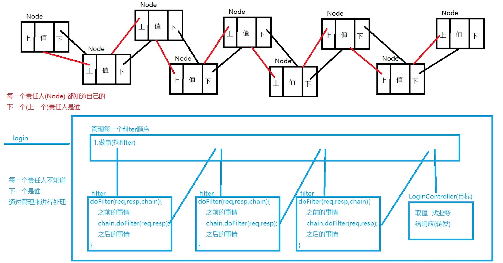

## 分类

- 创建型模式(5种)：解决对象创建的过程
  - 单例模式、工厂方法模式、抽象工厂模式、建造者模式、原型模式
- 结构型模式(7种)：把类或对象通过某种形式结合在一起，构成某种复杂或合理的结构
  - 适配器模式、装饰者模式、代理模式、外观模式、桥接模式、组合模式、享元模式
- 行为型模式(11种)：解决类或对象之间的交互，更合理的优化类或对象之间的关系
  - 观察者模式、策略模式、模板模式、责任链模式、解析器模式、迭代子模式、命令模式、状态模式、备忘录模式、访问者模式、中介者模式

## 单例模式(Singleton)

- 目的：让一个类只有一个对象参数，减少内容的使用

- 实现：

  - 私有的构造方法
  - 私有的静态的当前类的对象作为属性
  - 公有的静态的方法返回当前类对象

- 体现：

  - 饿汉式(立即加载)：对象启动时就加载了

    - 优点：不会产生对象没有就拿来使用，既空指针异常
    - 缺点：启动项目加载的对象过多，造成服务器承载压力问题

    ```java
    package study.modified;
    
    public class Peson {
        private static final Peson peson = new Peson();
        private Peson(){}
        public static Peson getInstance(){
            return peson;
        }
        
        public static void main(String[] args){
            Peson peson = Peson.getInstance();
        }
    }
    ```

  - 懒汉式(延迟加载)：对象什么时候用到了才会加载

    - 优点：启动项目时，需要才加载，不需要不创建，不会浪费空间
    - 缺点：可能会由于没有操作好，导致异常

    ```java
    public class Peson {
        //volatile 强制禁止指令重排序
        private static volatile Peson peson;
        private Peson(){}
        public static Peson getInstance(){
            if(peson==null){
                synchronized(Peson.class){
                    if(peson==null){
                        peson = new Peson();
                    }
                }
            }
            return peson;
        }
        
        public static void main(String[] args){
            Peson peson = Peson.getInstance();
        }
    }
    ```

  - 生命周期托管(单例对象别人帮忙处理)：对象加载过程交给别人

## 适配者模式(Adapter)

目的：解决接口中有的不需要实现的方法

- 类适配器：继承一个类，实现一个接口，让接口中的方法调用被继承类的方法
- 对象适配器：一个对象中存在另一个对象，当前类的方法让另一个类的方法执行
- 缺省是配置：用抽象类实现接口，将不是都必须实现的方法实现，可以在这些方法中抛出异常，使用时就必须重写，不使用就没事

## 策略模式(Strategy)

- 目的：用来解决执行流程固定，执行结果由于提供了不同策略而不同

- 特点：一般最少会有三个类，一个控制流程，一个类提供策略，第三个类必须继承提供策略的类

## 责任链模式(Chain of Responsbility Pattern)

- 目的：通过一个类管理所有类似的类，一个类执行放行后，告知管理者，管理者找寻下个类执行

- 责任链与链式存储区别：

  

## 观察者模式(Observer)

需要一个观察者，一个目标，目标里面依附着观察者(多个)，在目标发生事情后，通知观察者，每个观察者执行自己的方法