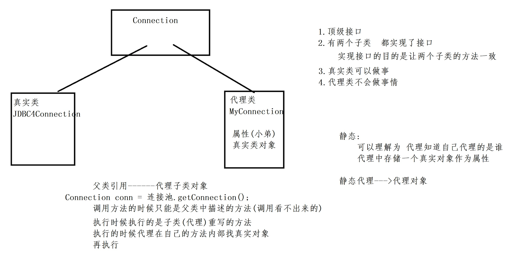
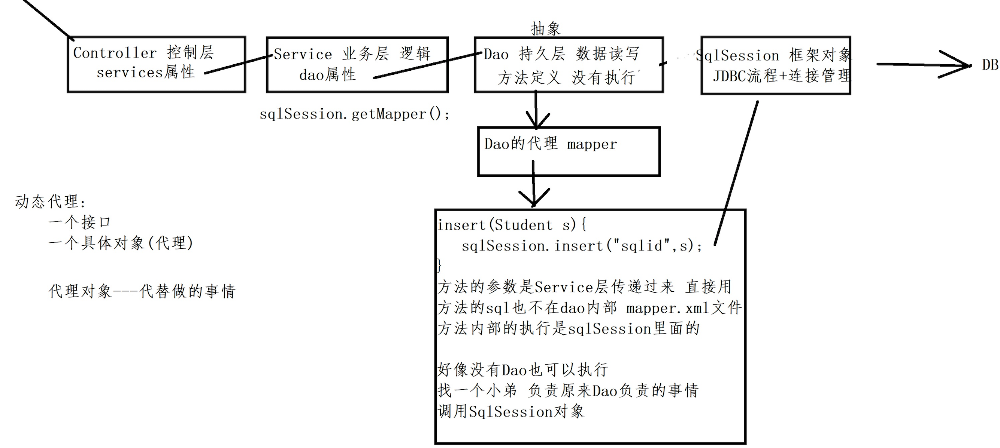

## 框架简介搭建

- MyBatis框架最早的名字叫iBatis

  - 2001年~2010年  Clinton Begin发起一个开源项目  iBatis1.0 由Apache组织管理
  - 2010年6月份  iBatis项目交由谷歌公司托管   更名为MyBatis
  - 2013年11月  整个项目迁移至GitHub
  - 2019年10月  MyBatis3.5.3发布

- MyBatis是一个持久层的框架(DAO---数据库交互)

  - 半自动的ORM框架  Object Relational Mapping(数据库的表---Java对象domain之间的映射关系)

- 导包

- 核心配置文件 configuration.xml 

  ```xml
  <configuration>
      <environments default="test">
          <environment id="test">
              <transactionManager type="JDBC"></transactionManager>
              <dataSource type="POOLED">
                  <property name="driver" value="com.mysql.jdbc.Driver"/>
                  <property name="url" value="jdbc:mysql://localhost:3306/test?useSSL=false"/>
                  <property name="username" value="root"/>
                  <property name="password" value="root"/>
              </dataSource>
          </environment>
      </environments>
      <mappers>
          <mapper resource="mybatis/mapper/userMapper.xml"></mapper>
          <mapper resource="mybatis/mapper/peopleMapper.xml"></mapper>
          <mapper resource="mybatis/mapper/cardMapper.xml"></mapper>
      </mappers>
  </configuration>
  ```

- 配置mapper文件

  ```xml
  <mapper namespace="mybatis.dao.CardDao">
      <resultMap id="cardMap" type="mybatis.domain.Card">
          <result property="cid" column="cid"></result>
          <result property="address" column="address"></result>
          <association property="people" javaType="mybatis.domain.People" column="cid" select="selectPeopleForCard"></association>
      </resultMap>
      <select id="selectPeopleForCard" resultType="mybatis.domain.People">
        select * from people where cid=#{cid}
    	</select>
    	<select id="selectOneCard" resultMap="cardMap">
        select * from card where cid=#{cid}
    	</select>
  </mapper>
  ```

- \#与$

  - \#{}：表示类型和值 通常用来做条件 列的值
  - ${}：表示的就是一个普通字串  "asc"  通常是表名 列名 关键字

## 获取session

```java
//获取SqlSessionFactoryBuilder     工人    new
SqlSessionFactoryBuilder builder = new SqlSessionFactoryBuilder();
//给工人配置一个输入流  读取"图纸"  inputStream ----> 核心配置
InputStream inputStream = Thread.currentThread().getContextClassLoader().getResourceAsStream("配置文件路径")
//获取SqlSessionFactory对象 工厂 
builder.build(inputStream);
//获取SqlSession对象  
SqlSession session = factory.openSession(true);
//通过sqlSession对象调用方法执行
```

## 联合查询

- 一对一

  ```xml
  <mapper namespace="mybatis.dao.CardDao">
      <!--方案一：先查询所有，不包含内部domain数据，然后根据ID再依次查询内部domain数据 单条查询-->
      <resultMap id="cardMap" type="mybatis.domain.Card">
          <result property="cid" column="cid"></result>
          <result property="address" column="address"></result>
          <association property="people" javaType="mybatis.domain.People" column="cid" select="selectPeopleForCard"></association>
      </resultMap>
      <select id="selectPeopleForCard" resultType="mybatis.domain.People">select * from people where cid=#{cid}</select>
      <select id="selectOneCard" resultMap="cardMap">select * from card where cid=#{cid}</select>
      <select id="selectAllCard" resultMap="cardMap">select * from card</select>
      <!--方案二：直接一条sql语句将所有数据查询，包括domain中其他domain对象的数据，联合查询-->
      <resultMap id="cardMap" type="mybatis.domain.Card">
          <id property="cid" column="cid"></id>
          <result property="address" column="address"></result>
          <association property="people" javaType="mybatis.domain.People">
              <id property="pid" column="pid"></id>
              <result property="name" column="name"></result>
              <result property="ctime" column="ctime"></result>
              <result property="utime" column="utime"></result>
          </association>
      </resultMap>
      <select id="selectOneCard" resultMap="cardMap">
          select c.cid,c.address,p.pid,p.name,p.ctime,p.utime from card c inner join people p on c.cid=p.cid where c.cid=#{cid}
      </select>
      <select id="selectAllCard" resultMap="cardMap">
          select c.cid,c.address,p.pid,p.name,p.ctime,p.utime from card c inner join people p on c.cid=p.cid
      </select>
  </mapper>
  ```

  如果只用到了主表的信息，从表的数据没有用到可能会产生N+1问题，可以在configuration.xml

  中配置：

  ```xml
  <settings>
     <!--设置延迟加载domain中的其他实体对象-->
     <setting name="lazyLoadingEnabled" value="true"/>
     <!--设置domain对象中的其他实体对象侵略性加载，只有在使用到才加载-->
     <setting name="aggressiveLazyLoading" value="false"/>
  </settings>
  ```

- 一对多

  ```xml
  <mapper namespace="mybatis.dao.DeptDao">
      <!--方式一-->
      <resultMap id="deptMap" type="mybatis.domain.Dept">
          <id property="deptno" column="deptno"></id>
          <result property="dname" column="dname"></result>
          <result property="loc" column="loc"></result>
          <collection property="empList" javaType="java.util.List" ofType="mybatis.domain.Emp" select="selectEmpForDept" column="deptno"></collection>
      </resultMap>
      <select id="selectEmpForDept" resultType="mybatis.domain.Emp">
          select * from emp where deptno=#{deptno}
      </select>
      <select id="selectOneDept" resultMap="deptMap">
          select * from dept where deptno=#{deptno}
      </select>
      <select id="selectAllDept" resultMap="deptMap">
          select * from dept;
      </select>
      <!--方式二-->
      <resultMap id="deptMap" type="mybatis.domain.Dept">
          <id property="deptno" column="deptno"></id>
          <result property="dname" column="dname"></result>
          <result property="loc" column="loc"></result>
          <collection property="empList" javaType="java.util.List" ofType="mybatis.domain.Emp">
              <id property="empno" column="empno"></id>
              <result property="ename" column="ename"></result>
              <result property="job" column="job"></result>
              <result property="mgr" column="mgr"></result>
              <result property="hiredate" column="hiredate"></result>
              <result property="sal" column="sal"></result>
              <result property="comm" column="comm"></result>
          </collection>
      </resultMap>
      <select id="selectOneDept" resultMap="deptMap">
          select d.dname,d.loc,e.* from dept d left join emp e on d.deptno=e.deptno where d.deptno=#{deptno}
      </select>
      <select id="selectAllDept" resultMap="deptMap">
          select d.dname,d.loc,e.* from dept d left join emp e on d.deptno=e.deptno
      </select>
  </mapper>
  ```

- 多对多

  ```xml
  <mapper namespace="mybatis.dao.StudentDao">
      <!--方式一-->
      <resultMap id="StudentMap" type="mybatis.domain.Student">
          <id property="sid" column="sid"></id>
          <result property="sname" column="sname"></result>
          <result property="ssex" column="ssex"></result>
          <result property="sage" column="sage"></result>
          <collection property="teacherList" javaType="java.util.List" ofType="mybatis.domain.Teacher" select="selectTeacherForStudent" column="sid"></collection>
      </resultMap>
      <select id="selectTeacherForStudent" resultType="mybatis.domain.Teacher">
          select teacher.* from tea_stu inner join teacher on tea_stu.tid=teacher.tid where tea_stu.sid=#{sid}
      </select>
      <select id="selectOneStudent" resultMap="StudentMap">
          select * from student where sid = #{sid}
      </select>
      <select id="selectAllStudent" resultMap="StudentMap">
          select * from  student
      </select>
      <!--方式二-->
      <resultMap id="StudentMap" type="mybatis.domain.Student">
          <id property="sid" column="sid"></id>
          <result property="sname" column="sname"></result>
          <result property="ssex" column="ssex"></result>
          <result property="sage" column="sage"></result>
          <collection property="teacherList" javaType="java.util.List" ofType="mybatis.domain.Teacher">
              <id property="tid" column="tid"></id>
              <result property="tname" column="tname"></result>
              <result property="tsex" column="tsex"></result>
              <result property="tage" column="tage"></result>
          </collection>
      </resultMap>
      <select id="selectOneStudent" resultMap="StudentMap">
          select s.*,t.* from student s inner join tea_stu ts on s.sid=ts.sid inner join teacher t on ts.tid=t.tid where s.sid=#{sid}
      </select>
      <select id="selectAllStudent" resultMap="StudentMap">
          select s.*,t.* from student s inner join tea_stu ts on s.sid=ts.sid inner join teacher t on ts.tid=t.tid
      </select>
  </mapper>
  ```

## 配置文件

- configuration.xml

  - properties标签：通常是为了引入一个外部的文件信息

    - 可以在configuration中通过${key}方式找寻一个真正的信息，可以隐藏真实信息的
    - 可以在使用现在搭建环境时直接引入之前已有的信息

  - settings标签：为了设置一些属性信息，比如懒加载对象

    ```xml
    <settings>
      <setting name="" value=""/>
    </settings>
    ```

  - typeAliases标签：为了某一个(一些)类，起别名用的

    ```xml
    <typeAliases>
      <typeAlias type="domain.Student" alias="student"></typeAlias>
    </typeAliases>
    ```

  - environments标签：为了做一些与数据库连接相关的配置

    ```xml
    <!—default属性 可以选择某一个environment环境—>
    <environments default="test">
      <environment id="test">
        <!—transactionManager：设置连接数据库的管理者
        type的两种值:用什么方式建立连接
        JDBC     利用JDBC来管理提交 回滚等功能
        MANAGED  配置上以后 什么都不做
        -->
        <transactionManager type="JDBC"></transactionManager>
        <!—dataSource:设置数据源相关的信息
        type:设置当前数据源管理连接的方式
        UNPOOLED:每次需要连接的时候简单的创建 简单的关闭
        POOLED:这个数据源的管理方式实现了连接的缓存 连接复用
        除了基本属性外:
        poolMaximumActiveConnections    MyBatis默认10
        poolTimeToWait            MyBatis默认20000  20秒
        JNDI(Java Naming and Directory Interface):这个数据源的配置是为了准备与外部应用一起使用
        —>
        <dataSource type="POOLED">
          <property name="driver" value="com.mysql.jdbc.Driver"/>
          <property name="url" value="jdbc:mysql://localhost:3306/test?useSSL=false"/>
          <property name="username" value="root"/>
          <property name="password" value="root"/>
          <-- 需要设置几个连接数据库的属性property
              driver、url、username、password
              defaultTransactionIsoilationLevel:事务隔离级别
              四种不同隔离级别
              Serializable:避免所有读取问题 性能很慢
              Repeatable-Read:可以避免脏读 不可重复读
              Read-Committed:可以避免脏读
              Read-UnCommitted:均无法避免
              -->
            </dataSource>
          </environment>
        </environments>
    ```

  - mappers标签

    - mapper resource="一个映射文件(文件中的某一个标签--SQL)"
    - mapper class="一个类(方法上面的注解--SQL)"

- mapper.xml

  - 根标记 mapper
    - namespace属性：理论上可以随便写 强烈建议属性与dao类全名对应，以后的dao变成接口，让代理对象做事
  - 字标记
    - 以上的三个子标记，必须有id属性。除了id以外还可以写parameterType(基本类型 map 对象)
      - \<insert id="" parameterType="">
      - \<delete id="">
      - \<update id="">
    - \<select>标记：
      - 必须有id属性，必须告知查询后的数据放置在什么容器内(对象、map、基本类型)
      - resultMap属性：可以自定义规则，用来设计表格之间的联合关系

## 动态SQL

```
<where>
    <if test="deptno!=null and deptno!='' ">
        and deptno = #{deptno}
    </if>
    <if test="job!=null and job!='' ">
        and job = #{job}
    </if>
</where>
order by sal
<choose>
    <when test=" orderFlag=='desc' ">
        ${orderFlag}
    </when>
    <when test=" orderFlag=='asc' ">
        asc
    </when>
</choose>
<foreach collection="list" item="empno" index="i" open="(" close=")" separator=",">
    #{empno}
</foreach>
```

## 动态代理

- Dao层次保留：将Dao中原有的具体方法变成抽象方法，Dao具体类变成接口

- service中获取dao：StudentDao dao = sqlSession.getMapper(StudentDao.class)

  - 相当于实现了一个StudentDao的类在执行调用方法
  - mapper.xml文件中的namespace需要与Dao接口类全名一致，标签中的ID与方法名一致

- 静态代理模型

  

- 动态代理模型

  

## 注解开发

- 固定Sql：@Insert、@Delete、@Update、@Select

- 动态Sql：@InsertProvider、@DeleteProvider、@UpdateProvider、@SelectProvider

- 传参(不止一个参数)

  - 将sql中的动态参数变成param1、param2…，与方法中参数顺序对应
  - @Param:指定参数与sql中的动态参数对应关系，如：@Param("sid")

- @ResultMap：适用于查询多条

  - 当查询多条数据，可以使用@ResultMap("定义好的查询一条的@Results中的ID")

- @Results：适用于存在关联关系的domain对象

  ```java
  //对于当前domain对象的另一个domain对象只有一条数据
  @Results(
      id="规则名",
      value={
          @Result(property="",column="",id=true),
          @Result(property="",column=""),
          @Result(property="",column=""),
          @Result(property="",[javaType=XXX.class,]column="",one=@One(select="方法名"[,fetchType=FetchType.LAZY]))
      }
  )
  //对于当前domain对象的另一个domain对象有多条数据
  @Results(
      id="规则名",
      value={
          @Result(property="",column="",id=true),
          @Result(property="",column=""),
          @Result(property="",column=""),
          @Result(property="",[javaType=XXX.class,]column="",many=@Many(select="方法名"[,fetchType=FetchType.LAZY]))
      }
  )
  ```

- 动态SQL

  - @XxxProvider(type=XXX.class(指定类),method=""(指定方法))   
  - @XxxProvider(XXX.class):针对类中的方法名称为：provideSql

## 缓存


