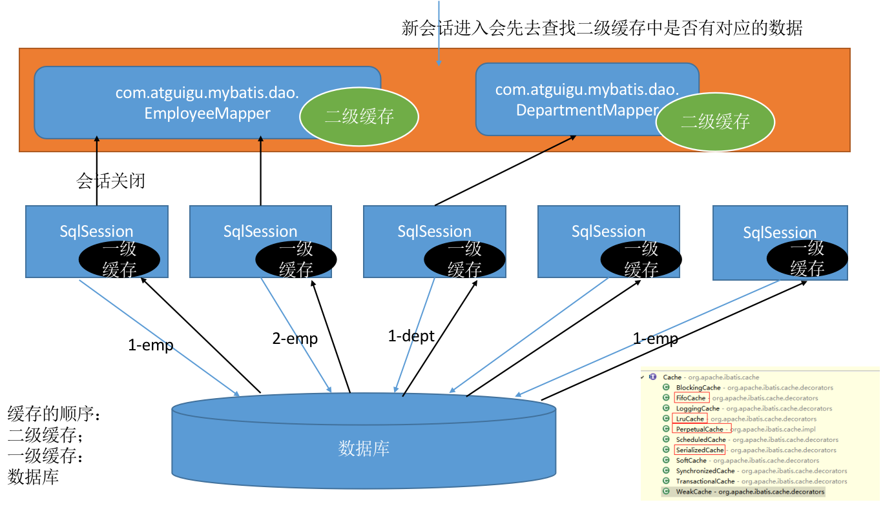

# Mybatis的XML使用

## 简介

### 简介

- MyBatis 是支持定制化 SQL、存储过程以及高级 映射的优秀的持久层框架。
- MyBatis 避免了几乎所有的 JDBC 代码和手动设 置参数以及获取结果集。
- MyBatis可以使用简单的XML或注解用于配置和原 始映射，将接口和Java的POJO(Plain Old Java Objects，普通的Java对象)映射成数据库中的记 录。

### 历史

- 原是Apache的一个开源项目iBatis, 2010年6月这 个项目由Apache Software Foundation 迁移到了 Google Code，随着开发团队转投Google Code 旗下， iBatis3.x正式更名为MyBatis ，代码于 2013年11月迁移到Github(下载地址见后)。
- iBatis一词来源于“internet”和“abatis”的组合，是 一个基于Java的持久层框架。 iBatis提供的持久 层框架包括SQL Maps和Data Access Objects (DAO)

### 优点

- **简单易学**：本身就很小且简单。没有任何第三方依赖，最简单安装只要两个jar文件+配置几个sql映射文件易于学习，易于使用，通过文档和源代码，可以比较完全的掌握它的设计思路和实现
- **灵活**：mybatis不会对应用程序或者数据库的现有设计强加任何影响。 sql写在xml里，便于统一管理和优化。通过sql基本上可以实现我们不使用数据访问框架可以实现的所有功能，或许更多。
- **解耦**：通过提供DAO层，将业务逻辑和数据访问逻辑分离，使系统的设计更清晰，更易维护，更易单元测试。sql和代码的分离，提高了可维护性。

## HelloWorld

1. 创建POJO类和以及Dao接口，定义一系列方法。

2. 创建MyBatis全局配置文件

   MyBatis 的全局配置文件包含了影响 MyBatis 行为的设置(settings)和属性(properties)信息、如数据 库连接池信息等。指导着MyBatis进行工作。

3. 创建SQL映射文件

   映射文件的作用就相当于是定义Dao接口的实现类如何工作。这也是我们使用MyBatis时编写的最多的文件。在全局配置文件中引入

4. 利用全局配置文件创建SqlSessionFactory对象

   ```java
   InputStream inputStream = Resources.getResourceAsStream("mybatis-config.xml");
   SqlSessionFactory sessionFactory = new SqlSessionFactoryBuilder().build(inputStream);
   ```

5. 获取SqlSession对象：sessionFactory.openSession();

   1. SqlSession 的实例不是线程安全的，因此是不能被共享的。
   2. SqlSession每次使用完成后需要正确关闭，这个 关闭操作是必须的
   3. SqlSession可以直接调用方法的id进行数据库操 作，但是我们一般还是推荐使用SqlSession获取 到Dao接口的代理类，执行代理对象的方法，可 以更安全的进行类型检查操作。

6. 使用SqlSession的根据ID操作数据或者通过SqlSession对象获取代理对象操作

   ```java
   try {
     Employee employee = session.selectOne("domain.Employee.selectOne", 1);
     System.out.println(employee);
   }finally {
     session.close();
   }
   
   //保证接口中的方法名称与mapper.xml文件中的id一样，mapper的namespace与接口全名一致
   try {
     EmployeeDao employeeDao = session.getMapper(EmployeeDao.class);
     Employee employee = employeeDao.selectOne(1);
     System.out.println(employee);
   }finally {
     session.close();
   }
   ```

## 全局配置文件

- **properties**：引入外部properties配置文件

  - resource属性：引入类路径下的资源
  - url属性：引入网络路径或者磁盘路径下的资源

- **settings**：设置全局配置Configuration中的属性值，具体值说明：[设置](https://mybatis.org/mybatis-3/zh/configuration.html#settings)

- **typeAliases**：别名处理器

  - 类型别名是为 Java 类型设置一个短的名字，可以方便我们 引用某个类。

    ```xml
    <typeAliases>
      <typeAlias type="domain.Employee" alias="employee"/>
    </typeAliases>
    ```

  - 类很多的情况下，可以批量设置别名这个包下的每一个类 创建一个默认的别名，就是简单类名小写。

    ```xml
    <typeAliases>
      <package name="com.doamin"/>
    </typeAliases>
    ```

  - 也可以使用@Alias注解在类上为其指定一个别名：@Alias("employee")

  - Mybatis中自带的别名:

    

- **typeHandlers**：类型处理器，处理java类型与数据库类型的转换，可以指定类型转换器，也可以自定义。

- **objectFactory**：对象工厂

- **plugins**：插件是Mybatis提供的一个非常强大的机制，可以通过插件来修改Mybatis的一些核心行为，引入四大对象：

  - Executor (update, query, flushStatements, commit, rollback, getTransaction, close, isClosed)
  - ParameterHandler (getParameterObject, setParameters)
  - ResultSetHandler (handleResultSets, handleOutputParameters)
  - StatementHandler (prepare, parameterize, batch, update, query)

- **environments**：环境们，mybatis可以配置多种环境 ,default指定使用某种环境。可以达到快速切换环境

  - environment：配置一个具体的环境信息；必须有两个标签；id代表当前环境的唯一标识

    - id属性：当前环境唯一标识

    - transactionManager标签：事务管理器

      type属性：事务管理器的类型

      - JDBC(JdbcTransactionFactory)：使用了 JDBC 的提交和回滚设置，依赖于从数 据源得到的连接来管理事务范围。
      - MANAGED(ManagedTransactionFactory)：不提交或回滚一个连接、让容器来管理 事务的整个生命周期(比如 JEE 应用服务器的上下 文)
      - 自定义：实现TransactionFactory接口.type指定为全类名

    - dataSource标签：数据源

      type属性：数据源类型

      - UNPOOLED(UnpooledDataSourceFactory)：不使用连接池
      - POOLED(PooledDataSourceFactory)：使用连接池
      - JNDI(JndiDataSourceFactory)：在EJB 或应用服务器这类容器中查找指定的数据源
      - 自定义数据源：实现DataSourceFactory接口，type是全类名

- **databaseIdProvider**：数据库厂商标识，根据不同的数据库厂商执行不同的语句

  ```xml
  <databaseIdProvider type="DB_VENDOR">
    <property name="MySQL" value="mysql"/>
    <property name="Oracle" value="oracle"/>
    <property name="Sql Server" value="sqlserver"/>
  </databaseIdProvider>
  <!--
  Type: DB_VENDOR,使用MyBatis提供的VendorDatabaseIdProvider解析数据库厂商标识。
  也可以实现DatabaseIdProvider接口来自定义
  在mapper.xml文件中可以用databaseId="mysql"来指定数据库类型。
  -->
  ```

  匹配规则如下：

  1. 如果没有配置databaseIdProvider标签，那么databaseId=null
  2. 如果配置了databaseIdProvider标签，使用标签配置的name去匹 配数据库信息，匹配上设置databaseId=配置指定的值，否则依旧为 null
  3. 如果databaseId不为null，他只会找到配置databaseId的sql语句
  4. MyBatis 会加载不带 databaseId 属性和带有匹配当前数据库 databaseId 属性的所有语句。如果同时找到带有 databaseId 和不带 databaseId 的相同语句，则后者会被舍弃。

- **mappers**：映射器，可以使用mapper或者package实现逐一映射或批量映射(SQL映射文件名必须和接口名相同并且在同一目录下)

## 映射文件

- cache –命名空间的二级缓存配置
- cache-ref – 其他命名空间缓存配置的引用。
- resultMap – 自定义结果集映射
- parameterMap – 已废弃!老式风格的参数映射 
- sql –抽取可重用语句块。
- insert – 映射插入语句
- update – 映射更新语句
- delete – 映射删除语句
- select – 映射查询语句

### 主键生成方式

- 若数据库支持自动生成主键的字段(比如MySQL 和 SQL Server)，则可以设置 useGeneratedKeys=”true”，然后再把 keyProperty 设置到目标属性上。

  ```xml
  <insert id="add" useGeneratedKeys="true" keyProperty="id">
    insert into employee (last_name,email,gender) values (#{lastName},#{email},#{gender})
  </insert>
  ```

- 而对于不支持自增型主键的数据库(例如 Oracle)，则可以使用 selectKey 子元素: selectKey 元素将会首先运行，id 会被设置，然 后插入语句会被调用。

  ```xml
  <insert id="add">
    <selectKey order="BEFORE" keyProperty="id" resultType="_int">
      select EMPLOYEES_SEQ.nextval from dual
    </selectKey>
    insert into employee (last_name,email,gender) values (#{lastName},#{email},#{gender})
  </insert>
  ```

### 参数传递

- 单个参数：可以接受基本类型，对象类型，集合类型的值。这种情况MyBatis可直接使用这个参数，不需要经过任何处理
- 多个参数：任意多个参数，都会被MyBatis重新包装成一个Map传入，Map的key是param1，param2，0，1...，值就是参数的值
- 命名参数：为参数使用@Param起一个名字，MyBatis就会将这些参数封装进map中，key就是我们自己指定的名字
- POJO类：当这些参数属于我们业务POJO时，我们直接传递POJO
- Map：我们也可以封装多个参数为map，直接传递

**参数位置：**

#{key}:获取参数的值，预编译到SQL中。安全。

${key}:获取参数的值，拼接到SQL中。有SQL注入问 题。ORDER BY ${name}

Sql中参数位置支持的属性：javaType、jdbcType、mode、numericScale、resultMap、typeHandler、jdbcTypeName

### 自动映射

1. 全局setting设置

   - autoMappingBehavior默认是PARTIAL，开启自动映射的功能。唯一的要求是列名和javaBean属性名一致
   - 如果autoMappingBehavior设置为null则会取消自动映射
   - 数据库字段命名规范，POJO属性符合驼峰命名法，如 A_COLUMN->aColumn，我们可以开启自动驼峰命名规则映射功能，mapUnderscoreToCamelCase=true。

2. 自定义resultMap，实现高级结果集映射

   - constructor - 类在实例化时, 用来注入结果到构造方法中 
     - idArg - ID 参数; 标记结果作为 ID 可以帮助提高整体效能
     - arg - 注入到构造方法的一个普通结果

   - id：一个 ID 结果; 标记结果作为 ID 可以帮助提高整体效能

   - result：注入到字段或 JavaBean 属性的普通结果

   - association：一个复杂的类型关联;许多结果将包成这种类型

     ```xml
     <!--分段查询-->
     <resultMap id="cardMap" type="mybatis.domain.Card">
             <result property="cid" column="cid"></result>
             <result property="address" column="address"></result>
             <association property="people" javaType="mybatis.domain.People" column="cid" select="selectPeopleForCard"></association>
         </resultMap>
         <select id="selectPeopleForCard" resultType="mybatis.domain.People">select * from people where cid=#{cid}</select>
     <!--关联查询-->
     <resultMap id="cardMap" type="mybatis.domain.Card">
       <id property="cid" column="cid"></id>
       <result property="address" column="address"></result>
       <association property="people" javaType="mybatis.domain.People">
         <id property="pid" column="pid"></id>
         <result property="name" column="name"></result>
         <result property="ctime" column="ctime"></result>
         <result property="utime" column="utime"></result>
       </association>
     </resultMap>
     ```

   - collection：复杂类型的集，与association类似，只是collection是针对集合。

   - discriminator：使用结果值来决定使用哪个结果映射

   当采用分段查询的时候可以设置延迟加载机制，如：

   ```xml
   <settings>
     <setting name="lazyLoadingEnabled" value="true"/>
     <setting name="aggressiveLazyLoading" value="false"/>
   </settings>
   ```

3. 拓展-多列值封装map传递

   当采用分段查询的方式时，可以column自定字段时，可以封装成一个map传递，也可以覆盖全局的延迟加载策略，如：

   ```xml
   <!--分段查询-->
   <resultMap id="cardMap" type="mybatis.domain.Card">
     <result property="cid" column="cid"></result>
     <result property="address" column="address"></result>
     <association property="people" javaType="mybatis.domain.People" 
                  column="{cid=cid,name=name}" select="selectPeopleForCard" fetchType="lazy">
     </association>
   </resultMap>
   <select id="selectPeopleForCard" resultType="mybatis.domain.People">
     select * from people where cid=#{cid} and name=#{name}
   </select>
   ```

## 动态SQL

- if：判断

  ```xml
  <select id="getEmpsByConditionIf" resultType="com.mybatis.bean.Employee">
    select * from tbl_employee
    <where>
      <if test="id!=null">
        id=#{id}
      </if>
      <if test="lastName!=null &amp;&amp; lastName!=&quot;&quot;">
        and last_name like #{lastName}
      </if>
      <if test="email!=null and email.trim()!=&quot;&quot;">
        and email=#{email}
      </if> 
      <if test="gender==0 or gender==1">
        and gender=#{gender}
      </if>
    </where>
  </select>
  ```

- choose (when, otherwise)：分支选择；类似带了break的swtich-case

  ```xml
  <select id="getEmpsByConditionChoose" resultType="com.mybatis.bean.Employee">
    select * from tbl_employee 
    <where>
      <!-- 如果带了id就用id查，如果带了lastName就用lastName查;只会进入其中一个 -->
      <choose>
        <when test="id!=null">
          id=#{id}
        </when>
        <when test="lastName!=null">
          last_name like #{lastName}
        </when>
        <when test="email!=null">
          email = #{email}
        </when>
        <otherwise>
          gender = 0
        </otherwise>
      </choose>
    </where>
  </select>
  ```

- trim：字符串截取(where(封装查询条件), set(封装修改条件))

  ```xml
  <select id="getEmpsByConditionTrim" resultType="com.mybatis.bean.Employee">
    select * from tbl_employee
    <!-- 后面多出的and或者or where标签不能解决 
     prefix="":前缀：trim标签体中是整个字符串拼串 后的结果。
       prefix给拼串后的整个字符串加一个前缀 
     prefixOverrides="":
       前缀覆盖： 去掉整个字符串前面多余的字符
     suffix="":后缀
       suffix给拼串后的整个字符串加一个后缀 
     suffixOverrides=""
       后缀覆盖：去掉整个字符串后面多余的字符
     -->
    <!-- 自定义字符串的截取规则 -->
    <trim prefix="where" suffixOverrides="and">
      <if test="id!=null">
        id=#{id} and
      </if>
      <if test="lastName!=null &amp;&amp; lastName!=&quot;&quot;">
        last_name like #{lastName} and
      </if>
      <if test="email!=null and email.trim()!=&quot;&quot;">
        email=#{email} and
      </if> 
      <if test="gender==0 or gender==1">
        gender=#{gender}
      </if>
    </trim>
  </select>
  
  
  <update id="updateEmp">
    <!-- Set标签的使用 -->
    update tbl_employee 
    <set>
      <if test="lastName!=null">
        last_name=#{lastName},
      </if>
      <if test="email!=null">
        email=#{email},
      </if>
      <if test="gender!=null">
        gender=#{gender}
      </if>
    </set>
    where id=#{id} 
  </update>
  ```

- foreach：遍历集合

  ```xml
  <sql id="insertColumn">
    <if test="_databaseId=='oracle'">
      employee_id,last_name,email
    </if>
    <if test="_databaseId=='mysql'">
      last_name,email,gender,d_id
    </if>
  </sql>
  
  <insert id="addEmps">
    insert into tbl_employee(
    <include refid="insertColumn"></include>
    ) 
    values
    <foreach collection="emps" item="emp" separator=",">
      (#{emp.lastName},#{emp.email},#{emp.gender},#{emp.dept.id})
    </foreach>
  </insert>
  ```

## 缓存机制

### 一级缓存

- 同一次会话期间只要查询过的数据都会保存在当 前SqlSession的一个Map中，格式如：

  key:hashCode+查询的SqlId+编写的sql查询语句+参数

- 一级缓存(local cache), 即本地缓存，默认开启, 作用域默认 为sqlSession。当 Session flush 或 close 后, 该 Session 中的所有 Cache 将被清空。

- 本地缓存不能被关闭, 但可以调用 clearCache() 来清空本地缓存, 或者改变缓存的作用域.

- 在mybatis3.1之后,可以配置本地缓存的作用域. 在 mybatis.xml 中配置

  ```xml
  <settings>
    <setting name="LocalCacheScope" value="SESSION"/>
  </settings>
  ```

  - SESSION：默认值，缓存一个会话中执行的所有查询。
  - STATEMENT：仅用在sql执行上，对相同的SqlSession的不同调用将不会共享数据

- 失效情况

  - 不同的SqlSession对应不同的一级缓存
  - 同一个SqlSession但是查询条件不同
  - 同一个SqlSession两次查询期间执行了任何一次增 删改操作
  - 同一个SqlSession两次查询期间手动清空了缓存

### 二级缓存

- 二级缓存需要手动开启和配置，他是基于namespace级 别的缓存。

- 二级缓存实现需要POJO类实现Serializabel接口。

- 二级缓存在SqlSession关闭或提交之后才会生效。

- 使用步骤

  1. 全局配置文件中开启二级缓存：\<setting name="cacheEnabled" value="true"/>
  2. 需要使用二级缓存的映射文件处使用cache配置缓存：\<cache/>
  3. 注意：POJO需要实现Serializable接口

- 缓存相关属性

  - eviction=“FIFO”:缓存回收策略:
    - LRU(默认值)：最近最少使用的，移除最长时间不被使用的对象。
    - FIFO：先进先出，按对象进入缓存的顺序来移除它们。
    - SOFT：软引用，移除基于垃圾回收器状态和软引用规则的对象。
    - WEAK：弱引用，更积极地移除基于垃圾收集器状态和弱引用规则的对象。
  - flushInterval：刷新间隔，单位毫秒，默认情况是不设置，也就是没有刷新间隔，缓存仅仅调用语句时刷新
  - size：缓存大小，存放多少元素，正整数，代表缓存最多可以存储多少个对象，太大容易导致内存溢出
  - readOnly：是否只读
    - true：只读；mybatis认为所有从缓存中获取数据的操作都是只读操作，不会修改数据。
             mybatis为了加快获取速度，直接就会将数据在缓存中的引用交给用户。不安全，速度快
    - false(默认值)：非只读：mybatis觉得获取的数据可能会被修改。
            mybatis会利用序列化&反序列的技术克隆一份新的数据给你。安全，速度慢

- 缓存相关设置

  - 全局setting的cacheEnable：配置二级缓存的开关。一级缓存一直是打开的。

  - select标签的useCache属性：配置这个select是否使用二级缓存。一级缓存一直是使用的

  - sql标签的flushCache属性：增删改默认flushCache=true。sql执行以后，会同时清空一级和二级缓存。

    查询默认flushCache=false。

  - sqlSession.clearCache()：只是用来清除一级缓存。

  - 当在某一个作用域 (一级缓存Session/二级缓存 Namespaces) 进行了 C/U/D 操作后，默认该作用域下所 有 select 中的缓存将被clear。

### 自定义缓存

- MyBatis定义了缓存接口Cache。我们 可以通过实现Cache接口来自定义二级缓存

### 第三方缓存

如整合ehcache

1. 导入ehcache包，以及整合包，日志包

   ehcache-core-2.6.8.jar、mybatis-ehcache-1.0.3.jar slf4j-api-1.6.1.jar、slf4j-log4j12-1.6.2.jar

2. 编写ehcache.xml配置文件，放在类路径下

   ```xml
   <?xml version="1.0" encoding="UTF-8"?>
   <ehcache xmlns:xsi="http://www.w3.org/2001/XMLSchema-instance"
    xsi:noNamespaceSchemaLocation="../config/ehcache.xsd">
    <!-- 磁盘保存路径 -->
    <diskStore path="D:\44\ehcache" />
   
    <defaultCache 
      maxElementsInMemory="10000" 
      maxElementsOnDisk="10000000"
      eternal="false" 
      overflowToDisk="true" 
      timeToIdleSeconds="120"
      timeToLiveSeconds="120" 
      diskExpiryThreadIntervalSeconds="120"
      memoryStoreEvictionPolicy="LRU">
    </defaultCache>
   </ehcache>
    
   <!-- 
   属性说明：
   l diskStore：指定数据在磁盘中的存储位置。
   l defaultCache：当借助CacheManager.add("demoCache")创建Cache时，EhCache便会采用<defalutCache/>指定的的管理策略
    
   以下属性是必须的：
   l maxElementsInMemory - 在内存中缓存的element的最大数目 
   l maxElementsOnDisk - 在磁盘上缓存的element的最大数目，若是0表示无穷大
   l eternal - 设定缓存的elements是否永远不过期。如果为true，则缓存的数据始终有效，如果为false那么还要根据timeToIdleSeconds，timeToLiveSeconds判断
   l overflowToDisk - 设定当内存缓存溢出的时候是否将过期的element缓存到磁盘上
    
   以下属性是可选的：
   l timeToIdleSeconds - 当缓存在EhCache中的数据前后两次访问的时间超过timeToIdleSeconds的属性取值时，这些数据便会删除，默认值是0,也就是可闲置时间无穷大
   l timeToLiveSeconds - 缓存element的有效生命期，默认是0.,也就是element存活时间无穷大
    diskSpoolBufferSizeMB 这个参数设置DiskStore(磁盘缓存)的缓存区大小.默认是30MB.每个Cache都应该有自己的一个缓冲区.
   l diskPersistent - 在VM重启的时候是否启用磁盘保存EhCache中的数据，默认是false。
   l diskExpiryThreadIntervalSeconds - 磁盘缓存的清理线程运行间隔，默认是120秒。每个120s，相应的线程会进行一次EhCache中数据的清理工作
   l memoryStoreEvictionPolicy - 当内存缓存达到最大，有新的element加入的时候， 移除缓存中element的策略。默认是LRU（最近最少使用），可选的有LFU（最不常使用）和FIFO（先进先出）
    -->
   ```

3. 配置cache标签，在sql映射文件中：

   \<cache type="org.mybatis.caches.ehcache.EhcacheCache">\</cache>

4. 若想在命名空间中共享相同的缓存配置和实例。 可以使用 cache-ref 元素来引用另外一个缓存

   \<cache-ref namespace="com.atguigu.mybatis.dao.EmployeeMapper"/>

### 缓存结构图



## Spring整合

1. 配置Spring-mvc配置文件，默认名称为spring-servlet.xml可以自定义

   ```xml
   <?xml version="1.0" encoding="UTF-8"?>
   <beans xmlns="http://www.springframework.org/schema/beans"
   	xmlns:xsi="http://www.w3.org/2001/XMLSchema-instance"
   	xmlns:context="http://www.springframework.org/schema/context"
   	xmlns:mvc="http://www.springframework.org/schema/mvc"
   	xsi:schemaLocation="http://www.springframework.org/schema/mvc http://www.springframework.org/schema/mvc/spring-mvc-4.0.xsd
   		http://www.springframework.org/schema/beans http://www.springframework.org/schema/beans/spring-beans.xsd
   		http://www.springframework.org/schema/context http://www.springframework.org/schema/context/spring-context-4.0.xsd">
   
   	<!--SpringMVC只是控制网站跳转逻辑  -->
   	<!-- 只扫描控制器 -->
   	<context:component-scan base-package="com.mybatis" use-default-filters="false">
   		<context:include-filter type="annotation" expression="org.springframework.stereotype.Controller"/>
   	</context:component-scan>
   	
   	<!-- 视图解析器 -->
   	<bean class="org.springframework.web.servlet.view.InternalResourceViewResolver">
   		<property name="prefix" value="/WEB-INF/pages/"></property>
   		<property name="suffix" value=".jsp"></property>
   	</bean>
   	
   	<mvc:annotation-driven></mvc:annotation-driven>
   	<mvc:default-servlet-handler/>
   </beans>
   ```

2. 配置mybatis配置文件

   ```xml
   <?xml version="1.0" encoding="UTF-8" ?>
   <!DOCTYPE configuration
    PUBLIC "-//mybatis.org//DTD Config 3.0//EN"
    "http://mybatis.org/dtd/mybatis-3-config.dtd">
   <configuration>
   	<settings>
   		<setting name="mapUnderscoreToCamelCase" value="true"/>
   		<setting name="jdbcTypeForNull" value="NULL"/>
   		
   		<!--显式的指定每个我们需要更改的配置的值，即使他是默认的。防止版本更新带来的问题  -->
   		<setting name="cacheEnabled" value="true"/>
   		<setting name="lazyLoadingEnabled" value="true"/>
   		<setting name="aggressiveLazyLoading" value="false"/>
   	</settings>
   	
   	<databaseIdProvider type="DB_VENDOR">
   		<property name="MySQL" value="mysql"/>
   		<property name="Oracle" value="oracle"/>
   		<property name="SQL Server" value="sqlserver"/>
   	</databaseIdProvider>
   </configuration>
   ```

3. 配置Spring配置文件

   ```xml
   <?xml version="1.0" encoding="UTF-8"?>
   <beans xmlns="http://www.springframework.org/schema/beans"
   	xmlns:xsi="http://www.w3.org/2001/XMLSchema-instance"
   	xmlns:context="http://www.springframework.org/schema/context"
   	xmlns:mybatis-spring="http://mybatis.org/schema/mybatis-spring"
   	xmlns:tx="http://www.springframework.org/schema/tx"
   	xsi:schemaLocation="http://www.springframework.org/schema/beans http://www.springframework.org/schema/beans/spring-beans.xsd
   		http://mybatis.org/schema/mybatis-spring http://mybatis.org/schema/mybatis-spring-1.2.xsd
   		http://www.springframework.org/schema/tx http://www.springframework.org/schema/tx/spring-tx-4.0.xsd
   		http://www.springframework.org/schema/context http://www.springframework.org/schema/context/spring-context-4.0.xsd">
   
   	<!-- Spring希望管理所有的业务逻辑组件，等。。。 -->
   	<context:component-scan base-package="com.mybatis">
   		<context:exclude-filter type="annotation"
   			expression="org.springframework.stereotype.Controller" />
   	</context:component-scan>
   
   	<!-- 引入数据库的配置文件 -->
   	<context:property-placeholder location="classpath:dbconfig.properties" />
   	<!-- Spring用来控制业务逻辑。数据源、事务控制、aop -->
   	<bean id="dataSource" class="com.mchange.v2.c3p0.ComboPooledDataSource">
   		<property name="jdbcUrl" value="${jdbc.url}"></property>
   		<property name="driverClass" value="${jdbc.driver}"></property>
   		<property name="user" value="${jdbc.username}"></property>
   		<property name="password" value="${jdbc.password}"></property>
   	</bean>
   	<!-- spring事务管理 -->
   	<bean id="dataSourceTransactionManager" class="org.springframework.jdbc.datasource.DataSourceTransactionManager">
   		<property name="dataSource" ref="dataSource"></property>
   	</bean>
   
   	<!-- 开启基于注解的事务 -->
   	<tx:annotation-driven transaction-manager="dataSourceTransactionManager"/>
   	
   	<!-- 
   	整合mybatis 
   		目的：1、spring管理所有组件。mapper的实现类。
   				service==>Dao   @Autowired:自动注入mapper；
   			2、spring用来管理事务，spring声明式事务
   	-->
     <!--mybatis-->
       <bean id="sqlSessionFactory" class="org.mybatis.spring.SqlSessionFactoryBean">
           <property name="dataSource" ref="dataSource" />
           <!--mybatis方法1：如果使用xml文件来保存sql语句，那么添加以下配置-->
           <!--<property name="mapperLocations" value="classpath:com/mcs/mapper/*_mapper.xml" />-->
           <property name="configLocation" value="classpath:mybatis-config.xml"/>
       </bean>
       <!--mybatis方法2：使用注解,扫描，两者可以并存-->
       <bean class="org.mybatis.spring.mapper.MapperScannerConfigurer" >
           <property name="basePackage" value="com.task.dao" />
           <property name="sqlSessionFactoryBeanName" value="sqlSessionFactory" />
       </bean>
   	
   	<!--配置一个可以进行批量执行的sqlSession  -->
   	<bean id="sqlSession" class="org.mybatis.spring.SqlSessionTemplate">
   		<constructor-arg name="sqlSessionFactory" ref="sqlSessionFactoryBean"></constructor-arg>
   		<constructor-arg name="executorType" value="BATCH"></constructor-arg>
   	</bean>
   	
   </beans>
   
   ```

4. 配置web.xml文件

   ```xml
   <?xml version="1.0" encoding="UTF-8"?>
   <web-app xmlns:xsi="http://www.w3.org/2001/XMLSchema-instance" xmlns="http://java.sun.com/xml/ns/javaee" xsi:schemaLocation="http://java.sun.com/xml/ns/javaee http://java.sun.com/xml/ns/javaee/web-app_2_5.xsd" id="WebApp_ID" version="2.5">
     <display-name>MyBatis_06_ssm</display-name>
     
     <!--Spring配置： needed for ContextLoaderListener -->
   	<context-param>
   		<param-name>contextConfigLocation</param-name>
       <!--指定spring配置文件位置-->
   		<param-value>classpath:spring-beans.xml</param-value>
   	</context-param>
   
   	<listener>
   		<listener-class>org.springframework.web.context.ContextLoaderListener</listener-class>
   	</listener>
   	
   	<!-- SpringMVC配置,配置文件默认为spring-servlet.xml，也可以指定-->
   	<servlet>
   		<servlet-name>spring</servlet-name>
   		<servlet-class>org.springframework.web.servlet.DispatcherServlet</servlet-class>
       <!--指定springMVC的配置文件-->
       <init-param>
         <param-name>contextConfigLocation</param-name>
         <param-value>classpath:beans-mvc.xml</param-value>
       </init-param>
   		<load-on-startup>1</load-on-startup>
   	</servlet>
     
   	<servlet-mapping>
   		<servlet-name>spring</servlet-name>
   		<url-pattern>/</url-pattern>
   	</servlet-mapping>
     
   </web-app>
   ```

## 逆向工程

MyBatis Generator：简称MBG，是一个专门为Mybatis使用者定制的代码生成器，可以快速的根据数据表生成对应的映射文件、接口以及bean类。支持基本的增删改查，以及QBC风格的条件查询。

官方文档地址：http://www.mybatis.org/generator/

- 使用步骤：

  1. 编写MBG的配置文件(重要几处配置)

     1. jdbcConnection配置数据库连接信息

     2. javaModelGenerator配置javaBean的生成策略

     3. sqlMapGenerator 配置sql映射文件生成策略

     4. javaClientGenerator配置Mapper接口的生成策略

     5. table 配置要逆向解析的数据表

        tableName:表名 

        domainObjectName:对应的javaBean名

     ```xml
     <?xml version="1.0" encoding="UTF-8"?>
     <!DOCTYPE generatorConfiguration
       PUBLIC "-//mybatis.org//DTD MyBatis Generator Configuration 1.0//EN"
       "http://mybatis.org/dtd/mybatis-generator-config_1_0.dtd">
     <generatorConfiguration>
     
     	<!-- 
     		targetRuntime="MyBatis3Simple":生成简单版的CRUD
     		MyBatis3:豪华版
     	
     	 -->
       <context id="DB2Tables" targetRuntime="MyBatis3">
       	<!-- jdbcConnection：指定如何连接到目标数据库 -->
         <jdbcConnection driverClass="com.mysql.jdbc.Driver"
             connectionURL="jdbc:mysql://localhost:3306/mybatis?allowMultiQueries=true"
             userId="root"
             password="123456">
         </jdbcConnection>
     
     	<!-- 是否强转BigDecimal类型 -->
         <javaTypeResolver >
           <property name="forceBigDecimals" value="false" />
         </javaTypeResolver>
     
     	<!-- javaModelGenerator：指定javaBean的生成策略 
     	targetPackage="test.model"：目标包名
     	targetProject="\MBGTestProject\src"：目标工程
     	-->
         <javaModelGenerator targetPackage="com.mybatis.bean" 
         		targetProject=".\src">
           <property name="enableSubPackages" value="true" />
           <property name="trimStrings" value="true" />
         </javaModelGenerator>
     
     	<!-- sqlMapGenerator：sql映射生成策略： -->
         <sqlMapGenerator targetPackage="com.mybatis.dao"  
         	targetProject=".\conf">
           <property name="enableSubPackages" value="true" />
         </sqlMapGenerator>
     
     	<!-- javaClientGenerator:指定mapper接口所在的位置 -->
         <javaClientGenerator type="XMLMAPPER" targetPackage="com.mybatis.dao"  
         	targetProject=".\src">
           <property name="enableSubPackages" value="true" />
         </javaClientGenerator>
     
     	<!-- 指定要逆向分析哪些表：根据表要创建javaBean -->
         <table tableName="tbl_dept" domainObjectName="Department"></table>
         <table tableName="tbl_employee" domainObjectName="Employee"></table>
       </context>
     </generatorConfiguration>
     
     ```

     

  2. 运行代码生成器生成代码

     ```java
     public static void main(String[] args) throws Exception {
       List<String> warnings = new ArrayList<String>();
       boolean overwrite = true;
       File configFile = new File("mbg.xml");
       ConfigurationParser cp = new ConfigurationParser(warnings); 
       Configuration config = cp.parseConfiguration(configFile); 
       DefaultShellCallback callback = new DefaultShellCallback(overwrite); 
       MyBatisGenerator myBatisGenerator = new MyBatisGenerator(config, callback, warnings);
       myBatisGenerator.generate(null); 
     }
     ```

- 注意：

  Context标签：targetRuntime=“MyBatis3“可以生成带条件的增删改查 targetRuntime=“MyBatis3Simple“可以生成基本的增删改查

  如果再次生成，建议将之前生成的数据删除，避免xml向后追加内容出现的问 题。

## 工作原理

1. 根据配置文件创建SQLSessionFactory

   

2. 获取SqlSession

   

3. 获取接口代理对象

   

4. 执行查询

   

5. 查询流程总结

   

## 插件开发

MyBatis在四大对象的创建过程中，都会有插件进行 介入。插件可以利用动态代理机制一层层的包装目标 对象，而实现在目标对象执行目标方法之前进行拦截 的效果

### 插件开发

1. 编写插件实现Interceptor接口，并使用@Intercepts注解完成插件签名

   ```java
   //以下注解含义：拦截StatementHandler类型的类的parameterize方法，参数时java.sql.Statement类型。
   @Intercepts({@Signature(type=StatementHandler.class,method="parameterize",args=java.sql.Statement.class)})
   public class MyFirstPlugin implements Interceptor{}
   ```

2. 在全局配置文件中注册插件

   ```xml
   <plugins>
     <plugin interceptor="com.atguigu.mybatis.dao.MyFirstPlugin">
       <!--给拦截器中的属性填值-->
       <property name="username" value="root"/>
       <property name="password" value="123456"/>
     </plugin>
     <plugin interceptor="com.mybatis.dao.MySecondPlugin"></plugin>
   </plugins>
   ```

### 插件原理

1. 按照插件注解声明，及插件配置顺序调用插件plugin方法，生成被拦截对象的动态代理

2. 多个插件依次生成目标对象的代理对象，层层包裹，先声 明的先包裹;形成代理链

3. 目标方法执行时依次从外到内执行插件的intercept方法。

4. 多个插件情况下，我们往往需要在某个插件中分离出目标 对象。可以借助MyBatis提供的SystemMetaObject类来进行获 取最后一层的h以及target属性的值。

   

### Interceptor接口

- Intercept：拦截目标方法执行

  ```java
  public Object intercept(Invocation invocation) throws Throwable {
    //获取到代理对象
    Object target = invocation.getTarget();
    //获取到代理对象的元数据
    MetaObject metaObject = SystemMetaObject.forObject(target);
    //分离代理对象。由于会形成多次代理，所以需要通过一个 while 循环分离出最终被代理对象
    while (metaObject.hasGetter("h")) { 
      Object h = metaObject.getValue("h");        
      metaObject = SystemMetaObject.forObject(h); 
    }
    //获取到代理对象中包含的被代理的真实对象
    Object obj = metaObject.getValue("target");
    //获取真实被代理对象的MetaObject方便进行信息提取
    MetaObject forObject = SystemMetaObject.forObject(obj);
    //提取代理对象中的属性值
    Object value = metaObject.getValue("parameterHandler.parameterObject");
    //设置代理对象中的属性值
    metaObject.setValue("parameterHandler.parameterObject", 11);
    //执行代理对象方法
    Object proceed = invocation.proceed();
    //返回执行结果
    return proceed；
  }
  ```

- plugin：生成动态代理对象，可以使用MyBatis提 供的Plugin类的wrap方法

  ```java
  public Object plugin(Object target) {
  		//我们可以借助Plugin的wrap方法来使用当前Interceptor包装我们目标对象
  		Object wrap = Plugin.wrap(target, this);
  		//返回为当前target创建的动态代理
  		return wrap;
  	}
  ```

- setProperties：注入插件配置时设置的属性

## 拓展

### PageHelper插件分页

1. 导包：pagehelper-x.x.x.jar和jsqlparser-xxxx.jar。

2. 在MyBatis全局配置文件中配置分页插件。

   ```xml
   <plugins>
     <plugin interceptor="com.github.pagehelper.PageInterceptor"></plugin>
   </plugins>
   ```

3. 使用PageHelper提供的方法进行分页

   ```java
   public void test(){
     // 1、获取sqlSessionFactory对象
   		SqlSessionFactory sqlSessionFactory = getSqlSessionFactory();
   		// 2、获取sqlSession对象
   		SqlSession openSession = sqlSessionFactory.openSession();
   		try {
   			EmployeeMapper mapper = openSession.getMapper(EmployeeMapper.class);
   			Page<Object> page = PageHelper.startPage(5, 1);
   			
   			List<Employee> emps = mapper.getEmps();
   			/*System.out.println("当前页码："+page.getPageNum());
   			System.out.println("总记录数："+page.getTotal());
   			System.out.println("每页的记录数："+page.getPageSize());
   			System.out.println("总页码："+page.getPages());*/
   		} finally {
   			openSession.close();
   		}
   }
   ```

4. 可以使用更强大的PageInfo封装返回结果

   ```java
   public void test(){
     // 1、获取sqlSessionFactory对象
   		SqlSessionFactory sqlSessionFactory = getSqlSessionFactory();
   		// 2、获取sqlSession对象
   		SqlSession openSession = sqlSessionFactory.openSession();
   		try {
   			EmployeeMapper mapper = openSession.getMapper(EmployeeMapper.class);
   			Page<Object> page = PageHelper.startPage(5, 1);
   			
   			List<Employee> emps = mapper.getEmps();
   			//传入要连续显示多少页
   			PageInfo<Employee> info = new PageInfo<>(emps, 5);
   			for (Employee employee : emps) {
   				System.out.println(employee);
   			}
   			System.out.println("当前页码："+info.getPageNum());
   			System.out.println("总记录数："+info.getTotal());
   			System.out.println("每页的记录数："+info.getPageSize());
   			System.out.println("总页码："+info.getPages());
   			System.out.println("是否第一页："+info.isIsFirstPage());
   			System.out.println("连续显示的页码：");
   			int[] nums = info.getNavigatepageNums();
   			for (int i = 0; i < nums.length; i++) {
   				System.out.println(nums[i]);
   			}
   		} finally {
   			openSession.close();
   		}
   }
   ```

### 批量操作

- 默认的 openSession() 方法没有参数,它会创建有如下特性

  - 会开启一个事务(也就是不自动提交)
  - 连接对象会从由活动环境配置的数据源实例得到。
  - 事务隔离级别将会使用驱动或数据源的默认设置。
  - 预处理语句不会被复用,也不会批量处理更新

- 使用批量操作，可以使用openSession(ExecutorType type)方法，参数值

  - ExecutorType.SIMPLE：默认的，与openSession()方法一样
  - ExecutorType.REUSE:：这个执行器类型会复用预处理语句。
  - ExecutorType.BATCH： 这个执行器会批量执行所有更新语句

- 在与Spring整合中，推荐额外配置一个可以专 门用来执行批量操作的sqlSession

  ```xml
  <!--配置一个可以进行批量执行的sqlSession 
  需要用到批量操作的时候，我们可以注入配置的这个批量 SqlSession。通过他获取到mapper映射器进行操作。 
  -->
  <bean id="sqlSession" class="org.mybatis.spring.SqlSessionTemplate">
    <constructor-arg name="sqlSessionFactory" ref="sqlSessionFactoryBean"></constructor-arg>
    <constructor-arg name="executorType" value="BATCH"></constructor-arg>
  </bean>
  ```

- 注意：

  - 批量操作是在session.commit()以后才发送sql语句给数据库进行执行的
  - 如果我们想让其提前执行，以方便后续可能的查询操作 获取数据，我们可以使用sqlSession.flushStatements()方 法，让其直接冲刷到数据库进行执行。

### typeHandler处理枚举

可以通过自定义TypeHandler的形式来在设置参数或 者取出结果集的时候自定义参数封装策略

#### 实现步骤：

1. 实现TypeHandler接口或者继承BaseTypeHandler

2. 使用@MappedTypes定义处理的java类型

   使用@MappedJdbcTypes定义jdbcType类型

3. 在自定义结果集标签或者参数处理的时候声明使用自定义 TypeHandler进行处理，或者在全局配置TypeHandler要处理的javaType

#### 测试实例：

1. 定义一个enum类

   ```java
   /**
    * 希望数据库保存的是100,200这些状态码，而不是默认0,1或者枚举的名
    * @author lfy
    *
    */
   public enum EmpStatus {
   	LOGIN(100,"用户登录"),LOGOUT(200,"用户登出"),REMOVE(300,"用户不存在");
     
   	private Integer code;
   	private String msg;
   	private EmpStatus(Integer code,String msg){
   		this.code = code;
   		this.msg = msg;
   	}
   	public Integer getCode() {
   		return code;
   	}
   	
   	public void setCode(Integer code) {
   		this.code = code;
   	}
   	public String getMsg() {
   		return msg;
   	}
   	public void setMsg(String msg) {
   		this.msg = msg;
   	}
   	
   	//按照状态码返回枚举对象
   	public static EmpStatus getEmpStatusByCode(Integer code){
   		switch (code) {
   			case 100:
   				return LOGIN;
   			case 200:
   				return LOGOUT;	
   			case 300:
   				return REMOVE;
   			default:
   				return LOGOUT;
   		}
   	}
   }
   ```

2. 实现TypeHandler接口

   ```java
   @MappedTypes(com.mybatis.bean.EmpStatus.class)
   public class MyEnumEmpStatusTypeHandler implements TypeHandler<EmpStatus> {
   	/**
   	 * 定义当前数据如何保存到数据库中
   	 */
   	@Override
   	public void setParameter(PreparedStatement ps, int i, EmpStatus parameter,JdbcType jdbcType) 
       throws SQLException {
   		System.out.println("要保存的状态码："+parameter.getCode());
   		ps.setString(i, parameter.getCode().toString());
   	}
   
   	@Override
   	public EmpStatus getResult(ResultSet rs, String columnName) throws SQLException {
   		//需要根据从数据库中拿到的枚举的状态码返回一个枚举对象
   		int code = rs.getInt(columnName);
   		System.out.println("从数据库中获取的状态码："+code);
   		EmpStatus status = EmpStatus.getEmpStatusByCode(code);
   		return status;
   	}
   
   	@Override
   	public EmpStatus getResult(ResultSet rs, int columnIndex) throws SQLException {
   		int code = rs.getInt(columnIndex);
   		System.out.println("从数据库中获取的状态码："+code);
   		EmpStatus status = EmpStatus.getEmpStatusByCode(code);
   		return status;
   	}
   
   	@Override
   	public EmpStatus getResult(CallableStatement cs, int columnIndex) throws SQLException {
   		int code = cs.getInt(columnIndex);
   		System.out.println("从数据库中获取的状态码："+code);
   		EmpStatus status = EmpStatus.getEmpStatusByCode(code);
   		return status;
   	}
   }
   ```

3. 测试全局配置EnumOrdinalTypeHandler

   ```xml
   <typeHandler handler="org.apache.ibatis.type.EnumOrdinalTypeHandler" javaType="com.mybatis.bean.EmpStatus"/>
   ```

4. 测试全局配置MyEnumEmpStatusTypeHandler

   ```xml
   <typeHandler 
                handler="com.atguigu.mybatis.typehandler.MyEnumEmpStatusTypeHandler"
                javaType="com.atguigu.mybatis.bean.EmpStatus"/>
   <!--如果在类上面标注了@MappedTypes可以不指定javaType-->
   ```

5. 测试参数位置设置自定义TypeHandler

   ```xml
   <insert id="addEmp" useGeneratedKeys="true" keyProperty="id">
     insert into tbl_employee(last_name,email,gender,empStatus) 
     values(
     	#{lastName},#{email},#{gender},
     	#{empStatus,typeHandler=com.atguigu.mybatis.typehandler.MyEnumEmpStatusTypeHandler}
     )
   </insert>
   ```

# Mybatis注解开发

- 固定Sql：@Insert、@Delete、@Update、@Select

- 动态Sql：@InsertProvider、@DeleteProvider、@UpdateProvider、@SelectProvider

- 传参(不止一个参数)

  - 将sql中的动态参数变成param1、param2…，与方法中参数顺序对应
  - @Param:指定参数与sql中的动态参数对应关系，如：@Param("sid")

- @ResultMap：适用于查询多条

  - 当查询多条数据，可以使用@ResultMap("定义好的查询一条的@Results中的ID")

- @Results：适用于存在关联关系的domain对象

  ```java
  //对于当前domain对象的另一个domain对象只有一条数据
  @Results(
      id="规则名",
      value={
          @Result(property="",column="",id=true),
          @Result(property="",column=""),
          @Result(property="",column=""),
          @Result(property="",[javaType=XXX.class,]column="",one=@One(select="方法名"[,fetchType=FetchType.LAZY]))
      }
  )
  //对于当前domain对象的另一个domain对象有多条数据
  @Results(
      id="规则名",
      value={
          @Result(property="",column="",id=true),
          @Result(property="",column=""),
          @Result(property="",column=""),
          @Result(property="",[javaType=XXX.class,]column="",many=@Many(select="方法名"[,fetchType=FetchType.LAZY]))
      }
  )
  ```

- 动态SQL

  - @XxxProvider(type=XXX.class(指定类),method=""(指定方法))   
  - @XxxProvider(XXX.class):针对类中的方法名称为：provideSql