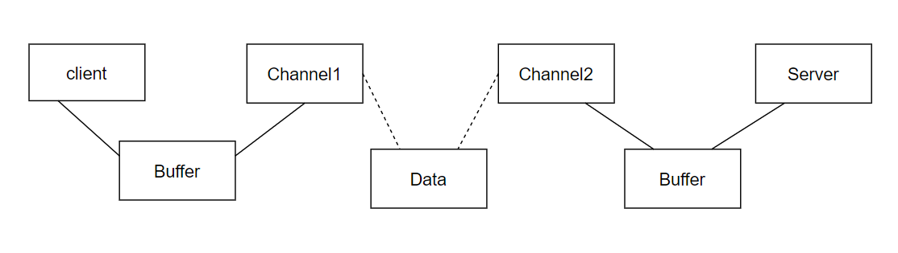
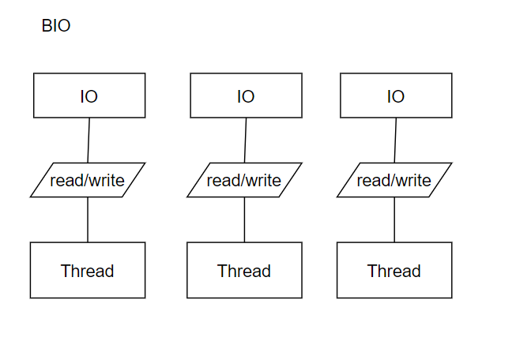
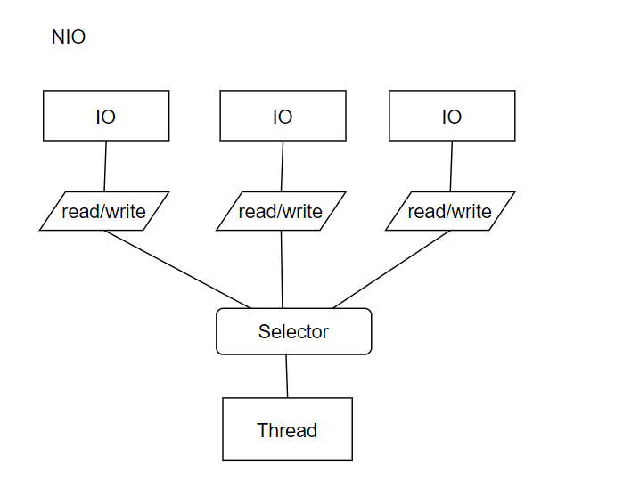
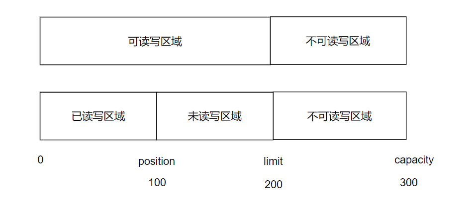
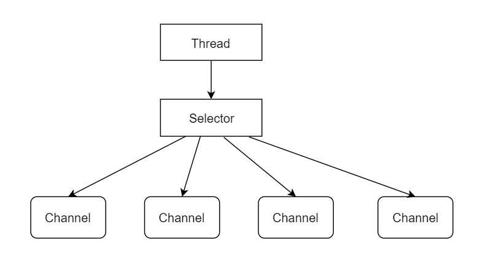
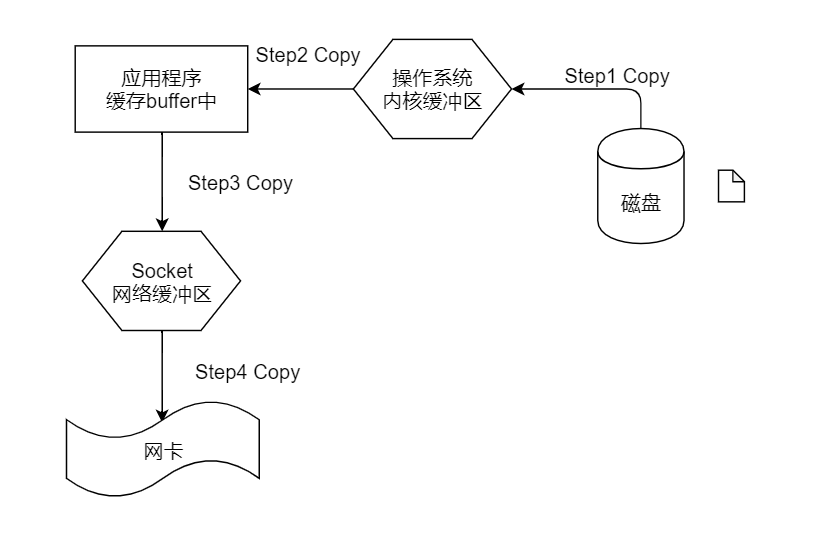
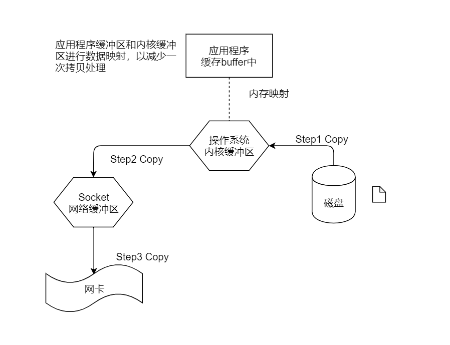
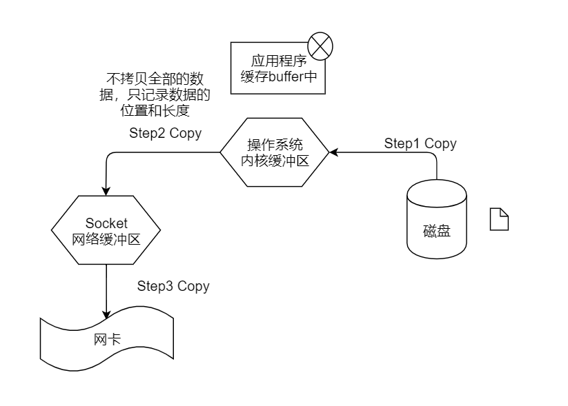
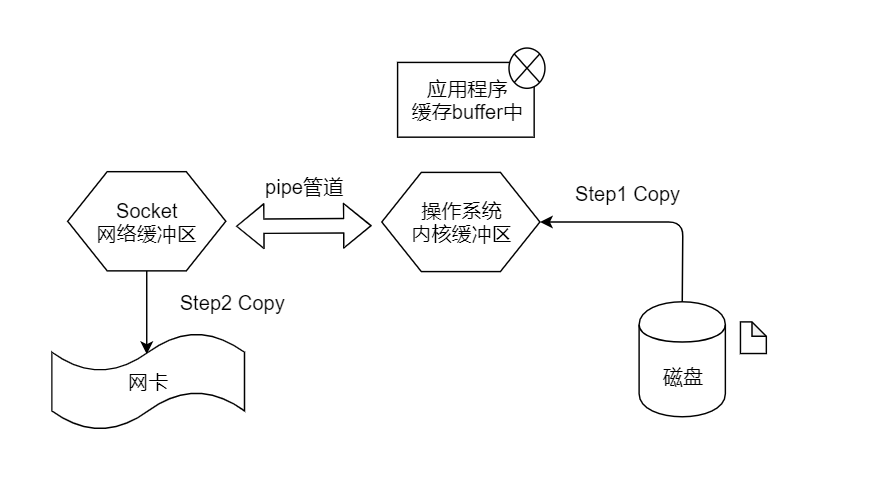

# Netty


## （一） 初识

Netty，是一个java网络的编程框架。

Netty，可以自定义通信协议，是通过编码和解码字节流实现。

三大特性（受欢迎的原因）：并发更高、传输更快、封装更好


## （二） IO

I/O，本质上是处理人机交互、机器间交互的问题。

##### 【流模型】

方向：输入流、输出流
大小：字符流、字节流

计算机中最小的二进制单位  bit  0 1
字节 8bit                     计算机处理的单位
字符 16bit = 2字节     人处理的单位 

字符流更多处理文本数据
字节更多处理图片、视频、文件等二进制数据

##### 【装饰者模式】

 使用相同的处理方式，处理不同的节点

节点流和处理流
节点流：可以和IO设备交互的流（读写数据）
处理流：对已经存在的节点流进行连接或封装，提供统一的处理方式。常常以增加缓冲的方式来提高效率。


## （三） NIO

BIO - BlockingIO (同步阻塞)
NIO - New IO /  Non-Blocking IO (同步非阻塞)
          建立多路复用的IO机制
AIO - Asynchronous IO （异步非阻塞）


##### 【同步、异步、阻塞、非阻塞】

问题： A任务 - 依赖 ->  B任务
同步 ==  当B任务完成之后，A任务才可能完成，要么都成功，要么都失败。（可靠）
异步 ==  通知B任务开始启动，A任务完成即认为完成。（不可靠）


问题：面向CPU
阻塞：等待慢操作完成才切换
非阻塞：在慢操作执行时，同时去做别的事儿，等慢操作完成再切换回来执行后续
（提高利用率，但增加了切换成本）


##### 【NIO核心】

BIO是面向流的， NIO是面向块（缓冲区）的
最大不同在于，NIO将文件或文件中的一段区域映射到内存中，可以像访问内存一样访问文件


Channel通道   Buffer缓冲区   Selector选择器

Channel， 是从节点读取数据的渠道，和Stream类比，是双向的
Buffer， 类比BIO中读取数据的byte数组，NIO的数据存储在Buffer中(数组) 

问题：


问题：



每次处理数据时，都是通过Buffer连接channel处理的

Selector,  检测多个通道上是否有IO事件发生，如果有进行处理，如果没有持续监测。


##### 【BIO vs  NIO】






##### 【Channel】

FileChannel   
Pipe.SinkChannel
Pipe.SourceChannel    用于线程间通信的管道
ServerSocketChannel
SocketChannel              支持TCP网络通信的管道
DatagramChannel        支持UDP通信的管道


创建channel通过传统节点  InputStream  OutputStream提供的getChannel方法获得
常用方法  read()   write()   map()
      map()  将数据映射成ByteBuffer


##### 【Buffer】  

最常用子类 ByteBuffer
底层是数组结构，可以进行get/set操作
Buffer没有构造器，使用时通过XxxBuffer.allocate(int n)方法进行分配，创建容量为n的对象

子类MapperByteBuffer，表示channel将磁盘文件的部分或全部内容映射到内存中。


###### 【概念】

capacity 容量    limit 界限     position 位置



capacity  最大数据容量
limit  可读写区域和不可读写区域的边界
postion    已读写区域和未读写区域的边界


###### 【使用原理】

初始化时，position=0，limit=capacity
调用put方法存入数据，positon向后移动，代表数据处理的位置
装载数据完成后，调用flip，切换读写模式，操作索引的方法
         limit = position     position = 0    
         保障可读写和不可读写的边界被赋值  ，以及读数据的索引是从头开始
读出数据完成后，调用clear，清空初始位置的方法
         position=0，limit=capacity  ，为重新装载数据做准备


```
 public static void main(String[] args) throws Exception {

        CharBuffer buffer = CharBuffer.allocate(8);
        System.out.println("capacity: "+buffer.capacity());
        System.out.println("limit: "+buffer.limit());
        System.out.println("position：" +buffer.position());


        buffer.put('a');
        buffer.put('b');
        System.out.println("=====加入a&b");
        System.out.println("position：" +buffer.position());

        buffer.flip();
        System.out.println("=====执行flip");
        System.out.println("limit: "+buffer.limit());
        System.out.println("position：" +buffer.position());

        System.out.println("=====获取第一个元素：" +buffer.get());
        System.out.println("position：" +buffer.position());


        buffer.clear();
        System.out.println("=====执行clear");
        System.out.println("limit: "+buffer.limit());
        System.out.println("position：" +buffer.position());

        // 执行clear后  对象依然存在  清空的只是索引位置
        System.out.println("=====获取第二个元素：" +buffer.get(1));
        System.out.println("position：" +buffer.position());

    }
```

##### 【Socket】

网络通信：两个程序通过双向的连接进行数据的交换，双向链路的一端，称为Socket。
Socket由IP地址和端口号唯一确定，在java环境中，主要指基于TCP/IP协议的网络编程。

服务器程序和客户端程序，分别使用ServerSocket和Socket。
1）服务端创建ServerSocket,  调用accept()方法来接收客户端的连接。
2）客户端创建Socket,  请求和服务端建立连接，传输数据。
3）当服务端接收到客户的连接后，创建一个新的Socket与客户端连接，服务端继续等待新的请求。

客户端的处理流程
1）创建Socket
2）打开连接的输入/输出流
3）按照协议对Socket进行读写操作
4）关闭Socket


##### 【Selector】

Selector是选择器，也叫多路复用器。提供一种选择已经就绪的任务的能力。分别轮询各通道Channel，是否已经准备好执行IO操作。使用单个线程处理多个Channel，以减少资源浪费和系统切换的开销。



三个元素：Selector选择器、SelectableChannel可选择的通道、SelectionKey选择键

**选择器和通道的关系，需要将通道注册进选择器中，但前提是通道是可选择的。这个注册关系的对应是选择器逻辑的核心。**
Selector，管理被注册的通道集合，以及他们的就绪状态。
SelectableChannel，是抽象类，提供了通道可选择所需要实现的公共api。
      FileChannel不是可选择的，Socket通道都是可选择的。
      一个通道可以被注册到多个选择器上吗？    可以
      对于每个选择器而言，一个通道只能被注册一次
SelectionKey，封装了特定的通道和特定的选择器之间的注册关系。
      包含两方面，其一是注册关系关心通道有哪些操作，其二是通道已经准备好了哪些操作。


###### 【Selector 选择器处理流程】

使用Selector.open() 方法进行创建
然后将channel注册到Selector中，并设置需要监听的操作/事件。
然后管理已经注册好的通道。
       分为三种类型的集合： 已注册的、已选择的、已取消的
               已注册——与选择器关联过的所有通道，包含无效的。(不能修改)
               已选择——每个成员对应的通道都被选择器判断为已经准备好的。(可删除，不可添加)
               已取消——当调用cancel方法取消选择器和通道的注册关系后，放入此集合中。
                                  当选择器关闭时，所有被注册到该选择器的通道都将被注销。

int  select()方法
可以选择已经准备就绪的通道，返回值表示有多少通道已经就绪。

返回不为0时，继续调用selectedKeys()，返回已选择的集合。
遍历此集合，分别判断每一个元素对应的通道，哪一种操作可执行。


可以选择已经准备就绪的通道，返回值表示有多少通道已经就绪

###### 【SelectableChannel 可选择的通道】


配置通道是非阻塞的
channel.configureBlocking(false);  
配置通道的哪些操作是要被选择器监听的
     通道的操作范围有：  Connect    Accept       Read       Write
                                         连接就绪    接收就绪    读就绪    写就绪
     对应SelectionKey四个常量
                             OP_CONNECT    OP_ACCEPT    OP_READ   OP_WRITE                               

​    注册给selector，去监听读操作
​    channel.register(selector, SelectionKey.OP_READ);
​            不只对一种操作监听
​             channel.register(selector, SelectionKey.OP_READ | SelectionKey.OP_WRITE);


###### 【SelectionKey选择键】

​      监听的操作就是  感兴趣的操作集合  interestOps()
​      可以进行的IO操作集合， readyOps()
​             相对应的判断方法   isAcceptable()   isWritable()   isConnectable()  isReadable()


##### 【零拷贝】

传统的I/O操作，会导致数据在操作系统和应用程序之间多次传输，减少传输次数，即较少CPU的使用。


###### IO中断和DMA

1）IO中断，在IO设备处理数据的过程中，CPU和IO设备并行工作，当处理完一个数据时，需要CPU花费短暂的时间做中断处理，所以在一个指令结束时，中断使用的是CPU的处理时间。
2）DMA =  Direct Memory Accesss  直接存储器访问
      数据传输的基本单位是数据块，在CPU与IO设备间每次至少传输一个数据块，申请的是总线的使用权，而传输的数据也是直接从设备传入内存中，只在传输开始和结束时才需要CPU的干预，极大的减少的CPU的使用率。  


概念：零拷贝就是避免CPU将数据从一块存储拷贝到另一块存储的技术。

需求：读取文件从Socket中发送出去


###### 传统的拷贝方式 

​     Socket网络缓冲区，也属于操作系统内核缓冲区。

   

​     总共四次，减少第二次和第三次拷贝的冗余，让磁盘文件数据直接拷贝到Socket网络缓冲区，是零拷贝出现的背景和意义。但它需要操作系统的支持。

​     在操作系统中进行的拷贝（第二次和第三次），叫做CPU拷贝。
​     连接磁盘或网卡等硬件的拷贝（第一次和第四次），叫做DMA拷贝。

​     所以传统拷贝中，是两次CPU拷贝、两次DMA拷贝。

###### Linux系统中的零拷贝     

1）mmap = memory mapping 内存映射 （3次）


2） sendfile (linux 2.1内核支持)

减少对应用程序的调用处理； 在操作系统内核缓冲区和Socket网络缓冲区的copy过程中提高效率。


3）sendfile with scatter/gather  copy  (批量sendfile)
      从单个文件的处理，上升到一个或多个物理地址的处理，提高整体的处理速度。  


4） splice（拼接，在linux 2.6内核支持，2次）

​       在操作系统内核缓冲区和Socket网络缓冲区中建立管道，以减少拷贝的过程       



​       剩下的两次都是DMA拷贝，减少到了0次CPU拷贝，是为零拷贝。


###### 【java中的零拷贝】

1）FileChannel中的map方法，底层就是调用linux系统的mmap拷贝方式。
       适用于读取大文件，同时支持对文件内容的修改，但如果读取后需要socket发送，仍然还是要拷贝，效率并不是很高。

2）FileChannel.transferTo()方法，对应于linux系统的sendFile拷贝方式。
        不再涉及buffer，直接从通道1转移到通道2。