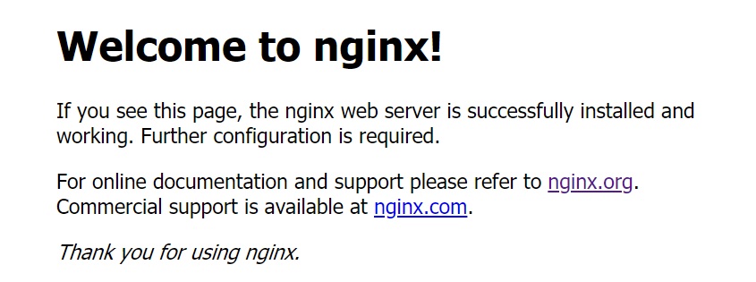

# Nginx学习笔记

## 1、Nginx初识

**Nginx 是一个高性能的Http和反向代理服务器**。也是一个IMAP/POP3/SMTP等邮件代理服务器。


### (一) 正向代理和反向代理

正向代理：客户端client通过设置，使用代理服务器proxy去访问远程服务器server。
|client   -   proxy |  -   server

使用场景：

1) 可以访问原来无法访问的资源
2) 做缓存使用，加快访问速度
3) 对客户端授权或记录访问信息等


反向代理：服务器通过代理服务接收连接请求，然后再转发给内部网络的服务器，将服务器的结果返回给客户端，此时这种代理叫反向代理。

client  -  | proxy - server | 

使用场景：

1）保证内网的安全，阻止web攻击。 
2）负载均衡，优化网站的负载（处理能力）


一句话，代理服务器站在客户端一边（能够感知），就是正向代理；代理服务器站在服务端一边（客户不感知），就是反向代理。


### (二) Hello Nginx

nginx安装包所在目录  /usr/local/src/

nginx安装目录  /usr/local/nginx/

启动命令  ./nginx   

验证方式   浏览器访问  虚拟机ip地址  （返回nginx欢迎页面）



启动后，进程id存放位置   /usr/local/nginx/nginx.pid
  查看文件   cat  nginx.pid

关闭方式： ./nginx -s  stop  原生命令

杀死进程：
kill  + 参数  +  pid 形式
如 ： kill -9 pid  强制停止服务
          kill -TERM pid  快速停止服务
          kill -QUIT  pid  平缓停止服务

信号处理命令：
./nginx -s + （ stop, quit, reopen, reload) 
其中 reload 是重加载命令，  在更改配置后使用
quit仍然是平缓停止的意思（完整有序），stop是快速停止


## 2、Nginx配置

分为三部分，全局块、events块、http块。

### （一）全局块

全局指令，指定运行时的用户组、进程id存放位置、日志存放位置、worker process数量等等。

```
# 配置用户或者用户组
#user  nobody;

# 允许生成的进程数
worker_processes  1;

# 日志路径设置  可以配置级别
#  debug | info | notice | warn | error | crit 
#error_log  logs/error.log;
#error_log  logs/error.log  notice;
#error_log  logs/error.log  info;

# 存储进程id的文件地址
#pid        logs/nginx.pid;
```

### （二）events块

影响nginx服务器和用户网络连接的配置，比如每个进程的最大连接数，选取哪种事件驱动模型，以及在网络连接过程中，是否开启多个，是否序列化等等。

```
events {
    # 每个进程的最大连接数
    worker_connections  1024;
}
```

### （三）http块

配置代理、缓存、日志等绝大部分功能的地方，可以嵌套多个server块，而不同的server可以对应不同的域名（虚拟主机）

#### **（1）虚拟主机的配置**

虚拟主机：同一台nginx服务器，可以支持多个网站的运行，每个虚拟主机之间都相互独立，具有完整功能。

```
http {
    # 对应虚拟主机的配置
    server{
       # 监听端口
       listen       80;
       # 监听域名
       server_name  localhost;
       # 定位出路径或文件地址
       location / {
             # 相对路径
       		 root   html;
       		 # 默认跳转的首页地址
             index  index.html index.htm;
       }
    }
    
    server{
    
    }
}
```


配置指定域名(www.bigdata.com)，访问到虚拟机上的页面

1）在安装目录下，创建文件夹，如: mkdir bigdata
2)   创建页面， index.html
3)   更改配置

```
http {
    # 对应虚拟主机的配置
    server{
       # 监听端口
       listen       80;
       # 监听域名
       server_name  bigdata.com;
       # 定位出路径或文件地址
       location / {
             # 相对路径
       		 root   bigdata;
       		 # 默认跳转的首页地址
             index  index.html;
       }
    }

}
```

4)  给域名配置ip地址的映射
      更改hosts文件  （C:\Windows\System32\drivers\etc）

5）浏览器输入虚拟机地址或者域名  bigdata.com ，均能返回自定义页面


#### **（2）日志配置**

通过日志，可以获取到用户地址信息、跳转来源、终端、以及url访问量等等。

```
    #log_format  main  '$remote_addr - $remote_user [$time_local] "$request" '
    #                  '$status $body_bytes_sent "$http_referer" '
    #                  '"$http_user_agent" "$http_x_forwarded_for"';

    # 配置日志文件地址  声明日志格式 
    #access_log  logs/access.log  main;
```


日志demo

```
192.168.1.11 - - [04/Mar/2020:13:03:39 +0800] "GET / HTTP/1.1" 200 612 "-" "Mozilla/5.0 (Windows NT 10.0; Win64; x64) AppleWebKit/537.36 (KHTML, like Gecko) Chrome/80.0.3987.100 Safari/537.36"
```


|                      | 用途                               |
| -------------------- | ---------------------------------- |
| remote_addr          | 客户端的ip地址                     |
| remote_user          | 客户端的用户名称                   |
| time_local           | 访问时间和时区                     |
| request              | 请求方法                           |
| status               | 响应状态码   如：200               |
| body_bytes_sent      | 主体内容字节数  如：612            |
| http_referer         | 记录是从哪个链接访问过来的         |
| http_user_agent      | 用户使用的代理（浏览器）           |
| http_x_forwarded_for | 通过代理服务器来记录客户端的ip地址 |

可以通过脚本实现日志切割（每天生成一份日志）
  重命名日志文件  -   让nginx重新从配置中读取日志文件名  -  在新的日志文件中记录日志


#### **（3）反向代理配置**

前提：系统中安装好jdk和tomcat（配置好环境变量）

已安装的目录地址：
1） jdk路径   /usr/local/java/
2） tomcat路径   /usr/local/tomcat/
       启动方式  /usr/local/tomcat/bin      执行 ./startup.sh
       关闭方式   执行./shutdown.sh
       验证方式   虚拟机ip:8080     可以看到tomcat页面


**原需求**： 访问域名bigdata.com     显示 nginx路径/bigdata/index.html页面
**现需求**： 访问域名bigdata.com     显示 tomcat 首页

实现方式

```
        location / {
            #root   bigdata;
            proxy_pass  http://127.0.0.1:8080;
            #index  index.html;
        }
```

注意：更改配置文件nginx.conf后，执行重加载命令  ./nginx -s reload


**进阶需求**：一台nginx连接多台tomcat，当域名下对应不同路径时，分发给不同的tomcat处理

实现方式

a)  拷贝一个tomcat安装目录，修改server.xml配置中的三处端口
b) 分别在webapps目录下，创建tomcat1和tomcat2目录，放置index.html（显示不同的tomcat以及其端口），启动两个tomcat
c) 通过浏览器访问   虚拟机ip:8080/tomcat1/index.html   以及    
虚拟机ip:8081/tomcat2/index.html  都可以展示出内容
d)  修改nginx配置文件并重加载

```
        location ~ /tomcat1/ {
            #root   bigdata;
            proxy_pass  http://127.0.0.1:8080;
            #index  index.html;
        }

        location ~ /tomcat2/ {
            proxy_pass  http://127.0.0.1:8081;
        }

```

e) 浏览器验证，访问  http://bigdata.com/tomcat1/index.html  和 http://bigdata.com/tomcat2/index.html，均能找到对应页面。

最终实现通过不同的路径，映射到不同的tomcat目录下


#### **（4）负载均衡**

client1   client2  ....  clientN   ---  server 

client1   client2  ...   client 2^n   ---   server1  server2 ..  serverN

早期使用DNS（域名解析系统）做负载，具体而言，给客户端解析不同的ip地址，让流量直接到达服务器。


clientN   -   负载均衡器(load balancer)   --调度算法--   serverN
优点：
1） 通过健康检查，避免单点故障
2） 当发现节点故障时，从集群中移除，保证应用的高可用


四层负载均衡，在OSI模型的传输层，主要是转发。
七层负载均衡，在OSI模型的应用层，主要是代理。


负载均衡器可以处理四大类型的请求，HTTP/HTTPS/TCP/UDP等。

负载均衡的调度算法：
1） 轮询， 相当于将服务器从第1台到最后1台，行成一个环状，每接收一笔请求，则从1台开始循环遍历。
2）最小连接，优先选择连接数最少的服务器，适用于会话时间较长的业务处理。
3）ip映射，根据请求的ip地址进行散列，让同一ip下的请求都映射到同一服务器上，可以解决session问题。（粘性会话）


当访问 192.168.1.20/lb/index.html时，通过负载均衡，让请求平均分配到8080和8081端口中。
1） 分别找到两个tomcat的安装目录，如/usr/local/tomcat/webapps
       创建lb目录，  mkdir lb
       创建访问页面， cp tomcat1/index.html  lb
       查看页面内容， cat  lb/index.html

2） nginx.conf配置的修改

```
    # http块的层级下
    upstream myserver{
        # server列表的地址和端口
        server 192.168.1.20:8080;
        server 192.168.1.20:8081;
    }
    
     server {
        listen       80;
        server_name  192.168.1.20;

        #charset koi8-r;

        #access_log  logs/host.access.log  main;

        location / {
            # 将请求映射到负载均衡器中   参数为配置的upstream名称
            proxy_pass http://myserver;
        }
     }
```

3） 浏览器访问  http://192.168.1.20/lb/index.html 

以上，是默认的轮询调度算法。

如果需要额外设置权重，某个服务器处理的更多些，使用weight，默认值是1。

```
   upstream myserver{
        # server列表的地址和端口
        server 192.168.1.20:8080 weight=2;
        server 192.168.1.20:8081 weight=1;
    }
```

如果需要根据ip地址，固定server处理，可以使用ip_hash。

```
   upstream myserver{
        server 192.168.1.20:8080  weight=2;
        server 192.168.1.20:8081  weight=1;
        ip_hash;
    }
```


#### **(5) 动静分离**

将动态和静态请求分离开，不能单纯的理解为动态页面和静态页面的物理分离。
如果是静态资源请求，直接查找nginx上的静态资源地址。
如果是动态资源请求，通过反向代理，映射到tomcat路径下的资源。

实现方式：
1） 单独把静态文件放在独立的服务器及独立的域名下，推荐方案；
2） 将动态资源和静态资源混合在一起，通过nginx来分开。


需求： 访问图片等静态资源时，可以直接从nginx中获取，访问jsp等动态资源时，通过tomcat返回结果。

处理流程：
1） 准备动态资源，来到/usr/local/tomcat/webapps ， 通过rz命令上传本地的index.jsp
2） 准备静态资源，来到/usr/local/nginx/image， 通过rz命令上传本地的test.png         
3)   nginx.conf配置 

```
        # 动态资源配置
        location ~ .*.jsp$ {
            proxy_pass http://myserver;
        }       
        
        # 静态资源配置
        location ~ .*\.(gif|jpg|png|css)$ {
            root /usr/local/nginx/image;
            # 在浏览器端使用缓存  设置过期时间
            expires 3d;
        }

```

4） 浏览器验证，分别访问 http://192.168.1.20/jsp/index.jsp  &  http://192.168.1.20/test.png 

​      

#### （6）location块

匹配规则：

1）location = /uri  精确匹配
2）location ^~ /uri  前缀匹配，顺序在正则之前
      location /uri  前缀匹配，顺序在正则匹配之后

3）location ~ pattern 区分大小写的正则匹配
      location ~* pattern  不区分大小写的正则匹配

4）location / 通用匹配，接收未匹配到其他location的请求


匹配顺序：
首先会进行精确匹配，然后会进行前缀匹配，具体顺序按照指令长度，从长到短的顺序依次匹配，但是在正则匹配时，是按照配置文件的顺序依次匹配的，如果不希望前缀匹配后进行正则匹配，那么使用^~


情况一：

```
#对于 ^~ 和 ~

location ^~ /helloworld {
    return 601;
}

#location /helloworld {
#    return 602;
#}
#两种前缀匹配不能同时出现  否则启动会报错
```

bigdata.com/helloworld/test    -》  返回601


情况二：

```
#location ^~ /helloworld {
#    return 601;
#}

location /helloworld {
    return 602;
}
#两种前缀匹配不能同时出现  否则启动会报错

location ~ /helloworld {
    return 603;
}
```

访问  bigdata.com/helloworld/test    -》  返回603


情况三：

```

#location ^~ /helloworld {
#    return 601;
#}

location /helloworld {
    return 602;
}
#两种前缀匹配不能同时出现  否则启动会报错

location ~ /helloworld {
    return 603;
}

location ~ /helloworld/test {
    return 604;
}
```

访问  bigdata.com/helloworld/test/a.html    -》  返回603


情况四：

```
#location ^~ /helloworld {
#    return 601;
#}

location /helloworld {
    return 602;
}
#两种前缀匹配不能同时出现  否则启动会报错

location ~ /helloworld/test {
    return 604;
}

location ~ /helloworld {
    return 603;
}
```

访问  bigdata.com/helloworld/test/a.html    -》  返回604


#### （7）URL重写

对url的规范化处理，域名更换时的新旧跳转，一些额外的参数调整等等

```
server{
    listen 80;
    server_name bigdata.com;
    rewrite ^/(.*) http://www.bigdata.com/$1 permanent;
}
# 访问 bigdata.com   地址栏会变成www.bigdata.com
```


## 3、Nginx安装

在各官网下载相关组件   nginx  openssl  zlib  pcre 等等


以openssl为例
1） 通过rz上传压缩包
2） 通过tar -xvf  *.tar.gz 进行解压缩
3）cd openssl-1.1.1d    进行配置检查以及编译
      ./config   执行配置检查
      make & make install  进行编译和安装         

​      如上过程，适用于zlib和pcre 
​      注意：  对于 pcre而言，  执行检查命令为 ./configure
4)  安装nginx过程中  执行配置检查

    ```
    ./configure --sbin-path=/usr/local/nginx/nginx \
    --conf-path=/usr/local/nginx/nginx.conf \
    --pid-path=/usr/local/nginx/nginx.pid \
    --with-http_ssl_module \
    --with-pcre=/usr/local/src/pcre-8.44 \
    --with-zlib=/usr/local/src/zlib-1.2.11 \
    --with-openssl=/usr/local/src/openssl-1.1.1d
5)  仍然执行 make  以及  make install  
6)  nginx安装成功   ./nginx验证


注意事项：nginx服务器，需要虚拟机开放80端口的访问
防火墙配置 （同样适用于开放8080  8081端口）
firewall-cmd --list-all   查看当前配置
firewall-cmd --add-service=http --permanent   开放http访问
firewall-cmd --add-port=80/tcp --permanent  开放80端口
firewall-cmd --reload  重启防火墙保存


jdk的安装
1） 解压缩 -- 拷贝目录到 /usr/local/java
2)   更改环境变量   vim /etc/profile

```java
export JAVA_HOME=/usr/local/java
export JAVA_BIN=$JAVA_HOME/bin
export PATH=$PATH:$JAVA_HOME/bin
export CLASSPATH=.:$JAVA_HOME/lib/dt.jar:$JAVA_HOME/lib/tools.jar
export PATH=$JAVA_HOME/bin:$JRE_HOME/bin:$PATH
```

3)  让环境变量生效  source  /etc/profile
4)  验证版本   java -version


tomcat的安装
1） 解压缩 --  拷贝目录到 /usr/local/tomcat
2)    执行启动 ./startup.sh


