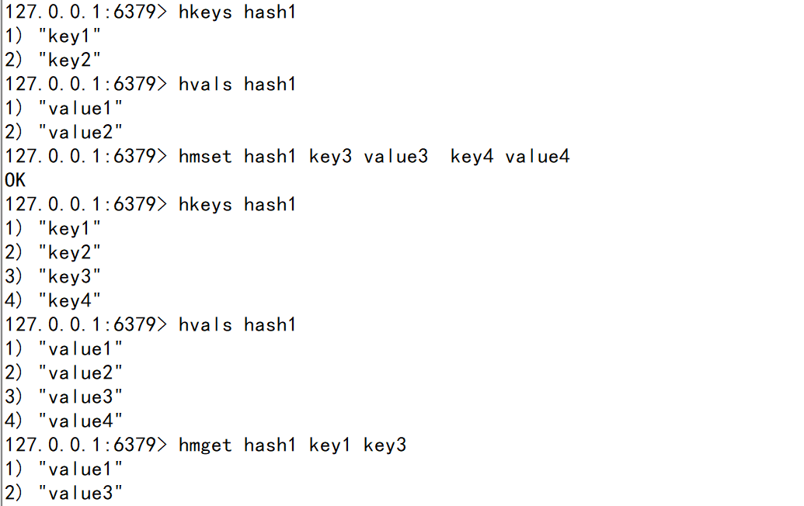

## Part 1  Mysql VS Nosql

时间戳   当前距离1970年1月1日8时0分0秒   的总秒数    计算机纪元

1971年   贝尔实验室的程序员 发明了unix系统和c语言 (jvm底层语言)
计算机都是32位的    时间跨度支持68年上下      1901—2038年范围内
随着64位系统的诞生   问题就解决了    2900多亿年

关系型数据库    E-R模型 (公司成员系统)

示例：

| 名字   | 所在部门 | 职位   | 特征 |
| ------ | -------- | ------ | ---- |
| 阿拓   | 教学部   | 老师   | 老   |
| 爱德华 | 清洁部   | 扫地僧 |      |

设计：表members

| 字段名     | 类型（大小） | 备注 |
| ---------- | ------------ | ---- |
| name       | varchar(255) | 名字 |
| department | varchar      | 部门 |
| title      | varchar      | 职位 |

非关系型数据库 (json类型)

行1  ： {“name”:"爱德华"，“department”:"清洁部"，“title”:"扫地僧"}

行2 ：  {“name”:"阿拓"，“department”:"教学部"，“title”:"老师"，“特征”：“老”}


## Part 2  Redis入门

Redis : REmote  DIctionary  Server 远程字典服务

RDS:  Relational  Database  Service 关系型数据服务

#### **一、redis命令**

##### redis启动相关命令

1） redis-server  启动服务端的命令，但是需要保持当前窗口状态。
               打开新的窗口，使用clone session方法。

2） redis-cli -p 6379   启动客户端的命令，需要通过参数-p 指定端口号
               输入ping   会返回pong 代表连接ok 

3） set key1 "hello world"   设置key1的值为“hello world”  返回ok。

4） get key1   返回“hello world” ,说明数据可以正常的存取。

5） exit  退出当前的连接。

6） shutdown  关闭当前的服务  然后再执行一次exit完全退出

7） redis-benchmark  压测命令
              测试在不同命令下  10w次请求在多长时间内完成
              官方标准是达到10w/s 的get/set

8）info Server 查看服务端相关信息

9）info Clients 查看客户端相关信息

10）info 看看详细信息

11）info Replication 查看主从配置相关信息

##### redis数据库相关命令

1） keys * 查看当前数据库所有的key值
                    系统会设置3个默认key额外使用

2） keys ?  匹配方式的使用
                对于存在key1 key2 key3形式的key时
                keys  key?   可以找到
                keys  k???    也可以找到     
                说明？是一个匹配符，并且有占位的作用

3） select 1 切换到1号数据库
              get  key1  返回nil，空的意思
              通过127.0.0.1:6379[?]后面的括号中的值，可以判断当前所在的数据库编号

4） dbsize  展示数据库中key的个数

5） flushdb  删除当前数据库的数据   "慎用!"     

6） flushall  删除所有数据库的数据   要怎么用   看着办      

​              get  key1  返回nil，空的意思

如图：


##### **redis键值操作命令**

1） exists  + key  判断键值是否存在

2） type  + key  显示当前键值存储的数据类型

3)   expire  + key  +  n   设置key值的有效时间为n秒 ,   过了有效期，此key的值置为空
                pexpire + key +  n   有效时间的单位变为毫秒。

4） ttl + key  还剩多长时间有效， 正数代表未过期的剩余时间，单位是秒。 
           pttl + key     返回剩余时间的单位变为毫秒。
           负数的情况如下：
               当返回-2时，说明key已经不存在
               当返回-1时，说明key没有设置有效时间。

5） persist  + key  设置数据一直有效，特别作用于错误设置了有效期之后。

6）del + key  删除一个key

7)   rename +  key + newKey   可以重命名key的值

8）randomkey  随机出一个key

9） move key +  dbID    移动指定key到另一个数据库中，dbID是数据库编号
            eg:  move key5 1

如图：


## Part 3  Redis数据结构

#### **一、String（字符串）**

1 命令：

1）strlen   查看字符串的长度
2）append   增加后缀，返回字符串的长度
            eg： append  key1 "222"   ->  "hello111222"
            eg:    set key1 "hello111222"
3） 当value的值是整数时，可以通过命令直接进行数学运算
         incr  自增 ，返回最新的值。
         decr  自减， 也返回最新的值。 
         incrby  增加，区别是增加计算的参数   如：incrby  key11 3。
         decrby 减少，同上。

4） 范围内操作的命令
        getrange  key  start  end 获取从初始位置到结束位置的值，从0计数  ==》 类似subString
        setrange  key  start  newStr  设置从起始位置开始，替换指定位置为新的字符串
                 eg :  "hello111222" ->  setrange key1  5 333 ->  "hello333222"

5)   整合命令
         setex   = set + expire      使用方式： setex + key + 时间 + value
         setnx   = set + exists   = set if not exists    使用方式：  setnx +  key  + value
                     如果key不存在，则设置数据，返回1。如果存在，不设置，返回0。
         getset  先取出原来的值，再设置为新值   使用方式:  getset + key + value   返回旧值。

6） 批量操作
         mget  = more  get   使用方式 : mget + key1 + key2 + key3
                      参数接收多个key， 结果返回多个value
         mset  = more set  使用方式：mset + key1 + value1 + key2 + value2
                      一次设置多个key和value， 参数本身是个map
         msetnx   使用方式同上。

如图：


2 原理：

redis的字符串是动态字符串，内部结构类似ArrayList。采用预分配冗余空间的方式减少内存的频繁分配。内部为字符串分配的实际空间一般高于字符串长度，当字符串长度<1MB时，扩容方式是直接加倍，如果>1MB，一次扩容只扩1MB，直到扩大到512MB。

#### **二、list（列表）**

栈和队列   -》  “数据结构”
栈： 像生活中的口袋一样，先进后出。  push 压栈   pop 弹出
队列：像生活中的排队一样，先进先出。

1 命令：

1）存取操作  push  pop   range
         lpush :   从左侧存入数据  —》  栈结构     弹出时执行lpop (从左侧弹出)
         rpush:   从右侧存入数据  —》  队列结构     弹出时执行lpop (从左侧弹出)
         lrange:   范围内查看数据    使用方式：lrange key start  end


2）对list本身的操作 
           llen   查看长度
           lindex  获取某一个位置的值，下角标从0开始
           lrem    删除n个value的值    使用方式： lrem key  N  value
           ltrim   截取某个范围的数据重新赋值给key   使用方式： ltrim key start  end (下角标从0开始)
           linsert   插入数据到某个位置的前后   
                    使用方式： linsert  key  before/after  oldValue  newValue
                    如果要插入数据到头部，还可以使用 lpushx， 使用方式：lpushx  key value
                    同理，如果要插入数据到尾部，可以使用 rpushx, 使用方式同上。
           lset   可以更改指定位置的值   使用方式： lset key  index  value

#### **三、Hash（哈希）**

HashMap<String,String>  ==》  string

HashMap<String,List>  ==》  List

HashMap<String,Map> ==》  Hash

HashMap<String,Set\<String>> ==》  Set

HashMap<String,Set<Double,String>>  ==》 ZSet

1  命令：
      1)   存取数据
             hset  使用方式： hset  hash1  key1 value1 
             hget  使用方式： hget  hash1  key1  =>  "value1"  
             hsetnx   如果不存在即set新的key值
             hmset/hmget  批量处理更便捷
         

​     

​    2） 遍历数据
​              hkeys  查看所有的key值
​              hvals    查看所有的value值    
​              hlen    查看数据长度
​              hgetall   返回全部的key和value
​              hexists   判断是否存在某个key， 存在返回1，不存在返回0

​     3） 变更数据
​               hdel   删除数据  ， 使用方式 hdel  key   field_key
​               hincrby   对整数的增加操作,指定增加的范围   使用方式 hincrby  key  field_key  num               

#### **四、set（集合）**

java的集合中有list/set/map
        list可以存储有序的重复数据， 而set可以存储无序的不重复数据。

1 命令：

1）读写操作：
           sadd  创建set类型的value，eg： sadd set1 1 2 3 4 4 3 2 1
           scard  key  查看set的大小     
           smembers  key  查询set中的所有值   
           sismember  key  value  判断value是否在key所对应的set中，
                   如果在返回1，如果不在返回0  

2）更新操作：
           srem   key   value1  value2   删除set中一至多个数据的值
           srandmember  key  num   可以在set中随机出num个元素     
           spop   key  num    可以随机弹出num个元素返回                 

3） 交互操作：
            smove key1 key2  value  移动元素value从key1到key2


​           

​            还支持求并集、交集和差集。
​            sinter  key1 key2  代表求两个集合的交集（两者都有的元素）。
​            sdiff   key1  key2   返回存在在key1中但不存在在key2中的元素，两者的差集
​            sunion  key1 key2  返回并集（两个集合中的所有元素）


拓展问题： 在java的set中，如何求交集、差集、并集？
                                        方法： retainAll()、removeAll()、addAll()  

#### 五、ZSet（有序集合）

1 命令
1）读取操作
         zadd    创建或增加zset的元素值，每一个元素值都包含  <分数,value>
                      使用方式： zadd key1  score1 value1  score2 value2 ...
         zrange  key1  start  end  指定在start到end的范围内查看元素
                       如果要查看分数 ，加上withscores
         zrangebyscore  key1  minScore  maxScore  指定分数范围内查询元素
                       参数说明  分数前增加“(”  代表开区间(不包含当前值)
                       支持limit分页   limit + offset（偏移量） + num（返回的数量）
         zrem  key1 + value  删除指定的value值   


2）统计操作
         zcard + key  统计元素个数
         zcount + key + minScore + maxScore  统计给定分数范围内的元素个数
                   比如统计及格人数等需求。
         zscore + key + member  查询指定成员的分数
         zrank  + key + member  返回指定成员的索引位置(因为有序，所以位置代表排名)
         zrevrank  + key + member  默认从低到高排序，逆序正好代表排名
         zrevrange   原来是从小到大排列，逆序后从大到小排列


#### **六、Geo（位置信息）**

1 命令
    1） geoadd  +  key + 经度 +  维度 + 成员名    
                  通过经纬度存储地址，支持存储多个


​    2） geodist  +  key +  member1  + member2 + 距离单位
​                  查询两个地点之间的相对距离
​                  距离单位支持：m(米)、km(千米)、mi（英里）、ft（英尺）
​    3）geopos   查询成员经纬度数据
​    4）geohash  进行哈希编码 ，得到编码结果


​    5）georadius  以某个经纬度的位置为中心，划一个指定距离的半径，返回集合中满足条件的地址。   这就是“附近的XXX”的一种实现方式。
​            使用方式：  georadius  + key  + 中心的经度 + 中心的纬度  +  半径的距离  + 半径的单位
​            可选参数：  withdist  返回距离； withcoord 返回经纬度 ；  withhash  返回哈希编码；


​    6）georadiusbymember  根据给定地理位置获取指定范围内的地址位置集合

#### **七、bitmap(位图)**

命令

   1）读取操作
          setbit  key  index  0/1 设置某个位置的值为 0 / 1  
          getbit  key  index  获取某个位置的值
          get + key   零存整取，直接获得二进制字符数组对应的字符串。

​    2） 统计操作
​           bitcount  查询数组中有多少个1 
​                     支持参数   字符的起始位置到终止位置   ，  可以计算每个字符的二进制有多少个1


#### 八、HyperLogLog（基数统计）

命令

​    1)  基础命令

​		pfadd  增加数据 

​		pfcount    统计数据 (去重)

​		pfmerge   将多个HyperLogLog合并为一个，并去重


#### **九、Stream(流)**

1  消息的发布与订阅

​      

​     上图的出处： https://www.cnblogs.com/lovesong/p/5272752.html  


命令：

​     subscribe  + channel   订阅频道的命令，会持续接收消息
​     publish  + channel + message  在某个频道发布消息，相应的订阅者会接收到


2  Stream
    生成消息的命令：

​    1)  xadd  生成消息，返回消息ID（时间戳+顺序），顺序指的该毫秒下产生的第几条消息。
​    2）xlen  查看消息列表的长度
​    3）xrange   key  -  +     遍历所有的消息
​    4）xdel  key + 消息ID   通过消息id删除消息


   

​    读取消息的命令：
​    1）xread 读取消息，返回消息列表
​                eg: xread  +  streams + key + 0-0  遍历读取所有的消息
​                支持参数count + num，指定返回消息的数量
​                支持参数block + num,  可以阻塞等待消息的返回，此时0-0 应该替换为“$”,代表从尾部接收


## part 4   Redis配置文件

#### redis.conf

1 单位的问题： 1k / 1kb / 1m / 1mb / 1g / 1gb 是不同的，没有b的时候取整。
           单位的大小写是不敏感的 1GB=1gB=1Gb

####     网络相关

2 bind 127.0.0.1   绑定ip地址(能够访问服务端的地址,0.0.0.0代表可以被外网服务器访问)
            当前的redis服务只能被本机访问
3 protected-mode  yes  开启保护模式
            当bind没有配置且登录不需要密码时，启动保护模式（只能被本地访问）
4 port 6379  端口号

5 timeout  0   客户端超时时间 ，0代表一直保持

6 tcp-keepalive   300   单位是秒，每300s去检查一次客户端是否健康，避免服务端阻塞。

7 tcp-backlog  511   队列数量(未完成握手和已完成握手的)    

####     **通用相关**

8 daemonize no  后台运行开关
             改为yes后，重启redis验证。
             redis启动指定配置文件的方式为： redis-server /root/myredis/redis.conf 

9 pidfile /var/run/redis_6379.pid   当守护进程开启时，写入进程id的文件地址

10 loglevel notice  四种级别，notice对应生产环境

11 logfile ""   日志存储的位置

12 databases 16   初始化数据库是16个

#### 安全和限制

config命令是一种从客户端查看配置项信息的方式，使用config  get，属于危险命令，可以限制使用。

- **安全校验配置**    requirepass  代表是否设置密码
       如果需要设置密码    config set requirepass  + \<password>
       此时输入命令前，需要先校验    anth + \<password>   然后才能执行其他操作
       恢复初始状态，只需要重新设置为空串 

  

- **危险命令限制**     
       包含 config / flushdb / flushall /  keys
        rename-command  +  命令 + “”  将此命令置为不可用

#### 缓存淘汰策略

有效期叫做TTL(time to live)，作用是为了节省空间和有效期失效后保证数据的一致性

过期/淘汰策略：当内存使用达到最大值时，需要使用某种算法来清除掉某些数据，以保证新数据的写入。

- **常见淘汰策略3种：**
  - FIFO（First in First out）：先进先出，判断被存储的时间，离目前最远的数据优先被淘汰
  - LRU（Least Recently Used）：最近最少使用(时间)，判断最近被使用的时间，离目前最远的数据优先淘汰
  - LFU（Least Frequently Used）：最不经常使用(次数)，在一段时间内数据被使用最少的，优先被淘汰

- **redis缓存清除策略(maxmemory-policy)6种：**volatile(不稳定的)，代表会过期的数据，等价于设置了expire的数据

  - noeviction：不删除策略, 达到最大内存限制时, 如果需要更多内存, 直接返回错误信息。 大多数写 命令都会导致占用更多的内存(有极少数会例外, 如 DEL ）
  - allkeys-lru：所有key通用; 优先删除最近最少使用(less recently used ,LRU) 的 key
  - volatile-lru：优先删除最近最少使用(less recently used ,LRU) 的 key(限于会过期的key)
  - allkeys-random：所有key通用; 随机删除一部分 key
  - volatile-random：随机删除一部分 key(限于会过期的key)
  - volatile-ttl：优先删除剩余时间(time to live,TTL) 短的key(限于会过期的key)

- **近似LRU算法**：因为LRU算法需要消耗大量内存，所有采用近似LRU算法，并且是懒处理

  - 算法原理

    首先给每个key增加一个额外24bit的字段，记录最后被访问时间戳，然后当内存超出maxmemory时，通过maxmemory-samples设置采样出指定个数，采样范围取决于maxmemory-policy配置是volatile还是allkeys，淘汰掉旧的key。

  - 算法分析

    采样范围越大，越接近严格LRU，Redis3.0中增加了淘汰池，进一步提升了效果。

    淘汰池是一个大小为maxmemory_samples的数组，每一次淘汰循环中，新随机出的key会和淘汰池 中的key列表融合，淘汰掉最旧的key，剩余较旧的key列表放在淘汰池中等待下一次循环。

## part 5  Redis持久化

#### 定义

将数据(如内存中的对象)保存到可以永久保存的存储设备中。

#### 持久化方式

##### RDB(Redis DataBase)

- 释义：在指定的时间间隔内对数据进行快照存储。先将所有数据写入一个临时文件，写入成功后，用该文件替换原来的备份文件，用二进制压缩存储，是一次全量的备份。

- 触发方式

  - 命令触发
    - save：会阻塞当前redis服务器，直到持久化完成，线上应禁止使用
    - bgsave：会fork一个子进程，有子进程负责持久化，因此阻塞只会发生在fork子进程的时候。
  - 自动触发
    - 根据我们的 save m n 配置规则自动触发
    - 从节点全量复制时，主节点发送rdb文件给从节点完成复制操作，主节点会触发 bgsave
    - 执行 debug reload(保存并清空数据，重新加载rdb文件) 时
    - 执行 shutdown时，如果没有开启aof，也会触发

- 恢复方式：将备份文件(dump.rdb)移动到redis安装目录并启动服务即可

- 在redis.conf中的配置

  

- Fork原理

  

  1. redis调用系统函数fork() ，创建一个子进程
  2. 子进程将数据集写入到一个临时 RDB 文件中

  3. 当子进程完成对临时RDB文件的写入时，redis 用新的临时RDB 文件替换原来的RDB 文件，并删 除旧 RDB 文件。

  4. 执行fork时，操作系统会使用写时复制(copy- on-write)策略，即fork函数发生的一刻父子进 程共享同一内存数据，当父进程要更改其中某片数 据时(如执行一个写命令 )，操作系统会将该片 数据复制一份以保证子进程的数据不受影响。**新的 RDB文件存储的是执行fork那一刻的内存数据。**

  5. 在进行快照的过程中不会修改RDB文件，只有快 照结束后才会将旧的文件替换成新的。**任何时候 RDB文件都是完整的。**

- RDB性能分析

  - 优点
    - 通过rdb文件恢复数据比较快
    - rdb文件非常紧凑，适合于数据备份
    - 通过RDB进行数据备份，由于使用 子进程生成，所以对Redis服务器性 能影响较小
  - 缺点
    - 采用RDB的方式可能会造成某个时段内数据的丢失，比如还没达到触发条件时服务器死机了，那么这个时间段的数据会丢失
    - 使用save命令会造成服务器阻塞，直接数据同步完成才能接收后 续请求
    - 使用bgsave命令在forks子进程时，如果数据量太大，forks的过 程也会发生阻塞，另外，forks子进程会耗费内存

##### AOF(Append Only File)

- 释义：以日志文本的形式记录服务器所处理的每一个数据更改指令，然后通过重放来恢复数据，是连续的增量备份。

  - 注意：如果更新操作过多，aof文件过大，加载文件恢复数据会非常慢，为解决这个问题，redis支持aof文件重写，通过重写aof，可以生成一个恢复当前数据的最少命令集。

  - 整体流程：一是命令实时写入，二是对aof文件重写
  - 命令写入流程：命令输入=>追加到aof_buf =>同步到aof磁盘 (考虑到磁盘IO心性能增加了缓冲)

- 触发方式：

  注入：在写入aof文件时，如果redis服务宕机，则日志文件可能出现格式错误，重启服务时，服务器会拒绝载入这个aof文件，可以通过命令：redis-check-aof --fix file.aof 修复。

  - 手动触发：执行命令bgrewriteaof
  - 根据配置规则来触发 (整体时间还跟Redis的定时任务频率有关系)

- 恢复方式：重启redis服务即可

- 在redis.conf中的配置

  

- AOF原理

  

  1. 在重写期间，由于主进程依然在响应命令， 为了保证最终备份的完整性;因此它依然 会写入旧的AOF file中，如果重写失败， 能够保证数据不丢失。
  2. 为了把重写期间响应的写入信息也写入到 新的文件中，因此也会为子进程保留一个 buf，防止新写的file丢失数据。
  3. 重写是直接把当前内存的数据生成对应命 令，并不需要读取老的AOF文件进行分析、 命令合并。
  4. AOF文件直接采用的文本协议，主要是兼 容性好、追加方便、可读性高可认为修改 修复。

- AOF性能分析

  - 优点
    - AOF只是追加日志文件，因此对服务器性能影响较小，速度比RDB快，消耗内存小
    - 数据安全性较高
  - 缺点
    - AOF方式生成的日志文件太大，即使通过AFO重写，文件体积仍然很大
    - 恢复数据的速度比RDB慢

**注意**：

1. 当RDB与AOF两种方式都开启时，Redis启动时会优先使用AOF日志来 恢复数据，因为AOF保存的文件比RDB文件更完整
2. Redis4.0+提供了一个混合持久化的选择，将rdb文件的内容和增量的aof 日志存在一起，重启时先加载rdb，再重放aof，以达到最大效率。

## part 6  Redis管道与事务

#### 管道

- 管道技术是客户端提供的，与服务器无关；服务器始终使用：收到-执行-回复   的顺序处理消息，而客户端通过对管道中的指令列表改变读写顺序，而大幅节省IO时间，指令越多，效果越好，可以将多个命令打包一次性发送给服务端处理。

- 管道测试：redis-benchmark (-P)

#### 事务

- 一个成熟的数据库一定会支持事务，以保障多个操作的原子性。同时事务还能保证一个事务中的命令依次执行而不被其他命令插入

- redis事务指令：multi(开启事务)、exec(执行命令)、discard(取消事务)；

  注意：虽然可以使用discard取消事务，但是不支持回滚。

- redis事务执行流程：输入multi命令，服务器返回ok开启事务；依次输入执行命令，每个命令服务器返回queued，表示命令被服务器接收并暂时保存起来，输入exec命令，事务中所有命令才执行

注意：

- 语法错误，直接清空所有命令，所有命令不执行。
- 运行错误，后面的命令继续执行。

#### 事务监测

本质上是建立在key上的乐观锁。

- watch命令，可以监控一个或多个键，一旦其中一个键的值发生变化，之后的事务操作就不会执行，监控一致持续到exec命令。
- 执行exec命令后，会取消监控使用watch命令监控的键，如果不想执行事务中的命令，也可以使用unwatch来取消监控。
- 使用方式：watch-->mutl-->command-->exec
- 注意：由于WATCH命令的作用只是当被监控的键被修改后取消之后的事务，并不能保证其他客户端不修改监控的 值，所以当EXEC命令执行失败之后，需要重watch和重新执行整个事务

## part 7 redis分布式锁

- 悲观锁(Pessimistic Lock)：每次去拿数据的时候都认为别人会修改。所以每次在拿数据的时候都 会上锁。这样别人想拿数据就被挡住，直到悲观锁被释放。
- 乐观锁(Optimistic Lock)：每次去拿数据的时候都认为别人不会修改。所以不会上锁，不会上锁! 但是如果想要更新数据，则会在更新前检查在读取至更新这段时间别人有没有修改过这个数据。如果修改过，则重 新读取，再次尝试更新，循环上述步骤直到更新成功。
  - CAS算法：Compare-and-Swap，即比较并替换，也有叫做Compare-and-Set的，比较并设置，会出现经典的(A-B-A)问题。
    - 如：读取到一个值A，在将其更新为B之前，检查原值是否仍为A，如果没变将A更新为B结束。 如果变化了，则什么都不做。
  - **乐观锁策略也被称为无锁编程。换句话说，乐观锁其实不是“锁”，它仅仅只是一个在循环重试CAS的算法而已**
- 悲观锁VS乐观锁
  1. 悲观锁阻塞事务，乐观锁回滚重试。 
  2. 乐观锁适用于写比较少的情况下，即冲突很少发生时，可以省去锁的开销，加大了系统吞吐量。 
  3. 悲观锁适用于写比较多的情况下，因为如果乐观锁经常冲突，应用要不断进行重试，反倒降低性能。
- 分布式锁：是控制分布式系统之间同步访问共享资源的一种方式。
  - 三种实现方式
    - 数据库乐观锁
    - 基于redis的分布式锁(常用)
    - 基于Zookeeper的的分布式锁
  - redis的分布式锁满足可靠性条件
    - 互斥性：在任意时刻，只有一个客户端能持有锁
    - 不会发生死锁：即使有一个客户端在持有锁的期间崩溃而没有主动解锁，也能保证后续其他客户端能加锁
    - 具有容错性：只要大部分的Redis节点正常运行，客户端就可以加锁和解锁
    - 解铃还须系铃人：加锁和解锁必须是同一个客户端，客户端自己不能把别人加的锁给解了
  - redis分布式锁原理：Redis为单进程单线程模式，采用队列模式将并发访问变成串行访问，且多客户端对Redis的连接并不存在竞争关系，基于此，Redis中可以使用SETNX命令实现分布式锁。

## part 8 redis集群配置

#### 主从模式

为了保证高可用，redis-cluster集群引入了主从模式，一个主节点对应一个或者多个从节点，当主节点宕机的时候，就会启用从节点。

当其它主节点ping一个主节点A时，如果半数以上的主节点与A通信超时，那么认为主节点A宕机了。如果主节点A和它的从节点A1都宕机了，那么该集群就无法再提供服务了

- 优点

  - 支持主从复制，主节点自动将数据同步到从机，可以进行读写分离 

  - 为了分载Master的读操作压力，Slave服务器可以为客户端提供只读操作的服务，写服务仍然必须由Master来完成 
  - Slave同样可以接受其它Slaves的连接和同步请求，这样可以有效的分载Master的同步压力

- 缺点

  - Redis不具备自动容错和恢复功能，主机从机的宕机都会导致前端部分读写请求失败，需要等待机器重启或者手动切换前端的IP才能恢 复。
  - 主机宕机，宕机前有部分数据未能及时同步到从机，切换IP后还会引入数据不一致的问题，降低了系统的可用性。
  -  Redis较难支持在线扩容，在集群容量达到上限时在线扩容会变得很复杂

#### 主从复制

在Redis中，用户可以通过执行SLAVEOF命令或者设置slaveof选项，让一个服务器去复制(replicate)另一个服 务器，我们称呼被复制的服务器为主服务器(master)，而对主服务器进行复制的服务器则被称为从服务器 (slave)。配置的口诀为:**配从不配主。**

假如：现在有两个Redis服务器，地址分别为127.0.0.1:6379和127.0.0.1:12345，如果我们向服务器 127.0.0.1:12345发送以下命令

```shell
SLAVEOF 127.0.0.1 6379
```

那么服务器127.0.0.1:12345将成为127.0.0.1:6379的从服务器，而服务器127.0.0.1:6379则会成为 127.0.0.1:12345的主服务器。

如果需要解除主从关系，输入 slaveof no one。

#### 哨兵模式

- 作用：Redis 2.8中提供了哨兵工具来实现自动化的系统监控和故障恢复功能

- 目的：监控主服务器和从服务器是否正常运行，如果主服务器出现故障时自动将从服务器转换为主服务器，其他从库挂载到新的主库，之前宕机的主库重启后也挂载到新的主库。

- 优点：哨兵模式是基于主从模式的，所有主从的优点，哨兵模式都具有。主从可以自动切换，系统更健壮，可用性 更高

- 缺点：Redis较难支持在线扩容，在集群容量达到上限时在线扩容会变得很复杂

- 使用

  - 在指定的配置文件存放位置新建配置文件：sentinel.conf

    ```shell
    # 禁止保护模式
    protected-mode no
    # 配置监听的主服务器，这里sentinel monitor代表监控，mymaster代表服务器的名称，可以自定义，192.168.11.128代表监控的主服务器，6379代表端口，2代表只有两个或两个以上的哨兵认为主服务器不可用的时候，才会进行failover操作。
    sentinel monitor mymaster 192.168.11.128 6379 2
    # sentinel author-pass定义服务的密码，mymaster是服务名称，123456是Redis服务器密码
    # sentinel auth-pass <master-name> <password>
    sentinel auth-pass mymaster 123456
    ```

  - 然后执行命令：redis-sentinel + sentinel.conf文件位置    启动哨兵模式。


​     


