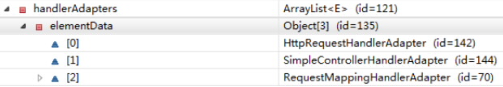

## Spring MVC概述

- Spring为展现层提供的基于MVC设计理念的优秀Web框架，是目前最流行的MVC框架之一。

- Spring3.0后全面超越Struts2，成为最优秀的MVC框架。

- Spring MVC通过一套MVC注解，让POJO类成为处理请求的控制器，而无需实现任何接口。
- 支持REST风格的URL请求。
- 采用了松散耦合可拔插组件结构，比其他MVC框架更具拓展性和灵活性。

## Hello World初现

- 步骤一：加入jar包

  commons-logging、spring-aop、spring-beans、spring-context、spring-core、

  spring-expression、spring-web、spring-webmvc

- 步骤二：配置web.xml文件

  配置DispatcherServlet：DispatcherServlet默认加载WEB-INF/{ServletName}-servlet.xml的配置文件启动Web层的spring容器；可以通过contextConfigLocation初始化参数自定义配置文件的位置和名称。

  ```xml
  <servlet>
    <servlet-name>dispatcherServlet</servlet-name>
    <!--不初始化contextConfigLocation参数，则会默认读取WEB-INF/dispacherServlet-servlet.xml初始化spring容器-->
    <servlet-class>org.springframework.web.servlet.DispatcherServlet</servlet-class>
    <init-param>
      <param-name>contextConfigLocation</param-name>
      <param-value>classpath:spring-mvc.xml</param-value>
    </init-param>
    <load-on-startup>1</load-on-startup>
  </servlet>
  
  <servlet-mapping>
    <servlet-name>dispatcherServlet</servlet-name>
    <url-pattern>/</url-pattern>
  </servlet-mapping>
  ```

- 步骤三：创建Spring配置文件

  - 配置自动扫包

    ```xml
    <context:component-scan base-package="com.atguigu.springmvc"></context:component-scan>
    ```

  - 配置视图解析器：将视图逻辑名解析为/{viewName}.jsp

    ```xml
    <bean class="org.springframework.web.servlet.view.InternalResourceViewResolver">
      <property name="prefix" value="/"></property>
      <property name="suffix" value=".jsp"></property>
    </bean>
    ```

- 步骤四：创建请求处理器类

  ```java
  @Controller
  public class HelloWorldController{
    @RequestMapping(value="/helloWorld")
  	public String helloWorld(){
      return "helloWorld";
    }
  }
  ```

- 步骤五：启动SpringMVC，页面访问http://localhost:8080/helloWorld

## 注解

### 请求地址

Spring MVC使用@RequestMapping注解为控制器指定可以处理哪些URL请求,可以使用在类上和方法上

#### 普通请求

```java
@RequestMapping(value = "testParamsAndHeaders", 
                params = {"username","age!=10"}, 
                headers = {"Accept-Language=en-US,zh;q=0.8"},
                method = RequestMethod.GET)
public String testParamsAndHeaders() {
  System.out.println("testParamsAndHeaders");
  return SUCCESS;
}
```

- value：指定请求地址

- params：指定请求参数

  – param1:表示请求必须包含名为param1的参数

  – !param1:表示请求中不能包含名param1的参数

  – param1!=value1:表示请求中名为param1的参数值不能为 value1

  – {“param1=value1”,“param2”}:表示请求中param1参数值必须为value1,并且还要包含param2参数

- headers：指定请求头，格式与params注解格式类似

- method：指定请求方式

#### Ant风格请求

- Ant风格请求支持3种匹配符：
  - ?：匹配文件名中的一个字符
  - *：匹配文件名中的任意字符
  - **：匹配0+路径
- @RequestMapping中支持风格
  - /user/*/createUser：匹配/user/aaa/createUser、/user/bbb/createUser等
  - /user/**/createUser：匹配/user/createUser、/user/aaa/bbb/createUser等
  - /user/createUser??：匹配/user/createUseraa、/user/createUserbb等

#### REST风格请求

- 定义：Rest即Representational State Transfer(表现层状态转化)。是目前流行的一种互联网软件架构。

  - 资源(Resource)：网络上的一个实体，或者说网络上的一个具体信息。可以是一段文本，一张图片，一种服务等，可以用一个URL(统一资源定位符)指向它，每种资源对应一个特定的url。
  - 表现层(Representation)：把资源具体呈现出来的形式，叫做资源的表现层。比如文本可以使用txt格式表现，也可以使用HTML、XML、JSON格式表现，甚至可以使用二进制格式。
  - 状态转化(State Transfer)：每发出一个请求就代表了客户端和服务端的一次交互过程。http协议是无状态协议，所有状态都保存在服务器端，因此如果客户端想要操作服务器，必须通过某种手段让服务器端发生"状态转化"，具体说就是http协议里的四种操作方式转化成四种操作：GET、POST、PUT(更新)、DELETE

- 特点：结构清晰，符合标准，易于理解，拓展方便。

- 示例：

  - /user/1	HTTP	GET：得到id为1的user
  - /user/1	HTTP	DELETE：删除id为1的user
  - /user/1	HTTP	PUT：更新id为1的user
  - /user  	  HTTP	POST：新增user

- 使用

  - 在web.xml文件中配置HiddenHttpMethodFilter过滤器

    浏览器form表单只支持GET和POST请求，而DELETE和PUT等method并不支持，Spring3.0添加了一个过滤器，将这些请求转化成标准的http请求，使的服务端支持DELETE、PUT等请求。

    ```xml
    <!--配置 org.springframework.web.filter.HiddenHttpMethodFilter: 可以把 POST 请求转为 DELETE 或 POST 请求-->
    <filter>
      <filter-name>HiddenHttpMethodFilter</filter-name>
      <filter-class>org.springframework.web.filter.HiddenHttpMethodFilter</filter-class>
    </filter>
    
    <filter-mapping>
      <filter-name>HiddenHttpMethodFilter</filter-name>
      <url-pattern>/*</url-pattern>
    </filter-mapping>
    ```

  - 在静态页面中配置：请求方式必须是post，隐藏标签的name必须是_method

    ```html
    <form action="springmvc/testRest/1" method="post">
      <input type="hidden" name="_method" value="DELETE"/>
      <input type="submit" value="TestRest DELETE"/>
    </form>
    ```

### 请求参数 && 请求头

- @PathVariable：REST请求风格URL中参数

  ```java
  @RequestMapping("/testPathVariable/{id}")
  public String testPathVariable(@PathVariable("id") Integer id) {
    System.out.println("testPathVariable: " + id);
    return SUCCESS;
  }
  ```

- @RequestParam：request对象中的参数

  ```java
  @RequestMapping(value = "/testRequestParam")
  public String testRequestParam(
    @RequestParam(value = "username") String un,
    @RequestParam(value = "age", required = false, defaultValue = "0") int age) {
    
    System.out.println("testRequestParam, username: " + un + ", age: "+ age);
    return SUCCESS;
  }
  ```

- @RequestHeader

  ```java
  @RequestMapping("/testRequestHeader")
  public String testRequestHeader(
    @RequestHeader(value = "Accept-Language") String al) {
    System.out.println("testRequestHeader, Accept-Language: " + al);
    return SUCCESS;
  }
  ```

- @CookieValue

  ```java
  @RequestMapping("/testCookieValue")
  public String testCookieValue(@CookieValue("JSESSIONID") String sessionId) {
    System.out.println("testCookieValue: sessionId: " + sessionId);
    return SUCCESS;
  }
  ```

- POJO对象参数：Spring MVC 会按参数名和 POJO属性名自动匹配，自动为该对象填充属性值

  支持级联属性：如User类中的Address类型属性address，request请求中有address.city参数，会与Address类的city属性对应。

  ```java
  @RequestMapping("/testPojo")
  public String testPojo(User user) {
    System.out.println("testPojo: " + user);
    return SUCCESS;
  }
  ```

- Servlet API参数

  支持：HttpServletRequest、HttpServletResponse、HttpSession、java.security.Principal、Locale、InputStream、OutputStream、Reader、Writer

### 模型数据处理

- Spring MVC提供了以下几种途径输出模型数据

  - ModelAndView：处理方法返回数据类型为ModelAndView时，方法体即可通过该对象添加模型数据。
  - Map 及 􏲡Model 及 ModelMap：入参为：org.springframework.ui.Model、org.springframework.ui. ModelMap或java.uti.Map时，处理方法返回时，Map、Model、ModelMap中的数据会自动添加到模型中。
  - @SessionAttributes：将模型中的某个属性暂存到HttpSession中，以便多个请求之间可以共享这个属性。
  - @ModelAttribute：方法入参标注该注解后，入参的对象就会方法数据模型中。

- ModelView：包含视图信息，也包含模型数据，如：

  ```java
  @RequestMapping("/testModelAndView")
  public ModelAndView testModelAndView() {
    String viewName = "success";
    ModelAndView modelAndView = new ModelAndView(viewName);
    //添加模型数据到 ModelAndView 中.
    modelAndView.addObject("time", new Date());
    return modelAndView;
  }
  ```

- Map 及 􏲡Model 及 ModelMap，如：

  

  ```java
  @RequestMapping("/testMap")
  public String testMap(Map<String, Object> map) {
    System.out.println(map.getClass().getName());
    map.put("names", Arrays.asList("Tom", "Jerry", "Mike"));
    return SUCCESS;
  }
  ```

- @SessionAttributes：将数据方式HttpSession中，可以通过属性名指定需要放到会话中的属性，也可以通过模型属性的对象类型指定需要放到会话中的模型数据，如：

  ```java
  @SessionAttributes(value = {"user"}, types = {String.class})
  public class Test{
    @RequestMapping("/testSessionAttributes")
    public String testSessionAttributes(Map<String, Object> map) {
      User user = new User("Tom", "123456", "tom@atguigu.com", 15);
      map.put("user", user);
      map.put("school", "atguigu");
      return SUCCESS;
    }
  }
  ```

- @ModelAttribute

  - 在方法上使用该注解，Spring MVC在执行方法之前会逐个调用有该注解修饰的方法。
  - 在方法的入参上使用该注解
    - 可以从隐含对象中获取隐含模型数据中获取对象，再将参数参数绑定到对象中，在注入方法的入参。
    - 将方法入参对象添加到模型中。

  ```java
   /**
       * 1. 有 @ModelAttribute 标记的方法, 会在每个目标方法执行之前被 SpringMVC 调用!
       * 2. @ModelAttribute 注解也可以来修饰目标方法 POJO 类型的入参, 其 value 属性值有如下的作用:
       * 1). SpringMVC 会使用 value 属性值在 implicitModel 中查找对应的对象, 若存在则会直接传入到目标方法的入参中.
       * 2). SpringMVC 会一 value 为 key, POJO 类型的对象为 value, 存入到 request 中.
       */
  @ModelAttribute
  public void getUser(@RequestParam(value = "id", required = false) Integer id,
                      Map<String, Object> map) {
    System.out.println("modelAttribute method");
    if (id != null) {
      //模拟从数据库中获取对象
      User user = new User(1, "Tom", "123456", "tom@atguigu.com", 12);
      System.out.println("从数据库中获取一个对象: " + user);
  
      map.put("user", user);
    }
  }
  
  /* 运行流程:
  		1. 执行 @ModelAttribute 注解修饰的方法: 从数据库中取出对象, 把对象放入到了 Map 中. 键为: user
  		2. SpringMVC 从 Map 中取出 User 对象, 并把表单的请求参数赋给该 User 对象的对应属性.
  		3. SpringMVC 把上述对象传入目标方法的参数.
  		注意: 在 @ModelAttribute 修饰的方法中, 放入到 Map 时的键需要和目标方法入参类型的第一个字母小写的字符串一致!*/
  
  @RequestMapping("/testModelAttribute")
  public String testModelAttribute(User user) {
    System.out.println("修改: " + user);
    return SUCCESS;
  }
  ```

**注意**：由@SessionAttributes注解引发的异常

```java
org.springframework.web.HttpSessionRequiredException:Session attribute 'user' required - not found in session
```

原因：在入参中使用@ModelAttribute("user")标注后，如果该处理类也使用了@SessionAttributes("user")标注，那么在调用该方法时，会先从模型数据中查找是否有user，如果没有然后尝试从session中找，但是session标注了user，再查找时又没有user就会报错，如果这时处理类没有用@SessionAttributes("user")标注，则会通过反射创建一个user对象，注入入参。

避免：可以@ModelAttribute标注在一个方法上，产生一个user对象，放入模型对象中。

## 视图 && 视图解析器

### SpringMVC解析视图方式


1. 请求处理方法完成后，无论返回结果是String、View或ModelMap等类型的数据，Spring也会在内部将他们装配成一个ModelAndView对象，它包含了逻辑名和模型对象的视图。最终会返回ModelAndView对象。
2. Spring MVC借助视图解析器(ViewResolver)得到最终的视图对象(View)，最终的视图可能是JSP，也可能是Excel、JFreeChart等各种表现形式的视图。
3. 对于最终采取何种视图对象对模型数据进行渲染，处理器并不关心，处理器工作重点聚焦在生产模型数据的工作上，从而实现MVC的重复解耦。

### 视图

- 视图的作用是渲染模型数据，将模型里的数据以某种形式呈现给客户。

- 为了实现视图模型和具体实现技术的解耦，Spring 在org.springframework.web.servlet包中定义了一个高度抽象的View接口。

- 视图对象由视图解析器负责实例化。由于视图是无状态的，所有不会有线程安全问题。

- 常用视图实现类

  <table>
  	<tr>
  	    <th>大类</th>
  	    <th>视图类型</th>
  	    <th>说明</th>  
  	</tr >
  	<tr >
  	    <td rowspan="2">URL视图资源</td>
  	    <td>InternalResourceView</td>
  	    <td>将JSP或其他资源封装成一个视图，是InternationResourceViewResolver默认使用的实现类</td>
  	</tr>
  	<tr>
  	    <td>JstlView</td>
  	    <td>如果jsp中使用了JSTL国际化标签的功能则需要使用该视图类</td>
  	</tr>
  	<tr>
      	<td rowspan="2">文档视图</td>
  	    <td>AbstractExcelView</td>
  	    <td>Excel文档视图的抽象类，该视图类基于POI构造Excel文档</td>
  	</tr>
  	<tr>
        <td>AbstractPdfView</td>
  	    <td>PDF文档视图的抽象类，该视图类基于iText够着PDF文档</td>
  	</tr>
  	<tr>
      	<td rowspan="6">报表视图</td>
  	    <td>ConfigurableJasperReportsView</td>
  	    <td rowspan="6">使用JasperReports报表视图</td>
  	</tr>
  	<tr>
  	    <td>JasperReportsCsvView</td>
  	</tr>
  	<tr>
  	    <td>JasperReportsMultiFormatView</td>
  	</tr>
  	<tr>
  	    <td >JasperReportsHtmlView</td>
  	</tr>
  	<tr>
  	    <td>JasperReportsPdfView</td>
  	</tr>
    <tr>
  	    <td>JasperReportsXlsView</td>
  	</tr>
  	<tr>
  	    <td >JSON视图</td>
  	    <td >MappingJaksonJsonView</td>
  	    <td >将模型数据通过Jakson开源框架的ObjectMapper以JSON方式输出</td>
  	</tr>
  </table>

### 视图解析器

- Spring MVC为逻辑视图名的解析提供了不同的策略，可以在Spring Web上下文中配置一种或多种解析策略，并指定他们之间的先后顺序，每一种策略对应一个具体的视图解析器实现类。

- 视图解析器的作用比较单一：将逻辑视图解析为一个具体 的视图对象。

- 所有的视图解析器都必须实现ViewResolver接口。

- 每个视图解析器都实现了Ordered接口并开放出一个order属性，可以通过order属性指定解析器的优先顺序，值越小优先级越高。

- Spring MVC按照优先顺序对逻辑视图名进行解析，知道解析成功并返回视图，否则抛出ServletException异常。

- 常用视图解析器实现类

  <table>
  	<tr>
  	    <th>大类</th>
  	    <th>视图类型</th>
  	    <th>说明</th>  
  	</tr >
  	<tr >
  	    <td>解析为Bean的名称</td>
  	    <td>BeanNameViewResolver</td>
  	    <td>将逻辑视图名解析为一个bean，bean的id等于逻辑视图名称，常用与自定义视图解析器。</td>
  	</tr>
  	<tr>
      	<td rowspan="2">解析为URL文件</td>
  	    <td>InternalResourceViewResolver</td>
  	    <td>将视图名解析为一个URL文件，一般使用该解析器将视图名映射为一个保存在webapp目录下的程序文件(如jsp)</td>
  	</tr>
  	<tr>
        <td>JasperReportsViewResolver</td>
  	    <td>JasperReports是一个基于java的开源报表工具，该解析器将视图名解析为报表文件对应的url</td>
  	</tr>
  	<tr>
      	<td>模板文件视图</td>
  	    <td>FreeMarkerViewResolver</td>
  	    <td>解析为基于FreeMarker模板技术的模板文件</td>
  	</tr>
  </table>

- 国际化：InternalResourceViewResolver

  - 若项目中使用了JSTL标签，SpringMVC会自动把视图InternalResourceView转为JstlView

  - 如果使用Jstl的fmt标签，则需要在SpringMVC的配置文件中配置国际化资源文件，如：

    1. 在src目录下增加i18n.properties、i18n_zh_CN.properties、i18n_en_US.properties国际化资源文件

    2. 配置文件名称

       ```xml
       <bean id="messageSource"
             class="org.springframework.context.support.ResourceBundleMessageSource">
         <property name="basename" value="i18n"></property>	
       </bean>
       ```

- 直接响应通过Spring MVC渲染的页面，而不经过Controller，需要在SpringMVC的配置文件中指定，如：

  ```xml
  <mvc:view-controller path="/success" view-name="success"/>
  ```

- Excel视图

  - 若希望使用excel展示数据列表，仅需要实现SpringMVC提供的AbstractExcelView或AbstractJExcelView接口，并实现buildExcelDocument()方法，在方法中使用模型数据对象构建Excel文档就行。

  - AbstractExcelView基于POI API，而AbstractJExcelView基于JExcel API的。

  - 由于是自定义视图解析器，所以需要在spring mvc的配置文件中使用BeanNameViewResolver作为视图解析器

    ```xml
    <bean class="org.springframework.web.servlet.view.BeanNameViewResolver">
      <property name="order" value="100"></property>
    </bean>
    ```

  - 若想在浏览器中直接下载excel文件，可以设置响应头Content-Disposition的值为：attachment;filename=xxx.xls

- 重定向

  - 返回字符串中带"forward："：就会处理成转发，不写默认是转发。
  - 返回字符串中带"redirect："：就会处理成重定向。

## RESTful CRUD

### 列表

- URI：/users
- 请求方式：GET

### 添加

- 显示添加页面
  - URI：/user
  - 请求方式：GET
  - 注意：如果使用Spring MVC的form标签，标签默认需要回显，那么需要在处理方法中存在一个空的数据对象
- 添加操作
  - URI：user
  - 请求方式：POST

### 删除

- URI：user/{id}

- 请求方式：DELETE

- 注意：

  - 在使用删除按钮的时候，url是一个超链接，请求方式为GET，那么需要将请求方式改为DELETE，处理方式新建一个form标签，然后通过JQuery将表单中的方式修改并提交。

    ```html
    <script type="text/javascript">
    	$(function(){
    		$(".delete").click(function(){
    			var href = $(this).attr("href");
    			$("form").attr("action", href).submit();			
    			return false;
    		});
    	})
    </script>
    
    <form action="" method="POST">
      <input type="hidden" name="_method" value="DELETE"/>
    </form>
    
    <td><a href="emp/${emp.id}">Edit</a></td>
    ```

  - 在引入静态资源时，SpringMVC会认为这是一个映射请求，处理这个问题需要在SpringMVC配置文件中加入配置，如：

    ```xml
    <!--  
    		default-servlet-handler 将在 SpringMVC 上下文中定义一个 DefaultServletHttpRequestHandler,
    		它会对进入 DispatcherServlet 的请求进行筛查, 如果发现是没有经过映射的请求, 就将该请求交由 WEB 应用服务器默认的 
    		Servlet 处理. 如果不是静态资源的请求，才由 DispatcherServlet 继续处理
    
    		一般 WEB 应用服务器默认的 Servlet 的名称都是 default.
    		若所使用的 WEB 服务器的默认 Servlet 名称不是 default，则需要通过 default-servlet-name 属性显式指定
    	-->
    <mvc:default-servlet-handler/>
    <mvc:annotation-driven></mvc:annotation-driven>
    ```

### 修改

- 显示修改页面
  - URI：user/{id}
  - 请求方式：GET
  - 注意：如果使用Spring MVC的form标签，标签默认需要回显，需要使用@ModelAttribute修改一个方法，用来将user放入模型数据中。
- 修改操作
  - URI：emp
  - 请求方式：PUT

## 表单标签

- 通过使用SpringMVC的表单标签可以实现将模型数据中的属性和html表单元素相绑定，以实现表单数据更便捷编辑和表单值的回显。

- 可以通过modelAttribute属性指定绑定的模型属性，若没有指定该属性，则默认从request域对象中读取command的表单bean，如果该属性不存在，则会报错。

- 表单组件标签
  - \<form:input>、\<form:select>
    - path属性：表单字段对应html的name属性，支持级联属性
    - htmlEscape属性：是否对表单值的HTML特殊字符进行转换，默认值为true
    - cssClass属性：表单组件对象的css样式类名
    - cssErrorClass属性：表单组件的数据存储错误时，采取的css样式
  - \<form:input>、\<form:password>、\<form:hidden>、\<form:textarea>:对应Html表单的text、password、hidden、textarea
  - \<form:radiobutton>：单选框组件标签，当表单bean的属性值和value值相等时，单选框被选中。
  - \<form:radiobuttons>：单选框组标签，用于构造多个单选框
    - items属性：可以是一个List、Map、或String[]
    - itemValue属性：指定redio的value值，可以是集合中bean的一个属性值
    - itemLabel属性：指定redio显示的值
    - delimiter属性：指定多个单选框之间的分隔符
  - \<form:checkbox>：复选框组件，用于构造单个复选框
  - \<form:checkboxs>：用于构造多个复选框，使用方式与radiobuttons标签相同
  - \<form:select>：用于构造下拉框组件，使用方式与radiobuttons标签相同
  - \<form:option>：下拉框选项组件标签，使用方式与radiobuttons标签相同
  - \<form:errors>：显示表单组件或数据校验所对应的错误
    - \<form:errors path=“*”/>：显示表单所有的错误
    - \<form:errors path=“user*”/>：显示所有以user为前缀的属性对应的错误
    - \<form:errors path=“username”/>：显示特定表单对象属性的错误
- 处理静态资源
  - 优雅的REST风格的资源url不希望带.html或.do后缀
  - 若将DispatcherServlet请求映射配置为/，Spring MVC将捕获WEB容器的所有请求，包括静态资源，会将他们认为是一个映射请求，因找不到对应的处理方法而报错。
  - 可以在配置文件中配置\<mvc:default-servlet- handler />解决静态资源请求问题
    - \<mvc:default-servlet-handler/>将在Spring MVC上下文中定义一个DefaultServletHttpRequestHandler，它会对进入DispatcherServlet的请求进行筛选，没有映射的请求(当做静态资源)，就交由默认的Servlet处理，否则交由DispatcherServlet处理
    - 一般WEB容器默认的Servlet名称是default。若使用的WEB容器默认Servlet名称不是default，需要通过default- servlet-name属性指定。

## 数据处理

### 数据转换

#### 数据绑定流程

- SpringMVC通过反射机制对目标处理方法进行解析，将请求消息绑定到处理方法的入参中，然后通过ConversionService完成数据的类型转换，然后通过Vlidator验证器验证数据格式，使用BindingResult存储错误信息。数据绑定的核心部件是DataBinder，运行机制如下：

  

- 数据转换：SpringMVC上下文中内建了很多转换器，可完成大多数Java数据类型的转换工作

- ConversionService converters =
  - –  java.lang.Boolean -> java.lang.String :org.springframework.core.convert.support.ObjectToStringConverter@f874ca
  - –  java.lang.Character -> java.lang.Number : CharacterToNumberFactory@f004c9
  - –  java.util.UUID -> java.lang.String : ObjectToStringConverter@112b07f ......

#### 自定义转换器

- ConversionService是Spring类型转换体系的核心接口，可以利用ConversionServiceFactoryBean在spring 的IOC容器中定义一个ConversionService，Spring将自动识别出IOC容器中的ConversionService，并在Bean属性配置及SpringMVC处理方法入参绑定等场景使用它进行数据的准换。

- 可以通过ConversionServiceFactoryBean的converters属性注册自定义类型转换器。

- Spring支持的转换器：Spring定义了3种类型的转换器接口，实现任意一个转换器接口都可以作为自定义转换器注册到ConversionServiceFactoryBean中：

  - Converter<S,T>：将S类型对象转换为T类型对象。

  - ConverterFactory：将相同系列多个"同质"Converter封装在一起，例如都是要将String转换成枚举(枚举的子类)，如：

    ```java
    final class StringToEnumConverterFactory implements ConverterFactory<String, Enum> {  
    
      public <T extends Enum> Converter<String, T> getConverter(Class<T> targetType) {  
        return new StringToEnum(targetType);  
      }  
    
      private class StringToEnum<T extends Enum> implements Converter<String, T> {  
    
        private final Class<T> enumType;  
    
        public StringToEnum(Class<T> enumType) {  
          this.enumType = enumType;  
        }  
    
        public T convert(String source) {  
          if (source.length() == 0) {  
            // It's an empty enum identifier: reset the enum value to null.  
            return null;  
          }  
          return (T) Enum.valueOf(this.enumType, source.trim());  
        }  
      }  
    
    }  
    ```

  - GenericConverter：支持在多个不同的原类型和目标类型之间进行转换。

- 自定义转换器示例

  - 创建一个类实现Converter<S,T>接口，重写方法，使用@Component注解交个Spring管理，如将String类型转换为Employee类型：

    ```java
    @Component
    public class EmployeeConverter implements Converter<String, Employee> {
    
    	@Override
    	public Employee convert(String source) {
    		if(source != null){
    			String [] vals = source.split("-");
    			//GG-gg@atguigu.com-0-105
    			if(vals != null && vals.length == 4){
    				String lastName = vals[0];
    				String email = vals[1];
    				Integer gender = Integer.parseInt(vals[2]);
    				Department department = new Department();
    				department.setId(Integer.parseInt(vals[3]));
    				
    				Employee employee = new Employee(null, lastName, email, gender, department);
    				System.out.println(source + "--convert--" + employee);
    				return employee;
    			}
    		}
    		return null;
    	}
    }
    ```

  - 配置到SpringMVC的配置文件中，如：

    ```xml
    <mvc:annotation-driven conversion-service="conversionService"></mvc:annotation-driven>	
    
    <!-- 配置 ConversionService，
    	如果使用ConversionServiceFactoryBean，那么就不会使用springMvc默认的格式化，
    	推荐使用 FormattingConversionServiceFactoryBean
    -->
    <bean id="conversionService"
       class="org.springframework.format.support.FormattingConversionServiceFactoryBean">
      <property name="converters">
        <set>
          <ref bean="employeeConverter"/>
        </set>
      </property>	
    </bean>
    ```

#### annotation-driven

- 会自动注册：RequestMappingHandlerMapping、RequestMappingHandlerAdapter、ExceptionHandlerExceptionResolver

- 提供一下支持：

  - 支持使用ConversionService实例对表单参数进行类型转化。
  - 支持使用@NumberFormat、@DateTimeFormat注解，完成数据类型的格式化
  - 支持使用@Valid注解对JavaBean实例进行JSR303验证
  - 支持使用@RequestBody、@ResponseBody注解。

- 分析：

  - 􏴇􏲭􏰪􏲃􏳑没有配置\<mvc:default-servlet-handler/>和\<mvc:annotation-driven/>

    

  - 配置了\<mvc:default-servlet-handler/>，没有配置\<mvc:annotation-driven/>

    

  - 配置了没有配置\<mvc:default-servlet-handler/>和\<mvc:annotation-driven/>

    

#### InitBinder

- 有该注解标识的方法，可以对WebDataBinder对象进行初始化。WebDataBinder是DataBinder的子类，用于完成表单字段到JavaBean属性的绑定。

- 有该注解标识的方法，不能有返回值，返回类型必须是void

- 有该注解标识的方法，方法参数通常是WebDataBinder，如：

  ```java
  @InitBinder
  public void initBinder(WebDataBinder binder){
    //不自动绑定对象中的的username属性
    binder.setDisallowedFields("username");
  }
  ```

### 数据格式化

- 对属性对象的输入/输出进行格式化，从本质上依然属于类型转换。

- Spring在格式化模块中定义了一个实现ConversionService接口的FormattingConversionService实现类，该实现类扩展了GenericConversionService，因此它既具有类型转换功能，有具有格式化功能。

- FormattingConversionService拥有一个FormattingConversionServiceFactoryBean工厂类，用于在spring上下文中构造前者。

- FormattingConversionServiceFactoryBean内部已经注册了：

  - NumberFormatAnnotationFormatterFactroy：支持对数字类型的属性使用@NumberFormat注解。
  - JodaDateTimeFormatAnnotationFormatterFactroy：支持对日期类型的属性使用@DateTimeFormat注解

- 装配了FormattingConversionServiceFactoryBean后，就可以在SpringMVC入参绑定及模型数据输出时使用注解驱动了。

  \<mvc:annotation -driven/>默认创建的ConversionService实例既为FormattingConversionServiceFactoryBean

- 日期格式化：@DateTimeFormat

  - 可以对java.util.Date、java.util.Calendar、java.long.Long时间类型进行标注
  - 属性：
    - pattern属性：指定解析/格式化字段数据的格式，如：”yyyy -MM-dd hh:mm:ss ”
    - iso属性：指定解析/格式化字段数据的模式，包括四种：
      - ISO.NONE(不使用，默认值)、
      - ISO.DATE(yyyy-MM-dd)、
      - ISO.TIME(hh:mm:ss.SSSZ)、
      - ISO.DATE_TIME(yyyy-MM-dd hh:mm:ss.SSSZ)
    - style属性：通过样式指定日期时间的格式，由两位字符组成，第一位表示日期的格式，第二位表示时间的格式：S：短日期/时间格式、M：中日期/时间格式、L：长日期/时间格式、F：完整日期/时间格式、-：忽略日期或时间格式

- 数值格式化：@NumberFormat

  - 可对数字类型的属性进行标注，拥有两个互斥的属性
  - style属性：类型为NumberFormat.Style，用于指定样式类型，包括三种：
    - Style.NUMBER(正常数字类型)、
    - Style.CURRENCY(货币类型)、
    - Style.PERCENT(百分数类型)
  - pattern类型：类型为String，自定义样式，如：pattern="#,###"

### 数据校验

- JSR 303是java为bean数据合法性校验提供的标准框架，已经包含着JAVAEE6.0中。通过在属性上标注@NotNull、@Max等注解指定校验规则，并通过标准的验证接口对bean进行验证，提供以下注解：

  | **Constraint**                | **详细信息**                                             |
  | :---------------------------- | :------------------------------------------------------- |
  | `@Null`                       | 被注释的元素必须为 `null`                                |
  | `@NotNull`                    | 被注释的元素必须不为 `null`                              |
  | `@AssertTrue`                 | 被注释的元素必须为 `true`                                |
  | `@AssertFalse`                | 被注释的元素必须为 `false`                               |
  | `@Min(value)`                 | 被注释的元素必须是一个数字，其值必须大于等于指定的最小值 |
  | `@Max(value)`                 | 被注释的元素必须是一个数字，其值必须小于等于指定的最大值 |
  | `@DecimalMin(value)`          | 被注释的元素必须是一个数字，其值必须大于等于指定的最小值 |
  | `@DecimalMax(value)`          | 被注释的元素必须是一个数字，其值必须小于等于指定的最大值 |
  | `@Size(max, min)`             | 被注释的元素的大小必须在指定的范围内                     |
  | `@Digits (integer, fraction)` | 被注释的元素必须是一个数字，其值必须在可接受的范围内     |
  | `@Past`                       | 被注释的元素必须是一个过去的日期                         |
  | `@Future`                     | 被注释的元素必须是一个将来的日期                         |
  | `@Pattern(value)`             | 被注释的元素必须符合指定的正则表达式                     |

- Hibernate Validator是JSR303的一个参考实现，除了所有的标准注解外，还附加一下注解：

  | `@Email`    | 被注释的元素必须是电子邮箱地址         |
  | ----------- | -------------------------------------- |
  | `@Length`   | 被注释的字符串的大小必须在指定的范围内 |
  | `@NotEmpty` | 被注释的字符串的必须非空               |
  | `@Range`    | 被注释的元素必须在合适的范围内         |

- Spring MVC数据校验

  - \<mvc:annotation -driven/>配置会默认装配好一个LocalValidatorFactoryBean，通过在处理方法入参上标注@Valid注解，即可让SpringMVC在完成数据绑定后执行数据校验工作。

  - Spring 的LocalValidatorFactoryBean即实现了Spring的Validator接口，也实现了JSR303的Validator，但Spring本身并没有提供JSR303的实现，所以必须将JSR303的实现者的jar包导入项目，如：Hibernate Validator

  - Spring MVC是通过对处理方法签名的规约来保存校验结果的：前一个表单/命令对象的校验结果保存到随后的入参中，这个入参必须是org.springframework.validation包中的BindingResult或Errors类型，校验对象与校验结果之间不能有其他入参，如：

    ```java
    @RequestMapping("/testBindingResultAndErrors")
    public String testBindingResultAndErrors(@Valid User user, BindingResult userBindingResult, 
                                             @Valid Dept dept, Errors deptErrors)
    {
      if (userBindingResult.getErrorCount()>0){
        for (FieldError error:userBindingResult.getFieldErrors()){
          System.out.println(error.getField()+":"+error.getDefaultMessage());
        }
      }
      return "error";
    }
    ```

  - 常用方法：

    - FieldError getFieldError (String field)
    - List< FieldError > getFieldErrors ()
    - Object getFieldValue (String field)
    - Int getErrorCount ()

- 提示消息的国际化

  - 每个属性在数据绑定和数据校验发生错误时，都会生成一个FieldError对象。

  - 当一个属性校验失败，校验框架会为该属性生成4个消息代码，如User类中的password属性标注了@Pattern注解，当值不满足@Pattern所定义的规则时，会产生以下错误代码：

    - Pattern.user.password
    - Pattern.password
    - Pattern.java.lang.String
    - Pattern

  - 当Spring MVC验证数据有错误时，SpringMVC会查看WEB上下文是否配置了对应的国际化消息，如果有就显示当前系统语言的错误信息。

  - 若类型转换、数据格式转换、参数不存在或调用处理方法时发生错误，都会在隐含模型中创建错误消息，错误代码前缀说明：

    - required：必须的参数不存在􏱤，如：@RequiredParam(“param1”)注解默认param1参数是必须的，如果没有会产生required.param1错误
    - typeMismatch：在数据绑定时，数据类型不匹配问题。
    - methodInvocation：SpringMVC在调用处理方法时发生了错误。

  - 配置国际化文件名称

    ```xml
    <bean id="messageSource"
          class="org.springframework.context.support.ResourceBundleMessageSource">
      <property name="basename" value="i18n"></property>
    </bean>
    ```

### 处理JSON

- 返回JSON数据

  - 加入jackson的jar包
  - 处理方法在处理方法上面加@ResponseBody注解，并且处理方法返回集合类型数据。

- HttpMessageConverter\<T>

  - 是Spring3.0新添加的一个接口，负责将请求信息转换为一个对象(类型为T)，将对象输入为响应信息。

  - 定义的方法：

    - Boolean canRead(Class<?> clazz,MediaType mediaType)：指定转换器可以读取的对象类型，既转换器是否将请求信息转换为clazz类型的对象，同时指定支持MIME类型(text/html,application/json等)
  - Boolean canWrite(Class<?> clazz,MediaType mediaType)：指定转换器是否可以将clazz类型的对象写到响应流中，响应流支持的类型在MediaType中定义。
    
    - LIst\<MediaType> getSupportMediaTypes()􏰄：该转换器致辞的媒体类型
  - T read(Class<? extends T> clazz, HttpInputMessage inputMessage)：将请求信息流转换为T类型对象
  
  - void write(T t, @Nullable MediaType contentType, HttpOutputMessage outputMessage)：将T类型对象写到响应流中，同时指定响应的媒体类型为contentType。
  
  - 流程：

    

  - 实现类

    

  - DispatcherServlet默认装配RequestMappingHandlerAdapter，而RequestMappingHandlerAdapter默认装配如下HttpMessageConverter：

    

    加入jackson 的jar包后，RequestMappingHandlerAdapter装配的HttpMessageConverter中多了一个MappingJackson2HttpMessageConverter：

    

  - 使用

    - 使用HttpMessageConverter\<T>将请求信息或响应结果转化为对应类型的入参或响应信息，提供2种途径
  
    - @RequestBody / @ResponseBody：对处理方法进行标注
  
- HttpEntity \<T> / ResponseEntity \<T> ：作为处理方法的入参或返回值
  
- 当处理方法使用到@RequestBody / @ResponseBody或HttpEntity \<T> / ResponseEntity \<T>时，Spring首先根据请求头或响应头的Accept属性选择匹配的HttpMessageConverter，进而根据参数类型或泛型类型的过滤得到相应的HttpMessageConverter，若找不到匹配的HttpMessageConverter将报错。
  
- @RequestBody􏰳、@ResponseBody示例：
  
  
  
  - HttpEntity􏰳、ResponseEntity示例：
    
      

## 国际化

### 概述

- 默认情况下，SpringMVC根据Accept-Language参数判断客户端的本地化类型。
- 当接收到请求时，SpringMVC会在上下文中查找一个本地化解析器(LocalResolver)，找到后使用它获取请求所对应的本地化类型信息
- SpringMVC还允许装配一个动态更改本地化类型的拦截器，通过指定一个请求参数控制单个请求的本地化类型。

### 本地化解析器和拦截器

- AcceptHeaderLocaleResolver：根据HTTP请求头的Accept-Language参数确定本地化类型，如果没有配置本地化解析器，SpringMVC默认使用该解析器。
- CookieLocaleResolver：根据指定的Cookie值确定本地化类型。
- SessionLocaleResolver：根据session中特定的属性确定本地化类型。
- LocaleChangeInterceptor：从请求参数中获取本次请求对应的本地化类型。

### 工作原理

SessionLocaleResolver&LocaleChangeInterceptor


### 示例

页面添加一个按钮，作用切换中英文，按钮URL中带参数locale，值为zh_CH或en_US，后面页面的语言都变化。

- 在src目录下加入国际化配置文件：i18n_en_US.properties、i18n_zh_CN.properties、i18n.properties

- 在SpringMVC配置文件中配置

  ```xml
  <bean id="messageSource"
        class="org.springframework.context.support.ResourceBundleMessageSource">
    <property name="basename" value="i18n"></property>
  </bean>
  <mvc:interceptors>
    <!-- 配置 LocaleChanceInterceptor -->
    <bean class="org.springframework.web.servlet.i18n.LocaleChangeInterceptor"></bean>
  </mvc:interceptors>
  ```

## 文件上传

- Spring MVC为文件上传提供了直接的支持，这种支持是通过既插既用的MultipartResolver实现的，Spring用commons-fileupload+commons-io 实现了MultipartResolver实现类：CommonsMultipartResolver

- SpringMVC 上下文中默认没有装配MultipartResolver，因此默认情况下不能处理文件的上传工作，如果想要使用Spring 的文件上传功能，需要在上下文中配置MultipartResolver。

- 配置MultipartResolver

  - 必须导入commons-fileupload+commons-io这两个包，并在SpringMVC上下文中加入如下配置：

    ```xml
    <bean id="multipartResolver"
          class="org.springframework.web.multipart.commons.CommonsMultipartResolver">
      <!--defaultEncoding属性必须与JSP文件中pageEncoding属性值一致-->
      <property name="defaultEncoding" value="UTF-8"></property>
      <property name="maxUploadSize" value="1024000"></property>	
    </bean>	
    ```

- 示例

  - jsp文件

    ```html
    <form action="${pageContext.request.contextPath }/testFileUpload" enctype="multipart/form-data">
      File:<input type="file" name="file"/>
      Desc:<input name="desc" type="text"/>
      <input type="submit" value="Submit"/>
    </form>
    ```

  - controller

    ```java
    @RequestMapping("/testFileUpload")
    public String testFileUpload(@RequestParam("desc") String desc, 
                                 @RequestParam("file") MultipartFile file) throws IOException{
      System.out.println("desc: " + desc);
      System.out.println("OriginalFilename: " + file.getOriginalFilename());
      System.out.println("InputStream: " + file.getInputStream());
      return "success";
    }
    ```

## 拦截器

- SpringMVC可以使用拦截器对请求进行拦截，用户可以自定义拦截器来实现特定的功能，自定义的拦截器必须实现HandlerInterceptor接口，接口中的方法：
  - preHandle()：该方法在控制器方法执行之前调用，如果还需要执行处理方法或者还要调用其他拦截器则需要返回true，否则返回fasle；
  - postHandle()：该方法在控制器方法执行之后，DispatcherServlet向客户端响应前被调用。
  - afterCompletion()：该方法在DispatcherServlet完成处理请求后被调用，可以在该方法中进行一些资源清理的操作。

- 拦截器方法执行流程：

  

- 配置自定义拦截器

  ```xml
  <mvc:interceptors>
    <!-- 配置自定义的拦截器 对所有路径生效-->
    <bean class="com.springmvc.interceptors.HelloInterceptor"></bean>
  
    <!-- 配置拦截器(不)作用的路径 -->
    <mvc:interceptor>
      <mvc:mapping path="/emps"/>
      <bean class="com.springmvc.interceptors.HelloInterceptor"></bean>
    </mvc:interceptor>
  </mvc:interceptors>
  ```

## 异常处理

SpringMVC通过HandlerExceptionResolver处理程序的异常，包括Controller映射、数据绑定以及目标目标方法执行时发生的异常。

- ExceptionHandlerExceptionResolver：主要处理Controller中用@ExceptionHandler标注的方法。

  - @ExceptionHandler注解有优先级问题：即查找最精确的那个错误类型。
  - ExceptionHandlerMethodResolver若找不到@ExceptionHandler注解，会找@ControllerAdvice注解标注内中的@ExceptionHandler注解标注的方法

- ResponseStatusExceptionResolver：主要处理使用@ResponseStatus注解，可以定义返回状态及描述

- DefaultHandlerExceptionResolver：对一些特定异常进行处理，具体可以看类源码。

- SimpleMappingExceptionResolver：可以将异常统一处理，并将异常类名映射为视图名，如：

  ```xml
  <!--将java.lang.ArithmeticException该错误映射到error页面-->
  <bean id="exceptionResolver" class="org.springframework.web.servlet.handler.SimpleMappingExceptionResolver">
    <property name="exceptionMappings">
      <props>
        <prop key="java.lang.ArithmeticException">error</prop>
      </props>
    </property>
  </bean>
  ```

## 运行流程


## 对比Struts2

- SpringMVC的入口是Servlet，而Struts2是Filter
- SpringMVC效率比Struts2高，SpringMVC是基于方法设计，而Struts2是基于类，每发一次请求都会实例化一个类。
- SpringMVC使用更加简洁，开发效率比Struts2高，支持JSR303等。
- Struts2的OGNL表达式使页面的开发效率相比SpringMVC要高。

