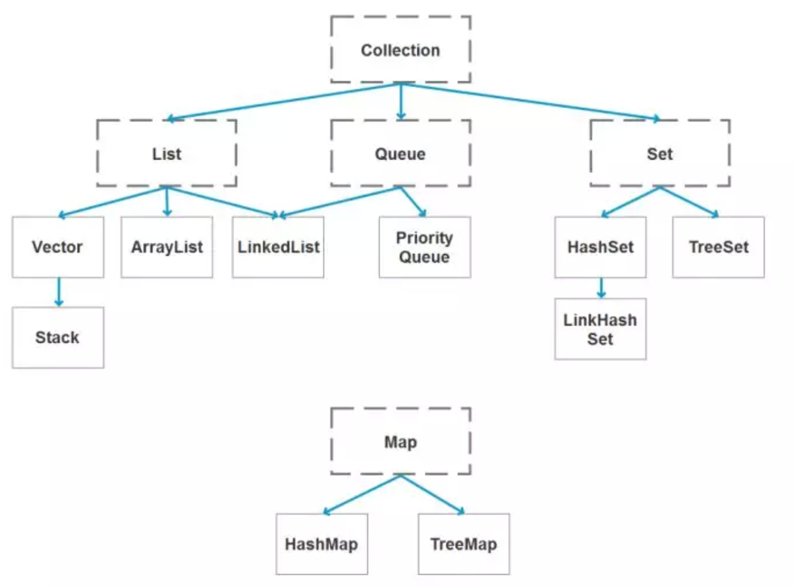
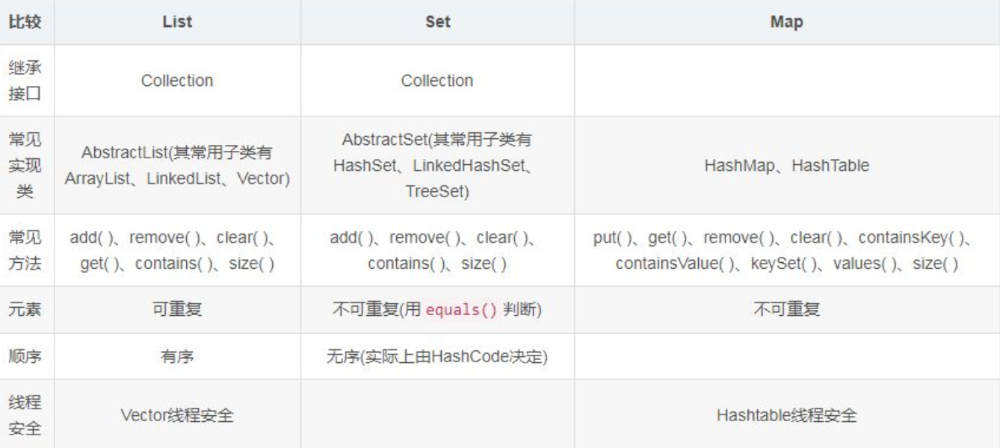
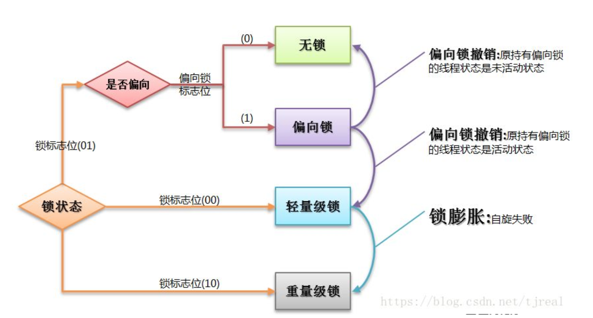
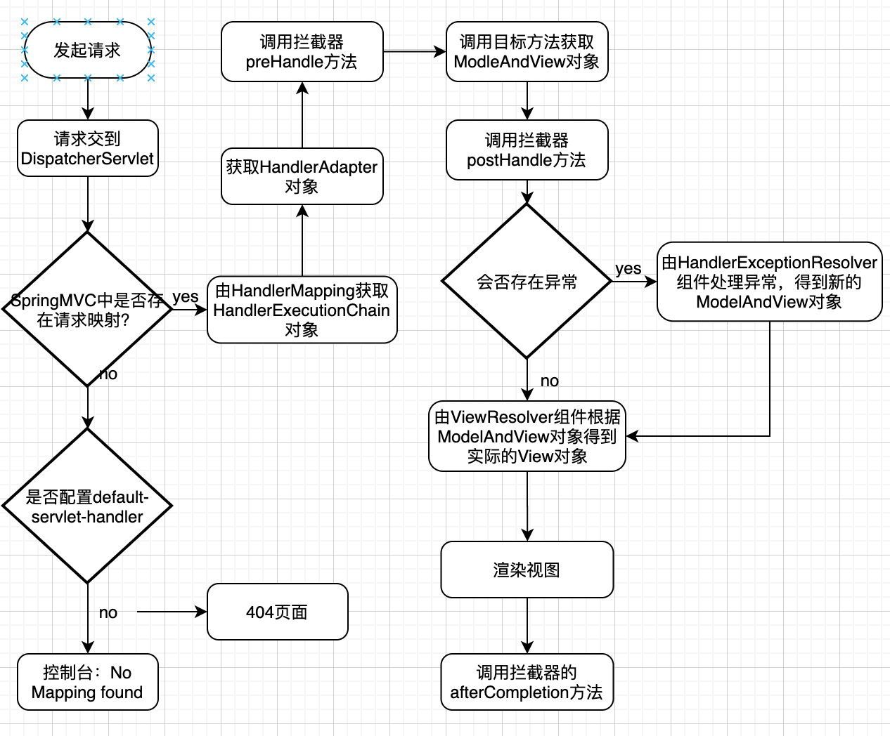
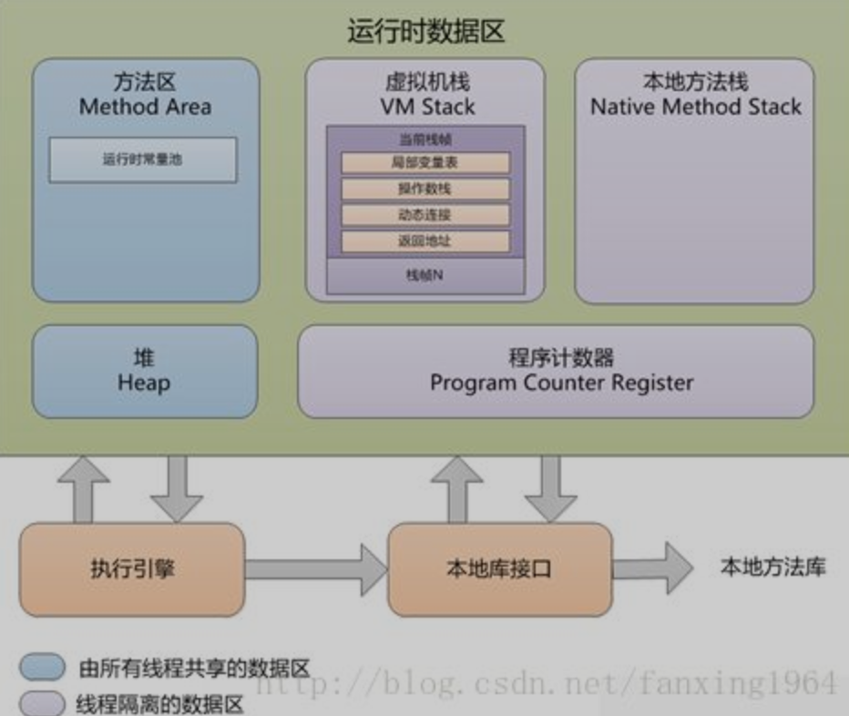

# JAVA基础

## 1. JDK 和 JRE 有什么区别？

- JDK：Java Development Kit 的简称，java 开发工具包，提供了 java 的开发环境和运行环境。
- JRE：Java Runtime Environment 的简称，java 运行环境，为 java 的运行提供了所需环境。

> 具体来说 JDK 其实包含了 JRE，同时还包含了编译 java 源码的编译器 javac，还包含了很多 java 程序调试和分析的工具。简单来说：如果你需要运行 java 程序，只需安装 JRE 就可以了，如果你需要编写 java 程序，需要安装 JDK。

## 2. == 和 equals 的区别是什么？

> == 对于基本类型来说是值比较，对于引用类型来说是比较的是引用；而 equals 默认情况下是引用比较，只是很多类重新了 equals 方法，比如 String、Integer 等把它变成了值比较，所以一般情况下 equals 比较的是值是否相等。

## 3. 两个对象的 hashCode()相同，则 equals()也一定为 true，对吗？

> 不对，两个对象的 hashCode()相同，equals()不一定 true。

## 4. final 在 java 中有什么作用？

- final 修饰的类叫最终类，该类不能被继承。
- final 修饰的方法不能被重写。
- final 修饰的变量叫常量，常量必须初始化，初始化之后值就不能被修改。

## 5. java 中的 Math.round(-1.5) 等于多少？

> 等于 -1，因为在数轴上取值时，中间值（0.5）向右取整，所以正 0.5 是往上取整，负 0.5 是直接舍弃。

## 6. String 属于基础的数据类型吗？

> String 不属于基础类型，基础类型有 8 种：byte、boolean、char、short、int、float、long、double，而 String 属于对象。

## 7. java 中操作字符串都有哪些类？它们之间有什么区别？

操作字符串的类有：String、StringBuffer、StringBuilder。

> String 和 StringBuffer、StringBuilder 的区别在于 String 声明的是不可变的对象，每次操作都会生成新的 String 对象，然后将指针指向新的 String 对象，而 StringBuffer、StringBuilder 可以在原有对象的基础上进行操作，所以在经常改变字符串内容的情况下最好不要使用 String。

> StringBuffer 和 StringBuilder 最大的区别在于，StringBuffer 是线程安全的，而 StringBuilder 是非线程安全的，但 StringBuilder 的性能却高于 StringBuffer，所以在单线程环境下推荐使用 StringBuilder，多线程环境下推荐使用 StringBuffer。

## 8. String str="i"与 String str=new String("i")一样吗？

> 不一样，因为内存的分配方式不一样。String str="i"的方式，java 虚拟机会将其分配到常量池中；而 String str=new String("i") 则会被分到堆内存中。

## 9. 如何将字符串反转？

> 使用 StringBuilder 或者 stringBuffer 的 reverse() 方法。

## 10. String 类的常用方法都有那些？

- indexOf()：返回指定字符的索引。
- charAt()：返回指定索引处的字符。
- replace()：字符串替换。
- trim()：去除字符串两端空白。
- split()：分割字符串，返回一个分割后的字符串数组。
- getBytes()：返回字符串的 byte 类型数组。
- length()：返回字符串长度。
- toLowerCase()：将字符串转成小写字母。
- toUpperCase()：将字符串转成大写字符。
- substring()：截取字符串。
- equals()：字符串比较。

## 11. 抽象类必须要有抽象方法吗？

不需要，抽象类不一定非要有抽象方法。

## 12. 普通类和抽象类有哪些区别？

- 普通类不能包含抽象方法，抽象类可以包含抽象方法。
- 抽象类不能直接实例化，普通类可以直接实例化。

## 13. 抽象类能使用 final 修饰吗？

> 不能，定义抽象类就是让其他类继承的，如果定义为 final 该类就不能被继承，这样彼此就会产生矛盾，所以 final 不能修饰抽象类

## 14. 接口和抽象类有什么区别？

- 实现：抽象类的子类使用 extends 来继承；接口必须使用 implements 来实现接口。
- 构造函数：抽象类可以有构造函数；接口不能有。
- main 方法：抽象类可以有 main 方法，并且我们能运行它；接口不能有 main 方法。
- 实现数量：类可以实现很多个接口；但是只能继承一个抽象类。
- 访问修饰符：接口中的方法默认使用 public 修饰；抽象类中的方法可以是任意访问修饰符。

## 15. java 中 IO 流分为几种？

- 按功能来分：输入流（input）、输出流（output）。

- 按类型来分：字节流和字符流。

## 16. BIO、NIO、AIO 有什么区别？

- BIO：Block IO 同步阻塞式 IO，就是我们平常使用的传统 IO，它的特点是模式简单使用方便，并发处理能力低。
- NIO：New IO 同步非阻塞 IO，是传统 IO 的升级，客户端和服务器端通过 Channel（通道）通讯，实现了多路复用。
- AIO：Asynchronous IO 是 NIO 的升级，也叫 NIO2，实现了异步非堵塞 IO ，异步 IO 的操作基于事件和回调机制。

## 17. Files的常用方法都有哪些？

- Files.exists()：检测文件路径是否存在。
- Files.createFile()：创建文件。
- Files.createDirectory()：创建文件夹。
- Files.delete()：删除一个文件或目录。
- Files.copy()：复制文件。
- Files.move()：移动文件。
- Files.size()：查看文件个数。
- Files.read()：读取文件。
- Files.write()：写入文件。

# 容器

## 18. java 容器都有哪些？

常用容器的图录：



## 19. Collection 和 Collections 有什么区别？

- java.util.Collection 是一个集合接口（集合类的一个顶级接口）。它提供了对集合对象进行基本操作的通用接口方法。Collection接口在Java 类库中有很多具体的实现。Collection接口的意义是为各种具体的集合提供了最大化的统一操作方式，其直接继承接口有List与Set。
- Collections则是集合类的一个工具类/帮助类，其中提供了一系列静态方法，用于对集合中元素进行排序、搜索以及线程安全等各种操作。

## 20. List、Set、Map 之间的区别是什么？



## 21. HashMap 和 Hashtable 有什么区别？

- hashMap去掉了HashTable 的contains方法，但是加上了containsValue（）和containsKey（）方法。
- hashTable同步的，而HashMap是非同步的，效率上逼hashTable要高。
- hashMap允许空键值，而hashTable不允许。

## 22. 如何决定使用 HashMap 还是 TreeMap？

> 对于在Map中插入、删除和定位元素这类操作，HashMap是最好的选择。然而，假如你需要对一个有序的key集合进行遍历，TreeMap是更好的选择。基于你的collection的大小，也许向HashMap中添加元素会更快，将map换为TreeMap进行有序key的遍历。

## 23. 说一下 HashMap 的实现原理？

> HashMap的数据结构：在java编程语言中，最基本的结构就是两种，一个是数组，另外一个是模拟指针（引用），所有的数据结构都可以用这两个基本结构来构造的，HashMap也不例外。HashMap实际上是一个“链表散列”的数据结构，即数组和链表的结合体。注意Jdk 1.8中对HashMap的实现做了优化,当链表中的节点数据超过八个之后,该链表会转为红黑树来提高查询效率;

## 24. 说一下 HashSet 的实现原理？

- HashSet底层由HashMap实现
- HashSet的值存放于HashMap的key上
- HashMap的value统一为PRESENT

## 25. ArrayList 和 LinkedList 的区别是什么？

> 最明显的区别是 ArrrayList底层的数据结构是数组，支持随机访问，而 LinkedList 的底层数据结构是双向循环链表，不支持随机访问。使用下标访问一个元素，ArrayList 的时间复杂度是 O(1)，而 LinkedList 是 O(n)。

## 26. 如何实现数组和 List 之间的转换？

- List转换成为数组：调用ArrayList的toArray方法。
- 数组转换成为List：调用Arrays的asList方法。

## 27. ArrayList 和 Vector 的区别是什么？

- Vector是同步的，而ArrayList不是。然而，如果你寻求在迭代的时候对列表进行改变，你应该使用CopyOnWriteArrayList。 
- ArrayList比Vector快，它因为有同步，不会过载。 
- ArrayList更加通用，因为我们可以使用Collections工具类轻易地获取同步列表和只读列表。

## 28. Array 和 ArrayList 有何区别？

- Array可以容纳基本类型和对象，而ArrayList只能容纳对象。 
- Array是指定大小的，而ArrayList大小是固定的。 
- Array没有提供ArrayList那么多功能，比如addAll、removeAll和iterator等。

## 29. 在 Queue 中 poll()和 remove()有什么区别？

> poll() 和 remove() 都是从队列中取出一个元素，但是 poll() 在获取元素失败的时候会返回空，但是 remove() 失败的时候会抛出异常。

## 30. 哪些集合类是线程安全的？

- vector：就比arraylist多了个同步化机制（线程安全），因为效率较低，现在已经不太建议使用。在web应用中，特别是前台页面，往往效率（页面响应速度）是优先考虑的。
- statck：堆栈类，先进后出。
- hashtable：就比hashmap多了个线程安全。
- enumeration：枚举，相当于迭代器。

## 31. 迭代器 Iterator 是什么？

> 迭代器是一种设计模式，它是一个对象，它可以遍历并选择序列中的对象，而开发人员不需要了解该序列的底层结构。迭代器通常被称为“轻量级”对象，因为创建它的代价小。

## 32. Iterator 怎么使用？有什么特点？

Java中的Iterator功能比较简单，并且只能单向移动：

(1) 使用方法iterator()要求容器返回一个Iterator。第一次调用Iterator的next()方法时，它返回序列的第一个元素。注意：iterator()方法是java.lang.Iterable接口,被Collection继承。

(2) 使用next()获得序列中的下一个元素。

(3) 使用hasNext()检查序列中是否还有元素。

(4) 使用remove()将迭代器新返回的元素删除。　　

Iterator是Java迭代器最简单的实现，为List设计的ListIterator具有更多的功能，它可以从两个方向遍历List，也可以从List中插入和删除元素。

## 33. Iterator 和 ListIterator 有什么区别？

- Iterator可用来遍历Set和List集合，但是ListIterator只能用来遍历List。 
- Iterator对集合只能是前向遍历，ListIterator既可以前向也可以后向。 
- ListIterator实现了Iterator接口，并包含其他的功能，比如：增加元素，替换元素，获取前一个和后一个元素的索引，等等。

# 多线程

## 35. 并行和并发有什么区别？

- 并行是指两个或者多个事件在同一时刻发生；而并发是指两个或多个事件在同一时间间隔发生。
- 并行是在不同实体上的多个事件，并发是在同一实体上的多个事件。
- 在一台处理器上“同时”处理多个任务，在多台处理器上同时处理多个任务。如hadoop分布式集群。

## 36. 线程和进程的区别？

> 简而言之，进程是程序运行和资源分配的基本单位，一个程序至少有一个进程，一个进程至少有一个线程。进程在执行过程中拥有独立的内存单元，而多个线程共享内存资源，减少切换次数，从而效率更高。线程是进程的一个实体，是cpu调度和分派的基本单位，是比程序更小的能独立运行的基本单位。同一进程中的多个线程之间可以并发执行。

## 37. 守护线程是什么？

守护线程（即daemon thread），是个服务线程，准确地来说就是服务其他的线程。

## 38. 创建线程有哪几种方式？

①. 继承Thread类创建线程类

- 定义Thread类的子类，并重写该类的run方法，该run方法的方法体就代表了线程要完成的任务。因此把run()方法称为执行体。
- 创建Thread子类的实例，即创建了线程对象。
- 调用线程对象的start()方法来启动该线程。

②. 通过Runnable接口创建线程类

- 定义runnable接口的实现类，并重写该接口的run()方法，该run()方法的方法体同样是该线程的线程执行体。
- 创建 Runnable实现类的实例，并依此实例作为Thread的target来创建Thread对象，该Thread对象才是真正的线程对象。
- 调用线程对象的start()方法来启动该线程。

③. 通过Callable和Future创建线程

- 创建Callable接口的实现类，并实现call()方法，该call()方法将作为线程执行体，并且有返回值。
- 创建Callable实现类的实例，使用FutureTask类来包装Callable对象，该FutureTask对象封装了该Callable对象的call()方法的返回值。
- 使用FutureTask对象作为Thread对象的target创建并启动新线程。
- 调用FutureTask对象的get()方法来获得子线程执行结束后的返回值。

## 39. 说一下 Runnable 和 Callable 有什么区别？

- Runnable接口中的run()方法的返回值是void，它做的事情只是纯粹地去执行run()方法中的代码而已；
- Callable接口中的call()方法是有返回值的，是一个泛型，和Future、FutureTask配合可以用来获取异步执行的结果。

## 40. 线程有哪些状态？

线程通常都有五种状态，创建、就绪、运行、阻塞和死亡。

## 41. sleep() 和 wait() 有什么区别？

- sleep()：方法是线程类（Thread）的静态方法，让调用线程进入睡眠状态，让出执行机会给其他线程，等到休眠时间结束后，线程进入就绪状态和其他线程一起竞争cpu的执行时间。因为sleep() 是static静态的方法，他不能改变对象的机锁，当一个synchronized块中调用了sleep() 方法，线程虽然进入休眠，但是对象的机锁没有被释放，其他线程依然无法访问这个对象。
- wait()：wait()是Object类的方法，当一个线程执行到wait方法时，它就进入到一个和该对象相关的等待池，同时释放对象的机锁，使得其他线程能够访问，可以通过notify，notifyAll方法来唤醒等待的线程

## 42. notify()和 notifyAll()有什么区别？

notify是唤醒一个线程，notifyAll是唤醒所有线程。

## 43. 线程的 run()和 start()有什么区别？

run方法是线程运行时的方法体，执行流程。

start方式是让线程从创建状态变为就绪状态，等待内存分配资源并运行。

## 44. 创建线程池有哪几种方式？

四大线程池+线程池底层类：ThreadPoolExecutor

## 45. 线程池都有哪些状态？

线程池有5种状态：Running、ShutDown、Stop、Tidying、Terminated。

## 46. 线程池中 submit()和 execute()方法有什么区别？

submit有返回值，而execute没有

## 47. 在 java 程序中怎么保证多线程的运行安全？

- 原子性：提供互斥访问，同一时刻只能有一个线程对数据进行操作，（atomic,synchronized）；
- 可见性：一个线程对主内存的修改可以及时地被其他线程看到，（synchronized,volatile）；
- 有序性：一个线程观察其他线程中的指令执行顺序，由于指令重排序，该观察结果一般杂乱无序，（happens-before原则）。

## 48. 多线程锁的升级原理是什么？

在Java中，锁共有4种状态，级别从低到高依次为：无状态锁，偏向锁，轻量级锁和重量级锁状态，这几个状态会随着竞争情况逐渐升级。锁可以升级但不能降级。

锁升级的图示过程：



## 49. 什么是死锁？

> 死锁是指两个或两个以上的进程在执行过程中，由于竞争资源或者由于彼此通信而造成的一种阻塞的现象，若无外力作用，它们都将无法推进下去。此时称系统处于死锁状态或系统产生了死锁，这些永远在互相等待的进程称为死锁进程

## 50. 怎么防止死锁？

- 让线程间产生时间差
- 不要产生对象共用问题

## 51. ThreadLocal 是什么？有哪些使用场景？

> 线程局部变量是局限于线程内部的变量，属于线程自身所有，不在多个线程间共享。Java提供ThreadLocal类来支持线程局部变量，是一种实现线程安全的方式。但是在管理环境下（如 web 服务器）使用线程局部变量的时候要特别小心，在这种情况下，工作线程的生命周期比任何应用变量的生命周期都要长。任何线程局部变量一旦在工作完成后没有释放，Java 应用就存在内存泄露的风险

## 52.说一下 synchronized 底层实现原理？

synchronized可以保证方法或者代码块在运行时，同一时刻只有一个方法可以进入到临界区，同时它还可以保证共享变量的内存可见性。

## 53. synchronized 和 volatile 的区别是什么？

- volatile本质是在告诉jvm当前变量在寄存器（工作内存）中的值是不确定的，需要从主存中读取； synchronized则是锁定当前变量，只有当前线程可以访问该变量，其他线程被阻塞住。
- volatile仅能使用在变量级别；synchronized则可以使用在变量、方法、和类级别的。
- volatile仅能实现变量的修改可见性，不能保证原子性；而synchronized则可以保证变量的修改可见性和原子性。
- volatile不会造成线程的阻塞；synchronized可能会造成线程的阻塞。
- volatile标记的变量不会被编译器优化；synchronized标记的变量可以被编译器优化。

## 54. synchronized 和 Lock 有什么区别？

- 首先synchronized是java内置关键字，在jvm层面，Lock是个java类；
- synchronized无法判断是否获取锁的状态，Lock可以判断是否获取到锁；
- synchronized会自动释放锁(a 线程执行完同步代码会释放锁 ；b 线程执行过程中发生异常会释放锁)，Lock需在finally中手工释放锁（unlock()方法释放锁），否则容易造成线程死锁；
- 用synchronized关键字的两个线程1和线程2，如果当前线程1获得锁，线程2线程等待。如果线程1阻塞，线程2则会一直等待下去，而Lock锁就不一定会等待下去，如果尝试获取不到锁，线程可以不用一直等待就结束了；
- synchronized的锁可重入、不可中断、非公平，而Lock锁可重入、可判断、可公平（两者皆可）；
- Lock锁适合大量同步的代码的同步问题，synchronized锁适合代码少量的同步问题。

## 55. synchronized 和 ReentrantLock 区别是什么？

synchronized是和if、else、for、while一样的关键字，ReentrantLock是类，这是二者的本质区别。既然ReentrantLock是类，那么它就提供了比synchronized更多更灵活的特性，可以被继承、可以有方法、可以有各种各样的类变量，ReentrantLock比synchronized的扩展性体现在几点上： 

- ReentrantLock可以对获取锁的等待时间进行设置，这样就避免了死锁 
- ReentrantLock可以获取各种锁的信息
- ReentrantLock可以灵活地实现多路通知 

另外，二者的锁机制其实也是不一样的:ReentrantLock底层调用的是Unsafe的park方法加锁，synchronized操作的应该是对象头中mark word。

## 56. 说一下 atomic 的原理？

Atomic包中的类基本的特性就是在多线程环境下，当有多个线程同时对单个（包括基本类型及引用类型）变量进行操作时，具有排他性，即当多个线程同时对该变量的值进行更新时，仅有一个线程能成功，而未成功的线程可以向自旋锁一样，继续尝试，一直等到执行成功。

# 反射

## 57. 什么是反射？

反射主要是指程序可以访问、检测和修改它本身状态或行为的一种能力

Java反射机制主要提供了以下功能：

- 在运行时判断任意一个对象所属的类。
- 在运行时构造任意一个类的对象。
- 在运行时判断任意一个类所具有的成员变量和方法。
- 在运行时调用任意一个对象的方法。 

## 58. 什么是 java 序列化？什么情况下需要序列化？

简单说就是为了保存在内存中的各种对象的状态（也就是实例变量，不是方法），并且可以把保存的对象状态再读出来。虽然你可以用你自己的各种各样的方法来保存object states，但是Java给你提供一种应该比你自己好的保存对象状态的机制，那就是序列化。

什么情况下需要序列化：

a）当你想把的内存中的对象状态保存到一个文件中或者数据库中时候；
b）当你想用套接字在网络上传送对象的时候；
c）当你想通过RMI传输对象的时候；

## 59. 动态代理是什么？有哪些应用？

当想要给实现了某个接口的类中的方法，加一些额外的处理。比如说加日志，加事务等。可以给这个类创建一个代理，故名思议就是创建一个新的类，这个类不仅包含原来类方法的功能，而且还在原来的基础上添加了额外处理的新类。这个代理类并不是定义好的，是动态生成的。具有解耦意义，灵活，扩展性强。

动态代理的应用：

- Spring的AOP
- 加事务
- 加权限
- 加日志

## 60. 怎么实现动态代理？

首先必须定义一个接口，还要有一个InvocationHandler(将实现接口的类的对象传递给它)处理类。再有一个工具类Proxy(习惯性将其称为代理类，因为调用他的newInstance()可以产生代理对象,其实他只是一个产生代理对象的工具类）。利用到InvocationHandler，拼接代理类源码，将其编译生成代理类的二进制码，利用加载器加载，并将其实例化产生代理对象，最后返回。

# 对象拷贝

## 61. 为什么要使用克隆？

想对一个对象进行处理，又想保留原有的数据进行接下来的操作，就需要克隆了，Java语言中克隆针对的是类的实例。

## 62. 如何实现对象克隆？

1). 实现Cloneable接口并重写Object类中的clone()方法；

2). 实现Serializable接口，通过对象的序列化和反序列化实现克隆，可以实现真正的深度克隆，代码如下：

```java
public class MyUtil {

    private MyUtil() {
        throw new AssertionError();
    }

    @SuppressWarnings("unchecked")
    public static <T extends Serializable> T clone(T obj) throws Exception {
        ByteArrayOutputStream bout = new ByteArrayOutputStream();
        ObjectOutputStream oos = new ObjectOutputStream(bout);
        oos.writeObject(obj);

        ByteArrayInputStream bin = new ByteArrayInputStream(bout.toByteArray());
        ObjectInputStream ois = new ObjectInputStream(bin);
        return (T) ois.readObject();

        // 说明：调用ByteArrayInputStream或ByteArrayOutputStream对象的close方法没有任何意义
        // 这两个基于内存的流只要垃圾回收器清理对象就能够释放资源，这一点不同于对外部资源（如文件流）的释放
    }
}
```

## 63. 深拷贝和浅拷贝区别是什么？

- 浅拷贝只是复制了对象的引用地址，两个对象指向同一个内存地址，所以修改其中任意的值，另一个值都会随之变化，这就是浅拷贝（例：assign()）
- 深拷贝是将对象及值复制过来，两个对象修改其中任意的值另一个值不会改变，这就是深拷贝

# Java Web

## 64. jsp 和 servlet 有什么区别？

1. jsp经编译后就变成了Servlet.（JSP的本质就是Servlet，JVM只能识别java的类，不能识别JSP的代码，Web容器将JSP的代码编译成JVM能够识别的java类）
2. jsp更擅长表现于页面显示，servlet更擅长于逻辑控制。
3. Servlet中没有内置对象，Jsp中的内置对象都是必须通过HttpServletRequest对象，HttpServletResponse对象以及HttpServlet对象得到。
4. Jsp是Servlet的一种简化，使用Jsp只需要完成程序员需要输出到客户端的内容，Jsp中的Java脚本如何镶嵌到一个类中，由Jsp容器完成。而Servlet则是个完整的Java类，这个类的Service方法用于生成对客户端的响应。

## 65. jsp 有哪些内置对象？作用分别是什么？

- request：封装客户端的请求，其中包含来自GET或POST请求的参数；
- response：封装服务器对客户端的响应；
- session：封装用户会话的对象；
- application：封装服务器运行环境的对象；
- pageContext：通过该对象可以获取其他对象；
- out：输出服务器响应的输出流对象；
- page：JSP页面本身（相当于Java程序中的this）；
- config：Web应用的配置对象；
- exception：封装页面抛出异常的对象。

## 66. 说一下 jsp 的 4 种作用域？

- **page**代表与一个页面相关的对象和属性。
- **request**代表与Web客户机发出的一个请求相关的对象和属性。一个请求可能跨越多个页面，涉及多个Web组件；需要在页面显示的临时数据可以置于此作用域。
- **session**代表与某个用户与服务器建立的一次会话相关的对象和属性。跟某个用户相关的数据应该放在用户自己的session中。
- **application**代表与整个Web应用程序相关的对象和属性，它实质上是跨越整个Web应用程序，包括多个页面、请求和会话的一个全局作用域。

## 67. session 和 cookie 有什么区别？

- Session对象是服务器管理的，无状态的，需要一个标识来寻找
- 服务器分配一个唯一的字符串作为标识，在浏览器第一次请求后，将响应信息与标识一起返回浏览器，浏览器将标识存储在浏览器端的Cookie中，后面每次请求都会带上该标识(JSESSIONID)
- Session对象的管理机制：有两个类，一个负责管理session，一个负责session对象中的存储
- JSESSIONID存在浏览器中的cookie里  cookie("JSESSONID","随机")

## 68. 说一下 session 的工作原理？

其实session是一个存在服务器上的类似于一个散列表格的文件。里面存有我们需要的信息，在我们需要用的时候可以从里面取出来。类似于一个大号的map吧，里面的键存储的是用户的sessionid，用户向服务器发送请求的时候会带上这个sessionid。这时就可以从中取出对应的值了。

## 69. 如果客户端禁止 cookie 能实现 session 还能用吗？

1. 设置php.ini配置文件中的“session.use_trans_sid = 1”，或者编译时打开打开了“--enable-trans-sid”选项，让PHP自动跨页传递Session ID。
2. 手动通过URL传值、隐藏表单传递Session ID。
3. 用文件、数据库等形式保存Session ID，在跨页过程中手动调用。

## 70. spring mvc 和 struts 的区别是什么？

- 拦截机制不同

  Struts是类级别的拦截，每次请求都会创建新的对象

  SpringMVC是方法级别的拦截，一个方法对应一个request，所有方法独立，独享request、response中的数据。

- 底层框架不同

  Struts2采用Filter（StrutsPrepareAndExecuteFilter）实现，SpringMVC（DispatcherServlet）则采用Servlet实现。Filter在容器启动之后即初始化；服务停止以后坠毁，晚于Servlet。Servlet在是在调用时初始化，先于Filter调用，服务停止后销毁。

- 性能方面

  Struts2是类级别的拦截，每次请求对应实例一个新的Action，需要加载所有的属性值注入，SpringMVC实现了零配置，由于SpringMVC基于方法的拦截，有加载一次单例模式bean注入。所以，SpringMVC开发效率和性能高于Struts2。

- 配置方面

  spring MVC和Spring是无缝的。从这个项目的管理和安全上也比Struts2高。

## 71. 如何避免 sql 注入？

1. PreparedStatement（简单又有效的方法）
2. 使用正则表达式过滤传入的参数
3. 字符串过滤
4. JSP中调用该函数检查是否包函非法字符
5. JSP页面判断代码

## 72. 什么是 XSS 攻击，如何避免？

XSS攻击又称CSS,全称Cross Site Script （跨站脚本攻击），其原理是攻击者向有XSS漏洞的网站中输入恶意的 HTML 代码，当用户浏览该网站时，这段 HTML 代码会自动执行，从而达到攻击的目的

XSS防范的总体思路是：对输入(和URL参数)进行过滤，对输出进行编码。

## 73. 什么是 CSRF 攻击，如何避免？

CSRF（Cross-site request forgery）也被称为 one-click attack或者 session riding，中文全称是叫**跨站请求伪造**。一般来说，攻击者通过伪造用户的浏览器的请求，向访问一个用户自己曾经认证访问过的网站发送出去，使目标网站接收并误以为是用户的真实操作而去执行命令

避免方式：

1. 验证 HTTP Referer 字段
2. 使用验证码
3. 在请求地址中添加token并验证
4. 在HTTP 头中自定义属性并验证

# 异常

## 74. throw 和 throws 的区别？

throws是用来声明一个方法可能抛出的所有异常信息，throws是将异常声明但是不处理，而是将异常往上传，谁调用我就交给谁处理。而throw则是指抛出的一个具体的异常类型。

## 75. final、finally、finalize 有什么区别？

- final可以修饰类、变量、方法，修饰类表示该类不能被继承、修饰方法表示该方法不能被重写、修饰变量表示该变量是一个常量不能被重新赋值。
- finally一般作用在try-catch代码块中，在处理异常的时候，通常我们将一定要执行的代码方法finally代码块中，表示不管是否出现异常，该代码块都会执行，一般用来存放一些关闭资源的代码。
- finalize是一个方法，属于Object类的一个方法，而Object类是所有类的父类，该方法一般由垃圾回收器来调用，当我们调用System的gc()方法的时候，由垃圾回收器调用finalize(),回收垃圾。 

## 76. try-catch-finally 中哪个部分可以省略？

catch和finally都可以省略，但是cache和finally必须有一个跟在try语法后面。

## 77. try-catch-finally 中，如果 catch 中 return 了，finally 还会执行吗？

会执行，在 return 前执行。

## 78. 常见的异常类有哪些？

- NullPointerException：当应用程序试图访问空对象时，则抛出该异常。
- SQLException：提供关于数据库访问错误或其他错误信息的异常。
- IndexOutOfBoundsException：指示某排序索引（例如对数组、字符串或向量的排序）超出范围时抛出。 
- NumberFormatException：当应用程序试图将字符串转换成一种数值类型，但该字符串不能转换为适当格式时，抛出该异常。
- FileNotFoundException：当试图打开指定路径名表示的文件失败时，抛出此异常。
- IOException：当发生某种I/O异常时，抛出此异常。此类是失败或中断的I/O操作生成的异常的通用类。
- ClassCastException：当试图将对象强制转换为不是实例的子类时，抛出该异常。
- ArrayStoreException：试图将错误类型的对象存储到一个对象数组时抛出的异常。
- IllegalArgumentException：抛出的异常表明向方法传递了一个不合法或不正确的参数。
- ArithmeticException：当出现异常的运算条件时，抛出此异常。例如，一个整数“除以零”时，抛出此类的一个实例。 
- NegativeArraySizeException：如果应用程序试图创建大小为负的数组，则抛出该异常。
- NoSuchMethodException：无法找到某一特定方法时，抛出该异常。
- SecurityException：由安全管理器抛出的异常，指示存在安全侵犯。
- UnsupportedOperationException：当不支持请求的操作时，抛出该异常。
- RuntimeExceptionRuntimeException：是那些可能在Java虚拟机正常运行期间抛出的异常的超类。

# 网络

## 79. http 响应码 301 和 302 代表的是什么？有什么区别？

301，302 都是HTTP状态的编码，都代表着某个URL发生了转移。

**区别：** 

- 301 redirect: 301 代表永久性转移(Permanently Moved)。
- 302 redirect: 302 代表暂时性转移(Temporarily Moved )。 

## 80. forward 和 redirect 的区别？

Forward：是转发，会保留该次请求中的数据，服务器内部转发

redirect：跳转，不会保留该次请求的数据，服务器通过客户端重新发送请求

## 81. 简述 tcp 和 udp的区别？

- TCP面向连接（如打电话要先拨号建立连接）;UDP是无连接的，即发送数据之前不需要建立连接。
- TCP提供可靠的服务。也就是说，通过TCP连接传送的数据，无差错，不丢失，不重复，且按序到达;UDP尽最大努力交付，即不保证可靠交付。
- Tcp通过校验和，重传控制，序号标识，滑动窗口、确认应答实现可靠传输。如丢包时的重发控制，还可以对次序乱掉的分包进行顺序控制。
- UDP具有较好的实时性，工作效率比TCP高，适用于对高速传输和实时性有较高的通信或广播通信。
- 每一条TCP连接只能是点到点的;UDP支持一对一，一对多，多对一和多对多的交互通信。
- TCP对系统资源要求较多，UDP对系统资源要求较少。

## 82. tcp 为什么要三次握手，两次不行吗？为什么？

为了实现可靠数据传输， TCP 协议的通信双方， 都必须维护一个序列号， 以标识发送出去的数据包中， 哪些是已经被对方收到的。 三次握手的过程即是通信双方相互告知序列号起始值， 并确认对方已经收到了序列号起始值的必经步骤。

## 84. OSI 的七层模型都有哪些？

1. 应用层：网络服务与最终用户的一个接口。
2. 表示层：数据的表示、安全、压缩。
3. 会话层：建立、管理、终止会话。
4. 传输层：定义传输数据的协议端口号，以及流控和差错校验。
5. 网络层：进行逻辑地址寻址，实现不同网络之间的路径选择。
6. 数据链路层：建立逻辑连接、进行硬件地址寻址、差错校验等功能。
7. 物理层：建立、维护、断开物理连接。

## 85. get 和 post 请求有哪些区别？

- GET请求会被浏览器主动cache，而POST不会，除非手动设置。
- GET请求只能进行url编码，而POST支持多种编码方式。
- GET请求参数会被完整保留在浏览器历史记录里，而POST中的参数不会被保留。
- GET请求在URL中传送的参数是有长度限制的，而POST么有。
- GET参数通过URL传递，POST放在Request body中。

# Spring / Spring MVC

## 90. 为什么要使用 spring？

简单来说，Spring是一个轻量级的控制反转(IoC)和面向切面(AOP)的容器框架。

## 91. 解释一下什么是 aop？

AOP（Aspect-Oriented Programming，面向方面编程），可以说是OOP（Object-Oriented Programing，面向对象编程）的补充和完善。

## 92. 解释一下什么是 ioc？

IOC是Inversion of Control的缩写，多数书籍翻译成“控制反转”。

## 93. spring 有哪些主要模块？

## 94. spring 常用的注入方式有哪些？

Spring通过DI（依赖注入）实现IOC（控制反转），常用的注入方式主要有三种：

1. 构造方法注入
2. setter注入
3. 基于注解的注入

## 95. spring 中的 bean 是线程安全的吗？

容器本身并没有提供Bean的线程安全策略，因此可以说spring容器中的Bean本身不具备线程安全的特性，但是具体还是要结合具体scope的Bean去研究

## 96. spring 支持几种 bean 的作用域？

- singleton：单例模式，在整个Spring IoC容器中，使用singleton定义的Bean将只有一个实例
- prototype：原型模式，每次通过容器的getBean方法获取prototype定义的Bean时，都将产生一个新的Bean实例
- request：对于每次HTTP请求，使用request定义的Bean都将产生一个新实例，即每次HTTP请求将会产生不同的Bean实例。只有在Web应用中使用Spring时，该作用域才有效
- session：对于每次HTTP Session，使用session定义的Bean豆浆产生一个新实例。同样只有在Web应用中使用Spring时，该作用域才有效
- globalsession：每个全局的HTTP Session，使用session定义的Bean都将产生一个新实例。典型情况下，仅在使用portlet context的时候有效。同样只有在Web应用中使用Spring时，该作用域才有效

## 97. spring 自动装配 bean 有哪些方式？

- 隐式的bean发现机制和自动装配
- 在java代码或者XML中进行显示配置

## 98. spring 事务实现方式有哪些？

1. 编程式事务管理对基于 POJO 的应用来说是唯一选择。我们需要在代码中调用beginTransaction()、commit()、rollback()等事务管理相关的方法，这就是编程式事务管理。
2. 基于 TransactionProxyFactoryBean 的声明式事务管理
3. 基于 @Transactional 的声明式事务管理
4. 基于 Aspectj AOP 配置事务

## 99. 说一下 spring 的事务隔离？

事务隔离级别指的是一个事务对数据的修改与另一个并行的事务的隔离程度，当多个事务同时访问相同数据时，如果没有采取必要的隔离机制。

## 100. 说一下 spring mvc 运行流程？



## 101. spring mvc 有哪些组件？

Spring MVC的核心组件：

1. DispatcherServlet：中央控制器，把请求给转发到具体的控制类
2. Controller：具体处理请求的控制器
3. HandlerMapping：映射处理器，负责映射中央处理器转发给controller时的映射策略
4. ModelAndView：服务层返回的数据和视图层的封装类
5. ViewResolver：视图解析器，解析具体的视图
6. Interceptors ：拦截器，负责拦截我们定义的请求然后做处理工作

## 102. @RequestMapping 的作用是什么？

将方法与请求地址建立映射关系

## 103. @Autowired 的作用是什么？

根据变量、参数名称或者类型到spring容器中查找对应的对象，然后将对象赋值个该参数或者属性。

# Spring Boot / Spring Cloud

## 104. 什么是 spring boot？

SpringBoot是一个框架，一种全新的编程规范，他的产生简化了框架的使用，所谓简化是指简化了Spring众多框架中所需的大量且繁琐的配置文件，所以 SpringBoot是一个服务于框架的框架，服务范围是简化配置文件。


springboot是一个简化了spring应用开发的框架，是spring技术栈的一个整合。

## 105. 为什么要用 spring boot？

- Spring Boot使编码变简单
- Spring Boot使配置变简单
- Spring Boot使部署变简单
- Spring Boot使监控变简单
- Spring的不足

## 106. spring boot 核心配置文件是什么？

- properties文件
- yml文件

## 107. spring boot 配置文件有哪几种类型？它们有什么区别？

Spring Boot提供了两种常用的配置文件，分别是properties文件和yml文件。相对于properties文件而言，yml文件更年轻，也有很多的坑。可谓成也萧何败萧何，yml通过空格来确定层级关系，使配置文件结构跟清晰，但也会因为微不足道的空格而破坏了层级关系。

## 108. spring boot 有哪些方式可以实现热部署？

**①. 使用spring loaded**

**②. 使用spring-boot-devtools**

## 110. 什么是 spring cloud？

Spring Cloud 是致力于分布式系统、云服务的框架。

## 111. spring cloud 断路器的作用是什么？

可以对响应的功能进行，服务降级、服务熔断、流量消峰的操作。

## 112. spring cloud 的核心组件有哪些？

- 服务注册与发现：Netflix Eureka、Zookeeper、Consul、**Spring Cloud Nacos**
- 服务调用负载均衡：Netflix Ribbon、**OpenFeign**
- 断路器：Netflix Hystrix、**Spring Cloud Sentinel**
- 服务网关：Netflix Zuul、**Spring Cloud Getway**
- 配置中心：Spring Cloud Config+Spring Cloud Bus、**Spring Alibaba Nacos**

# Hibernate

## 113. 为什么要使用 hibernate？

- 对JDBC访问数据库的代码做了封装，大大简化了数据访问层繁琐的重复性代码。
- Hibernate是一个基于JDBC的主流持久化框架，是一个优秀的ORM实现。他很大程度的简化DAO层的编码工作
- hibernate使用Java反射机制，而不是字节码增强程序来实现透明性。
- hibernate的性能非常好，因为它是个轻量级框架。映射的灵活性很出色。它支持各种关系数据库，从一对一到多对多的各种复杂关系。

## 114. 什么是 ORM 框架？

对象-关系映射（Object-Relational Mapping，简称ORM），面向对象的开发方法是当今企业级应用开发环境中的主流开发方法，关系数据库是企业级应用环境中永久存放数据的主流数据存储系统。对象和关系数据是业务实体的两种表现形式，业务实体在内存中表现为对象，在数据库中表现为关系数据。内存中的对象之间存在关联和继承关系，而在数据库中，关系数据无法直接表达多对多关联和继承关系。因此，对象-关系映射(ORM)系统一般以中间件的形式存在，主要实现程序对象到关系数据库数据的映射。

## 115. hibernate 中如何在控制台查看打印的 sql 语句？

```properties
spring.jpa.properties.hibernate.show_sql=true          //控制台是否打印
spring.jpa.properties.hibernate.format_sql=true        //格式化sql语句
spring.jpa.properties.hibernate.use_sql_comments=true  //指出是什么操作生成了该语句
```

## 116. hibernate 有几种查询方式？

- sql查询
- hql查询
- QBC查看
- JPA查询

HQL是面向对象查询操作的，SQL是结构化查询语言 是面向数据库表结构的

## 117. hibernate 实体类可以被定义为 final 吗？

load方法懒加载体现是获取当前实体类的代理对象，需要数据时代理对象查询。

然后实现代理只有静态代理和动态代理，使用final修饰实体类后，该实体类就不能被继承，导致不能被代理，所以避免了懒加载。

## 118. 在 hibernate 中使用 Integer 和 int 做映射有什么区别？

在Hibernate中，如果将OID定义为Integer类型，那么Hibernate就可以根据其值是否为null而判断一个对象是否是临时的，如果将OID定义为了int类型，还需要在hbm映射文件中设置其unsaved-value属性为0。

## 119. hibernate 是如何工作的？

1. 通过Configuration config = new Configuration().configure();//读取并解析hibernate.cfg.xml配置文件
2. 由hibernate.cfg.xml中的<mapping resource="com/xx/User.hbm.xml"/>读取并解析映射信息
3. 通过SessionFactory sf = config.buildSessionFactory();//创建SessionFactory
4. Session session = sf.openSession();//打开Sesssion
5. Transaction tx = session.beginTransaction();//创建并启动事务Transation
6. persistent operate操作数据，持久化操作
7. tx.commit();//提交事务
8. 关闭Session
9. 关闭SesstionFactory

## 120. get()和 load()的区别？

- load方法会先获取一个代理对象，在需要使用数据时再想数据库获取数据(懒加载)，如果数据不存在，获取时抛出异常
- get方法会直接从数据库获取数据对象，如果没有数据，就返回null

## 121. 说一下 hibernate 的缓存机制？

一级缓存就是 Session 级别的缓存，在事务范围内有效是,内置的不能被卸载。二级缓存是 SesionFactory级别的缓存，从应用启动到应用结束有效。是可选的，默认没有二级缓存，需要手动开启。保存数据库后，缓存在内存中保存一份，如果更新了数据库就要同步更新。

hibernate的二级缓存默认是不支持分布式缓存的。使用 memcahe,redis等中央缓存来代替二级缓存。

## 122. hibernate 对象有哪些状态？

1. Transient（瞬时）：对象刚new出来，还没设id，设了其他值。
2. Persistent（持久）：调用了save()、saveOrUpdate()，就变成Persistent，有id。
3. Detached（脱管）：当session  close()完之后，变成Detached。

## 123. 在 hibernate 中 getCurrentSession 和 openSession 的区别是什么？

openSession 每次请求获取新的session对象，使用完后需要调用close方法。

getCurrentSession获取当前上下文一个session对象，多次使用时同一个session对象。

## 124. hibernate 实体类必须要有无参构造函数吗？为什么？

必须，因为hibernate框架会调用这个默认构造方法来构造实例对象，即Class类的newInstance方法，这个方法就是通过调用默认构造方法来创建实例对象的

# Mybatis

## 125. mybatis 中 #{}和 ${}的区别是什么？

- \#{}是预编译处理，${}是字符串替换；
- Mybatis在处理#{}时，会将sql中的#{}替换为?号，调用PreparedStatement的set方法来赋值；
- Mybatis在处理${}时，就是把${}替换成变量的值；
- 使用#{}可以有效的防止SQL注入，提高系统安全性。

## 126. mybatis 有几种分页方式？

- 数组分页
- sql分页
- 拦截器分页
- RowBounds分页

## 128. mybatis 逻辑分页和物理分页的区别是什么？

- 物理分页每次都访问数据库，逻辑分页只访问一次数据库，物理分页对数据库造成的负担大。
- 逻辑分页一次性将数据读取到内存，占用了较大的内容空间，物理分页每次只读取一部分数据，占用内存空间较小。
- 逻辑分页一次性将数据读取到内存，数据发生改变，数据库的最新状态不能实时反映到操作中，实时性差。物理分页每次需要数据时都访问数据库，能够获取数据库的最新状态，实时性强。
- 逻辑分页主要用于数据量不大、数据稳定的场合，物理分页主要用于数据量较大、更新频繁的场合。

## 129. mybatis 是否支持延迟加载？延迟加载的原理是什么？

Mybatis仅支持association关联对象和collection关联集合对象的延迟加载，association指的就是一对一，collection指的就是一对多查询。在Mybatis配置文件中，可以配置是否启用延迟加载lazyLoadingEnabled=true|false。

它的原理是，使用CGLIB创建目标对象的代理对象，当调用目标方法时，进入拦截器方法，比如调用a.getB().getName()，拦截器invoke()方法发现a.getB()是null值，那么就会单独发送事先保存好的查询关联B对象的sql，把B查询上来，然后调用a.setB(b)，于是a的对象b属性就有值了，接着完成a.getB().getName()方法的调用。这就是延迟加载的基本原理。

## 130. 说一下 mybatis 的一级缓存和二级缓存？

一级缓存: 基于 PerpetualCache 的 HashMap 本地缓存，其存储作用域为 Session，当 Session flush 或 close 之后，该 Session 中的所有 Cache 就将清空，默认打开一级缓存。

二级缓存与一级缓存其机制相同，默认也是采用 PerpetualCache，HashMap 存储，不同在于其存储作用域为 Mapper(Namespace)，并且可自定义存储源，如 Ehcache。默认不打开二级缓存，要开启二级缓存，使用二级缓存属性类需要实现Serializable序列化接口(可用来保存对象的状态),可在它的映射文件中配置<cache/> ；

## 131. mybatis 和 hibernate 的区别有哪些？

（1）Mybatis半自动ORM框架，Hibernate全自动ORM框架

（2）Mybatis写原生sql，可以严格控制sql执行性能，灵活度高，非常适合对关系数据模型要求不高的软件开发，

（3）Hibernate对象/关系映射能力强，数据库无关性好，对于关系模型要求高的软件，如果用hibernate开发可以节省很多代码，提高效率。

## 132. mybatis 有哪些执行器（Executor）？

1. **impleExecutor**：每执行一次update或select，就开启一个Statement对象，用完立刻关闭Statement对象。
2. **ReuseExecutor**：执行update或select，以sql作为key查找Statement对象，存在就使用，不存在就创建，用完后，不关闭Statement对象，而是放置于Map内，供下一次使用。简言之，就是重复使用Statement对象。
3. **BatchExecutor**：执行update（没有select，JDBC批处理不支持select），将所有sql都添加到批处理中（addBatch()），等待统一执行（executeBatch()），它缓存了多个Statement对象，每个Statement对象都是addBatch()完毕后，等待逐一执行executeBatch()批处理。与JDBC批处理相同。

## 133. mybatis 分页插件的实现原理是什么？

分页插件的基本原理是使用Mybatis提供的插件接口，实现自定义插件，在插件的拦截方法内拦截待执行的sql，然后重写sql，根据dialect方言，添加对应的物理分页语句和物理分页参数。

## 134. mybatis 如何编写一个自定义插件？

Mybatis自定义插件针对Mybatis四大对象（Executor、StatementHandler 、ParameterHandler 、ResultSetHandler ）进行拦截，具体拦截方式为： 

- Executor：拦截执行器的方法(log记录) 
- StatementHandler ：拦截Sql语法构建的处理 
- ParameterHandler ：拦截参数的处理 
- ResultSetHandler ：拦截结果集的处理 

# RabbitMQ

## 135. rabbitmq 的使用场景有哪些？

①. 跨系统的异步通信，所有需要异步交互的地方都可以使用消息队列。就像我们除了打电话（同步）以外，还需要发短信，发电子邮件（异步）的通讯方式。

②. 多个应用之间的耦合，由于消息是平台无关和语言无关的，而且语义上也不再是函数调用，因此更适合作为多个应用之间的松耦合的接口。基于消息队列的耦合，不需要发送方和接收方同时在线。在企业应用集成（EAI）中，文件传输，共享数据库，消息队列，远程过程调用都可以作为集成的方法。

③. 应用内的同步变异步，比如订单处理，就可以由前端应用将订单信息放到队列，后端应用从队列里依次获得消息处理，高峰时的大量订单可以积压在队列里慢慢处理掉。由于同步通常意味着阻塞，而大量线程的阻塞会降低计算机的性能。

④. 消息驱动的架构（EDA），系统分解为消息队列，和消息制造者和消息消费者，一个处理流程可以根据需要拆成多个阶段（Stage），阶段之间用队列连接起来，前一个阶段处理的结果放入队列，后一个阶段从队列中获取消息继续处理。

⑤. 应用需要更灵活的耦合方式，如发布订阅，比如可以指定路由规则。

⑥. 跨局域网，甚至跨城市的通讯（CDN行业），比如北京机房与广州机房的应用程序的通信。

## 136. rabbitmq 有哪些重要的角色？

RabbitMQ 中重要的角色有：生产者、消费者和代理：

- 生产者：消息的创建者，负责创建和推送数据到消息服务器；
- 消费者：消息的接收方，用于处理数据和确认消息；
- 代理：就是 RabbitMQ 本身，用于扮演“快递”的角色，本身不生产消息，只是扮演“快递”的角色。

## 137. rabbitmq 有哪些重要的组件？

- ConnectionFactory（连接管理器）：应用程序与Rabbit之间建立连接的管理器，程序代码中使用。
- Channel（信道）：消息推送使用的通道。
- Exchange（交换器）：用于接受、分配消息。
- Queue（队列）：用于存储生产者的消息。
- RoutingKey（路由键）：用于把生成者的数据分配到交换器上。
- BindingKey（绑定键）：用于把交换器的消息绑定到队列上。

## 138. rabbitmq 中 vhost 的作用是什么？

vhost 可以理解为虚拟 broker ，即 mini-RabbitMQ server。其内部均含有独立的 queue、exchange 和 binding 等，但最最重要的是，其拥有独立的权限系统，可以做到 vhost 范围的用户控制。当然，从 RabbitMQ 的全局角度，vhost 可以作为不同权限隔离的手段（一个典型的例子就是不同的应用可以跑在不同的 vhost 中）。

## 139. rabbitmq 的消息是怎么发送的？

首先客户端必须连接到 RabbitMQ 服务器才能发布和消费消息，客户端和 rabbit server 之间会创建一个 tcp 连接，一旦 tcp 打开并通过了认证（认证就是你发送给 rabbit 服务器的用户名和密码），你的客户端和 RabbitMQ 就创建了一条 amqp 信道（channel），信道是创建在“真实” tcp 上的虚拟连接，amqp 命令都是通过信道发送出去的，每个信道都会有一个唯一的 id，不论是发布消息，订阅队列都是通过这个信道完成的。

## 140. rabbitmq 怎么保证消息的稳定性？

- 提供了事务的功能。
- 通过将 channel 设置为 confirm（确认）模式。

## 141. rabbitmq 怎么避免消息丢失？

1. 消息持久化
2. ACK确认机制
3. 设置集群镜像模式
4. 消息补偿机制

## 142. 要保证消息持久化成功的条件有哪些？

1. 声明队列必须设置持久化 durable 设置为 true.
2. 消息推送投递模式必须设置持久化，deliveryMode 设置为 2（持久）。
3. 消息已经到达持久化交换器。
4. 消息已经到达持久化队列。

## 143. rabbitmq 持久化有什么缺点？

持久化的缺地就是降低了服务器的吞吐量，因为使用的是磁盘而非内存存储，从而降低了吞吐量。可尽量使用 ssd 硬盘来缓解吞吐量的问题。

## 144. rabbitmq 有几种广播类型？

三种广播模式：

1. fanout: 所有bind到此exchange的queue都可以接收消息（纯广播，绑定到RabbitMQ的接受者都能收到消息）；
2. direct: 通过routingKey和exchange决定的那个唯一的queue可以接收消息；
3. topic:所有符合routingKey(此时可以是一个表达式)的routingKey所bind的queue可以接收消息；

## 145. rabbitmq 怎么实现延迟消息队列？

1. 通过消息过期后进入死信交换器，再由交换器转发到延迟消费队列，实现延迟功能；
2. 使用 RabbitMQ-delayed-message-exchange 插件实现延迟功能。

## 146. rabbitmq 集群有什么用？

- 高可用：某个服务器出现问题，整个 RabbitMQ 还可以继续使用；
- 高容量：集群可以承载更多的消息量。

## 147. rabbitmq 节点的类型有哪些？

- 磁盘节点：消息会存储到磁盘。
- 内存节点：消息都存储在内存中，重启服务器消息丢失，性能高于磁盘类型。

## 148. rabbitmq 集群搭建需要注意哪些问题？

- 各节点之间使用“--link”连接，此属性不能忽略。
- 各节点使用的 erlang cookie 值必须相同，此值相当于“秘钥”的功能，用于各节点的认证。
- 整个集群中必须包含一个磁盘节点。

## 149. rabbitmq 每个节点是其他节点的完整拷贝吗？为什么？

不是，原因有以下两个：

1. 存储空间的考虑：如果每个节点都拥有所有队列的完全拷贝，这样新增节点不但没有新增存储空间，反而增加了更多的冗余数据；
2. 性能的考虑：如果每条消息都需要完整拷贝到每一个集群节点，那新增节点并没有提升处理消息的能力，最多是保持和单节点相同的性能甚至是更糟。

## 150. rabbitmq 集群中唯一一个磁盘节点崩溃了会发生什么情况？

- 不能创建队列
- 不能创建交换器
- 不能创建绑定
- 不能添加用户
- 不能更改权限
- 不能添加和删除集群节点

唯一磁盘节点崩溃了，集群是可以保持运行的，但你不能更改任何东西。

## 151. rabbitmq 对集群节点停止顺序有要求吗？

RabbitMQ 对集群的停止的顺序是有要求的，应该先关闭内存节点，最后再关闭磁盘节点。如果顺序恰好相反的话，可能会造成消息的丢失。

# Kafka

## 152. kafka 可以脱离 zookeeper 单独使用吗？为什么？

kafka 不能脱离 zookeeper 单独使用，因为 kafka 使用 zookeeper 管理和协调 kafka 的节点服务器。

## 153. kafka 有几种数据保留的策略？

kafka 有两种数据保存策略：按照过期时间保留和按照存储的消息大小保留。

## 154. kafka 同时设置了 7 天和 10G 清除数据，到第五天的时候消息达到了 10G，这个时候 kafka 将如何处理？

这个时候 kafka 会执行数据清除工作，时间和大小不论那个满足条件，都会清空数据。

## 155. 什么情况会导致 kafka 运行变慢？

- cpu 性能瓶颈
- 磁盘读写瓶颈
- 网络瓶颈

## 156. 使用 kafka 集群需要注意什么？

- 集群的数量不是越多越好，最好不要超过 7 个，因为节点越多，消息复制需要的时间就越长，整个群组的吞吐量就越低。
- 集群数量最好是单数，因为超过一半故障集群就不能用了，设置为单数容错率更高。

# Zookeeper

## 157. zookeeper 是什么？

zookeeper 是一个分布式的，开放源码的分布式应用程序协调服务，是 google chubby 的开源实现，是 hadoop 和 hbase 的重要组件。它是一个为分布式应用提供一致性服务的软件，提供的功能包括：配置维护、域名服务、分布式同步、组服务等。

## 158. zookeeper 都有哪些功能？

- 集群管理：监控节点存活状态、运行请求等。
- 主节点选举：主节点挂掉了之后可以从备用的节点开始新一轮选主，主节点选举说的就是这个选举的过程，使用 zookeeper 可以协助完成这个过程。
- 分布式锁：zookeeper 提供两种锁：独占锁、共享锁。独占锁即一次只能有一个线程使用资源，共享锁是读锁共享，读写互斥，即可以有多线线程同时读同一个资源，如果要使用写锁也只能有一个线程使用。zookeeper可以对分布式锁进行控制。
- 命名服务：在分布式系统中，通过使用命名服务，客户端应用能够根据指定名字来获取资源或服务的地址，提供者等信息。

## 159. zookeeper 有几种部署模式？

- 单机部署：一台集群上运行；
- 集群部署：多台集群运行；
- 伪集群部署：一台集群启动多个 zookeeper 实例运行。

## 160. zookeeper 怎么保证主从节点的状态同步？

zookeeper 的核心是原子广播，这个机制保证了各个 server 之间的同步。实现这个机制的协议叫做 zab 协议。 zab 协议有两种模式，分别是恢复模式（选主）和广播模式（同步）。当服务启动或者在领导者崩溃后，zab 就进入了恢复模式，当领导者被选举出来，且大多数 server 完成了和 leader 的状态同步以后，恢复模式就结束了。状态同步保证了 leader 和 server 具有相同的系统状态。

## 161. 集群中为什么要有主节点？

在分布式环境中，有些业务逻辑只需要集群中的某一台机器进行执行，其他的机器可以共享这个结果，这样可以大大减少重复计算，提高性能，所以就需要主节点。

## 162. 集群中有 3 台服务器，其中一个节点宕机，这个时候 zookeeper 还可以使用吗？

可以继续使用，单数服务器只要没超过一半的服务器宕机就可以继续使用。

## 163. 说一下 zookeeper 的通知机制？

客户端端会对某个 znode 建立一个 watcher 事件，当该 znode 发生变化时，这些客户端会收到 zookeeper 的通知，然后客户端可以根据 znode 变化来做出业务上的改变。

# MySql

## 164. 数据库的三范式是什么？

- 第一范式：强调的是列的原子性，即数据库表的每一列都是不可分割的原子数据项。
- 第二范式：要求实体的属性完全依赖于主关键字。所谓完全依赖是指不能存在仅依赖主关键字一部分的属性。
- 第三范式：任何非主属性不依赖于其它非主属性。

## 165. 一张自增表里面总共有 7 条数据，删除了最后 2 条数据，重启 mysql 数据库，又插入了一条数据，此时 id 是几？

- 表类型如果是 MyISAM ，那 id 就是 8。
- 表类型如果是 InnoDB，那 id 就是 6。

InnoDB 表只会把自增主键的最大 id 记录在内存中，所以重启之后会导致最大 id 丢失。

## 166. 如何获取当前数据库版本？

使用 select version() 获取当前 MySQL 数据库版本。

## 167. 说一下 ACID 是什么？

- Atomicity（原子性）：一个事务（transaction）中的所有操作，或者全部完成，或者全部不完成，不会结束在中间某个环节。事务在执行过程中发生错误，会被恢复（Rollback）到事务开始前的状态，就像这个事务从来没有执行过一样。即，事务不可分割、不可约简。
- Consistency（一致性）：在事务开始之前和事务结束以后，数据库的完整性没有被破坏。这表示写入的资料必须完全符合所有的预设约束、触发器、级联回滚等。
- Isolation（隔离性）：数据库允许多个并发事务同时对其数据进行读写和修改的能力，隔离性可以防止多个事务并发执行时由于交叉执行而导致数据的不一致。事务隔离分为不同级别，包括读未提交（Read uncommitted）、读提交（read committed）、可重复读（repeatable read）和串行化（Serializable）。
- Durability（持久性）：事务处理结束后，对数据的修改就是永久的，即便系统故障也不会丢失。

## 168. char 和 varchar 的区别是什么？

char(n) ：固定长度类型，比如订阅 char(10)，当你输入"abc"三个字符的时候，它们占的空间还是 10 个字节，其他 7 个是空字节。

chat 优点：效率高；缺点：占用空间；适用场景：存储密码的 md5 值，固定长度的，使用 char 非常合适。

varchar(n) ：可变长度，存储的值是每个值占用的字节再加上一个用来记录其长度的字节的长度。

所以，从空间上考虑 varcahr 比较合适；从效率上考虑 char 比较合适，二者使用需要权衡。

## 169. float 和 double 的区别是什么？

- float 最多可以存储 8 位的十进制数，并在内存中占 4 字节。
- double 最可可以存储 16 位的十进制数，并在内存中占 8 字节。

## 170. mysql 的内连接、左连接、右连接有什么区别？

内连接关键字：inner join；左连接：left join；右连接：right join。

内连接是把匹配的关联数据显示出来；左连接是左边的表全部显示出来，右边的表显示出符合条件的数据；右连接正好相反。

## 171. mysql 索引是怎么实现的？

索引是满足某种特定查找算法的数据结构，而这些数据结构会以某种方式指向数据，从而实现高效查找数据。

具体来说 MySQL 中的索引，不同的数据引擎实现有所不同，但目前主流的数据库引擎的索引都是 B+ 树实现的，B+ 树的搜索效率，可以到达二分法的性能，找到数据区域之后就找到了完整的数据结构了，所有索引的性能也是更好的。

## 172. 怎么验证 mysql 的索引是否满足需求？

使用 explain 查看 SQL 是如何执行查询语句的，从而分析你的索引是否满足需求。

explain 语法：explain select * from table where type=1。

## 173. 说一下数据库的事务隔离？

MySQL 的事务隔离是在 MySQL. ini 配置文件里添加的，在文件的最后添加：transaction-isolation = REPEATABLE-READ

## 174. 说一下 mysql 常用的引擎？

InnoDB 引擎：InnoDB 引擎提供了对数据库 acid 事务的支持，并且还提供了行级锁和外键的约束，它的设计的目标就是处理大数据容量的数据库系统。MySQL 运行的时候，InnoDB 会在内存中建立缓冲池，用于缓冲数据和索引。但是该引擎是不支持全文搜索，同时启动也比较的慢，它是不会保存表的行数的，所以当进行 select count(*) from table 指令的时候，需要进行扫描全表。由于锁的粒度小，写操作是不会锁定全表的,所以在并发度较高的场景下使用会提升效率的。

MyIASM 引擎：MySQL 的默认引擎，但不提供事务的支持，也不支持行级锁和外键。因此当执行插入和更新语句时，即执行写操作的时候需要锁定这个表，所以会导致效率会降低。不过和 InnoDB 不同的是，MyIASM 引擎是保存了表的行数，于是当进行 select count(*) from table 语句时，可以直接的读取已经保存的值而不需要进行扫描全表。所以，如果表的读操作远远多于写操作时，并且不需要事务的支持的，可以将 MyIASM 作为数据库引擎的首选。

## 175. 说一下 mysql 的行锁和表锁？

MyISAM 只支持表锁，InnoDB 支持表锁和行锁，默认为行锁。

- 表级锁：开销小，加锁快，不会出现死锁。锁定粒度大，发生锁冲突的概率最高，并发量最低。
- 行级锁：开销大，加锁慢，会出现死锁。锁力度小，发生锁冲突的概率小，并发度最高。

## 176. 说一下乐观锁和悲观锁？

- 乐观锁：每次去拿数据的时候都认为别人不会修改，所以不会上锁，但是在提交更新的时候会判断一下在此期间别人有没有去更新这个数据。
- 悲观锁：每次去拿数据的时候都认为别人会修改，所以每次在拿数据的时候都会上锁，这样别人想拿这个数据就会阻止，直到这个锁被释放。

数据库的乐观锁需要自己实现，在表里面添加一个 version 字段，每次修改成功值加 1，这样每次修改的时候先对比一下，自己拥有的 version 和数据库现在的 version 是否一致，如果不一致就不修改，这样就实现了乐观锁。

## 177. mysql 问题排查都有哪些手段？

- 使用 show processlist 命令查看当前所有连接信息。
- 使用 explain 命令查询 SQL 语句执行计划。
- 开启慢查询日志，查看慢查询的 SQL。

## 178. 如何做 mysql 的性能优化？

- 为搜索字段创建索引。
- 避免使用 select *，列出需要查询的字段。
- 垂直分割分表。
- 选择正确的存储引擎。

# Redis

## 179. redis 是什么？都有哪些使用场景？

Redis是一个开源的使用ANSI C语言编写、支持网络、可基于内存亦可持久化的日志型、Key-Value数据库，并提供多种语言的API。

Redis 使用场景：

- 数据高并发的读写
- 海量数据的读写
- 对扩展性要求高的数据

## 180. redis 有哪些功能？

- 数据缓存功能
- 分布式锁的功能
- 支持数据持久化
- 支持事务
- 支持消息队列

## 181. redis 和 memecache 有什么区别？

- memcached所有的值均是简单的字符串，redis作为其替代者，支持更为丰富的数据类型
- redis的速度比memcached快很多
- redis可以持久化其数据

## 182. redis 为什么是单线程的？

因为 cpu 不是 Redis 的瓶颈，Redis 的瓶颈最有可能是机器内存或者网络带宽。既然单线程容易实现，而且 cpu 又不会成为瓶颈，那就顺理成章地采用单线程的方案了。

关于 Redis 的性能，官方网站也有，普通笔记本轻松处理每秒几十万的请求。

而且单线程并不代表就慢 nginx 和 nodejs 也都是高性能单线程的代表。

## 183. 什么是缓存穿透？怎么解决？

缓存穿透：指查询一个一定不存在的数据，由于缓存是不命中时需要从数据库查询，查不到数据则不写入缓存，这将导致这个不存在的数据每次请求都要到数据库去查询，造成缓存穿透。

解决方案：最简单粗暴的方法如果一个查询返回的数据为空（不管是数据不存在，还是系统故障），我们就把这个空结果进行缓存，但它的过期时间会很短，最长不超过五分钟。

## 184. redis 支持的数据类型有哪些？

string、list、hash、set、zset、geo、bitmap、hyperloglog、Stream

## 185. redis 支持的 java 客户端都有哪些？

Redisson、Jedis、lettuce等等，官方推荐使用Redisson。

## 186. jedis 和 redisson 有哪些区别？

Jedis是Redis的Java实现的客户端，其API提供了比较全面的Redis命令的支持。

Redisson实现了分布式和可扩展的Java数据结构，和Jedis相比，功能较为简单，不支持字符串操作，不支持排序、事务、管道、分区等Redis特性。Redisson的宗旨是促进使用者对Redis的关注分离，从而让使用者能够将精力更集中地放在处理业务逻辑上。

## 187. 怎么保证缓存和数据库数据的一致性？

- 合理设置缓存的过期时间。
- 新增、更改、删除数据库操作时同步更新 Redis，可以使用事物机制来保证数据的一致性。

## 188. redis 持久化有几种方式？

- RDB（Redis Database）：指定的时间间隔能对你的数据进行快照存储。
- AOF（Append Only File）：每一个收到的写命令都通过write函数追加到文件中。

## 189. redis 怎么实现分布式锁？

Redis 分布式锁其实就是在系统里面占一个“坑”，其他程序也要占“坑”的时候，占用成功了就可以继续执行，失败了就只能放弃或稍后重试。

占坑一般使用 setnx(set if not exists)指令，只允许被一个程序占有，使用完调用 del 释放锁。

## 190. redis 分布式锁有什么缺陷？

Redis 分布式锁不能解决超时的问题，分布式锁有一个超时时间，程序的执行如果超出了锁的超时时间就会出现问题。

## 191. redis 如何做内存优化？

尽可能使用散列表（hashes），散列表（是说散列表里面存储的数少）使用的内存非常小，所以你应该尽可能的将你的数据模型抽象到一个散列表里面。

比如你的web系统中有一个用户对象，不要为这个用户的名称，姓氏，邮箱，密码设置单独的key,而是应该把这个用户的所有信息存储到一张散列表里面。

## 192. redis 淘汰策略有哪些？

- volatile-lru：从已设置过期时间的数据集（server. db[i]. expires）中挑选最近最少使用的数据淘汰。
- volatile-ttl：从已设置过期时间的数据集（server. db[i]. expires）中挑选将要过期的数据淘汰。
- volatile-random：从已设置过期时间的数据集（server. db[i]. expires）中任意选择数据淘汰。
- allkeys-lru：从数据集（server. db[i]. dict）中挑选最近最少使用的数据淘汰。
- allkeys-random：从数据集（server. db[i]. dict）中任意选择数据淘汰。
- no-enviction（驱逐）：禁止驱逐数据。

## 193. redis 常见的性能问题有哪些？该如何解决？

- 主服务器写内存快照，会阻塞主线程的工作，当快照比较大时对性能影响是非常大的，会间断性暂停服务，所以主服务器最好不要写内存快照。
- Redis 主从复制的性能问题，为了主从复制的速度和连接的稳定性，主从库最好在同一个局域网内。

# JVM

## 194. 说一下 jvm 的主要组成部分？及其作用？

- 类加载器（ClassLoader）
- 运行时数据区（Runtime Data Area）
- 执行引擎（Execution Engine）
- 本地库接口（Native Interface）

组件的作用： 

首先通过类加载器（ClassLoader）会把 Java 代码转换成字节码，

运行时数据区（Runtime Data Area）再把字节码加载到内存中，而字节码文件只是 JVM 的一套指令集规范，并不能直接交个底层操作系统去执行，

因此需要特定的命令解析器执行引擎（Execution Engine），将字节码翻译成底层系统指令，再交由 CPU 去执行，而这个过程中需要调用其他语言的本地库接口（Native Interface）来实现整个程序的功能。

## 195. 说一下 jvm 运行时数据区？

- 程序计数器
- 虚拟机栈
- 本地方法栈
- 堆
- 方法区

有的区域随着虚拟机进程的启动而存在，有的区域则依赖用户进程的启动和结束而创建和销毁。



## 196. 说一下堆栈的区别？

1. 栈内存存储的是局部变量而堆内存存储的是实体；

2. 栈内存的更新速度要快于堆内存，因为局部变量的生命周期很短；

3. 栈内存存放的变量生命周期一旦结束就会被释放，而堆内存存放的实体会被垃圾回收机制不定时的回收。

## 197. 队列和栈是什么？有什么区别？

- 队列和栈都是被用来预存储数据的。
- 队列允许先进先出检索元素，但也有例外的情况，Deque 接口允许从两端检索元素。
- 栈和队列很相似，但它运行对元素进行后进先出进行检索。

## 198. 什么是双亲委派模型？

在介绍双亲委派模型之前先说下类加载器。对于任意一个类，都需要由加载它的类加载器和这个类本身一同确立在 JVM 中的唯一性，每一个类加载器，都有一个独立的类名称空间。类加载器就是根据指定全限定名称将 class 文件加载到 JVM 内存，然后再转化为 class 对象。

类加载器分类：

- 启动类加载器（Bootstrap ClassLoader），是虚拟机自身的一部分，用来加载Java_HOME/lib/目录中的，或者被 -Xbootclasspath 参数所指定的路径中并且被虚拟机识别的类库；
- 扩展类加载器（Extension ClassLoader）：负责加载<java_home style="box-sizing: border-box; -webkit-tap-highlight-color: transparent; text-size-adjust: none; -webkit-font-smoothing: antialiased; outline: 0px !important;">\lib\ext目录或Java. ext. dirs系统变量指定的路径中的所有类库；</java_home>
- 应用程序类加载器（Application ClassLoader）。负责加载用户类路径（classpath）上的指定类库，我们可以直接使用这个类加载器。一般情况，如果我们没有自定义类加载器默认就是用这个加载器。

双亲委派模型：如果一个类加载器收到了类加载的请求，它首先不会自己去加载这个类，而是把这个请求委派给父类加载器去完成，每一层的类加载器都是如此，这样所有的加载请求都会被传送到顶层的启动类加载器中，只有当父加载无法完成加载请求（它的搜索范围中没找到所需的类）时，子加载器才会尝试去加载类。

## 199. 说一下类加载的执行过程？

1. 加载：根据查找路径找到相应的 class 文件然后导入；
2. 检查：检查加载的 class 文件的正确性；
3. 准备：给类中的静态变量分配内存空间；
4. 解析：虚拟机将常量池中的符号引用替换成直接引用的过程。符号引用就理解为一个标示，而在直接引用直接指向内存中的地址；
5. 初始化：对静态变量和静态代码块执行初始化工作。

## 200. 怎么判断对象是否可以被回收？

- 引用计数器：为每个对象创建一个引用计数，有对象引用时计数器 +1，引用被释放时计数 -1，当计数器为 0 时就可以被回收。它有一个缺点不能解决循环引用的问题；
- 可达性分析：从 GC Roots 开始向下搜索，搜索所走过的路径称为引用链。当一个对象到 GC Roots 没有任何引用链相连时，则证明此对象是可以被回收的。

## 201. java 中都有哪些引用类型？

- 强引用：Java中默认声明的就是强引用

- 软引用：在内存足够的时候，软引用对象不会被回收，只有在内存不足时，系统则会回收软引用对象，如果回收了软引用对象之后仍然没有足够的内存，才会抛出内存溢出异常

  ```java
  public class TestOOM {
  	private static List<Object> list = new ArrayList<>();
  	public static void main(String[] args) {
  	     testSoftReference();
  	}
  	private static void testSoftReference() {
  		for (int i = 0; i < 10; i++) {
  			byte[] buff = new byte[1024 * 1024];
  			SoftReference<byte[]> sr = new SoftReference<>(buff);
  			list.add(sr);
  		}
  		
  		System.gc(); //主动通知垃圾回收
  		
  		for(int i=0; i < list.size(); i++){
  			Object obj = ((SoftReference) list.get(i)).get();
  			System.out.println(obj);
        //结果为最后一个buff是一个对象，前面的都被回收，为null了
  		}
  	}
  }
  ```

- 弱引用：无论内存是否足够，只要 JVM 开始进行垃圾回收，那些被弱引用关联的对象都会被回收

  ```java
  private static void testWeakReference() {
  		for (int i = 0; i < 10; i++) {
  			byte[] buff = new byte[1024 * 1024];
  			WeakReference<byte[]> sr = new WeakReference<>(buff);
  			list.add(sr);
  		}
  		
  		System.gc(); //主动通知垃圾回收
  		
  		for(int i=0; i < list.size(); i++){
  			Object obj = ((WeakReference) list.get(i)).get();
  			System.out.println(obj);
        //所有结果都是null
  		}
  	}
  ```

- 虚引用（幽灵引用/幻影引用）

  虚引用是最弱的一种引用关系，如果一个对象仅持有虚引用，那么它就和没有任何引用一样，它随时可能会被回收，在 JDK1.2 之后，用 PhantomReference 类来表示，通过查看这个类的源码，发现它只有一个构造函数和一个 get() 方法，而且它的 get() 方法仅仅是返回一个null，也就是说将永远无法通过虚引用来获取对象，虚引用必须要和 ReferenceQueue 引用队列一起使用。

## 202. 说一下 jvm 有哪些垃圾回收算法？

- 标记-清除算法
- 标记-整理算法
- 复制算法
- 分代算法

## 203. 说一下 jvm 有哪些垃圾回收器？

- Serial：最早的单线程串行垃圾回收器。
- Serial Old：Serial 垃圾回收器的老年版本，同样也是单线程的，可以作为 CMS 垃圾回收器的备选预案。
- ParNew：是 Serial 的多线程版本。
- Parallel 和 ParNew 收集器类似是多线程的，但 Parallel 是吞吐量优先的收集器，可以牺牲等待时间换取系统的吞吐量。
- Parallel Old 是 Parallel 老生代版本，Parallel 使用的是复制的内存回收算法，Parallel Old 使用的是标记-整理的内存回收算法。
- CMS：一种以获得最短停顿时间为目标的收集器，非常适用 B/S 系统。
- G1：一种兼顾吞吐量和停顿时间的 GC 实现，是 JDK 9 以后的默认 GC 选项。

## 204. 详细介绍一下 CMS 垃圾回收器？

CMS 是英文 Concurrent Mark-Sweep 的简称，是以牺牲吞吐量为代价来获得最短回收停顿时间的垃圾回收器。对于要求服务器响应速度的应用上，这种垃圾回收器非常适合。在启动 JVM 的参数加上“-XX:+UseConcMarkSweepGC”来指定使用 CMS 垃圾回收器。

CMS 使用的是标记-清除的算法实现的，所以在 gc 的时候回产生大量的内存碎片，当剩余内存不能满足程序运行要求时，系统将会出现 Concurrent Mode Failure，临时 CMS 会采用 Serial Old 回收器进行垃圾清除，此时的性能将会被降低。

## 205.新生代垃圾回收器和老生代垃圾回收器都有哪些？有什么区别？

- 新生代回收器：Serial、ParNew、Parallel Scavenge
- 老年代回收器：Serial Old、Parallel Old、CMS
- 整堆回收器：G1

新生代垃圾回收器一般采用的是复制算法，复制算法的优点是效率高，缺点是内存利用率低；老年代回收器一般采用的是标记-整理的算法进行垃圾回收。

## 206. 简述分代垃圾回收器是怎么工作的？

分代回收器有两个分区：老生代和新生代，新生代默认的空间占比总空间的 1/3，老生代的默认占比是 2/3。

新生代使用的是复制算法，新生代里有 3 个分区：Eden、To Survivor、From Survivor，它们的默认占比是 8:1:1，它的执行流程如下：

- 把 Eden + From Survivor 存活的对象放入 To Survivor 区；
- 清空 Eden 和 From Survivor 分区；
- From Survivor 和 To Survivor 分区交换，From Survivor 变 To Survivor，To Survivor 变 From Survivor。

## 207. 说一下 jvm 调优的工具？

JDK 自带了很多监控工具，都位于 JDK 的 bin 目录下，其中最常用的是 jconsole 和 jvisualvm 这两款视图监控工具。

- jconsole：用于对 JVM 中的内存、线程和类等进行监控；
- jvisualvm：JDK 自带的全能分析工具，可以分析：内存快照、线程快照、程序死锁、监控内存的变化、gc 变化等。

## 208. 常用的 jvm 调优的参数都有哪些？

- -Xms2g：初始化推大小为 2g；
- -Xmx2g：堆最大内存为 2g；
- -XX:NewRatio=4：设置年轻的和老年代的内存比例为 1:4；
- -XX:SurvivorRatio=8：设置新生代 Eden 和 Survivor 比例为 8:2；
- –XX:+UseParNewGC：指定使用 ParNew + Serial Old 垃圾回收器组合；
- -XX:+UseParallelOldGC：指定使用 ParNew + ParNew Old 垃圾回收器组合；
- -XX:+UseConcMarkSweepGC：指定使用 CMS + Serial Old 垃圾回收器组合；
- -XX:+PrintGC：开启打印 gc 信息；
- -XX:+PrintGCDetails：打印 gc 详细信息。